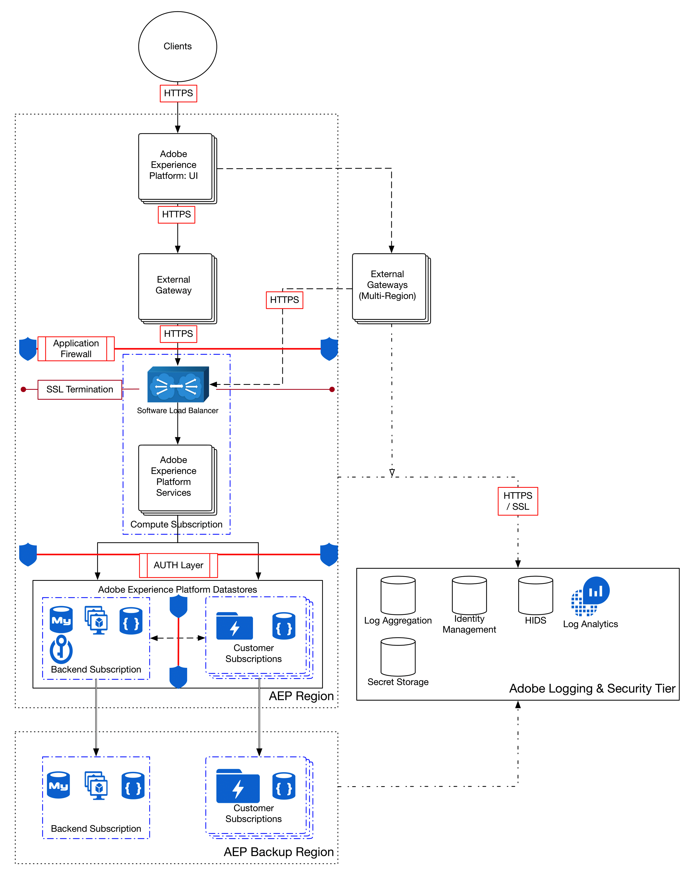

# Chiffrement des données dans Adobe Experience Platform

Adobe Experience Platform est un système puissant et extensible qui centralise et normalise les données d’expérience client sur l’ensemble des solutions d’entreprise. Toutes les données utilisées par Experience Platform sont chiffrées en transit et au repos pour garantir leur sécurité. Ce document décrit les processus de chiffrement d’Experience Platform à un niveau élevé.

Le diagramme de flux des processus suivant illustre la manière dont Experience Platform ingère, chiffre et conserve les données :

## Données en transit {#in-transit}

Toutes les données en transit entre Experience Platform et tout composant externe sont acheminées par des connexions sécurisées et chiffrées à l’aide de HTTPS [TLS v1.2](https://datatracker.ietf.org/doc/html/rfc5246).

En règle générale, les données sont importées dans Experience Platform de trois manières :

- Les fonctionnalités [collecte de données](../../collection/home.md) permettent aux sites web et aux applications mobiles d’envoyer des données à Experience Platform Edge Network pour l’évaluation et la préparation de l’ingestion.
- [Connecteurs ](../../sources/home.md) diffusez des données directement vers Experience Platform à partir des applications Adobe Experience Cloud et d’autres sources de données d’entreprise.
- Les outils ETL non Adobe (extraction, transformation, chargement) envoient des données à l’[API d’ingestion par lots](../../ingestion/batch-ingestion/overview.md) pour consommation.

Une fois les données introduites dans le système et [chiffrées au repos](#at-rest), les services Experience Platform enrichissent et exportent les données des manières suivantes :

- [Destinations](../../destinations/home.md) vous permet d’activer des données vers des applications Adobe et des applications partenaires.
- Les applications Experience Platform natives telles que [Customer Journey Analytics](https://experienceleague.adobe.com/docs/analytics-platform/using/cja-overview/cja-overview.html?lang=fr) et [Adobe Journey Optimizer](https://experienceleague.adobe.com/fr/docs/journey-optimizer/using/ajo-home) peuvent également utiliser les données.

### Prise en charge du protocole mTLS {#mtls-protocol-support}

Vous pouvez désormais utiliser Mutual Transport Layer Security (mTLS) pour renforcer la sécurité des connexions sortantes vers la [destination d’API HTTP](../../destinations/catalog/streaming/http-destination.md) et Adobe Journey Optimizer [actions personnalisées](https://experienceleague.adobe.com/fr/docs/journey-optimizer/using/orchestrate-journeys/about-journey-building/using-custom-actions). Le protocole mTLS est une méthode de sécurité de bout en bout pour une authentification mutuelle qui garantit que les deux parties qui partagent des informations sont celles qu’elles prétendent être avant que les données ne soient partagées. Le protocole mTLS inclut une étape supplémentaire par rapport à TLS, dans laquelle le serveur demande également le certificat du client et le vérifie de son côté.

Si vous souhaitez [utiliser le protocole mTLS avec des actions personnalisées Adobe Journey Optimizer](https://experienceleague.adobe.com/fr/docs/journey-optimizer/using/configuration/configure-journeys/action-journeys/about-custom-action-configuration) et des workflows de destination d’API HTTP Experience Platform, l’adresse du serveur que vous placez dans l’interface utilisateur d’action client Adobe Journey Optimizer ou l’interface utilisateur des destinations doit comporter les protocoles TLS désactivés et seul le protocole mTLS activé. Si le protocole TLS 1.2 est toujours activé sur ce point d’entrée, aucun certificat n’est envoyé pour l’authentification du client. Cela signifie que pour utiliser mTLS avec ces workflows, le point d’entrée de serveur de « réception » doit être un point d’entrée de connexion mTLS **uniquement**.

>[!IMPORTANT]
>
>Aucune configuration supplémentaire n’est requise dans la destination de votre action personnalisée Adobe Journey Optimizer ou de l’API HTTP pour activer mTLS. Ce processus se produit automatiquement lorsqu’un point d’entrée compatible avec mTLS est détecté. Le nom commun (NC) et les noms de remplacement du sujet (SAN) pour chaque certificat sont disponibles dans la documentation dans le cadre du certificat et peuvent être utilisés comme couche supplémentaire de validation de la propriété si vous le souhaitez.
>
>Le document RFC 2818, publié en mai 2000, rend obsolète l’utilisation du champ Nom commun (CN) dans les certificats HTTPS pour la vérification du nom du sujet. Il recommande plutôt d’utiliser l’extension SAN (Subject Alternative Name) du type « nom DNS ».

### Téléchargement de certificats {#download-certificates}

>[!NOTE]
>
>Il vous incombe de vous assurer que vos systèmes utilisent un certificat public valide. Consultez régulièrement vos certificats, en particulier à l’approche de la date d’expiration. Utilisez l’API pour récupérer et mettre à jour les certificats avant leur expiration.

Les liens de téléchargement direct pour les certificats mTLS publics ne sont plus fournis. Utilisez plutôt le [point d’entrée de certificat public](../../data-governance/mtls-api/public-certificate-endpoint.md) pour récupérer les certificats. Il s’agit de la seule méthode prise en charge pour accéder aux certificats publics actuels. Cela garantit que vous recevez toujours des certificats valides et à jour pour vos intégrations.

Les intégrations qui reposent sur un chiffrement par certificat doivent mettre à jour leurs workflows pour prendre en charge la récupération automatisée des certificats à l’aide de l’API . L’utilisation de liens statiques ou de mises à jour manuelles peut entraîner l’utilisation de certificats expirés ou révoqués, ce qui entraîne des échecs d’intégration.

#### Automatisation du cycle de vie des certificats {#certificate-lifecycle-automation}

Adobe automatise désormais le cycle de vie des certificats pour les intégrations mTLS afin d’améliorer la fiabilité et d’éviter les interruptions de service. Les certificats publics sont les suivants :

- Nouvelle émission 60 jours avant expiration.
- Révoqué 30 jours avant expiration.

Ces intervalles continueront d’être raccourcis conformément aux [lignes directrices en constante évolution du forum AC/B](https://www.digicert.com/blog/tls-certificate-lifetimes-will-officially-reduce-to-47-days) qui visent à réduire la durée de vie des certificats à un maximum de 47 jours.

Si vous avez déjà utilisé des liens sur cette page pour télécharger des certificats, mettez à jour votre processus pour les récupérer exclusivement par le biais de l’API.

## Données inactives {#at-rest}

Les données ingérées et utilisées par Experience Platform sont stockées dans le lac de données, une banque de données hautement granulaire contenant toutes les données gérées par le système, quels qu’en soient l’origine ou le format. Toutes les données conservées dans le lac de données sont chiffrées, stockées et gérées dans une instance [[!DNL Microsoft Azure Data Lake] Storage](https://docs.microsoft.com/en-us/azure/storage/blobs/data-lake-storage-introduction) isolée et propre à votre organisation.

Pour plus d’informations sur la manière dont les données au repos sont chiffrées dans le stockage du lac de données Azure, consultez la [documentation officielle d’Azure](https://learn.microsoft.com/en-us/azure/storage/common/storage-service-encryption).

## Étapes suivantes

Ce document fournit une présentation détaillée de la manière dont les données sont chiffrées dans Experience Platform. Pour plus d’informations sur les procédures de sécurité dans Experience Platform, consultez la présentation sur [la gouvernance, la confidentialité et la sécurité](./overview.md) sur Experience League ou consultez l’article technique sur la sécurité dans [Experience Platform](https://www.adobe.com/content/dam/cc/en/security/pdfs/AEP_SecurityOverview.pdf).
