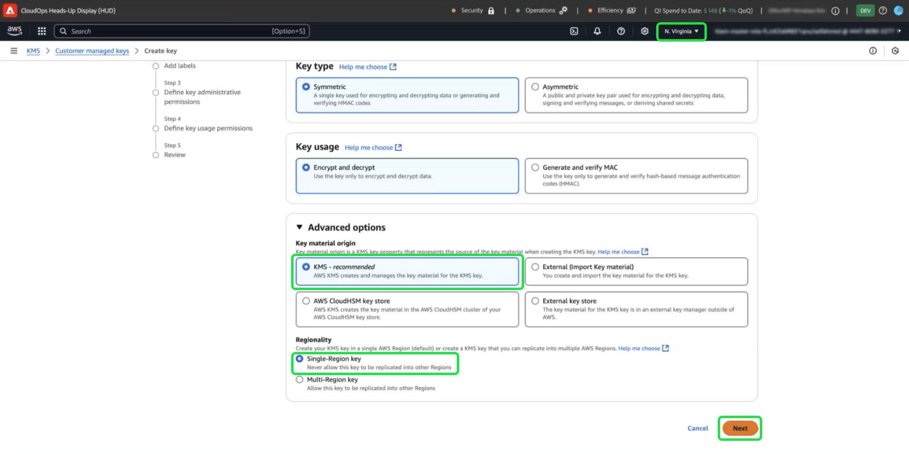

# Utilisation du service de gestion des clés Amazon Web Services pour le chiffrement des données Adobe Experience Platform

>[!AVAILABILITY]
>
>Ce document s’applique aux implémentations d’Experience Platform s’exécutant sur Amazon Web Services (AWS). Un Experience Platform s’exécutant sur AWS est actuellement disponible pour un nombre limité de clients. Pour en savoir plus sur l’infrastructure Experience Platform prise en charge, consultez la présentation multi-cloud de [Experience Platform ](https://experienceleague.adobe.com/en/docs/experience-platform/landing/multi-cloud).
>
>[Les clés gérées par le client](../customer-managed-keys/overview.md) (CMK) sur AWS sont prises en charge pour Privacy and Security Shield, mais ne sont pas disponibles pour Healthcare Shield. Les CMK sur Azure sont prises en charge pour Privacy and Security Shield ainsi que pour Healthcare Shield.

Utilisez ce guide pour sécuriser vos données avec Amazon Web Services (AWS) Key Management Service (KMS) en créant, gérant et contrôlant des clés de chiffrement pour Adobe Experience Platform. Cette intégration simplifie la conformité, rationalise les opérations grâce à l&#39;automatisation et élimine le besoin de gérer votre propre infrastructure de gestion clé.

Pour obtenir des instructions spécifiques au Customer Journey Analytics, reportez-vous à la documentation du CMK Customer Journey Analytics [](https://experienceleague.adobe.com/en/docs/analytics-platform/using/cja-privacy/cmk)

>[!IMPORTANT]
>
>Adobe Experience Platform chiffre les données inactives par défaut à l’aide de clés gérées par le système. En activant les clés gérées par le client (CMK), vous prenez le contrôle total de la sécurité de vos données. Toutefois, cette modification est irréversible. Une fois la fonction CMK activée, vous ne pouvez pas revenir aux clés gérées par le système. Il vous incombe de gérer vos clés en toute sécurité afin d’assurer un accès ininterrompu à vos données et d’éviter toute inaccessibilité potentielle.

Ce guide décrit le processus de création et de gestion des clés de chiffrement dans AWS KMS pour sécuriser vos données dans Experience Platform.

## Conditions préalables {#prerequisites}

Avant de poursuivre avec ce document, vous devez avoir une bonne compréhension des concepts et fonctionnalités clés suivants :

- **Service de gestion des clés AWS (KMS)** : comprendre les principes de base du service de gestion des clés AWS, notamment comment créer, gérer et faire pivoter des clés de chiffrement. Consultez la [documentation officielle de KMS](https://docs.aws.amazon.com/kms/) pour en savoir plus.
- **Politiques de gestion des identités et des accès (IAM) dans AWS** : IAM est un service qui vous permet de gérer l’accès aux services et ressources AWS en toute sécurité. Utilisez IAM pour :
   - Définissez les utilisateurs, groupes et rôles qui ont accès à des ressources spécifiques.
   - Spécifiez les actions que les utilisateurs et utilisatrices sont autorisés ou non à effectuer.
   - Mettez en œuvre un contrôle d’accès affiné en attribuant des autorisations à l’aide de politiques IAM.
Pour plus d’informations, consultez la documentation officielle [Politiques IAM pour AWS KMS](https://docs.aws.amazon.com/kms/latest/developerguide/iam-policies.html).
- **Sécurité des données dans Experience Platform** : découvrez comment Platform assure la sécurité des données et s’intègre à des services externes tels qu’AWS KMS pour le chiffrement. Platform protège les données avec HTTPS TLS v1.2 pour le transit, le chiffrement du fournisseur de cloud au repos, le stockage isolé et les options d’authentification et de chiffrement personnalisables. Consultez la [présentation de la gouvernance, de la confidentialité et de la sécurité](../overview.md) ou le document sur le [chiffrement des données dans Platform](../encryption.md) pour plus d’informations sur la manière dont vos données sont protégées.
- **AWS Management Console** : hub central où vous pouvez accéder à tous vos services AWS et les gérer à partir d’une application web. Utilisez la barre de recherche pour rechercher rapidement des outils, vérifier les notifications, gérer votre compte et la facturation et personnaliser vos paramètres. Pour plus d’informations, consultez la documentation [officielle de la console de gestion AWS](https://docs.aws.amazon.com/awsconsolehelpdocs/latest/gsg/what-is.html).

## Commencer {#get-started}

Ce guide nécessite que vous ayez déjà accès à un compte Amazon Web Services et à la console de gestion. Pour commencer, procédez comme suit :

1. **Vérifier les autorisations** : assurez-vous de disposer des autorisations de gestion des identités et des accès (IAM) AWS nécessaires pour créer, gérer et utiliser des clés de chiffrement dans KMS. Pour vérifier vos autorisations :
   1. Accédez au [simulateur de politiques IAM](https://policysim.aws.amazon.com/).
   1. Sélectionnez votre compte utilisateur ou votre rôle.
   1. Simuler des actions KMS telles que `kms:CreateKey` ou `kms:Encrypt`.
Si la simulation renvoie une erreur ou si vous n’êtes pas sûr de vos autorisations, contactez votre administrateur ou administratrice AWS pour obtenir de l’aide.

1. **Vérifiez la configuration de votre compte AWS** : vérifiez que votre compte AWS est activé pour utiliser les services AWS KMS. L&#39;accès KMS est activé par défaut pour la plupart des comptes, mais vous pouvez vérifier la configuration de votre compte en consultant la [console de gestion AWS](https://aws.amazon.com/console/). Pour plus d’informations, consultez le [guide du développeur du service de gestion des clés AWS](https://docs.aws.amazon.com/kms/latest/developerguide/overview.html).

1. **Sélectionnez une région prise en charge** : AWS KMS est disponible dans des régions spécifiques. Assurez-vous d’opérer dans une région où KMS est pris en charge. Vous pouvez afficher une liste complète des régions prises en charge dans la liste des points d’entrée et quotas AWS KMS [](https://aws.amazon.com/about-aws/global-infrastructure/regional-product-services/).

### Accédez à AWS KMS pour commencer la configuration des clés

>[!IMPORTANT]
>
>Garantissez le stockage sécurisé, l’accès et la disponibilité des clés de chiffrement. Il vous incombe de gérer vos clés et d’éviter toute perturbation des opérations de Platform.

Pour commencer à configurer et gérer votre clé de chiffrement, connectez-vous à votre compte AWS et accédez à AWS Key Management Service (KMS). Dans la console de gestion AWS, sélectionnez **Service de gestion des clés (KMS)** dans le menu des services.


## Créer une clé {#create-a-key}

L’espace de travail [!DNL Key Management Service (KMS)] s’affiche. Sélectionnez **[!DNL Create a key]**.


## Configurer les paramètres clés {#configure-key}

Le workflow [!DNL Configure Key] s’affiche. Par défaut, le type de clé est défini sur **[!DNL Symmetric]** et l’utilisation de la clé sur **[!DNL Encrypt and Decrypt]**. Assurez-vous que ces options sont sélectionnées avant de continuer.


Développez le menu déroulant **[!DNL Advanced options]** . Il est recommandé d’utiliser l’option **[!DNL KMS]**, qui permet à AWS de créer et de gérer les ressources clés. L’option **[!DNL KMS]** est sélectionnée par défaut.

>[!NOTE]
>
>Si vous disposez déjà d’une clé, vous pouvez importer du matériel de clé externe ou utiliser le Key Store d’AWS [!DNL CloudHSM]. Ces options ne sont pas couvertes dans le cadre de ce document.

Sélectionnez ensuite le paramètre [!DNL Regionality], qui spécifie la portée de la région de la clé. Sélectionnez **[!DNL Single-Region key]**, puis **[!DNL Next]** pour passer à l’étape 2.

>[!IMPORTANT]
>
>AWS applique des restrictions de région pour les clés KMS. Cette restriction de région signifie que la clé doit se trouver dans la même région que votre compte d’Adobe. L&#39;Adobe ne peut accéder qu&#39;aux clés KMS situées dans la région de votre compte. Assurez-vous que la région sélectionnée correspond à la région de votre compte à client unique d’Adobe.



## Étiqueter et baliser votre clé {#add-labels-and-tags-to-key}

La deuxième étape [!DNL Add labels] du workflow s’affiche. Ici, vous configurez les champs [!DNL Alias] et [!DNL Tags] pour vous aider à gérer et à localiser votre clé de chiffrement à partir de la console AWS KMS.

Saisissez un libellé descriptif pour votre clé dans le champ de saisie **[!DNL Alias]**. L’alias agit comme un identifiant convivial, permettant de localiser rapidement la clé à l’aide de la barre de recherche de la console AWS KMS. Pour éviter toute confusion, choisissez un nom significatif qui reflète l’objectif de la clé, tel que « Adobe-Platform-Key » ou « Customer-Encryption-Key ». Vous pouvez également inclure une description de la clé si l’alias de la clé est insuffisant pour décrire son objectif.

Enfin, attribuez des métadonnées à votre clé en ajoutant des paires clé-valeur dans la section [!DNL Tags] . Cette étape est facultative, mais vous devez ajouter des balises pour catégoriser et filtrer les ressources AWS afin d’en faciliter la gestion. Par exemple, si votre organisation utilise plusieurs ressources liées à l’Adobe, vous pouvez les baliser avec « Adobe » ou « Experience-Platform ». Cette étape supplémentaire facilite la recherche et la gestion de toutes les ressources associées dans la console de gestion AWS. Sélectionnez **[!DNL Add tag]** pour lancer le processus.

<!-- I do not have an AWS account with which to document the Add tag process as yet. -->

Lorsque vos paramètres vous conviennent, sélectionnez **[!DNL Next]** pour poursuivre le workflow.


## Définition des principales autorisations administratives {#define-key-admins}

La troisième étape du workflow de création de clé s’affiche. Pour garantir un accès sécurisé et contrôlé, vous pouvez choisir parmi les utilisateurs et rôles IAM ceux qui peuvent gérer la clé. Il existe deux options à ce stade : [!DNL Key administrators] et [!DNL Key deletion]. Dans la section **[!DNL Key administrators]** , cochez une ou plusieurs cases en regard du nom d’un utilisateur ou d’un rôle auquel vous souhaitez accorder des autorisations d’administrateur pour cette clé.

>[!NOTE]
>
>Vous ne pouvez pas créer d’administrateurs à cette étape du workflow.

Dans la section **[!DNL Key deletion]** , cochez la case pour accorder aux administrateurs de clés le droit de supprimer cette clé. Si vous ne cochez pas cette case, les utilisateurs administrateurs ne sont pas autorisés à effectuer cette opération.

Sélectionnez **[!DNL Next]** pour continuer le workflow.


## Octroi de l’accès aux utilisateurs clés {#assign-key-users}

Dans la quatrième étape du workflow, vous pouvez [!DNL Define key usage permissions]. Dans la liste **[!DNL Key users]**, cochez les cases de tous les utilisateurs et rôles IAM qui doivent être autorisés à utiliser cette clé.

De ce point de vue, vous pouvez également [!DNL Add another AWS account] ; toutefois, l’ajout d’autres comptes AWS est fortement déconseillé. L’ajout d’un autre compte peut introduire des risques et compliquer la gestion des autorisations pour les opérations de chiffrement et de déchiffrement. En conservant la clé associée à un seul compte AWS, Adobe assure une intégration sécurisée avec AWS KMS, minimise les risques et garantit un fonctionnement fiable.

Sélectionnez **[!DNL Next]** pour continuer le workflow.


## Vérifier la configuration des clés {#review}

L’étape de révision de la configuration de clé s’affiche. Vérifiez les détails clés dans les sections [!DNL Key configuration] et [!DNL Alias and description].

>[!NOTE]
>
>Assurez-vous que la région de clé est identique au compte AWS.


### Mise à jour de la stratégie de clé pour intégrer la clé à l’Experience Platform

Ensuite, modifiez le fichier JSON dans la section **[!DNL Key Policy]** pour intégrer la clé avec Experience Platform. Une politique de clé par défaut ressemble au fichier JSON ci-dessous.

<!-- The AWS ID below is fake. Q) Can I refer to it simply as AWS_ACCOUNT_ID ? Is that suitable? -->

```JSON
{
  "Id": "key-consolepolicy-3",
  "Version": "2012-10-17",
  "Statement": [
    {
      "Sid": "Enable IAM User Permissions",
      "Effect": "Allow",
      "Principal": {
        "AWS": "arn:aws:iam::123464903283:root" // this is a mock AWS Principal ID, your ID will differ
      },
      "Action": "kms:*",
      "Resource": "*"
    }
  ]
}
```

Dans l’exemple ci-dessus, toutes les ressources (`"Resource": "*"`) d’un même compte (`Principal.AWS`) peuvent accéder à cette clé. La politique permet à d’autres services du même compte d’utiliser la clé pour effectuer le chiffrement et le déchiffrement. Les services disposent uniquement des autorisations pour ce compte.

Accordez ensuite à votre compte client unique Platform l’accès à cette clé en ajoutant de nouvelles instructions à cette politique. Vous pouvez obtenir la politique JSON à partir de l’interface utilisateur de Platform et l’appliquer à votre clé AWS KMS pour la lier à la plateforme en toute sécurité.

Accédez à l’interface utilisateur de Platform. Dans la section **[!UICONTROL Administration]** du rail de navigation de gauche, sélectionnez **[!UICONTROL Chiffrement]**. L’espace de travail [!UICONTROL Configuration du chiffrement] s’affiche. Sélectionnez ensuite **[!UICONTROL Configurer]** dans la vignette [!UICONTROL Clés gérées par le client].


La [!UICONTROL configuration des clés gérées par le client] s’affiche. Sélectionnez l’icône de copie () pour copier la politique CMK KMS dans le presse-papiers. Une notification pop-up verte confirme que la politique a été copiée.


<!-- This part of the workflow was in contention at the time of the demo.  -->

Ensuite, revenez à l’espace de travail AWS KMS et mettez à jour la politique clé affichée ci-dessous.


Ajoutez à la politique par défaut les quatre instructions de l’espace de travail [!UICONTROL Configuration du chiffrement de la plateforme], comme illustré ci-dessous : `Enable IAM User Permissions`, `CJA Flow IAM User Permissions`, `CJA Integrity IAM User Permissions`, `CJA Oberon IAM User Permissions`.

```json
{
    "Version": "2012-10-17",
    "Id": "key-consolepolicy",
    "Statement": [
        {
            "Sid": "Enable IAM User Permissions",
            "Effect": "Allow",
            "Principal": {
                "AWS": "arn:aws:iam::975049898882:root" // this is a mock AWS Principal ID, your ID will differ
            },
            "Action": [
                "kms:Decrypt",
                "kms:Encrypt",
                "kms:ReEncrypt*",
                "kms:GenerateDataKey*",
                "kms:DescribeKey",
                "kms:CreateGrant"
            ],
            "Resource": "*",
            "Condition": {
                "StringEquals": {
                    "aws:PrincipalAccount": "975049898882" // this is a mock AWS Principal ID, your ID will differ
                }
            }
        },
        {
            "Sid": "CJA Flow IAM User Permissions",
            "Effect": "Allow",
            "Principal": {
                "AWS": "arn:aws:iam::767397686373:root"
            },
            "Action": [
                "kms:Decrypt",
                "kms:Encrypt",
                "kms:ReEncrypt*",
                "kms:GenerateDataKey*",
                "kms:DescribeKey",
                "kms:CreateGrant"
            ],
            "Resource": "*",
            "Condition": {
                "StringEquals": {
                    "aws:PrincipalAccount": "767397686373"
                }
            }
        },
        {
            "Sid": "CJA Integrity IAM User Permissions",
            "Effect": "Allow",
            "Principal": {
                "AWS": "arn:aws:iam::730335345392:root"
            },
            "Action": [
                "kms:Decrypt",
                "kms:Encrypt",
                "kms:ReEncrypt*",
                "kms:GenerateDataKey*",
                "kms:DescribeKey",
                "kms:CreateGrant"
            ],
            "Resource": "*",
            "Condition": {
                "StringEquals": {
                    "aws:PrincipalAccount": "730335345392"
                }
            }
        },
        {
            "Sid": "CJA Oberon IAM User Permissions",
            "Effect": "Allow",
            "Principal": {
                "AWS": "arn:aws:iam::891377157113:root"
            },
            "Action": [
                "kms:Decrypt",
                "kms:Encrypt",
                "kms:ReEncrypt*",
                "kms:GenerateDataKey*",
                "kms:DescribeKey",
                "kms:CreateGrant"
            ],
            "Resource": "*",
            "Condition": {
                "StringEquals": {
                    "aws:PrincipalAccount": "891377157113"
                }
            }
        }
    ]
}
```


Sélectionnez **[!DNL Finish]** pour confirmer les détails clés avec votre politique mise à jour et créer la clé. La clé et la politique ont maintenant été configurées avec un total de cinq instructions pour permettre à votre compte AWS de communiquer avec votre compte Experience Platform. L&#39;effet est instantané.

L’espace de travail [!DNL Customer managed keys] mis à jour de l’[!DNL Key Management Service] AWS s’affiche.

### Ajout de détails sur la clé de chiffrement AWS à Platform

Ensuite, pour activer le chiffrement, ajoutez le nom de ressource Amazon (ARN) de la clé à votre plateforme [!UICONTROL configuration des clés gérées par le client]. Dans la section [!DNL Customer Managed Keys] d’AWS, sélectionnez l’alias de votre nouvelle clé dans la liste de la [!DNL Key Management Service].


Les détails de votre clé s’affichent. Tout dans AWS possède un nom de ressource Amazon (ARN) qui
est un identifiant unique utilisé pour spécifier les ressources dans les services AWS. Il suit un format normalisé : `arn:partition:service:region:account-id:resource`.

Sélectionnez l’icône de copie pour copier votre ARN. Une boîte de dialogue de confirmation s’affiche.


Revenez maintenant à l’interface utilisateur de Platform [!UICONTROL Configuration des clés gérées par le client]. Dans la section **[!UICONTROL Ajouter les détails de la clé de chiffrement AWS]**, ajoutez un **[!UICONTROL Nom de configuration]** et la clé **[!UICONTROL KMS ARN]** que vous avez copiée à partir de l’interface utilisateur d’AWS.

.

Sélectionnez ensuite **[!UICONTROL ENREGISTRER]** pour envoyer le nom de la configuration, l’ARN de la clé KMS et commencer la validation de la clé.


Vous revenez alors à l’espace de travail [!UICONTROL Configurations de chiffrement]. Le statut de la configuration du chiffrement s’affiche au bas de la carte **[!UICONTROL Clés gérées par le client]**.

.

Une fois la clé validée, les identifiants du coffre de clés sont ajoutés au lac de données et aux magasins de données de profil pour tous les sandbox.

>[!NOTE]
>
>La durée du processus dépend de la taille des données. Généralement, le processus est terminé en moins de 24 heures. Chaque sandbox est généralement mis à jour en deux à trois minutes.

## Révocation de clé {#key-revocation}

>[!IMPORTANT]
>
>Découvrez les implications de la révocation des clés sur les applications en aval avant de révoquer tout accès.

Voici les principales considérations à prendre en compte pour la révocation des clés :

- La révocation ou la désactivation de la clé rendra vos données Platform inaccessibles. Cette action est irréversible et doit être effectuée avec précaution.
- Tenez compte des délais de propagation lorsque l’accès aux clés de chiffrement est révoqué. Les entrepôts de données de Principal deviennent inaccessibles en quelques minutes à 24 heures. Les entrepôts de données temporaires ou mis en cache deviennent inaccessibles dans les sept jours.

Pour révoquer une clé, accédez à l’espace de travail AWS KMS. La section **[!DNL Customer managed keys]** affiche toutes les clés disponibles pour votre compte AWS. Sélectionnez l’alias de votre clé dans la liste.


Les détails de votre clé s’affichent. Pour désactiver la touche , sélectionnez **[!DNL Key actions]**, puis **[!DNL Disable]** dans le menu déroulant.


Une boîte de dialogue de confirmation s’affiche. Sélectionnez **[!DNL Disable key]** pour confirmer votre choix. L’impact de la désactivation de la clé doit se refléter dans les applications Platform et l’interface utilisateur en cinq minutes environ.

>[!NOTE]
>
>Une fois la clé désactivée, vous pouvez l’activer à nouveau en utilisant la même méthode que celle décrite ci-dessus, si nécessaire. Cette option est disponible à partir de la liste déroulante **[!DNL Key actions]** .


Si votre clé est utilisée dans d’autres services, vous pouvez également supprimer l’accès pour l’Experience Platform directement à partir de la politique de clé. Sélectionnez **[!UICONTROL Modifier]** dans la section **[!DNL Key Policy]**.


La page **[!DNL Edit key policy]** s’affiche. Mettez en surbrillance et supprimez l’instruction de politique, copiée à partir de l’interface utilisateur de Platform, pour supprimer les autorisations de l’application Clés gérées par le client . Sélectionnez ensuite **[!DNL Save changes]** pour terminer le processus.


## Rotation des clés {#key-rotation}

AWS offre une rotation de clés automatique et à la demande. Pour réduire le risque de compromission de la clé ou répondre aux exigences de conformité en matière de sécurité, vous pouvez générer automatiquement de nouvelles clés de chiffrement à la demande ou à intervalles réguliers. Planifiez la rotation automatique des clés pour limiter la durée de vie d’une clé et vous assurer que si une clé est compromise, elle devient inutilisable après la rotation. Bien que les algorithmes de chiffrement modernes soient hautement sécurisés, la rotation des clés est une mesure de conformité de sécurité importante et démontre le respect des bonnes pratiques de sécurité.

### Rotation automatique des clés {#automatic-key-rotation}

La rotation automatique des clés est désactivée par défaut. Pour planifier la rotation automatique des clés à partir de l&#39;espace de travail KMS, sélectionnez l&#39;onglet **[!DNL Key rotation]** , puis **[!DNL Edit]** dans le **[!DNL Automatic key rotation section]**.


L’espace de travail **[!DNL Edit automatic key rotation]** s’affiche. À partir de là, sélectionnez le bouton radio pour activer ou désactiver la rotation automatique des touches. Utilisez ensuite le champ de saisie de texte ou le menu déroulant pour choisir une période pour la rotation de la clé. Sélectionnez **[!DNL Save]** pour confirmer les paramètres et revenir à l’espace de travail des détails clés.

>[!NOTE]
>
>La période de rotation des clés est de 90 jours au minimum et de 2 560 jours au maximum.


### Rotation des clés à la demande {#on-demand-key-rotation}

Si la clé actuelle est compromise, sélectionnez **[!DNL Rotate Now]** pour la faire pivoter immédiatement. AWS n’autorise que 10 rotations à la demande. Utilisez une rotation de clés planifiée, sauf si la sécurité a déjà été compromise.


## Étapes suivantes

Vous êtes arrivé au bout de ce document. À présent, vous savez comment créer, configurer et gérer des clés de chiffrement dans AWS KMS en vue de les utiliser avec Adobe Experience Platform. L’étape suivante consiste à examiner les politiques de sécurité et de conformité de votre entreprise afin de garantir l’application de bonnes pratiques de gestion des clés, telles que la rotation planifiée des clés et le stockage sécurisé des clés.
