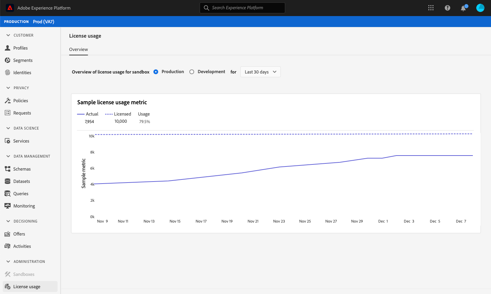

# Tableau de bord [!UICONTROL License usage] {#license-usage-dashboard}

L’interface utilisateur d’Adobe Experience Platform fournit un tableau de bord grâce auquel vous pouvez afficher des informations importantes sur l’utilisation des licences de l’entreprise. Celles-ci sont présentées telles qu’elles sont capturées lors d’aperçus quotidiens.

Vous trouverez des instructions détaillées sur l’accès au tableau de bord d’utilisation de la licence et les interactions avec celui-ci dans l’interface utilisateur, ainsi que des informations sur les mesures disponibles affichées dans le tableau de bord, dans le [guide de tableau de bord d’utilisation de la licence](../../dashboards/guides/license-usage.md).

Pour découvrir toutes les fonctionnalités des tableaux de bord dans Experience Platform, commencez par lire la [présentation des tableaux de bord](../../dashboards/home.md).

