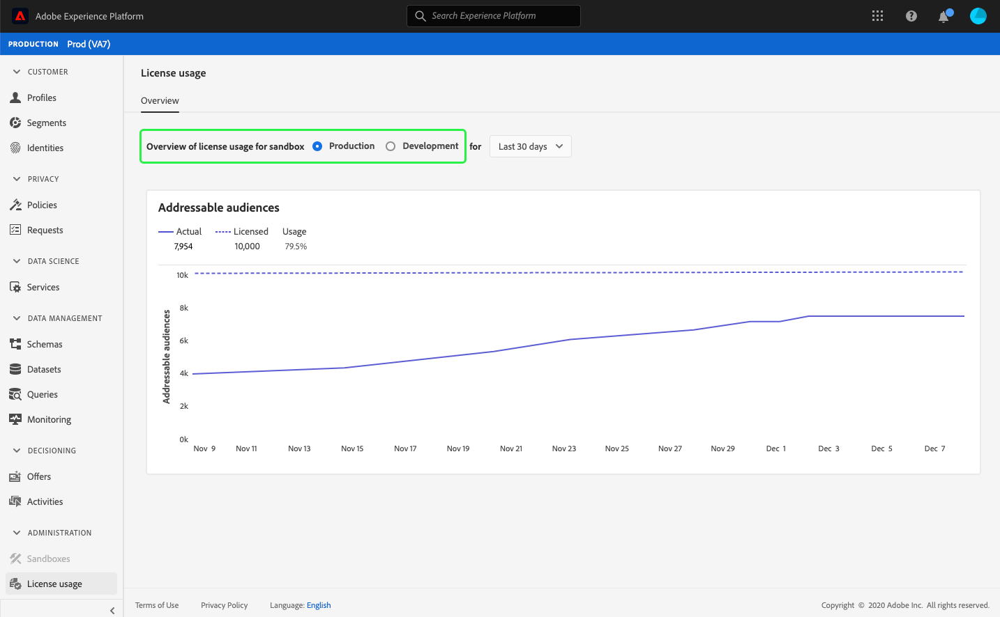

# (Alpha) [!UICONTROL Utilisation de la licence] tableau de bord {#license-usage-dashboard}

>[!IMPORTANT]
>
>La fonctionnalité de tableau de bord décrite dans ce document est actuellement en alpha et n’est pas disponible pour tous les utilisateurs. La documentation et les fonctionnalités peuvent changer.

L’interface utilisateur de Adobe Experience Platform fournit un tableau de bord grâce auquel vous pouvez vue des informations importantes sur l’utilisation des licences de votre entreprise, telles qu’elles sont capturées au cours d’un instantané quotidien. Ce guide explique comment accéder au tableau de bord d’utilisation des licences dans l’interface utilisateur et comment l’utiliser. Il fournit également plus d’informations sur les visualisations affichées dans le tableau de bord.

Pour un aperçu général de l’interface utilisateur de la plate-forme, consultez le [guide de l’interface utilisateur Experience Platform](ui-guide.md).

## Données du tableau de bord d&#39;utilisation de la licence

Le tableau de bord d’utilisation des licences affiche un instantané des données relatives aux licences de votre entreprise pour l’Experience Platform. Les données du tableau de bord s&#39;affichent exactement comme elles s&#39;affichent au moment précis où l&#39;instantané a été pris. En d&#39;autres termes, l&#39;instantané n&#39;est pas une approximation ou un échantillon des données et le tableau de bord n&#39;est pas mis à jour en temps réel.

>[!NOTE]
>
>Les modifications ou mises à jour apportées aux données depuis l&#39;instantané ne seront pas répercutées dans le tableau de bord tant que l&#39;instantané suivant n&#39;aura pas été pris.

## Exploration du tableau de bord d’utilisation des licences

Pour accéder au tableau de bord d’utilisation des licences dans l’interface utilisateur de la plate-forme, sélectionnez **[!UICONTROL Utilisation des licences]** dans le rail de gauche. Cette opération s’ouvre avec l’onglet **[!UICONTROL Aperçu]** qui affiche le tableau de bord.

### Sélectionner un sandbox

Pour choisir un sandbox à vue dans le tableau de bord, sélectionnez [!UICONTROL Production] ou [!UICONTROL Développement]. Le sandbox sélectionné est indiqué par le bouton radio en regard du nom du sandbox.

>[!NOTE]
>
>Le rapports de consommation des sandbox est cumulé pour tous les sandbox du même type. En d’autres termes, la sélection de [!UICONTROL Production] ou [!UICONTROL Développement] rendra compte de tous les sandbox de production ou de développement, respectivement.

### Sélectionner une plage de dates

Après avoir sélectionné un sandbox, vous pouvez utiliser la liste déroulante de plage de dates pour sélectionner la période à afficher dans le tableau de bord. Trois options sont disponibles : [!UICONTROL 30 derniers jours], [!UICONTROL 90 derniers jours] et [!UICONTROL 12 derniers mois]. Les 30 derniers jours sont sélectionnés par défaut.

### Widgets et mesures

Le tableau de bord d’utilisation des licences est composé de widgets qui affichent des mesures en lecture seule fournissant des informations importantes sur l’utilisation des licences de votre entreprise. Pour en savoir plus sur ces widgets, voir la section des widgets disponibles dans ce guide.

## Widgets disponibles {#available-widgets}

Experience Platform fournit actuellement un widget que vous pouvez utiliser pour visualiser l’utilisation des licences, avec d’autres widgets bientôt disponibles.

### [!UICONTROL Audiences adressables] {#addressable-audiences}

Le widget **[!UICONTROL audiences adressables]** affiche le nombre total de profils fusionnés au sein de la banque de données de Profil, après avoir appliqué une stratégie de fusion générée par le système pour combiner des fragments de profil de tous les jeux de données actuels à l&#39;aide d&#39;un algorithme de graphique déterministe (privé).

Pour plus d&#39;informations sur les fragments et les profils fusionnés, veuillez commencer par lire la section *fragments de Profil par rapport aux profils fusionnés* de la [vue d&#39;ensemble du Profil](../profile/home.md).

>[!NOTE]
>
>La stratégie de fusion utilisée pour calculer cette mesure est générée par un Experience Platform et ne peut pas être modifiée, pas plus qu’une autre stratégie de fusion ne peut être sélectionnée. Cette stratégie de fusion générée par le système n&#39;est pas identique à la stratégie de fusion par défaut utilisée pour calculer [!UICONTROL la taille d&#39;Audience] dans le tableau de bord [!DNL Profile]. Par conséquent, le nombre d&#39;audiences dans les tableaux de bord [!UICONTROL Utilisation de la licence] et [!DNL Profile] ne sera probablement pas exactement identique.

## Tableaux de bord supplémentaires

L’interface utilisateur de la plate-forme fournit des tableaux de bord supplémentaires pour l’affichage d’instantanés de vos données dans l’Experience Platform. Ces tableaux de bord comprennent le Profil client en temps réel et des segments. Pour plus d’informations sur ces tableaux de bord, sélectionnez l’un des liens suivants :

* [[!DNL Profile] Tableau de bord](../profile/ui/profile-dashboard.md)
* [Tableau de bord de segment](../segmentation/ui/segment-dashboard.md)

## Étapes suivantes

En suivant ce document, vous devriez maintenant pouvoir localiser le tableau de bord d&#39;utilisation de la licence et sélectionner un sandbox à vue. Vous devez également comprendre les mesures affichées dans les widgets disponibles. Pour en savoir plus sur l’interface utilisateur Experience Platform, consultez le [Guide de l’interface utilisateur de la plate-forme](ui-guide.md).