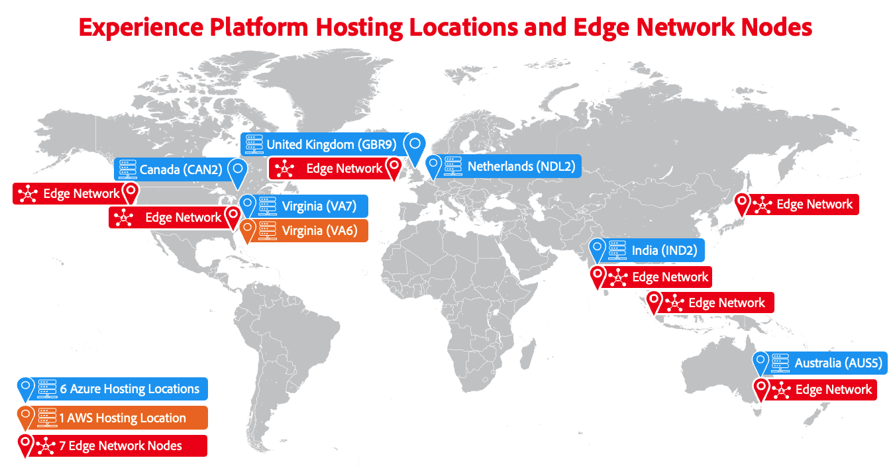

# Présentation de Adobe Experience Platform multi-cloud

Adobe Experience Platform est un produit multi-cloud qui vous permet de choisir entre s’exécuter sur [[!DNL Microsoft Azure]](https://azure.microsoft.com/en-us) ou [[!DNL Amazon Web Services (AWS)]](https://aws.amazon.com/). Cette flexibilité vous permet de choisir la solution la mieux adaptée à vos besoins professionnels et techniques.

>[!AVAILABILITY]
>
>Adobe Experience Platform s’exécutant sur Amazon Web Services (AWS) est actuellement disponible pour un nombre limité de clients. Pour en savoir plus sur Experience Platform sur AWS, contactez l’équipe chargée de votre compte Adobe.

Cette page fournit un aperçu général des deux infrastructures cloud disponibles et inclut des conseils sur la façon de choisir la bonne infrastructure pour votre entreprise.

## Quelle implémentation cloud est adaptée à mes besoins ? {#which-cloud-is-right}

Le choix entre Experience Platform sur Azure ou AWS dépend de plusieurs facteurs spécifiques à votre entreprise :

* **Besoins commerciaux et techniques** : évaluez les besoins de votre organisation et sa stratégie cloud à long terme.
* **Infrastructure existante** : prenez en compte votre infrastructure cloud actuelle et vos besoins en matière d’intégration.
* **Dépendance à l’égard des technologies cloud** : si votre entreprise repose principalement sur les technologies Microsoft, Azure est peut-être la solution la mieux adaptée. Si vous dépendez davantage des services Amazon, AWS pourrait être la meilleure option.
* **Considérations relatives à la résidence des données** : évaluez les exigences de résidence des données pour votre organisation et assurez-vous que la plateforme cloud choisie offre des régions conformes à ces réglementations.

Compte tenu des facteurs ci-dessus, utilisez cet arbre de décision simplifié pour vous aider à décider de la mise en œuvre cloud appropriée aux besoins de votre entreprise.

{align="center" zoomable="yes"}

## Emplacements d’hébergement {#available-cloud-regions}

Le choix de la région cloud appropriée est essentiel pour répondre aux exigences de résidence des données et assurer des performances optimales.

{align="center" zoomable="yes"}

Experience Platform est disponible dans six emplacements d’hébergement Microsoft Azure, un emplacement d’hébergement Amazon Web Services (AWS) et achemine les données vers les services Adobe via sept [nœuds Edge Network &#x200B;](../collection/home.md#edge) répartis dans le monde entier.

### Régions Microsoft Azure {#azure-regions}

Le tableau ci-dessous indique les régions Microsoft Azure où Experience Platform est hébergé.

| Pays | Code de région | Emplacement |
|---------|-------------|----------|
| États-Unis d&#39;Amérique | VA7 | Virginie |
| Royaume-Uni | GBR9 | Londres |
| Pays-Bas | NDL2 | Amsterdam |
| Canada | CAN2 | Toronto |
| Inde | IND2 | Maharashtra |
| Australie | AUS5 | Nouvelle-Galles du Sud |

{style="table-layout:auto"}

### Régions de Amazon Web Services (AWS) {#aws-regions}

Le tableau ci-dessous indique les régions AWS où Experience Platform est hébergé. Revenez régulièrement pour voir si d’autres emplacements ont été ajoutés.

| Pays | Code de région | Emplacement |
|---------|-------------|----------|
| États-Unis d&#39;Amérique | VA6 | Virginie |

{style="table-layout:auto"}

## Parité des fonctionnalités {#feature-parity}

Adobe s’engage à offrir la parité des fonctionnalités sur les plateformes cloud, pour toutes les applications s’exécutant sur Experience Platform, telles que :

* [Real-Time Customer Data Platform](../rtcdp/home.md)
* [Adobe Journey Optimizer](https://experienceleague.adobe.com/fr/docs/journey-optimizer/using/ajo-home)
* [Customer Journey Analytics](https://experienceleague.adobe.com/fr/docs/analytics-platform/using/cja-landing)

Cependant, certaines fonctionnalités peuvent différer entre les implémentations Azure et AWS. Ces différences sont décrites dans la section ci-dessous et dans d’autres parties de la documentation du produit, le cas échéant.

### Différences entre l’exécution d’Experience Platform sur Microsoft Azure et AWS {#azure-aws-differences}

Le tableau ci-dessous met en évidence les différences majeures entre l’exécution d’Experience Platform sur Microsoft Azure et AWS.

| Fonctionnalité | Microsoft Azure | Amazon Web Services |
| --- | --- | --- |
| [Conformité à la loi HIPAA](https://www.adobe.com/trust/compliance/hipaa-ready.html) | Pris en charge | Non pris en charge |
| [Catalogue des connecteurs source](/help/sources/home.md) | Tous les connecteurs du catalogue de sources sont pris en charge | Un nombre limité de connecteurs source est disponible. Tous les connecteurs source disponibles pour les implémentations d’AWS sont indiqués dans une note en haut de page dans leurs pages de documentation respectives. |

{style="table-layout:auto"}

<!-- To be determined if we need to add this part about the AI Assistant 

| [Experience Platform AI Assistant](/help/ai-assistant/home.md) | Supported | Not supported |

-->

## Conclusion {#conclusion}

Experience Platform offre flexibilité et choix en vous permettant d’exécuter sur Microsoft Azure ou Amazon Web Services. Évaluez les besoins de votre entreprise et l&#39;infrastructure existante pour prendre une décision éclairée sur la plateforme cloud à utiliser.
