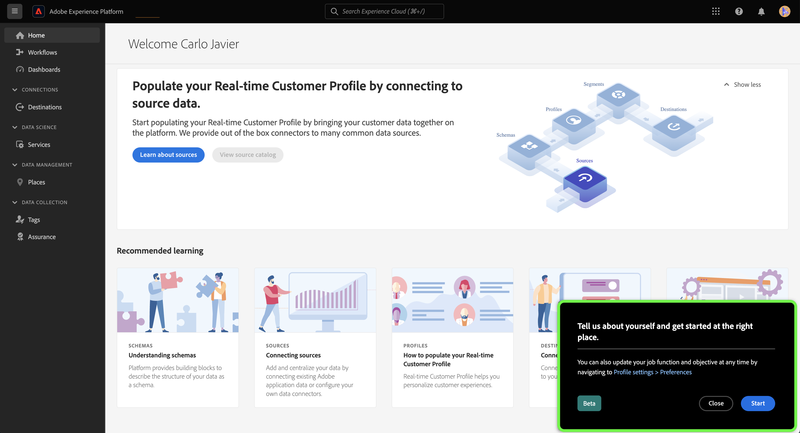

# Utiliser l’enquête d’auto-identification pour créer votre profil personnel Experience Platform

>[!NOTE]
>
>L’enquête d’auto-identification est en version bêta. Les fonctionnalités et la documentation peuvent faire l’objet de changements.

L’enquête d’auto-identification est un court questionnaire présenté sur la page d’accueil de l’interface utilisateur d’Adobe Experience Platform. Vous pouvez remplir le questionnaire pour fournir des informations sur vos fonctions professionnelles et sur vos objectifs généraux. Ces informations sont ensuite utilisées pour mieux aligner les guides intégrés au produit et finalement diffuser du contenu plus pertinent par rapport à vos objectifs.

Ce document fournit des informations sur la manière dont vous pouvez utiliser l’enquête d’auto-identification dans l’interface utilisateur de Platform pour recevoir du contenu pertinent en fonction de vos objectifs et tâches, ainsi que sur la manière de reconfigurer vos attributs de profil personnels à l’aide de l’interface utilisateur.

Pour en savoir plus sur Adobe Experience Platform, commencez par lire la [Présentation dʼExperience Platform](home.md).

## Enquête d’auto-identification dans l’interface utilisateur de Platform

L’invite de l’enquête d’auto-identification s’affiche en bas à droite de la page d’accueil de l’interface utilisateur de Platform lorsque vous vous connectez.

Pour lancer l’enquête, sélectionnez **[!UICONTROL Démarrer]**.

Pour la première question de l’enquête, sélectionnez la fonction qui décrit le mieux votre travail.

Les options disponibles sont les suivantes :

* Administration
* Ingénierie
* Confidentialité et gouvernance
* Marketing
* Autre

>[!NOTE]
>
>Vous pouvez sélectionner plusieurs fonctions dans la liste des options. Si vous sélectionnez [!UICONTROL Autre], il vous sera demandé de fournir des détails sur votre objectif.

Pour poursuivre, sélectionnez la ou les fonctions qui décrivent le mieux votre travail actuel, puis sélectionnez **[!UICONTROL Suivant]**.

Sélectionnez ensuite le ou les objectifs spécifiques qui s’appliquent le mieux à votre travail.

Voici la liste des objectifs disponibles :

* Créer et gérer des utilisateurs et utilisatrices
* Attribuer des rôles, des autorisations et des profils de produits
* Gérer l’utilisation des licences, des sandbox et des alertes
* Configurer le système pour l’ingestion de données
* Modéliser la structure des données de mon entreprise
* Interroger, filtrer et optimiser les données pour générer des informations
* Configurer les politiques de consentement et de données
* Gouvernance et respect de la vie privée
* Développer des stratégies marketing
* Créer, gérer et segmenter des audiences
* Configurer des tableaux de bord pour analyser l’impact sur l’entreprise
* Activer des données vers les destinations pour le ciblage en aval

Lorsque vous avez terminé, sélectionnez **[!UICONTROL Soumettre]**.

Une fois votre enquête d’auto-identification terminée, sélectionnez **[!UICONTROL Terminé]**.

>[!NOTE]
>
>Les objectifs et les recommandations (le cas échéant) changent selon les fonctions sélectionnées.

## Mettre à jour vos réponses à l’enquête

Mettez à jour vos fonctions et objectifs à l’aide du menu des préférences d’Experience Cloud. Pour accéder au menu des préférences, sélectionnez l’icône de votre profil dans le volet de navigation supérieur, puis sélectionnez **[!UICONTROL Préférences]**.

Ensuite, dans la section [!UICONTROL Général] du menu des préférences de votre profil, sélectionnez **[!UICONTROL Mettre à jour vos fonctions et objectifs]**.

L’enquête d’auto-identification s’affiche, vous permettant de reconfigurer vos réponses et de mettre à jour votre profil.

## Étapes suivantes

En lisant ce document, vous avez maintenant envoyé et mis à jour des informations concernant vos fonctions et objectifs, afin de recevoir un contenu plus pertinent lors de l’utilisation de l’interface utilisateur de Platform. Pour plus d’informations sur l’interface utilisateur de Platform, lisez la [Présentation d’Experience Platform](home.md).
