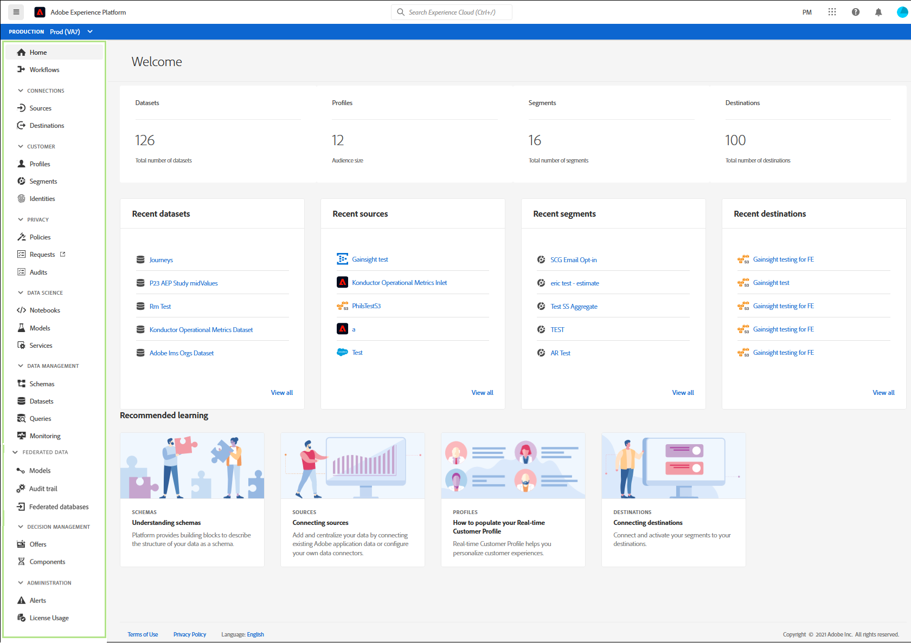

# Guide de l’interface utilisateur de Adobe Experience Platform

Ce guide présente l’utilisation de l’interface utilisateur (IU) de Adobe Experience Platform, explique la finalité des différents composants et fournit des liens vers d’autres documents présentant davantage d’informations.

Pour en savoir plus sur Adobe Experience Platform, commencez par lire la [Présentation dʼExperience Platform](home.md).

## Écran d’accueil

Après vous être connecté à Adobe Experience Platform, vous êtes sur la page [!UICONTROL Accueil], qui se compose des sections [tableau de bord des mesures](#metrics), [données récentes](#recent-data) et [apprentissage recommandé](#recommended-learning).

### Mesures

Le tableau de bord des mesures fournit des cartes qui vous donnent des informations sur les jeux de données, les profils, les segments et les destinations au sein de votre organisation.

La section **[!UICONTROL Jeux de données]** indique le nombre de jeux de données au sein de votre organisation. Ce nombre est mis à jour lorsqu’un nouveau jeu de données est créé. Vous trouverez plus d’informations sur les jeux de données dans la [présentation des jeux de données](../catalog/datasets/overview.md).

La section **[!UICONTROL Profils]** indique le nombre total de personnes disposant de profils au sein de votre organisation, à l’exclusion des fragments de profil. Ce nombre total de personnes représente l’audience adressable totale et est mis à jour une fois toutes les 24 heures. Pour plus d’informations sur les profils, consultez la [présentation du profil client en temps réel](../profile/home.md).

La section **[!UICONTROL Segments]** indique le nombre total de segments créés dans votre organisation. Ce nombre est mis à jour lorsqu’un nouveau segment est créé. Pour plus d’informations sur les segments, consultez la [présentation de Segmentation Service](../segmentation/home.md).

La section **[!UICONTROL Destinations]** indique le nombre total de destinations créées pour l’organisation. Ce nombre est mis à jour lorsqu’une nouvelle destination est créée. Vous trouverez plus d’informations sur les destinations dans la [présentation des destinations](../destinations/home.md).

### Données récentes

Le tableau de bord des données récentes fournit des informations sur les jeux de données, les sources, les segments et les destinations récemment créés.

La section **[!UICONTROL Jeux de données récents]** répertorie les cinq jeux de données créés le plus récemment au sein de votre organisation. Cette liste est mise à jour chaque fois qu’un jeu de données est créé. Vous pouvez sélectionner un jeu de données dans la liste à afficher. Vous pouvez trouver des informations supplémentaires sur le jeu de données spécifié ou sélectionner **[!UICONTROL Afficher tout]** pour afficher la liste de tous les jeux de données créés. Vous trouverez plus d’informations sur les jeux de données dans la [présentation des jeux de données](../catalog/datasets/overview.md).

La section **[!UICONTROL Sources récentes]** répertorie les cinq connecteurs source les plus récemment créés au sein de votre organisation. Cette liste est mise à jour chaque fois qu’un nouveau connecteur source est créé. Vous pouvez sélectionner une connexion source dans la liste pour l’afficher. Vous trouverez plus d’informations sur le connecteur spécifié ou sélectionnez **[!UICONTROL Afficher tout]** pour afficher la liste de toutes les connexions source créées. Pour plus d’informations sur les sources, reportez-vous à la [présentation des sources](../sources/home.md).

La section **[!UICONTROL Segments récents]** répertorie les cinq définitions de segment créées le plus récemment au sein de votre organisation. Cette liste est mise à jour chaque fois qu’une définition de segment est créée. Vous pouvez sélectionner une définition de segment dans la liste à afficher. Vous pouvez trouver des informations supplémentaires sur la définition de segment spécifiée ou sélectionner **[!UICONTROL Afficher tout]** pour afficher une liste de toutes les définitions de segment créées. Pour plus d’informations sur les segments, consultez la [présentation de Segmentation Service](../segmentation/home.md).

La section **[!UICONTROL Destinations récentes]** répertorie les cinq destinations créées le plus récemment au sein de votre organisation. Cette liste est mise à jour chaque fois qu’une nouvelle destination est créée. Vous pouvez sélectionner une destination dans la liste à afficher. Vous pouvez trouver des informations supplémentaires sur la destination spécifiée ou sélectionner **[!UICONTROL Afficher tout]** pour afficher une liste de toutes les destinations créées. Vous trouverez plus d’informations sur les destinations dans la [présentation des destinations](../destinations/home.md).

### Apprentissage recommandé

La section **[!UICONTROL Apprentissage recommandé]** fournit des liens vers une documentation utile pour commencer à utiliser Adobe Experience Platform.

## Barre de navigation supérieure

La barre de navigation supérieure de l’interface utilisateur d’Experience Platform affiche l’organisation dans laquelle vous êtes actuellement connecté et fournit plusieurs commandes importantes.

Le logo Adobe Experience Platform se trouve sur le côté gauche de la barre de navigation. Sélectionnez ce logo à tout moment pour revenir à l’écran d’accueil de l’interface utilisateur d’Experience Platform.

### Sélecteur d’organisation

Le premier élément situé sur le côté droit de la barre de navigation supérieure est le **sélecteur d’organisation**.

Si vous sélectionnez le sélecteur, un menu déroulant des organisations auxquelles vous avez accès s’affiche, le cas échéant. Pour passer à une autre organisation, sélectionnez une option répertoriée.

### Changer d’applications

L’élément suivant sur le côté droit du volet de navigation supérieur est le **sélecteur d’applications**, représenté par l’icône . Lorsque vous sélectionnez cette icône, vous pouvez basculer entre les applications Adobe auxquelles votre organisation a accès, telles qu’Experience Platform, Analytics, Assets, etc.

### Aide

À droite du sélecteur d’applications se trouve le menu **Aide et assistance**, représenté par l’icône . Lorsque vous sélectionnez cette icône, un menu contextuel s’affiche, contenant plusieurs ressources d’aide et d’assistance. L’onglet **[!UICONTROL Aide]** affiche une liste de la documentation pertinente pour la page sur laquelle vous vous trouvez actuellement. L’onglet **[!UICONTROL Assistance]** vous permet de créer un ticket de support auprès de l’équipe d’assistance d’Adobe. L’onglet **[!UICONTROL Commentaires]** vous permet d’envoyer des commentaires sur Experience Platform à Adobe.

### Notifications et annonces

Dans la section **notifications**, qui est représentée par l’icône . L’onglet **[!UICONTROL Notifications]** affiche des informations importantes sur le produit et d’autres mises à jour pertinentes, tandis que l’onglet **[!UICONTROL Annonces]** affiche des informations sur la maintenance du service.

### Profil utilisateur

Le dernier élément de la barre de navigation supérieure est le **paramètres utilisateur**, représenté par l’icône . Sélectionnez cette icône pour modifier vos préférences ou vous déconnecter.

Vous pouvez basculer entre le thème clair et sombre de l’interface d’Experience Platform à l’aide du commutateur situé juste en dessous de votre nom et de votre adresse e-mail. Sélectionnez le thème de votre choix.

### Sandbox

Juste en dessous de la barre de navigation supérieure se trouve la barre sandbox . Cette barre indique le sandbox que vous utilisez actuellement pour Experience Platform. Pour plus d’informations sur les sandbox, consultez la [présentation des sandbox](../sandboxes/home.md).

## Volet de navigation de gauche {#left-nav}

La navigation dans la partie gauche de l’écran répertorie tous les différents services pris en charge dans l’interface utilisateur d’Experience Platform.

Cliquez sur l’icône de menu pour afficher ou masquer le panneau de navigation de gauche.

Vous pouvez verrouiller la navigation en position ouverte en cliquant de nouveau après avoir affiché le panneau.

>[!IMPORTANT]
>
>La barre de navigation de gauche affiche uniquement les fonctionnalités auxquelles vous avez accès. Dans les versions précédentes de Adobe Experience Platform, les éléments non disponibles étaient désactivés. Si vous pensez que vous devriez avoir accès à une section qui n’apparaît pas, contactez votre administrateur système.

La section **[!UICONTROL Accueil]** vous permet de revenir à la page d’accueil de l’interface utilisateur d’Experience Platform.

La section **[!UICONTROL Workflows]** présente une liste de workflows à plusieurs étapes permettant d’effectuer des opérations dans Experience Platform. Pour plus d’informations sur les workflows, consultez la [présentation des workflows](./workflows.md).

### [!UICONTROL Connexions]

La section **[!UICONTROL Sources]** vous permet de créer, mettre à jour et supprimer des connexions source, ce qui vous permet d’ingérer des données provenant de sources externes dans Experience Platform. Pour plus d’informations sur les sources, reportez-vous à la [présentation des sources](../sources/home.md).

La section **[!UICONTROL Destinations]** vous permet de créer, mettre à jour et supprimer des destinations, ce qui vous permet d’exporter des données d’Experience Platform vers de nombreuses destinations externes. Vous trouverez plus d’informations sur les destinations dans la [présentation des destinations](../destinations/home.md).

### [!UICONTROL Client]

La section **[!UICONTROL Profils]** vous permet de parcourir les profils client, d’afficher les mesures des profils, de créer et de gérer des politiques de fusion et d’afficher des schémas d’union. Pour en savoir plus sur l’utilisation de la section [!UICONTROL Profils], veuillez lire le [[!DNL Profile] guide d’utilisation](../profile/ui/user-guide.md). Pour plus d’informations sur le profil client en temps réel, consultez la [présentation du profil client en temps réel](../profile/home.md).

La section **[!UICONTROL Audiences]** vous permet de créer et de gérer des définitions de segment. Pour en savoir plus sur l’utilisation de la section [!UICONTROL Audiences], veuillez lire le guide d’utilisation de la [segmentation](../segmentation/ui/overview.md). Pour plus d’informations sur Segmentation Service, consultez la [présentation de Segmentation Service](../segmentation/home.md).

La section **[!UICONTROL Identités]** vous permet de créer et de gérer des espaces de noms d’identité. Pour plus d’informations sur la section [!UICONTROL Identités], y compris des informations sur les espaces de noms d’identité et sur l’utilisation des identités dans l’interface utilisateur d’Experience Platform, reportez-vous à la [présentation des espaces de noms d’identité](../identity-service/features/namespaces.md).

### [!UICONTROL Confidentialité]

La section **[!UICONTROL Politiques]** vous permet de créer et de gérer des politiques d’utilisation des données. Pour en savoir plus sur l’utilisation de la section Politiques , consultez le guide d’utilisation des [politiques d’utilisation des données](../data-governance/policies/user-guide.md). Pour plus d’informations sur les politiques d’utilisation des données, consultez la [présentation des politiques d’utilisation des données](../data-governance/policies/overview.md).

La section **[!UICONTROL Demandes]** vous permet de créer et de gérer des demandes d’accès à des informations personnelles. Pour accéder à l’interface utilisateur de Privacy Service, vous devez être placé sur la liste autorisée. Pour en savoir plus sur l’utilisation de la section Demandes , veuillez lire le guide d’utilisation de [Privacy Service](../privacy-service/ui/user-guide.md). Vous trouverez plus d&#39;informations sur Privacy Service dans la présentation de [Privacy Service](../privacy-service/home.md).

### [!UICONTROL Science des données]

La section **[!UICONTROL Notebooks]** permet d’accéder à JupyterLab, un environnement de développement interactif qui vous permet d’explorer, d’analyser et de modéliser vos données. Pour en savoir plus sur l’utilisation de la section Notebooks , veuillez lire le guide d’utilisation de [JupyterLab](../data-science-workspace/jupyterlab/overview.md). Vous trouverez plus d’informations sur le Workspace de science des données dans la [ Présentation du Workspace de science des données ](../data-science-workspace/home.md)

La section **[!UICONTROL Modèles]** vous permet d’utiliser le machine learning et l’intelligence artificielle pour créer, développer, entraîner et ajuster des modèles afin de faire des prédictions. Vous trouverez plus d’informations sur la section Modèles dans le tutoriel sur [la formation et l’évaluation d’un modèle](../data-science-workspace/models-recipes/train-evaluate-model-ui.md).

La section **[!UICONTROL Services]** vous permet de gérer les modèles publiés pour la formation et la notation planifiées, ou d’utiliser les services intelligents d’Adobe, un ensemble de services d’IA qui offrent des expériences client personnalisées en temps réel. Vous trouverez plus d’informations sur la section Services dans le tutoriel [Publication d’un modèle en tant que service](../data-science-workspace/models-recipes/publish-model-service-ui.md).

### [!UICONTROL Gestion des données]

La section **[!UICONTROL Schémas]** vous permet de créer et de gérer des schémas de modèle de données d’expérience (XDM). Pour en savoir plus sur les schémas, consultez le tutoriel sur la [création d’un schéma](../xdm/tutorials/create-schema-ui.md). Pour plus d’informations sur XDM, consultez la [présentation du système XDM](../xdm/home.md).

La section **[!UICONTROL Jeux de données]** vous permet de créer et de gérer des jeux de données. Vous trouverez plus d’informations sur les jeux de données dans le [guide d’utilisation des jeux de données](../catalog/datasets/user-guide.md).

La section **[!UICONTROL Requêtes]** vous permet de créer et de gérer des requêtes, de consigner les requêtes SQL effectuées par Adobe Experience Platform Query Service et d’afficher vos informations d’identification [!DNL PostgreSQL]. Vous trouverez plus d’informations sur les requêtes dans le guide d’utilisation de [Query Service](../query-service/ui/overview.md).

La section **[!UICONTROL Surveillance]** vous permet de surveiller l’ingestion par lots et par flux. Pour plus d’informations sur la surveillance, consultez le [guide d’utilisation de la surveillance de l’ingestion des données](../ingestion/quality/monitor-data-ingestion.md).

### [!UICONTROL Données fédérées]

La section **[!UICONTROL Modèles]** vous permet de concevoir et de créer des modèles et des schémas de données qui définissent la structure, les relations et les contraintes de vos données. Pour plus d’informations sur les modèles et schémas de données, consultez le guide d’utilisation [Federated Audience Composition](https://experienceleague.adobe.com/fr/docs/federated-audience-composition/using/config/datamodel/schemas).

La section **[!UICONTROL Journal d’audit]** fournit un enregistrement détaillé et chronologique de toutes les actions et de tous les événements qui ont été effectués dans votre environnement en temps réel. Pour plus d’informations sur le journal d’audit, consultez le guide d’utilisation [Federated Audience Composition](https://experienceleague.adobe.com/en/docs/federated-audience-composition/using/audit-trail/audit-trail).

La section **[!UICONTROL Bases de données fédérées]** vous permet de connecter Adobe Experience Platform à votre entrepôt de données d’entreprise. Pour plus d’informations sur la connexion aux bases de données fédérées, consultez le guide d’utilisation [Federated Audience Composition](https://experienceleague.adobe.com/fr/docs/federated-audience-composition/using/config/federated-db).

### [!UICONTROL Prise de décision]

Adobe Journey Optimizer est un service applicatif qui complète Experience Platform. Il vous permet d’utiliser des technologies de prise de décision puissantes afin de fournir à vos clients la meilleure offre et la meilleure expérience possible à tous les points de contact au bon moment. Pour en savoir plus sur Journey Optimizer, notamment sur l’utilisation des [!UICONTROL Offres] et [!UICONTROL Activités] consultez la [documentation de Journey Optimizer](https://experienceleague.adobe.com/docs/journey-optimizer.html?lang=fr).

### [!UICONTROL Administration]

L’interface utilisateur d’Experience Platform fournit un tableau de bord grâce auquel vous pouvez afficher des informations importantes sur l’utilisation des licences de l’entreprise. Celles-ci sont présentées telles qu’elles sont capturées lors d’instantanés quotidiens. Accédez à ce tableau de bord en sélectionnant **[!UICONTROL Utilisation des licences]** dans la navigation. Pour en savoir plus sur le tableau de bord d’utilisation de la licence, consultez le [guide du tableau de bord d’utilisation de la licence](./license-usage-and-guardrails/license-usage-dashboard.md).

>[!IMPORTANT]
>
>La fonctionnalité de tableau de bord d’utilisation de la licence est actuellement en version Alpha et n’est pas disponible pour tous les utilisateurs. La documentation et les fonctionnalités peuvent changer.

## Étapes suivantes

Ce guide vous a permis de découvrir la page d’accueil d’Experience Platform et les principaux éléments de navigation de son interface utilisateur. Pour plus d’informations sur l’utilisation de l’interface utilisateur, reportez-vous à la documentation de chaque service Experience Platform. Vous trouverez des liens vers cette documentation dans la section [navigation de gauche](#left-nav) située plus haut dans ce document.
