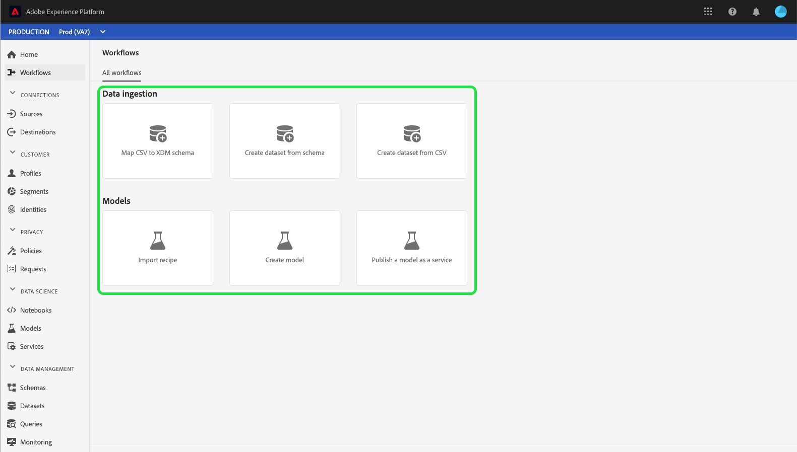

# Guide de l’interface utilisateur [!UICONTROL Workflows]

La section **[!UICONTROL Workflows]** de l’interface utilisateur de Adobe Experience Platform présente une liste de workflows à plusieurs étapes permettant d’effectuer des opérations dans Experience Platform. Ces workflows couvrent des domaines tels que l’ingestion des données et la science des données.

## [!UICONTROL Ingestion des données]

Le workflow **[!UICONTROL Mapper CSV à un schéma XDM]** permet de télécharger et de convertir un fichier CSV en schéma de modèle de données d’expérience (XDM). Vous trouverez plus d’informations sur ce workflow dans le tutoriel sur [le mappage d’un fichier CSV à un schéma XDM](../ingestion/tutorials/map-csv/overview.md).

Le workflow **[!UICONTROL Créer un jeu de données à partir d’un schéma]** permet de créer un jeu de données à partir d’un schéma XDM existant. Vous trouverez plus d’informations sur ce workflow dans le [guide d’utilisation des jeux de données](../catalog/datasets/user-guide.md#schema).

Le workflow **[!UICONTROL Créer un jeu de données à partir d’un fichier CSV]** permet de créer un jeu de données en chargeant un fichier CSV. Vous trouverez plus d’informations sur ce workflow dans le [guide d’utilisation des jeux de données](../catalog/datasets/user-guide.md#csv).

## [!UICONTROL &#x200B; Modèles &#x200B;]

Le workflow **[!UICONTROL Importer la recette]** permet d’importer et de configurer des recettes. Vous trouverez plus d’informations sur ce workflow dans le tutoriel sur [importation d’une recette empaquetée](../data-science-workspace/models-recipes/import-packaged-recipe-ui.md).

Le workflow **[!UICONTROL Créer un modèle]** permet de créer un modèle de machine learning. Vous trouverez plus d’informations sur ce workflow dans le [tutoriel de formation et d’évaluation de modèles](../data-science-workspace/models-recipes/train-evaluate-model-ui.md).

Le workflow **[!UICONTROL Publier un modèle en tant que service]** permet de publier un modèle créé en tant que service pouvant faire l’objet d’une notation. Vous trouverez plus d’informations sur ce workflow dans le tutoriel sur la [publication d’un modèle en tant que service](../data-science-workspace/models-recipes/publish-model-service-ui.md).

## Étapes suivantes

En lisant ce guide, vous avez découvert les [!UICONTROL Workflows] disponibles dans l’interface utilisateur d’Experience Platform. Pour plus d’informations sur les fonctionnalités de l’interface utilisateur d’Experience Platform, veuillez lire le [guide de l’interface utilisateur de Adobe Experience Platform](ui-guide.md).
