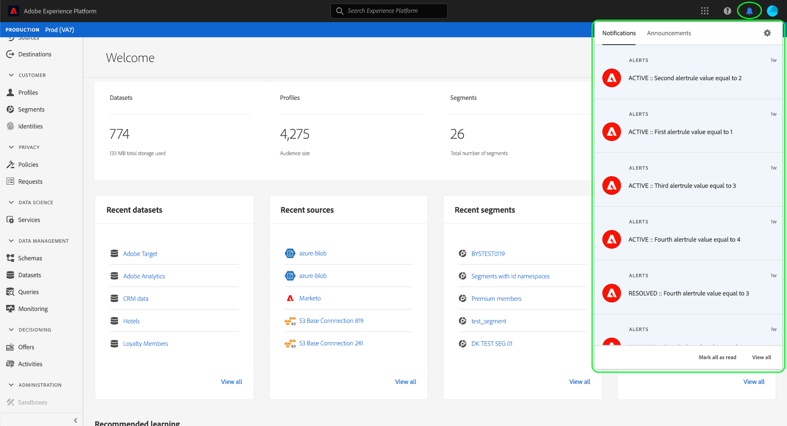

# Présentation des alertes

>[!NOTE]
>
>Étant donné que les alertes sont prises en charge dans les sandbox de production et de développement, vous pouvez vous y abonner dans n’importe quel sandbox. Lorsqu’un sandbox est réinitialisé, toutes les alertes d’abonnement sont également réinitialisées. Lorsqu’un sandbox est supprimé, toutes les alertes d’abonnement sont supprimées.

Adobe Experience Platform vous permet de vous abonner à des alertes basées sur des événements concernant les activités Adobe Experience Platform. Les alertes réduisent ou éliminent la nécessité d’interroger l’[[!DNL Observability Insights] API](../api/overview.md) afin de vérifier si une tâche est terminée, si un certain jalon a été atteint dans un processus ou si des erreurs se sont produites.

Lorsqu’un certain ensemble de conditions de vos opérations Experience Platform est atteint (par exemple, un problème potentiel lorsque le système dépasse un certain seuil), Experience Platform peut envoyer des messages d’alerte à toutes les personnes de votre organisation qui se sont abonnées à ces messages. Ces messages peuvent se répéter pendant un intervalle prédéfini jusqu’à ce que l’alerte ait été résolue.

Ce document fournit un aperçu des alertes dans Adobe Experience Platform, y compris la structure de la définition des règles d’alerte.

## Alertes ponctuelles ou alertes répétées

Les alertes d’Experience Platform peuvent être envoyées une seule fois ou se répéter à un intervalle prédéfini jusqu’à ce qu’elles soient résolues. Les cas d’utilisation de chacune de ces options sont censés différer comme suit :

| Alerte unique | Alerte répétée |
| --- | --- |
| N’indique pas nécessairement un problème. | Indique un état potentiellement indésirable. |
| Ne se répète pas. | Peut se répéter si la condition anormale persiste. |
| Par exemple :<ul><li>L’ingestion des données s’est terminée avec succès.</li><li>Une exécution de requête est terminée.</li><li>Les données ont été supprimées.</li></ul> | Par exemple :<ul><li>La durée d’ingestion dépasse le contrat de niveau de service (SLA).</li><li>L’ingestion quotidienne n’a pas eu lieu au cours des dernières 24 heures.</li><li>Le taux d’erreur du processeur de flux est supérieur au seuil configuré.</li></ul> |

{style="table-layout:auto"}

## Présentation des alertes

Une alerte peut être décomposée en plusieurs éléments :

| Composant | Description |
| --- | --- |
| **Mesure** | Une [mesure](../api/metrics.md#available-metrics) d’observabilité dont la valeur déclenche l’alerte, comme le nombre d’événements d’ingestion par lots ayant échoué (`timeseries.ingestion.dataset.batchfailed.count`). |
| **Condition** | Une condition liée à la mesure qui déclenche l’alerte si elle est résolue sur true, telle qu’une mesure de comptage dépassant un certain nombre. Cette condition peut être associée à une fenêtre temporelle prédéfinie. |
| **Période** | (Facultatif) La condition d’une alerte peut être limitée à une période prédéfinie. Par exemple, une alerte peut se déclencher en fonction du nombre de lots ayant échoué au cours des cinq dernières minutes. |
| **Action** | Lorsqu’une alerte est déclenchée, une action est exécutée. Plus précisément, les messages sont envoyés aux destinataires applicables par le biais d’un canal de diffusion, tel qu’un webhook préconfiguré ou l’interface utilisateur Experience Platform. |
| **Fréquence** | (Facultatif) Une alerte peut être configurée pour répéter son action à un intervalle défini si sa condition reste vraie ou n’est pas résolue. |

{style="table-layout:auto"}

## Recevoir et gérer des alertes

Les alertes peuvent être reçues et gérées par deux canaux :

* [Événements Adobe I/O](#events)
* [Interface utilisateur d’Experience Platform](#ui)

### Événements I/O {#events}

Des alertes peuvent être envoyées vers un webhook configuré afin de faciliter l’automatisation efficace de la surveillance des activités. Pour recevoir des alertes par le biais d’un webhook, vous devez enregistrer les alertes d’Experience Platform dans Adobe Developer Console. Pour obtenir des instructions spécifiques, reportez-vous au guide sur [l’abonnement aux notifications d’événement d’Adobe I/O](./subscribe.md).

### Interface utilisateur d’Experience Platform {#ui}

L’interface utilisateur d’Experience Platform vous permet d’afficher les alertes reçues et de gérer les règles d’alerte. La vidéo ci-après présente ces capacités.

>[!VIDEO](https://video.tv.adobe.com/v/336218?quality=12&learn=on)

Pour utiliser des alertes dans l’interface utilisateur d’Experience Platform, vous devez disposer des autorisations de contrôle d’accès suivantes activées via Adobe Admin Console :

| Autorisation | Description |
| --- | --- |
| Affichage des alertes | Permet d’afficher les messages d’alerte reçus. |
| Afficher l’historique des alertes* | Permet de visualiser l&#39;historique des alertes reçues à partir de l&#39;onglet [!UICONTROL Alerts] . |
| Gérer les alertes* | Permet d’activer et de désactiver les règles d’alerte à partir de l’onglet [!UICONTROL Alerts] . |
| Résoudre les alertes* | Permet de résoudre les alertes déclenchées à partir de l’onglet [!UICONTROL Alerts] . |

{style="table-layout:auto"}

** Pour accéder à l’onglet [!UICONTROL Alerts], vous devez également disposer de l’autorisation Afficher les alertes, associée à l’une des autres autorisations.*

>[!NOTE]
>
>Pour plus d’informations sur la gestion des autorisations dans Experience Platform, consultez la [documentation sur le contrôle d’accès](../../access-control/ui/overview.md).

Avec l’autorisation Afficher les alertes, vous pouvez afficher les alertes reçues en sélectionnant l’icône représentant une cloche () dans le coin supérieur droit.

>[!NOTE]
>
> Sélectionnez une alerte pour accéder à un tableau de bord associé et obtenir des informations plus détaillées sur les raisons pour lesquelles l’alerte a été déclenchée.

En outre, l’onglet [!UICONTROL Alerts] de l’interface utilisateur permet à chaque utilisateur de s’abonner à des types d’alerte spécifiques et permet aux administrateurs d’activer ou de désactiver complètement les règles d’alerte. Pour plus d’informations sur la gestion des alertes, consultez le [guide de l’interface utilisateur](./ui.md).

### Intégration de Slack {#slack-integration}

Vous pouvez utiliser un proxy webhook sur [Adobe App Builder](https://developer.adobe.com/app-builder/docs/get_started/app_builder_get_started/first-app) pour recevoir [Adobe I/O Events](https://developer.adobe.com/events/docs/guides/) d’Experience Platform vers votre [!DNL Slack]. Le proxy gère l’établissement de liaison de vérification d’Adobe et transforme les payloads des événements en messages [!DNL Slack], de sorte que vous puissiez recevoir des alertes destinées aux clients directement dans votre espace de travail.

>[!VIDEO](https://video.tv.adobe.com/v/3480183?learn=on)

Pour plus d’informations sur la manière de recevoir des notifications Experience Platform dans [!DNL Slack] en intégrant un proxy webhook Adobe App Builder, voir [surveiller les événements Experience Platform dans [!DNL Slack]](https://experienceleague.adobe.com/fr/docs/platform-learn/tutorials/monitoring/monitor-events-in-slack).

## Étapes suivantes

En lisant ce document, vous avez découvert les alertes Experience Platform et leur rôle dans l’écosystème Experience Platform. Pour découvrir comment recevoir et gérer des alertes, reportez-vous à la documentation de processus associée mentionnée dans cette présentation.
