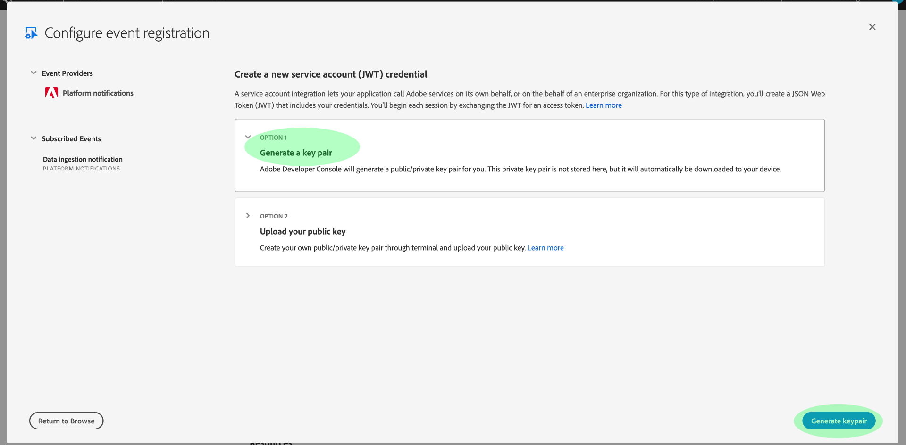

# Abonnement aux notifications dʼévénement Adobe I/O

[!DNL Observability Insights] vous permet de vous abonner à des notifications dʼévénement Adobe I/O concernant les activités dʼAdobe Experience Platform. Ces événements sont envoyés à un Webhook configuré afin de faciliter lʼautomatisation efficace de la surveillance des activités.

Ce document décrit les étapes à suivre pour vous abonner aux notifications d’événement d’Adobe I/O pour les services Adobe Experience Platform. Des informations de référence sur les types d’événements disponibles sont également fournies, ainsi que des liens vers d’autres documents sur la manière dont vous pouvez interpréter les données d’événement renvoyées pour chaque service [!DNL Platform] applicable.

## Prise en main

Ce document nécessite une compréhension pratique des Webhooks et de la manière de connecter un Webhook dʼune application à une autre. Pour en savoir plus sur les Webhooks, consultez la [[!DNL I/O Events] documentation](https://www.adobe.io/apis/experienceplatform/events/docs.html#!adobedocs/adobeio-events/master/intro/webhook_docs_intro.md).

## Création dʼun Webhook

Pour recevoir des notifications [!DNL I/O Event], vous devez enregistrer un Webhook en indiquant une URL Webhook unique dans les détails dʼenregistrement de votre événement.

Vous pouvez configurer votre Webhook à lʼaide du client de votre choix. Pour obtenir une adresse Webhook temporaire à utiliser dans le cadre de ce tutoriel, rendez-vous sur [Webhook.site](https://webhook.site/) et copiez lʼURL unique fournie.

Au cours du processus de validation initial, [!DNL I/O Events] envoie un paramètre de requête `challenge` dans une requête GET vers le Webhook. Vous devez configurer votre Webhook pour renvoyer la valeur de ce paramètre dans le payload de réponse. Si vous utilisez Webhook.site, sélectionnez **[!DNL Edit]** dans le coin supérieur droit, puis saisissez `$request.query.challenge$` sous **[!DNL Response body]** avant de sélectionner **[!DNL Save]**.

## Création dʼun projet dans Adobe Developer Console

Accédez à [Adobe Developer Console](https://www.adobe.com/go/devs_console_ui) et connectez-vous avec votre Adobe ID. Suivez ensuite les étapes décrites dans le tutoriel sur la [création dʼun projet vide](https://developer.adobe.com/developer-console/docs/guides/projects/projects-empty/) disponible dans la documentation dʼAdobe Developer Console.

## Abonnement aux événements

>[!NOTE]
>
>L’événement de notification d’ingestion de données a été abandonné dans Adobe I/O. À la place, vous devez utiliser l’événement d’E/S **Sources Flow Run Info**.

Une fois que vous avez créé un projet, accédez à lʼécran dʼaperçu de ce projet. Sélectionnez ensuite **[!UICONTROL Ajouter un événement]**.

Une boîte de dialogue sʼaffiche, vous permettant dʼajouter un fournisseur dʼévénements à votre projet :

* Si vous vous abonnez aux alertes dʼExperience Platform, sélectionnez **[!UICONTROL Notifications Platform]**.
* Si vous vous abonnez aux notifications dʼAdobe Experience Platform [!DNL Privacy Service], sélectionnez **[!UICONTROL Événements Privacy Service]**.

Après avoir choisi un fournisseur dʼévénements, sélectionnez **[!UICONTROL Suivant]**.

Lʼécran suivant affiche une liste des types dʼévénements auxquels vous pouvez vous abonner. Sélectionnez les événements auxquels vous souhaitez vous abonner, puis cliquez sur **[!UICONTROL Suivant]**.

>[!NOTE]
>
>Si vous avez des doutes sur les événements auxquels vous devez vous abonner pour le service avec lequel vous travaillez, consultez la documentation suivante :
>
>* [Notifications Platform](./rules.md)
>* [Notifications Privacy Service](../../privacy-service/privacy-events.md)

Lʼécran suivant vous invite à créer un JSON Web Token (JWT). Vous avez la possibilité de générer automatiquement une paire de clés ou de télécharger votre propre clé publique générée dans le terminal.

Pour les besoins de ce tutoriel, nous avons retenu la première option. Sélectionnez la zone dʼoption **[!UICONTROL Générer une paire de clés]**, puis cliquez sur le bouton **[!UICONTROL Générer la paire de clés]** dans le coin inférieur droit.

Lorsque la paire de clés est générée, elle est automatiquement téléchargée par le navigateur. Vous devez stocker ce fichier vous-même, car il nʼest pas conservé dans Developer Console.

Lʼécran suivant vous permet dʼafficher les détails de la paire de clés nouvellement générée. Sélectionnez **[!UICONTROL Suivant]** pour continuer.

Dans lʼécran suivant, indiquez le nom et la description de lʼenregistrement de lʼévénement dans la section [!UICONTROL Détails de lʼenregistrement de lʼévénement]. Il est recommandé de créer un nom unique et facilement identifiable afin de différencier cet enregistrement dʼévénement des autres sur le même projet.

Plus bas sur le même écran, sous la section [!UICONTROL Comment recevoir des événements], vous pouvez éventuellement configurer comment vous souhaitez recevoir les événements. **[!UICONTROL Webhook]** vous permet de fournir une adresse webhook personnalisée pour recevoir les événements, tandis que l’**[!UICONTROL action Runtime]** vous permet de faire de même à l’aide de [Adobe I/O Runtime](https://www.adobe.io/apis/experienceplatform/runtime/docs.html).

Pour ce tutoriel, sélectionnez **[!UICONTROL Webhook]** et fournissez l’URL du webhook que vous avez créé précédemment. Une fois que vous avez terminé, sélectionnez **[!UICONTROL Enregistrer les événements configurés]** pour terminer l’enregistrement de l’événement.

La page de détails de l’enregistrement d’événement nouvellement créé s’affiche ; vous pouvez y modifier sa configuration, passer en revue les événements reçus, effectuer du suivi de débogage et ajouter de nouveaux fournisseurs d’événements.

## Étapes suivantes

En suivant ce tutoriel, vous avez enregistré un webhook pour recevoir des notifications [!DNL I/O Event] pour [!DNL Experience Platform] et/ou [!DNL Privacy Service]. Pour plus d’informations sur les événements disponibles et sur la façon d’interpréter les payloads des notifications pour chaque service, reportez-vous à la documentation suivante :

* [[!DNL Privacy Service] notifications](../../privacy-service/privacy-events.md)
* [[!DNL Data Ingestion] notifications](../../ingestion/quality/subscribe-events.md)
* [Notifications [!DNL Flow Service] (sources)](../../sources/notifications.md)

Pour plus d’informations sur la façon de surveiller vos activités sur [!DNL Experience Platform] et [!DNL Privacy Service], consultez la [[!DNL Observability Insights] présentation](../home.md).
