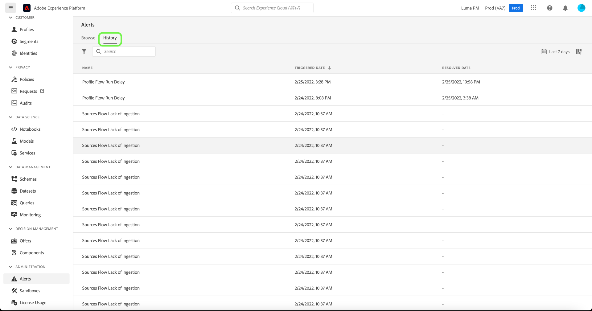

# Guide de lʼinterface utilisateur des alertes

Lʼinterface utilisateur dʼAdobe Experience Platform vous permet de consulter lʼhistorique des alertes reçues en fonction des mesures affichées par Adobe Experience Platform Observability Insights. Lʼinterface utilisateur vous permet également dʼafficher, dʼactiver, de désactiver et de vous abonner aux règles dʼalerte disponibles.

>[!NOTE]
>
>Pour démarrer avec les alertes dans Experience Platform, consultez la [Présentation des alertes](./overview.md).

Commencez par sélectionner **[!UICONTROL Alertes]** dans le volet de navigation de gauche.

## Gestion des règles dʼalerte

Lʼonglet **[!UICONTROL Parcourir]** répertorie les règles disponibles susceptibles de déclencher une alerte.

Sélectionnez une règle dans la liste pour afficher sa description et ses paramètres de configuration dans le rail de droite, y compris le seuil et la gravité.

Sélectionnez les points de suspension (**...**) en regard du nom dʼune règle pour afficher une liste déroulante avec les commandes suivantes : activation ou désactivation de lʼalerte (selon son statut actuel), abonnement ou désabonnement aux notifications par e-mail de lʼalerte.

## Affichage de lʼhistorique des alertes

Lʼonglet **[!UICONTROL Historique]** affiche lʼhistorique des alertes reçues pour votre organisation, y compris la règle qui a déclenché lʼalerte, la date de déclenchement et la date de résolution (le cas échéant).

Sélectionnez une alerte répertoriée pour afficher des détails supplémentaires dans le rail de droite, y compris un bref résumé de lʼévénement qui a déclenché lʼalerte.

## Étapes suivantes

Ce document fournit un aperçu de la manière dʼafficher et de gérer les alertes dans lʼinterface utilisateur de Platform. Pour plus dʼinformations sur les fonctionnalités du service, consultez la présentation dʼ[Observability Insights](../home.md).
