# Guide de lʼinterface utilisateur des alertes

Dans Adobe Experience Platform, vous pouvez afficher l’historique des alertes reçues par votre organisation en fonction des mesures issues des statistiques d’observabilité. Vous pouvez également parcourir les règles d’alerte disponibles, les activer ou les désactiver, vous y abonner et gérer les personnes qui reçoivent les notifications par e-mail.

>[!NOTE]
>
>Pour démarrer avec les alertes dans Experience Platform, consultez la [Présentation des alertes](./overview.md).

Pour commencer, sélectionnez **[!UICONTROL Alerts]** dans le volet de navigation de gauche.

![Page des alertes mettant en surbrillance les [!UICONTROL Alerts] dans le volet de navigation de gauche.](../images/alerts/ui/workspace.png)

## Gestion des règles dʼalerte {#manage-rules}

L’onglet **[!UICONTROL Browse]** répertorie les règles disponibles susceptibles de déclencher une alerte. Sélectionnez une règle dans la liste pour afficher sa description et ses paramètres de configuration dans le panneau de droite, y compris le seuil et la gravité.

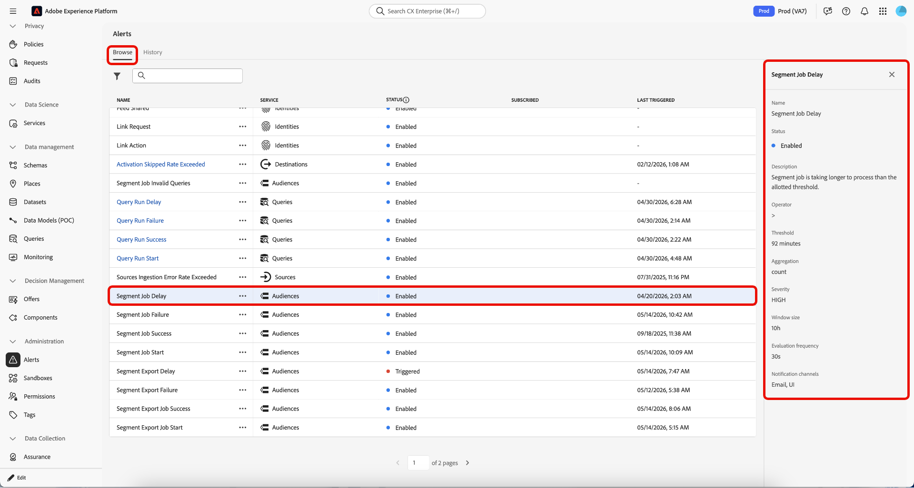

Sélectionnez les points de suspension (**...**) à côté du nom d’une règle. Un menu s’ouvre, dans lequel vous pouvez activer ou désactiver l’alerte (selon son statut actuel) et vous abonner ou vous désabonner des notifications par e-mail pour cette règle.

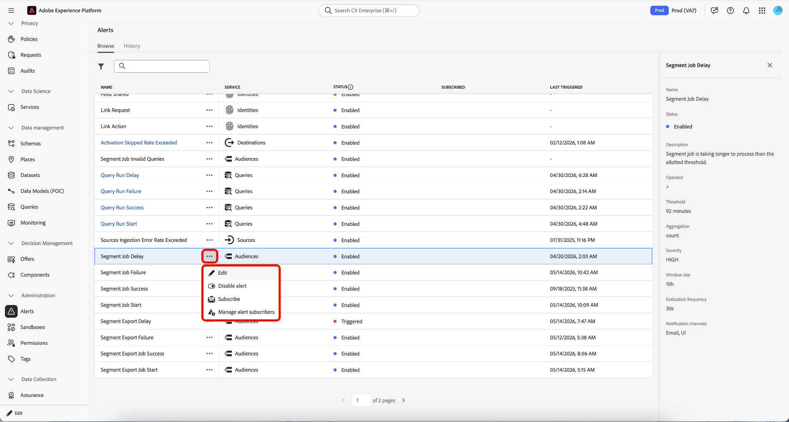

## Gérer les personnes abonnées aux alertes {#manage-subscribers}

>[!NOTE]
>
> Pour attribuer une alerte à un ID utilisateur Adobe, à une adresse e-mail externe ou à une liste de groupes d’e-mails, vous devez être administrateur.

Dans l’onglet **[!UICONTROL Browse]** , sélectionnez les points de suspension (**...**) en regard de la règle à gérer, sélectionnez **[!UICONTROL Manage alert subscribers]**.

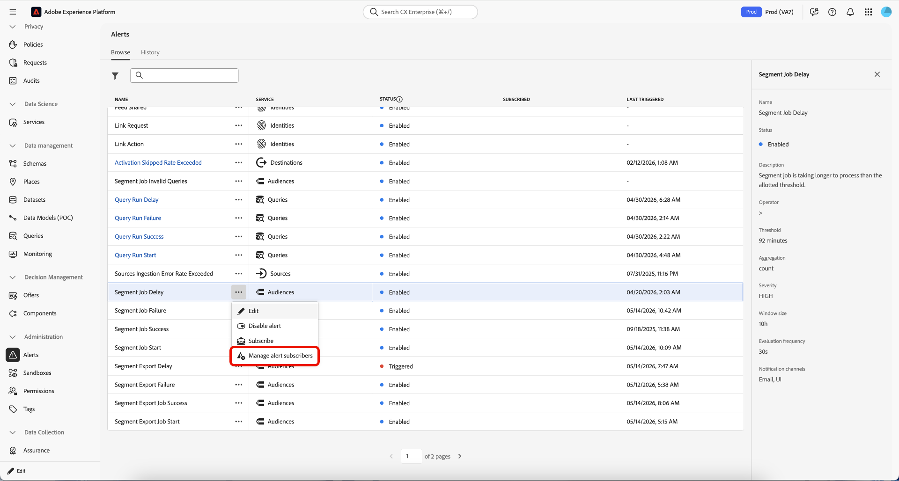

La page **[!UICONTROL Manage alert subscribers]** s’ouvre. Pour ajouter des abonnés, saisissez un identifiant utilisateur Adobe, une adresse e-mail externe ou une liste de groupes d’adresses e-mail, puis appuyez sur **Entrée**.

>[!NOTE]
>
>Pour ajouter plusieurs abonnés à la fois, saisissez des ID utilisateur ou des adresses e-mail séparées par des virgules.

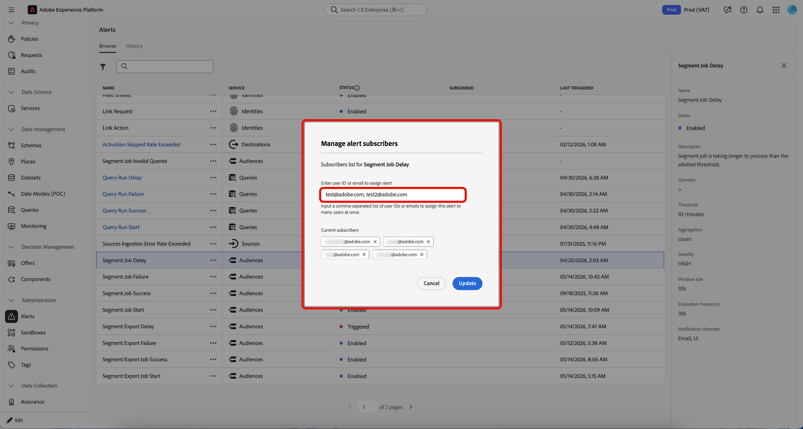

Les adresses ajoutées apparaissent dans la liste des abonnés. Sélectionnez **[!UICONTROL Update]**.

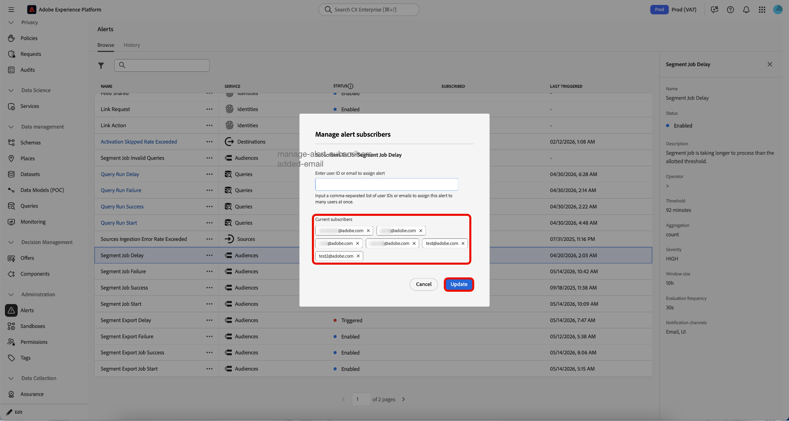

Une fois les abonnés ajoutés, ils recevront des notifications par e-mail pour cette alerte.

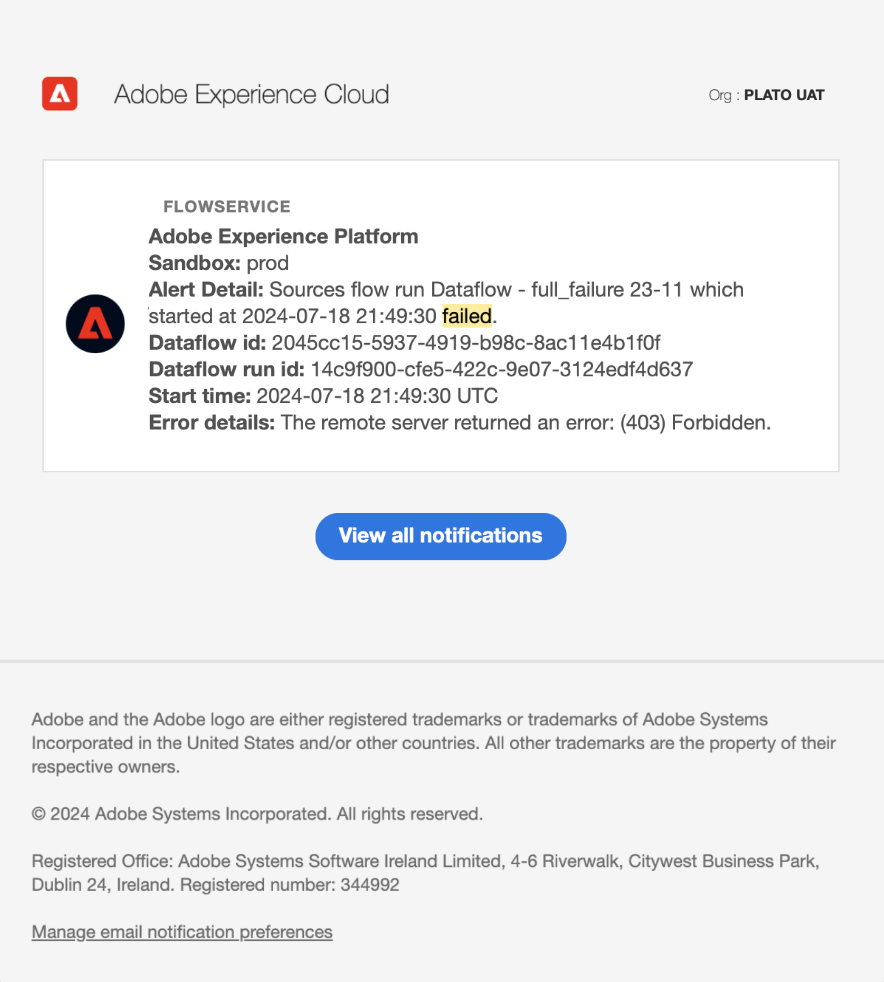

## Activer les alertes par e-mail {#enable-email}

Pour envoyer des notifications d’alerte dans votre boîte de réception, sélectionnez l’icône représentant une cloche () dans la barre d’outils supérieure droite pour ouvrir les notifications et les annonces. Dans la liste déroulante, sélectionnez l’icône des paramètres () pour ouvrir les préférences Experience Cloud.

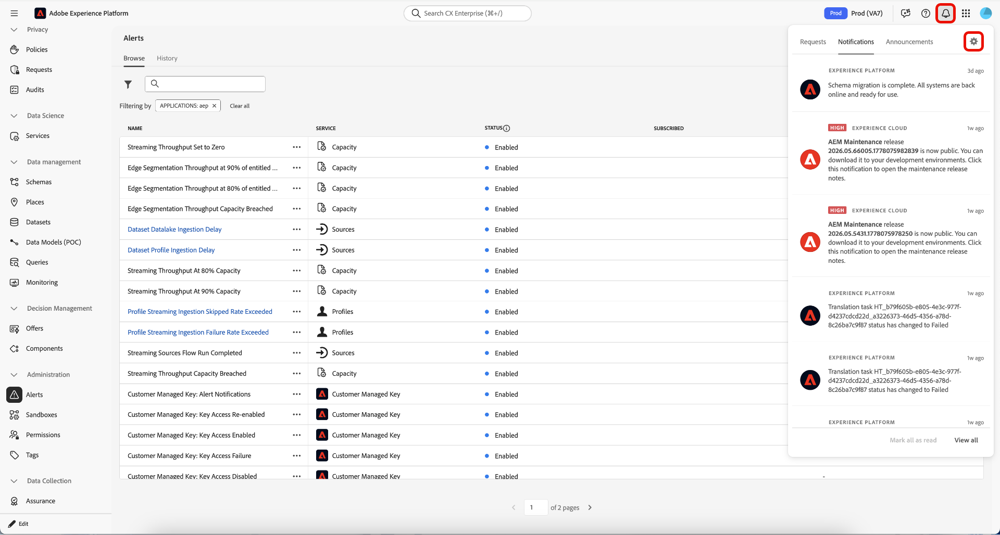

La page **[!UICONTROL Profile]** s’ouvre. Sélectionnez **[!UICONTROL Notifications]** dans le volet de navigation de gauche pour ouvrir les préférences d’e-mail. Faites défiler la page jusqu’à la section **E-mails**, en bas de la page, puis sélectionnez **[!UICONTROL Instant notifications]**.

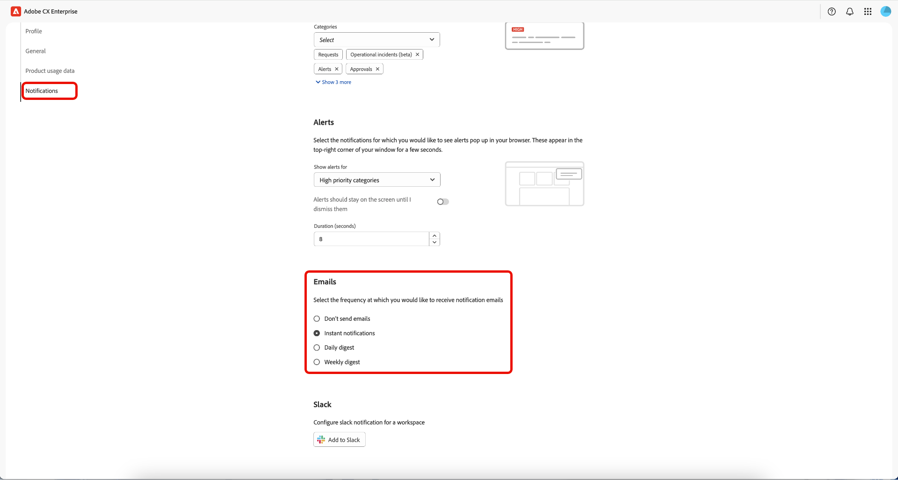

Les alertes auxquelles vous êtes abonné sont envoyées à l’adresse e-mail associée à votre Adobe ID.

## Personnaliser le seuil d’alerte {#alert-threshold}

Les seuils d’alerte peuvent être personnalisés pour les types d’alerte suivants :

| Type d’alerte | Paramètre personnalisé |
|---|---|
| Retard de la tâche relative aux segments | Seuil de retard |
| Retard d’export du segment | Seuil de retard |
| Retard d’exécution du flux de destination | Seuil de retard |
| Retard d’exécution du flux du service d’identités | Seuil de retard |
| Retard d’exécution du flux de profils | Seuil de retard |
| Taux d’échec d’ingestion de diffusion de profil dépassé | Seuil d’erreur |
| Taux d’omission de l’ingestion en flux continu du profil dépassé | Seuil d’erreur |
| Retard dans l’exécution du flux de sources | Seuil de retard |
| Taux d’erreurs d’ingestion de sources dépassé | Seuil d’erreur |
| Retard d’exécution de requête | Seuil de retard |
| Taux d’activations ignorées dépassé | Seuil d’erreur |

Sélectionnez les points de suspension (**...**) en regard du nom d’une règle, puis sélectionnez **[!UICONTROL Edit]**.

![L’option [!UICONTROL Edit] est mise en surbrillance pour la règle sélectionnée.](../images/alerts/ui/threshold-edit.png)

Sur la page **[!UICONTROL Customize alert]**, définissez le seuil de cette règle sur l’heure souhaitée (en minutes), puis sélectionnez **[!UICONTROL Confirm]**.

![Page Personnaliser une alerte mettant en surbrillance les options [!UICONTROL Threshold] et [!UICONTROL Confirm].](../images/alerts/ui/threshold-update.png)

Vous revenez à la page **[!UICONTROL Alerts]**. Pour vérifier le seuil, sélectionnez la règle dans la liste. Le panneau de droite affiche le seuil, le statut, la gravité et d’autres détails.

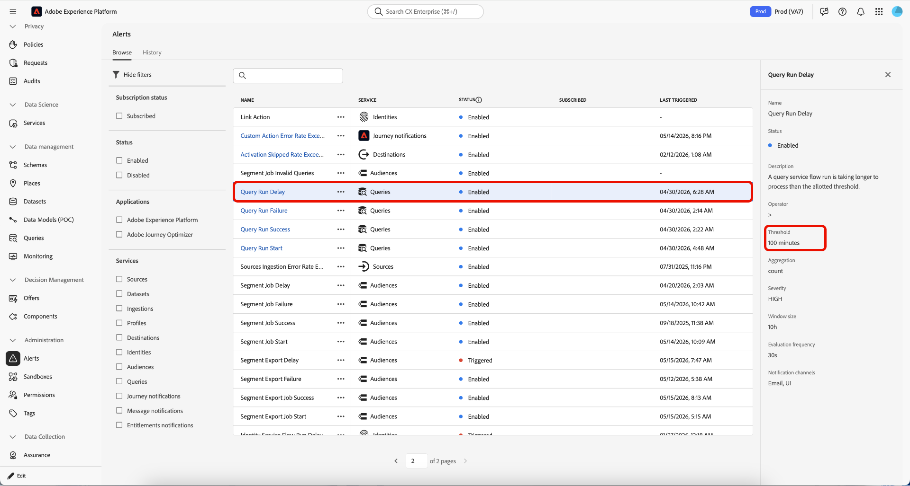

## Affichage de lʼhistorique des alertes {#alert-history}

L’onglet **[!UICONTROL History]** répertorie les alertes reçues par votre organisation, y compris la règle qui a déclenché l’alerte, le nom de l’objet associé, la date de déclenchement de l’alerte et la date de résolution de l’alerte (le cas échéant).

![Alertes reçues répertoriées dans l’onglet [!UICONTROL History].](../images/alerts/ui/history.png)

Sélectionnez une alerte dans la liste pour afficher plus de détails dans le panneau de droite, y compris un court résumé de ce qui l’a déclenchée. Utilisez la recherche globale pour rechercher et ouvrir l’objet associé.

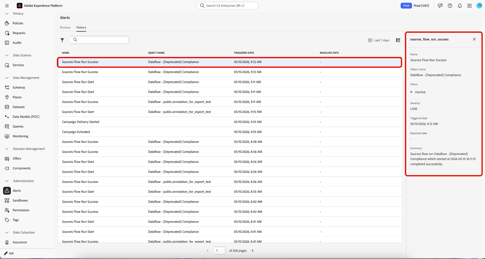

### Rechercher des alertes par nom d’alerte

Dans la barre de recherche, saisissez le texte correspondant au **nom de l’alerte**. La liste est mise à jour pour afficher les alertes correspondantes.

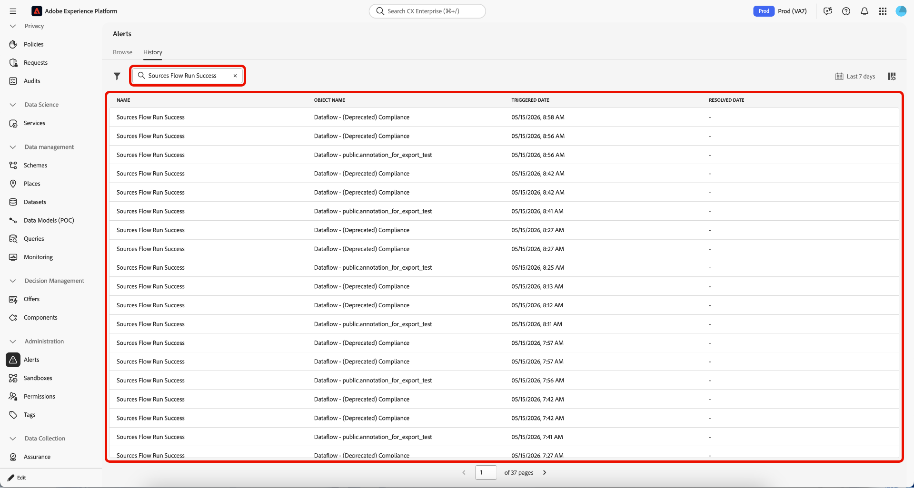

### Rechercher des alertes par nom d’objet

Pour filtrer par **nom de l’objet**, sélectionnez l’icône de filtre (), puis saisissez le nom de l’objet dans la barre de recherche. La liste affiche les alertes associées à cet objet.

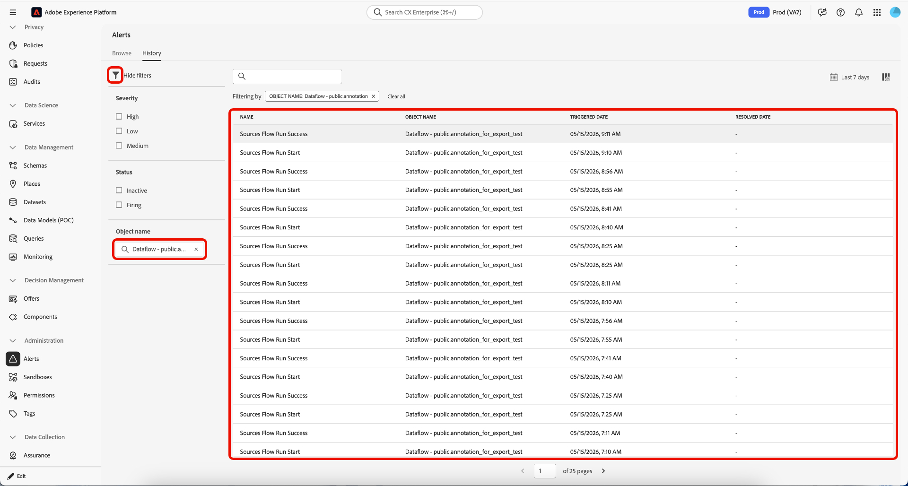

### Rechercher des alertes par période

Sélectionnez l’icône de calendrier () en haut à droite pour limiter les résultats aux alertes déclenchées au cours d’une période spécifique.

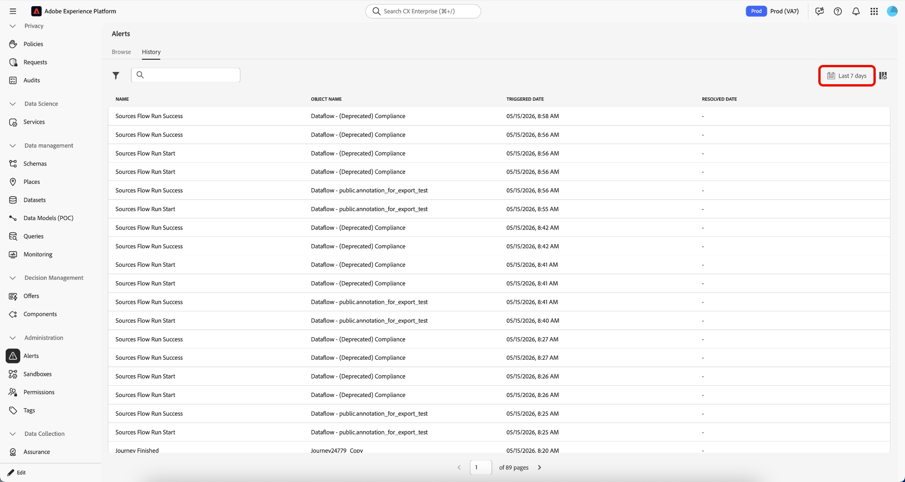

Sélectionnez un paramètre prédéfini (**[!UICONTROL Last 24 hours]**, **[!UICONTROL Last 7 days]** ou **[!UICONTROL Last 30 days]**) ou définissez une plage personnalisée dans le calendrier, puis sélectionnez **[!UICONTROL Apply]**.

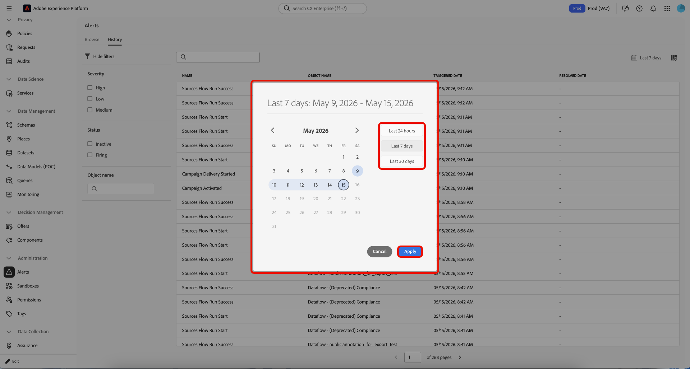

Vous revenez à l’onglet **[!UICONTROL History]** qui affiche les résultats filtrés.

## Étapes suivantes

Ce guide explique comment afficher et gérer les alertes dans l’interface utilisateur d’Experience Platform. Consultez la [[!DNL Observability Insights] présentation](../home.md) pour découvrir d’autres façons de surveiller l’activité dans Experience Platform.

