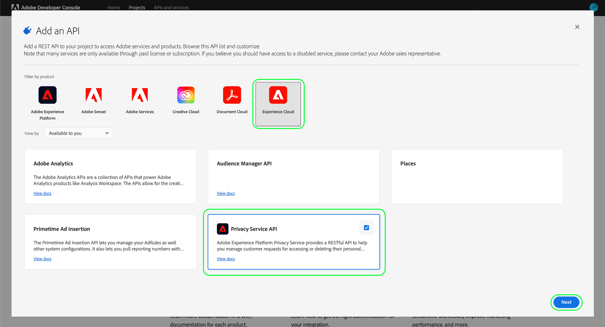

# S’authentifier et accéder à l’API Privacy Service

Ce guide présente les concepts de base que vous devez connaître avant d’effectuer des appels à l’API Adobe Experience Platform Privacy Service.

## Conditions préalables {#prerequisites}

Ce guide nécessite une compréhension pratique de [Privacy Service](../home.md) et de la manière dont il permet de gérer l’accès et de supprimer les requêtes de vos titulaires de données (clients) dans les applications Adobe Experience Cloud.

Pour créer des informations d’accès pour l’API, un administrateur de votre organisation doit avoir configuré au préalable des profils de produit pour Privacy Service dans Adobe Admin Console. Le profil de produit que vous attribuez à une intégration d’API détermine les autorisations dont dispose cette intégration lors de l’accès aux fonctionnalités de Privacy Service. Pour plus d’informations, consultez le guide sur la [gestion des autorisations Privacy Service](../permissions.md).

## Collecter des valeurs pour les en-têtes requis {#gather-values-required-headers}

Pour lancer des appels à l’API Privacy Service, vous devez d’abord rassembler vos informations d’identification d’accès pour les utiliser dans les en-têtes requis :

* `Authorization: Bearer {ACCESS_TOKEN}`
* `x-api-key: {API_KEY}`
* `x-gw-ims-org-id: {ORG_ID}`

Ces valeurs sont générées à l’aide de [Adobe Developer Console](https://developer.adobe.com/console). Vos `{ORG_ID}` et `{API_KEY}` ne doivent être générés qu’une seule fois et peuvent être réutilisés dans les appels d’API futurs. Cependant, votre `{ACCESS_TOKEN}` est temporaire et doit être régénéré toutes les 24 heures.

Les étapes de génération de ces valeurs sont décrites en détail ci-dessous.

### Configuration ponctuelle {#one-time-setup}

Accédez à [Adobe Developer Console](https://developer.adobe.com/console) et connectez-vous avec votre Adobe ID. Suivez ensuite les étapes décrites dans le tutoriel sur la [création d’un projet vide](https://developer.adobe.com/developer-console/docs/guides/projects/projects-empty/) dans la documentation de Developer Console.

Une fois que vous avez créé un projet, sélectionnez **[!UICONTROL Ajouter au projet]** et choisissez **[!UICONTROL API]** dans le menu déroulant.

![L’option d’API sélectionnée dans le menu déroulant [!UICONTROL Ajouter au projet] de la page des détails du projet dans Developer Console](../images/api/getting-started/add-api-button.png)

#### Sélectionner l’API Privacy Service {#select-privacy-service-api}

L’écran **[!UICONTROL Ajouter une API]** s’affiche. Sélectionnez **[!UICONTROL Experience Cloud]** pour limiter la liste des API disponibles, puis sélectionnez la vignette correspondant à **[!UICONTROL API Privacy Service]** avant de sélectionner **[!UICONTROL Suivant]**.

>[!TIP]
>
>Sélectionnez l’option **[!UICONTROL Afficher les documents]** pour accéder à la documentation de référence de l’API Privacy Service dans une fenêtre de navigateur distincte[&#128279;](https://developer.adobe.com/experience-platform-apis/references/privacy-service/).

Sélectionnez ensuite le type d’authentification pour générer des jetons d’accès et accéder à l’API Privacy Service.

>[!IMPORTANT]
>
>Sélectionnez la méthode **[!UICONTROL OAuth de serveur à serveur]**, car il s’agira de la seule méthode prise en charge à l’avenir. La méthode **[!UICONTROL Compte de service (JWT)]** est obsolète. Bien que les intégrations utilisant la méthode d’authentification JWT continueront à fonctionner jusqu’au 1er janvier 2025, Adobe vous recommande vivement de migrer les intégrations existantes vers la nouvelle méthode OAuth de serveur à serveur avant cette date. Pour plus d’informations, consultez la section [!BADGE Obsolète]{type=negative}[&#x200B; Générer un jeton web JSON (JWT)](/help/landing/api-authentication.md#jwt).

.

#### Attribution d’autorisations par le biais de profils de produit {#product-profiles}

La dernière étape de configuration consiste à sélectionner les profils de produit dont cette intégration héritera de ses autorisations. Si vous sélectionnez plusieurs profils, leurs jeux d’autorisations seront combinés pour l’intégration.

>[!NOTE]
>
>Les profils de produit et les autorisations granulaires qu’ils fournissent sont créés et gérés par les administrateurs via Adobe Admin Console. Pour plus d’informations[&#128279;](../permissions.md) consultez le guide sur les autorisations Privacy Service .

Lorsque vous avez terminé, sélectionnez **[!UICONTROL Enregistrer l’API configurée]**.

Une fois l’API ajoutée au projet, la page **[!UICONTROL API Privacy Service]** du projet affiche les informations d’identification suivantes, requises dans tous les appels aux API Privacy Service :

* `{API_KEY}` ([!UICONTROL ID client])
* `{ORG_ID}` ([!UICONTROL Identifiant de l’organisation])

### Authentification pour chaque session {#authentication-each-session}

Les dernières informations d’identification requises que vous devez collecter sont vos `{ACCESS_TOKEN}`, qui sont utilisées dans l’en-tête d’autorisation . Contrairement aux valeurs de `{API_KEY}` et `{ORG_ID}`, un nouveau jeton doit être généré toutes les 24 heures pour continuer à utiliser l’API.

En général, il existe deux méthodes pour générer un jeton d’accès :

* [Générez le jeton manuellement](#manual-token) à des fins de test et de développement.
* [Automatisez la génération de jetons](#auto-token) pour les intégrations d’API.

#### Génération manuelle d’un jeton {#manual-token}

Pour générer manuellement un nouveau `{ACCESS_TOKEN}`, accédez à **[!UICONTROL Informations d’identification]** > **[!UICONTROL OAuth de serveur à serveur]** et sélectionnez **[!UICONTROL Générer le jeton d’accès]**, comme illustré ci-dessous.

Un nouveau jeton d’accès est généré et un bouton permettant de copier le jeton dans le presse-papiers est fourni. Cette valeur est utilisée pour l’en-tête [!DNL Authorization] requis et doit être fournie au format `Bearer {ACCESS_TOKEN}`.

#### Automatiser la génération des jetons {#auto-token}

Vous pouvez également utiliser un environnement et une collection Postman pour générer des jetons d’accès. Pour plus d’informations, consultez la section sur l’[utilisation de Postman pour authentifier et tester les appels API](/help/landing/api-authentication.md#use-postman) dans le guide d’authentification des API Experience Platform.

## Lecture d’exemples d’appels API {#read-sample-api-calls}

Chaque guide de point d’entrée fournit des exemples d’appels API pour démontrer comment formater vos requêtes. Il s’agit notamment de chemins d’accès, d’en-têtes requis et de payloads de requêtes correctement formatés. L’exemple JSON renvoyé dans les réponses de l’API est également fourni. Pour en savoir plus sur les conventions utilisées dans la documentation pour les exemples d’appels API, consultez la section relative à la [lecture d’exemples d’appels API](../../landing/api-guide.md#sample-api) dans le guide de prise en main des API d’Experience Platform.

## Étapes suivantes {#next-steps}

Maintenant que vous savez quels en-têtes utiliser, vous êtes prêt à commencer à lancer des appels à l’API Privacy Service. Sélectionnez l’un des guides des points d’entrée pour commencer :

* [Tâches de confidentialité](./privacy-jobs.md)
* [Consentement](./consent.md)
