# Gérer les autorisations pour Privacy Service

L’accès à [Adobe Experience Platform Privacy Service](./home.md) est contrôlé par des autorisations granulaires en fonction du rôle dans Adobe Admin Console. En créant des profils de produit qui attribuent des autorisations à des groupes d’utilisateurs, vous pouvez déterminer qui a accès aux fonctionnalités de l’[Interface utilisateur](./ui/overview.md) et des [API](./api/overview.md) de Privacy Service.

>[!NOTE]
>
>Lors de la création d’une intégration pour l’API de Privacy Service, vous devez sélectionner un profil de produit existant afin de déterminer les fonctionnalités ou actions pour lesquelles l’intégration dispose d’autorisations. Consultez le guide sur la [prise en main de l’API de Privacy Service](./api/getting-started.md) pour plus d’informations.

Ce guide vous explique comment gérer les autorisations pour Privacy Service.

## Prise en main

Pour configurer le contrôle d’accès de Privacy Service, vous devez disposer de droits d’administrateur pour une organisation qui dispose d’une intégration de produit avec Adobe Experience Platform Privacy Service. Le rôle minimum qui permet d’accorder ou de retirer des autorisations est un **administrateur de profils de produit**. Les autres rôles d’administrateur qui peuvent gérer des autorisations sont les **administrateurs de produit** (qui peuvent gérer tous les profils au sein d’un produit) et les **administrateurs système** (aucune restriction). Consultez l’article sur les [rôles administratifs](https://helpx.adobe.com/fr/enterprise/using/admin-roles.html) dans le guide d’administration d’Adobe Enterprise pour plus d’informations.

Ce guide suppose que vous connaissez les concepts de base d’Admin Console tels que les profils de produit et la manière dont ils accordent des autorisations de produit à des utilisateurs et utilisatrices individuels et à des groupes. Pour plus d’informations, consultez le [guide d’utilisation d’Admin Console](https://helpx.adobe.com/fr/enterprise/using/admin-console.html).

## Autorisations disponibles

Le tableau suivant décrit les autorisations disponibles pour Privacy Service avec des descriptions des fonctionnalités spécifiques auxquelles elles donnent accès :

>[!NOTE]
>
>Toutes les autorisations Privacy Service et [!UICONTROL Opt Out of Sale] sont distinctes et séparées les unes des autres, sans chevauchement fonctionnel. Cela est possible, car l’API de Privacy Service est considérée comme idempotent.

| Catégorie | Autorisation | Description |
| --- | --- | --- |
| [!UICONTROL Privacy Service Permissions] | [!UICONTROL Privacy Read Permission] | Détermine si l’utilisateur ou l’utilisatrice peut afficher les requêtes d’accès et de suppression existantes, ainsi que leurs détails. |
| [!UICONTROL Privacy Service Permissions] | [!UICONTROL Privacy Write Permission] | Détermine si un utilisateur ou une utilisatrice peut créer de nouvelles requêtes d’accès et de suppression. |
| [!UICONTROL Privacy Service Permissions] | [!UICONTROL Read (Access) Content Delivery Permission] | Lorsqu’une requête d’accès est traitée par Privacy Service, un fichier ZIP contenant les données du client ou de la cliente lui est envoyé. Lorsque vous recherchez les détails d’une requête d’accès, cette autorisation détermine si l’utilisateur ou l’utilisatrice peut accéder au lien de téléchargement pour le fichier ZIP de la requête. |
| [!UICONTROL Opt Out of Sale Permissions] | [!UICONTROL Read Permission - Opt Out of Sale] | Détermine si l’utilisateur ou l’utilisatrice peut afficher les requêtes de désinscription à la vente existantes, ainsi que leurs détails. |
| [!UICONTROL Opt Out of Sale Permissions] | [!UICONTROL Write Permission - Opt Out of Sale] | Détermine si un utilisateur ou une utilisatrice peut créer de nouvelles requêtes de désinscription de la vente. |

{style="table-layout:auto"}

## Gérer les autorisations {#manage}

Pour gérer les autorisations de Privacy Service, connectez-vous à [Admin Console](https://adminconsole.adobe.com/) et sélectionnez **[!UICONTROL Products]** dans la barre de navigation supérieure. À partir de là, sélectionnez **[!UICONTROL Adobe Experience Platform Privacy Service]**.

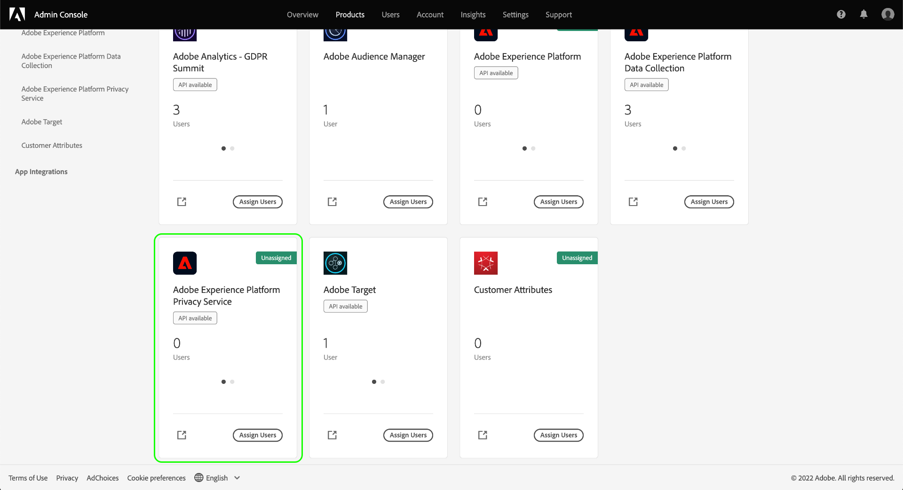

### Sélectionner ou créer un profil de produit

L’écran suivant affiche une liste des profils de produits disponibles pour Privacy Service sous votre organisation. S’il n’existe aucun profil de produit, sélectionnez **[!UICONTROL New Profile]** pour en créer un. Si votre organisation compte plusieurs rôles ou groupes d’utilisateurs et d’utilisatrices nécessitant différents niveaux d’accès, vous devez créer un profil de produit distinct pour chacun d’eux.

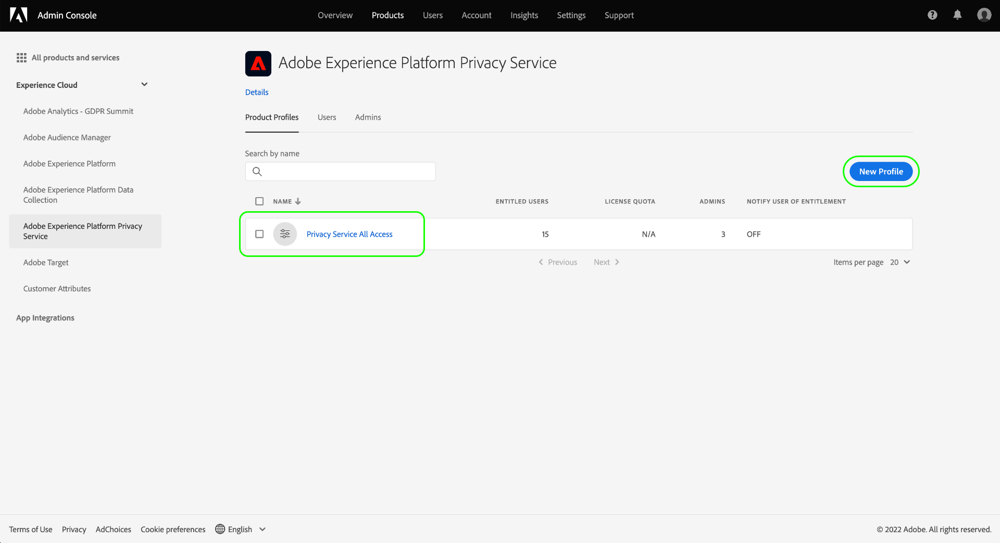

Après avoir sélectionné un profil de produit, vous pouvez utiliser l’onglet **[!UICONTROL Permissions]** pour démarrer [modification des autorisations](#edit-permissions) pour le profil, ou sélectionner l’onglet **[!UICONTROL Users]** pour démarrer [affectation d’utilisateurs](#assign-users) au profil.

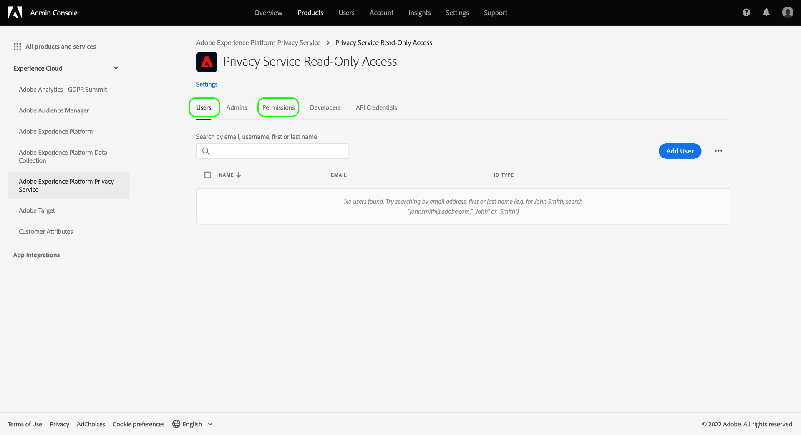

### Modifier les autorisations pour le profil {#edit-permissions}

Sur l’onglet **[!UICONTROL Permissions]** , sélectionnez l’une des catégories d’autorisations affichées pour accéder à la vue d’édition des autorisations.

Lors de l’édition des autorisations d’un profil, les autorisations disponibles sont répertoriées dans la colonne de gauche tandis que celles qui sont incluses dans le profil sont répertoriées dans la colonne de droite. Sélectionnez les autorisations répertoriées pour les déplacer entre les colonnes.

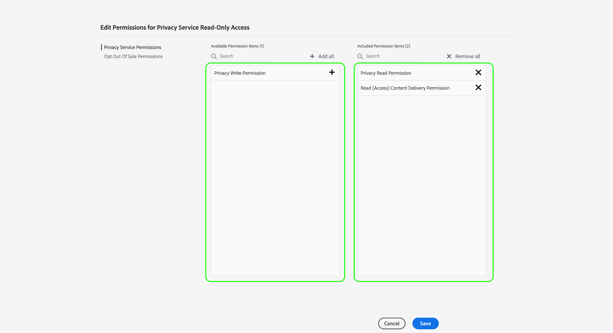

Les autorisations sont organisées en catégories. Pour passer d’une catégorie à l’autre, sélectionnez la catégorie souhaitée dans le volet de navigation de gauche.

![La section [!UICONTROL Opt Out of Sale] sous autorisations.](./images/permissions/switch-category.png)

Sélectionnez **[!UICONTROL Save]** une fois la configuration des autorisations terminée.

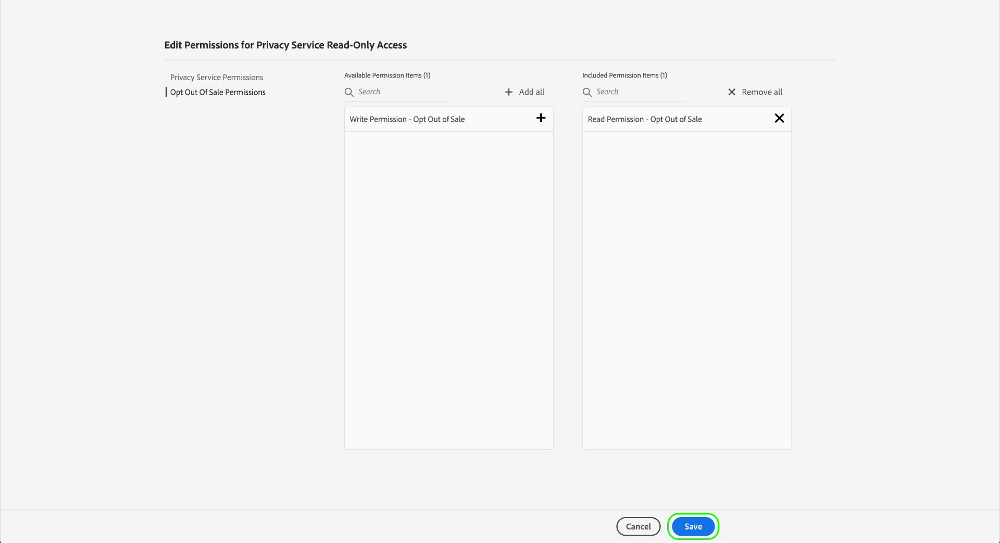

La vue Profil de produit réapparaît avec les autorisations ajoutées reflétées.

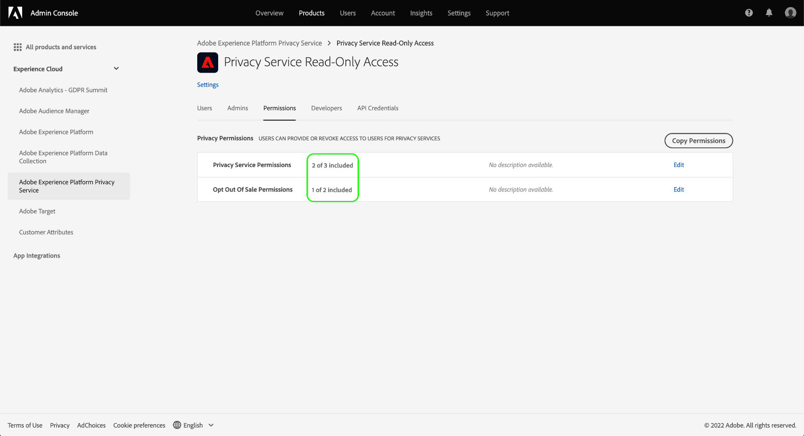

### Attribution d’utilisateurs et d’utilisatrices au profil {#assign-users}

Pour affecter des utilisateurs et utilisatrices au profil de produit (et leur accorder les autorisations configurées du profil), sélectionnez l’onglet **[!UICONTROL Users]** , suivi de **[!UICONTROL Add user]**.

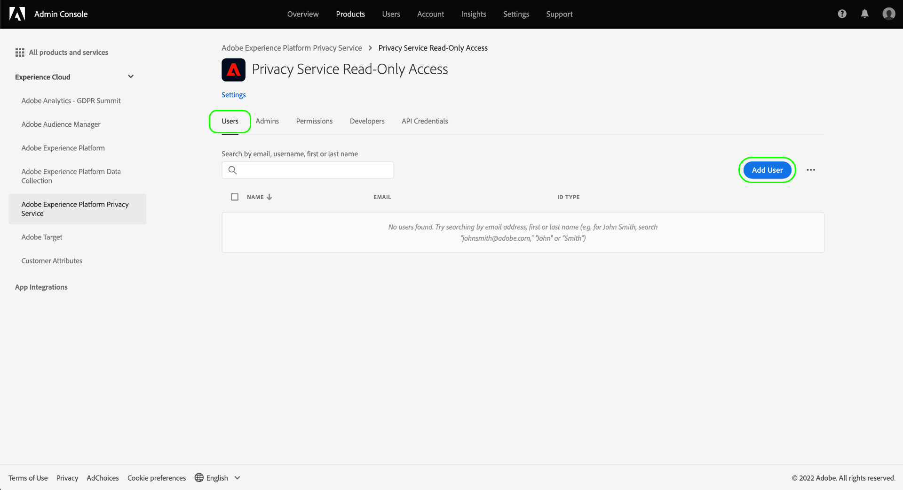

Pour plus d’informations sur la gestion des utilisateurs et utilisatrices pour un profil de produit, voir la [Documentation concernant Admin Console](https://helpx.adobe.com/fr/enterprise/using/manage-product-profiles.html).

### Migrer les informations d’identification d’API héritées vers le profil {#migrate-tech-accounts}

>[!NOTE]
>
>Cette section s’applique uniquement aux informations d’identification d’API existantes qui ont été créées avant l’intégration des autorisations de Privacy Service dans Adobe Admin Console. Pour les nouvelles informations d’identification, les profils de produit (et leurs autorisations) sont plutôt attribués via les [Projets d’Adobe Developer Console](https://developer.adobe.com/developer-console/docs/guides/projects/).  Voir la section sur l’[attribution de profils de produit à un projet](./api/getting-started.md#product-profiles) dans le guide de prise en main de l’API Privacy Service pour obtenir plus d’informations.

Auparavant, les comptes techniques ne nécessitaient pas de profil de produit pour l’intégration et les autorisations. Cependant, en raison des récentes améliorations apportées aux autorisations de Privacy Service, il est désormais nécessaire de migrer les informations d’identification d’API héritées vers le profil de produit. Cette mise à jour permet d’accorder des autorisations granulaires aux personnes titulaires d’un compte technique. Suivez les étapes ci-dessous pour mettre à jour les autorisations de compte technique pour Privacy Service.

#### Mettre à jour les autorisations de compte technique {#update-tech-account-permissions}

La première étape de l’attribution d’un jeu d’autorisations pour votre compte technique consiste à accéder à l’[Adobe Admin Console](https://adminconsole.adobe.com/) et créer un profil de produit pour Privacy Service.

Dans l’interface utilisateur d’Admin Console, sélectionnez **Produits** dans la barre de navigation, puis **[!UICONTROL Experience Cloud]** et **[!UICONTROL Adobe Experience Platform Privacy Service]** dans la barre latérale gauche. L’onglet [!UICONTROL Product Profiles] s’affiche. Sélectionnez **Nouveau profil** pour créer un profil de produit pour Privacy Service.

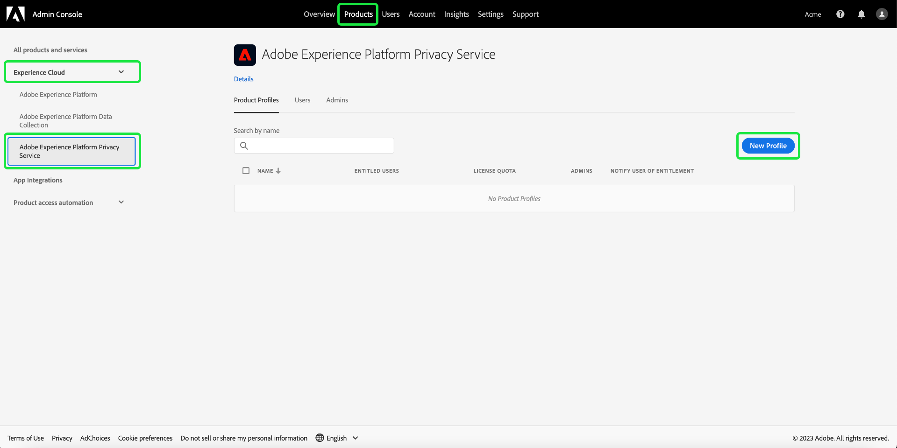

La boîte de dialogue [!UICONTROL Create a new product profile] s’affiche. Vous trouverez des instructions complètes sur la création d’un profil de produit dans le [Guide de l’interface utilisateur pour la création de profils](../access-control/ui/create-profile.md).

Après avoir enregistré votre nouveau profil de produit, accédez à l’[Adobe Developer Console](https://developer.adobe.com/console/home) et connectez-vous à ce produit ou à ce projet. Sélectionnez **[!UICONTROL Projects]** dans le volet de navigation supérieur, suivi de la vignette de votre projet.

>[!NOTE]
>
>Vous devrez peut-être vider votre cache et/ou attendre un certain temps pour que le nouveau projet apparaisse dans la liste de vos projets Developer Console.

Une fois la connexion à votre projet effectuée, sélectionnez l’intégration **[!UICONTROL Privacy Service API]** dans la barre latérale gauche.

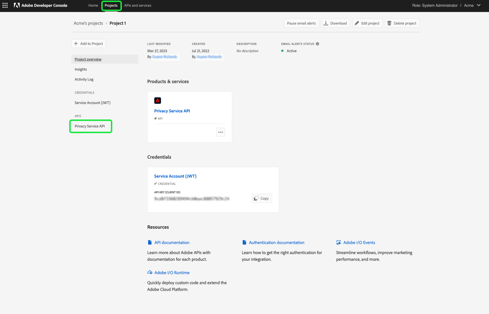

Le tableau de bord de l’intégration de l’API de Privacy Service s’affiche. Dans ce tableau de bord, vous pouvez modifier le profil de produit associé à ce projet. Sélectionnez **[!UICONTROL Edit product profiles]** pour lancer le processus. La boîte de dialogue [!UICONTROL Configure API] s’affiche.

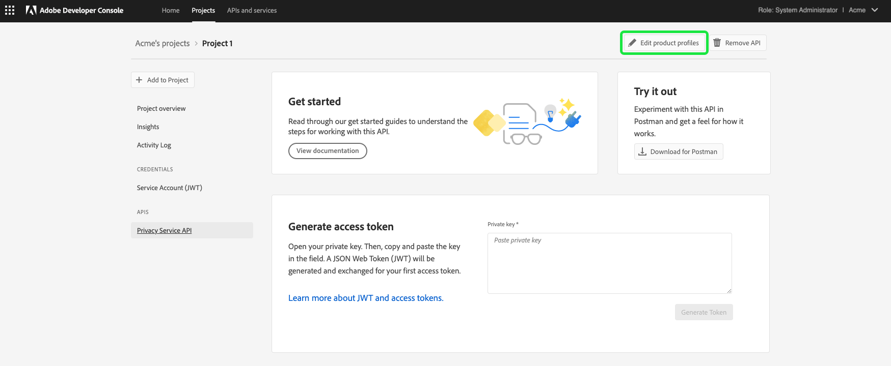

La boîte de dialogue [!UICONTROL Configure API] affiche les profils de produit disponibles qui existent actuellement dans le service. Ils sont en corrélation avec les profils de produit créés dans l’Admin Console. Dans la liste des profils de produit disponibles, cochez la case correspondant au nouveau profil de produit que vous avez créé pour le compte technique dans l’Admin Console. Ce compte technique est ainsi automatiquement associé aux autorisations du profil de produit sélectionné. Sélectionnez **[!UICONTROL Save configured API]** pour confirmer vos paramètres.

>[!NOTE]
>
>Si un compte technique est déjà associé à un profil de produit, l’une des cases à cocher de la liste des profils de produit disponibles est déjà sélectionnée.

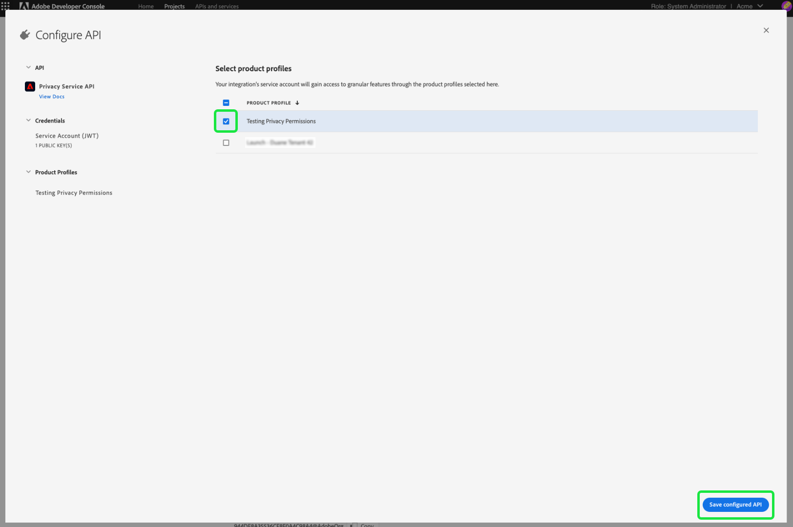

#### Vérifier que vos paramètres ont été appliqués {#confirm-applied-settings}

Pour confirmer que vos paramètres ont été appliqués au compte : Revenez à l’[Admin Console](https://adminconsole.adobe.com/) et accédez à votre profil de produit nouvellement créé. Sélectionnez l’onglet **[!UICONTROL API Credentials]** pour afficher la liste des projets associés. Le projet utilisé dans la Developer Console et dans lequel vous avez affecté le profil de produit au compte technique s’affiche dans la liste des informations d’identification. Le nom de chaque information d’identification d’API est composé du nom du projet et d’un numéro généré de manière aléatoire à la fin. Sélectionnez des informations d’identification pour ouvrir le panneau [!UICONTROL Details].

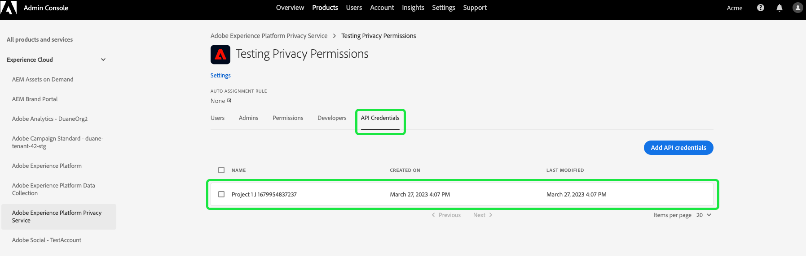

Le panneau [!UICONTROL Details] contient des informations sur les informations d’identification de l’API, notamment l’identifiant technique associé, la clé API, la date de création et de dernière modification, ainsi que les produits Adobe associés.

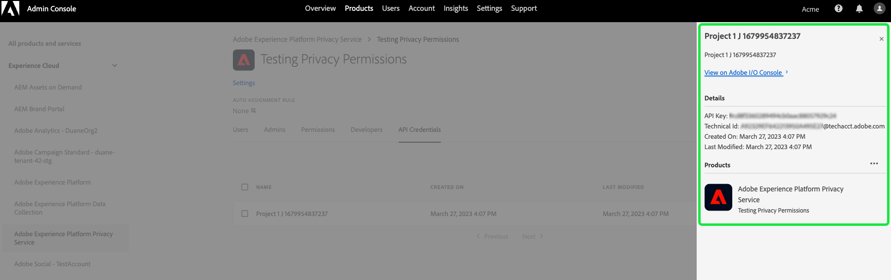

## Étapes suivantes

Ce guide couvrait les autorisations disponibles pour Privacy Service et la manière de les gérer via Admin Console.

Pour savoir comment créer une intégration d’API après avoir configuré les profils de produit, reportez-vous au [guide de prise en main pour l’API Privacy Service](./api/getting-started.md). Pour plus d’informations sur la gestion des autorisations pour d’autres fonctionnalités d’Adobe Experience Platform, reportez-vous à la [documentation sur le contrôle d’accès](../access-control/home.md).
