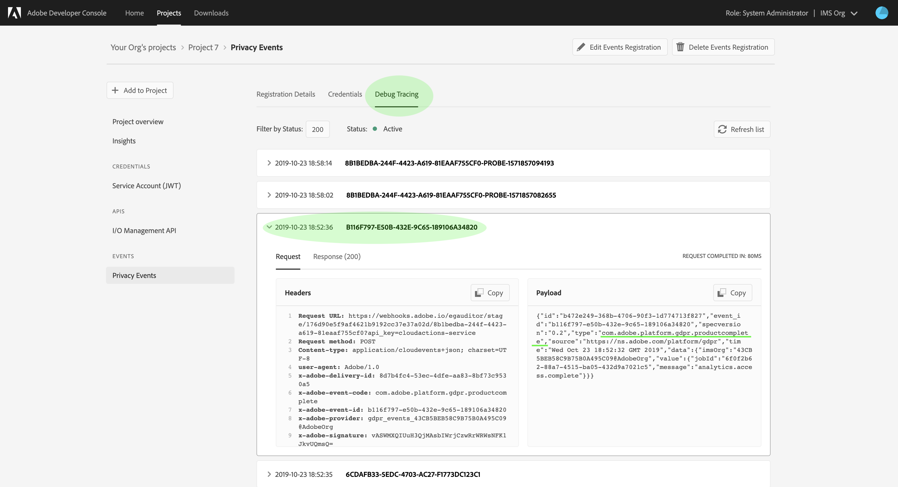

# S’abonner à [!DNL Privacy Service Events]

[!DNL Privacy Service Events] messages sont fournis par Adobe Experience Platform [!DNL Privacy Service], qui exploitent Adobe I/O Events envoyé à un webhook configuré pour faciliter l’automatisation efficace des demandes de traitement. Ils réduisent ou éliminent la nécessité d’interroger l’API [!DNL Privacy Service] pour vérifier si une tâche est terminée ou si un certain jalon a été atteint dans un workflow.

Il existe actuellement quatre types de notifications liées au cycle de vie de la tâche de demande d’accès à des informations personnelles :

| Type | Description |
| --- | --- |
| Fin de tâche | Toutes les applications [!DNL Experience Cloud] ont renvoyé leurs résultats et l&#39;état global ou intégral de la tâche a été marqué comme terminé. |
| Erreur de tâche | Une ou plusieurs applications ont signalé une erreur lors du traitement de la requête. |
| Produit terminé | L&#39;une des demandes associées à cet emploi a terminé son travail. |
| Erreur de produit | Une des applications a signalé une erreur lors du traitement de la requête. |

Ce document décrit les étapes à suivre pour configurer l’enregistrement d’un événement pour les notifications [!DNL Privacy Service] et pour interpréter les payloads des notifications.

## Prise en main

Veuillez consulter la documentation Privacy Service suivante avant de commencer ce tutoriel :

* [Présentation de Privacy Service](./home.md)
* [Guide de l’API Privacy Service](./api/overview.md)

## Enregistrer un webhook pour [!DNL Privacy Service Events]

Pour recevoir des [!DNL Privacy Service Events], vous devez utiliser Adobe Developer Console pour enregistrer un webhook auprès de votre intégration [!DNL Privacy Service].

Suivez le tutoriel sur [l’abonnement aux notifications [!DNL I/O Event]](../observability/alerts/subscribe.md) pour obtenir des instructions détaillées sur la manière d’y parvenir. Veillez à choisir **[!UICONTROL Privacy Service Events]** comme fournisseur d’événements pour accéder aux événements répertoriés ci-dessus.

## Recevoir des notifications [!DNL Privacy Service Event]

Une fois que vous avez correctement enregistré votre webhook et que les tâches de confidentialité ont été exécutées, vous pouvez commencer à recevoir des notifications d’événement. Vous pouvez afficher ces événements à l’aide du webhook lui-même ou en sélectionnant l’onglet **[!UICONTROL Debug Tracing]** dans la présentation de l’enregistrement des événements de votre projet dans Adobe Developer Console.



Le fichier JSON suivant est un exemple de payload de notification [!DNL Privacy Service Event] qui est envoyée à votre webhook lorsque l’une des applications associées à une tâche de confidentialité a terminé son travail :

```json
{
  "id":"b472e249-368b-4706-90f3-1d774713f827",
  "event_id":"b116f797-e50b-432e-9c65-189106a34820",
  "specversion":"0.2",
  "type":"com.adobe.platform.gdpr.productcomplete",
  "source":"https://ns.adobe.com/platform/gdpr",
  "time":"Wed Oct 23 18:52:32 GMT 2019",
  "data":{
    "imsOrg":"{ORG_ID}",
    "value":{
      "jobId":"6f0f2b62-88a7-4515-ba05-432d9a7021c5",
      "message":"analytics.access.complete"
    }
  }
}
```

| Propriété | Description |
| --- | --- |
| `id` | Identifiant unique généré par le système pour la notification. |
| `type` | Type de notification envoyée, donnant un contexte aux informations fournies sous `data`. Les valeurs potentielles sont les suivantes : <ul><li>`com.adobe.platform.gdpr.jobcomplete`</li><li>`com.adobe.platform.gdpr.joberror`</li><li>`com.adobe.platform.gdpr.productcomplete`</li><li>`com.adobe.platform.gdpr.producterror`</li></ul> |
| `time` | Date et heure du moment où l’événement s’est produit. |
| `data.value` | Contient des informations supplémentaires sur les éléments qui ont déclenché la notification : <ul><li>`jobId` : identifiant de la tâche de confidentialité qui a déclenché la notification.</li><li>`message` : message relatif au statut spécifique du traitement. Pour les notifications `productcomplete` ou `producterror`, ce champ indique l’application Experience Cloud en question.</li></ul> |

## Étapes suivantes

Ce document explique comment enregistrer des événements Privacy Service dans un webhook configuré et comment interpréter les payloads des notifications. Pour savoir comment effectuer le suivi des tâches de confidentialité à l’aide de l’interface utilisateur, consultez le guide d’utilisation de [&#128279;](./ui/user-guide.md).
