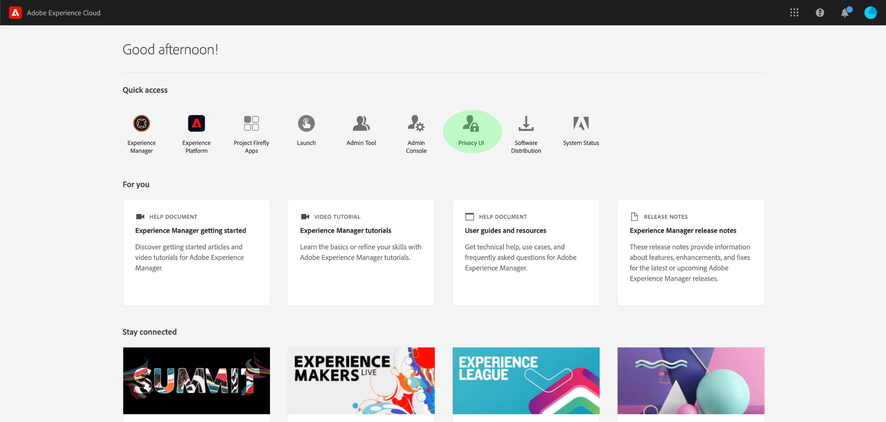
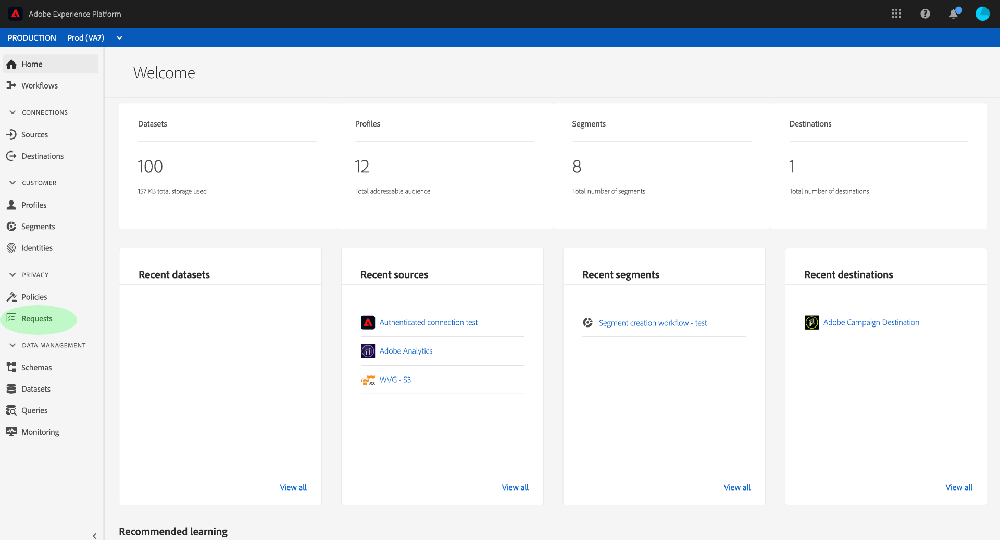

# Présentation de l’interface utilisateur de [!DNL Privacy Service] {#privacy-ui-guide}

>[!CONTEXTUALHELP]
>id="platform_privacy_privacyconsole_requests"
>title="Requêtes des titulaires de données"
>abstract="Ce widget affiche le nombre de requêtes des titulaires de données envoyées et terminées ayant été traitées par Privacy Service pour un jour donné. Pour plus d&#39;informations sur vos processus de Privacy Service, sélectionnez **Requêtes** dans le volet de navigation de gauche."

L’interface utilisateur de Privacy Service vous permet de coordonner les demandes de confidentialité et de conformité entre différentes applications Adobe Experience Cloud.

>[!NOTE]
>
>Pour plus d’informations sur la gestion des demandes de conformité par programmation à l’aide de l’API Privacy Service, consultez le [guide de l’API Privacy Service](../api/overview.md). Pour plus d’informations, consultez le document [gestion des autorisations Privacy Service](../permissions.md).

## Connectez-vous à l’interface utilisateur de [!DNL Privacy Service]

>[!IMPORTANT]
>
>Vous devez disposer d’une Adobe ID pour vous authentifier auprès de l’interface utilisateur de [!DNL Privacy Service].

Pour accéder à l’interface utilisateur, connectez-vous à  puis sélectionnez **[!UICONTROL Privacy Service]** dans le menu Accès rapide.

### Connexion à partir de [!DNL Experience Platform]

Si vous avez accès à l’interface utilisateur de Adobe Experience Platform, vous pouvez également accéder à l’interface utilisateur de [!DNL Privacy Service] via l’onglet **[!UICONTROL Requests]** dans le volet de navigation de gauche.

## Étapes suivantes

Maintenant que vous êtes connecté, reportez-vous au [guide d’utilisation](user-guide.md) pour savoir comment effectuer diverses opérations à l’aide de l’interface utilisateur de [!DNL Privacy Service].
