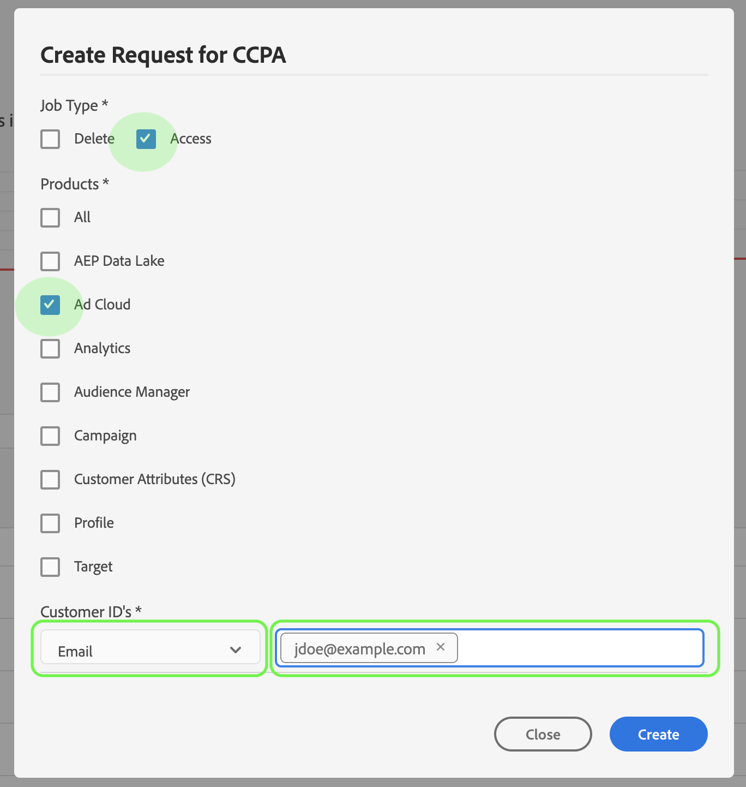
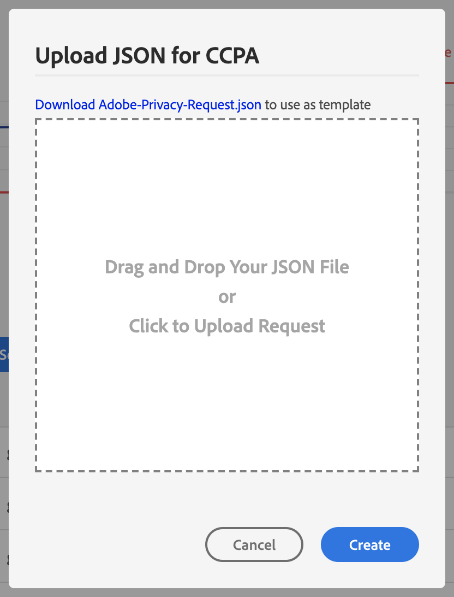

# Guide de l’utilisateur de Privacy Service

Ce décrit les étapes de création et de gestion des demandes de confidentialité à l’aide de l’interface utilisateur de Privacy Service.

## Parcourir le de l’interface utilisateur de Privacy Service 

Le  de l’interface utilisateur de Privacy Service fournit deux widgets qui vous permettent de  l’état de vos tâches de confidentialité : Rapport **** d’état et demandes **de** tâche. Le  affiche également la réglementation sélectionnée pour les tâches affichées.

### Type de règlement

Privacy Service prend en charge les demandes d’emploi pour deux types de réglementation :

* Le Règlement général sur la protection des données (RGD)
* La Loi sur la protection des renseignements personnels des consommateurs de Californie (ACCP).

Les tâches de chaque type de réglementation sont suivies séparément. Pour passer d&#39;un type de réglementation à l&#39;autre, cliquez sur le menu déroulant Type **de** réglementation et sélectionnez la réglementation souhaitée dans le .

Lorsque vous modifiez le type de réglementation, le  à jour pour afficher toutes les opérations, les , les widgets et les boîtes de dialogue de création d&#39;emplois qui s&#39;appliquent au règlement sélectionné.

### Rapport d’état

Le graphique sur le côté gauche du widget Rapport d’état effectue le suivi des tâches envoyées par rapport aux tâches qui peuvent avoir été signalées avec des erreurs. Le graphique sur la droite effectue le suivi des tâches proches de la fin de la fenêtre de conformité de 30 jours.

Cliquez sur l’un des deux boutons de bascule situés au-dessus du graphique pour afficher ou masquer leurs mesures respectives.

Vous pouvez le nombre exact de tâches associées à un point de données des graphiques en survolant le point de données en question avec la souris.

Pour  plus d’informations sur un point de données donné, cliquez sur le point de données en question pour afficher les tâches associées dans le widget Demandes de travaux. Prenez note du filtre appliqué juste au-dessus du  de travail.

>[!NOTE] Lorsqu’un filtre a été appliqué au widget Demandes de travaux, vous pouvez le supprimer en cliquant sur le **X** sur la pilule de filtre. Demandes de tâche revient alors au de suivi par défaut.

### Demandes de travaux

Le widget Demandes de travaux  toutes les demandes de travaux disponibles dans votre organisation, y compris des détails tels que le type de demande, l’état actuel, la date d’échéance et le courrier électronique du demandeur.

>[!NOTE] Les données des tâches créées précédemment ne sont accessibles que pendant 30 jours après la date d’achèvement.

Vous pouvez filtrer le  en saisissant des mots-clés dans la barre de recherche sous le titre Demandes de travaux. Le  automatiquement le  au fur et à mesure que vous tapez, affichant les requêtes qui contiennent des valeurs correspondant aux termes recherchés. Vous pouvez également utiliser le menu déroulant **Demandé sur** pour sélectionner une période pour les tâches répertoriées.

Pour  les détails d’une demande de tâche spécifique, cliquez sur l’ID de tâche de la demande dans le  pour ouvrir la page Détails *de la* tâche.

Cette boîte de dialogue contient des informations d’état sur chaque solution Experience Cloud et son état actuel par rapport à la tâche globale. Chaque tâche de confidentialité étant asynchrone, la page affiche la date et l’heure de communication (GMT) les plus récentes de chaque solution, car certaines nécessitent plus de temps que d’autres pour traiter la demande.

Si une solution a fourni des données supplémentaires, elles peuvent être consultées dans cette boîte de dialogue. Vous pouvez  ces données en cliquant sur les lignes de produit individuelles.

Pour télécharger l’intégralité des données de tâche au format CSV, cliquez sur **Exporter au format CSV** dans le coin supérieur droit de la boîte de dialogue.

## Créer une demande de tâche de confidentialité

L’interface utilisateur de Privacy Service propose deux méthodes pour créer des demandes de tâche :

* Utilisation du Créateur de requêtes
* Téléchargement d’un fichier JSON

Les étapes d’utilisation de chacune de ces méthodes sont décrites dans les sections suivantes.

### Utilisation du Créateur de requêtes

A l’aide du Créateur de requêtes, vous pouvez créer manuellement une nouvelle demande de tâche de confidentialité dans l’interface utilisateur. Le créateur de requêtes est préférable pour des jeux de requêtes plus simples et plus petits, car le créateur de requêtes limite les requêtes à n’avoir qu’un type d’ID par utilisateur. Pour les requêtes plus complexes, il peut être préférable de [télécharger un fichier](#upload-a-json-file) JSON à la place.

Pour  à l’aide du créateur de requêtes, cliquez sur **Créer une requête** sous le widget Rapport d’état sur le côté droit de l’écran.

La boîte de dialogue *Créer une demande* s’ouvre et affiche les options disponibles pour envoyer une demande de travail de confidentialité pour le type de réglementation actuellement sélectionné.

Sélectionnez le type **de** tâche de la requête (&quot;Supprimer&quot; ou &quot;Accès&quot;) et un ou plusieurs **produits** disponibles à partir du . Sous ID **du client**, sélectionnez un type d’ID dans le menu déroulant (adresse électronique, ECID ou AAID). Tapez les valeurs d’ID dans la zone de texte à droite, en appuyant sur **\&lt;enter>** pour chaque ID afin de l’ajouter au .

Les ID inclus dans ce recevront une copie de toute notification par courrier électronique de la part de Privacy Service, qui sera envoyée lorsqu’une tâche se termine, se termine par des erreurs ou expire. Lorsque vous avez terminé, cliquez sur **Créer**.

La boîte de dialogue disparaît et la nouvelle tâche (ou les tâches) sont répertoriées dans le widget Demandes de travaux avec leur état de traitement actuel.

### Téléchargement d’un fichier JSON

Lorsque vous créez des requêtes plus complexes, comme celles qui utilisent plusieurs types d’ID pour chaque sujet de données traité, vous pouvez créer une requête en téléchargeant un fichier JSON.

Cliquez sur la flèche en regard de **Créer une requête**, sous le widget Rapport d’état sur le côté droit de l’écran. Dans le  des options qui s’affiche, sélectionnez **Télécharger JSON**.

La boîte de dialogue *Télécharger JSON* s’affiche, vous permettant ainsi de faire glisser votre fichier JSON dans une fenêtre.

Si vous ne disposez pas d’un fichier JSON à télécharger, cliquez sur **Télécharger Adobe-GDPR-Request.json** pour télécharger un modèle que vous pouvez renseigner en fonction des valeurs que vous avez collectées auprès de vos sujets de données.

Recherchez le fichier JSON sur votre ordinateur et faites-le glisser dans la fenêtre de dialogue. Si le téléchargement est réussi, le nom du fichier s’affiche dans la boîte de dialogue. Vous pouvez continuer à ajouter d’autres fichiers JSON si nécessaire en les faisant glisser dans la boîte de dialogue.

Lorsque vous avez terminé, cliquez sur **Créer**. La boîte de dialogue disparaît et la nouvelle tâche (ou les tâches) sont répertoriées dans le widget Demandes de _tâche_ avec leur état de traitement actuel.

### Étapes suivantes

En lisant ce , vous avez appris à utiliser l’interface utilisateur de Privacy Service pour créer une tâche de confidentialité, à  les détails d’une tâche et à surveiller son état de traitement, et à télécharger les résultats une fois qu’elle est terminée.

Pour savoir comment effectuer ces opérations par programmation à l’aide de l’API Privacy Service, consultez le guide [du](../api/getting-started.md)développeur.