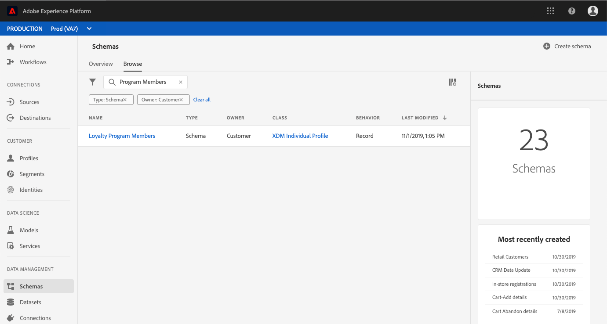

# (Alpha) Attributs calculés

>[!IMPORTANT]
>La fonctionnalité d’attribut calculé décrite dans ce est actuellement en alpha et n’est pas disponible pour tous les utilisateurs. La documentation et la fonctionnalité peuvent changer.

Les attributs calculés vous permettent de calculer automatiquement la valeur des champs en fonction d’autres valeurs, calculs et  de . Les attributs calculés fonctionnent au niveau  du, ce qui signifie que vous pouvez  des valeurs de sur tous les enregistrements et tous les.

Chaque attribut calculé contient un  de , ou &quot;règle&quot;, qui évalue les données entrantes et stocke la valeur résultante dans un attribut de ou dans un. Ces calculs vous aident à répondre facilement aux questions liées à des éléments tels que la valeur d’achat sur la durée de vie, le délai entre les achats ou le nombre d’ouvertures de l’application, sans que vous ayez à effectuer manuellement des calculs complexes chaque fois que les informations sont nécessaires.

Ce guide vous aidera à mieux comprendre les attributs calculés dans Adobe Experience Platform et inclut des exemples d’appels d’API pour effectuer des opérations CRUD de base à l’aide du `/config/computedAttributes` point de terminaison.

## Prise en main

Les points de fin d’API utilisés dans ce guide font partie de l’API de  client en temps réel. Avant de poursuivre, veuillez consulter le guide [en temps réel du développeur de clients](getting-started.md).

En particulier, la section [de](getting-started.md) prise en main du guide du développeur de  de comprend des liens vers des sujets connexes, un guide pour lire les exemples d’appels d’API dans ce  d’et des informations importantes sur les en-têtes requis nécessaires pour effectuer des appels vers les API de plateforme d’expérience.

## Présentation des attributs calculés

Adobe Experience Platform vous permet d’importer et de fusionner facilement des données provenant de plusieurs sources afin de générer des  de clients en temps réel. Chaque  contient des informations importantes concernant une personne, telles que ses coordonnées, ses préférences et son historique d&#39;achat, ce qui lui permet d&#39;obtenir un à 360 degrés du client.

Certaines des informations collectées dans le  sont facilement comprises lors de la lecture directe des champs de données (par exemple, &quot;prénom&quot;), tandis que d’autres données nécessitent plusieurs calculs ou l’utilisation d’autres champs et valeurs pour générer les informations (par exemple, &quot;total des achats sur toute la durée de vie&quot;). Pour faciliter la compréhension de ces données d’un coup d’oeil, Platform vous permet de créer des attributs **** calculés qui effectuent automatiquement ces références et calculs, renvoyant la valeur dans le champ approprié.

Les attributs calculés comprennent la création d’un  de, ou &quot;règle&quot;, qui fonctionne sur les données entrantes et stocke la valeur résultante dans un attribut ou unde.   de peut être défini de plusieurs manières différentes, ce qui vous permet de spécifier qu’une règle évalue uniquement le entrant, une donnée de et deentrante ou une donnée de, d’un jeu de données d’ensemble et d’un dictionnaire d’historique.

### Cas d’utilisation

Les cas d’utilisation des attributs calculés peuvent aller de calculs simples à des références très complexes. Voici quelques exemples d’utilisation des attributs calculés :

1. **Pourcentages :** Un attribut calculé simple peut inclure la prise de deux champs numériques sur un enregistrement et leur division pour créer un pourcentage. Vous pouvez, par exemple, prendre le nombre total de courriers électroniques envoyés à un individu et le diviser par le nombre de courriers électroniques ouverts par l’individu. Si vous examinez le champ d’attribut calculé qui en résulte, le pourcentage du nombre total de courriers électroniques ouverts par l’individu s’affichera rapidement.
1. **Utilisation de l’application :** Un autre exemple inclut la possibilité de   le nombre de fois où un utilisateur ouvre votre application. En suivant le nombre total d’ouvertures de l’application, en fonction des  d’ouverts individuels, vous pouvez diffuser des  ou des messages spéciaux aux utilisateurs lors de leur 100e ouverture, encourageant ainsi un engagement plus profond envers votre marque.
1. **Valeurs de durée de vie :** Il peut s’avérer très difficile de rassembler les totaux en cours d’exécution, tels qu’une valeur d’achat à vie pour un client. Cela nécessite la mise à jour du total historique chaque fois qu’un nouveau d’achat se produit. Un attribut calculé vous permet d’effectuer cette opération beaucoup plus facilement en conservant la valeur de durée de vie dans un seul champ qui est mis à jour automatiquement après chaque d’achat réussi lié au client.

## Configuration d’un attribut calculé

Pour configurer un attribut calculé, vous devez d’abord identifier le champ qui contiendra la valeur de l’attribut calculé. Ce champ peut être créé à l’aide d’un mixin pour ajouter le champ à un  existant ou en sélectionnant un champ que vous avez déjà défini dans un  de.

>[!NOTE]
>Les attributs calculés ne peuvent pas être ajoutés aux champs des mixins définis par Adobe. Le champ doit se trouver dans le  , ce qui signifie qu’il doit s’agir d’un champ que vous définissez et ajoutez à un . `tenant`

Pour définir correctement un champ d’attribut calculé, le  de doit être activé pour les  de et apparaître comme faisant partie du dede la classe sur laquelle le est basé. Pour plus d&#39;informations sur les  de et les [](../../xdm/api/getting-started.md)de, veuillez consulter la section du guide du développeur du registre dessur l&#39;activation d&#39;unpour lesbesoins de la programmation et de l&#39;affichage desol---ol. Il est également recommandé d’examiner la [section sur ](../../xdm/schema/composition.md) dans la documentation de base sur la composition de l’.

Le flux de travail de ce didacticiel utilise un   activé par le et suit les étapes de définition d’un nouveau mixin contenant le champ d’attribut calculé et s’assurant qu’il s’agit du bon. Si vous disposez déjà d’un champ qui se trouve dans le bon  de  dans un [compatible avec le, vous pouvez passer directement à l’étape de](#create-a-computed-attribute)création d’un attributcalculé.

###  un

Les étapes suivantes utilisent l’interface utilisateur d’Adobe Experience Platform pour localiser un , ajouter un mixin et définir un champ. Si vous préférez utiliser l&#39;API de registre de , reportez-vous au guide [du développeur de registre de](../../xdm/api/getting-started.md) pour savoir comment créer un mixin, ajouter un mixin à unet activer un à utiliser avec le de clients en temps réel.

Dans l’interface utilisateur, cliquez sur **de** dans le rail de gauche et utilisez la barre de recherche de l’onglet *Parcourir* pour trouver rapidement le à mettre à jour.



Une fois que vous avez localisé le , cliquez sur son nom pour ouvrir l&#39;éditeur de  de dans lequel vous pouvez apporter des modifications au.


### Création d’un mixin

Pour créer un nouveau mixin, cliquez sur **Ajouter** en regard de *mixins* dans la section *Composition* située à gauche de l’éditeur. Cela ouvre la boîte de dialogue de mixage **** Ajouter dans laquelle vous pouvez voir les mixins existants. Cliquez sur le bouton radio **Créer un nouveau mixin** pour définir votre nouveau mixin.

Donnez un nom et une description au mixin, puis cliquez sur **Ajouter mixin** une fois terminé.


### Ajouter un champ d’attribut calculé au 

Votre nouveau mixin doit maintenant apparaître dans la section *Mixins* sous *Composition*. Cliquez sur le nom du mixin et plusieurs boutons de champ **** Ajouter apparaissent dans la section *Structure* de l’éditeur.

Sélectionnez **Ajouter champ** en regard du nom de la  de pour ajouter un champ de niveau supérieur ou vous pouvez choisir d’ajouter le champ n’importe où dans la  de votre choix.

Après avoir cliqué sur **Ajouter champ** , un nouvel objet s’ouvre, nommé en fonction de votre ID de client, indiquant que le champ se trouve dans la   appropriée. Dans cet objet, un champ *Nouveau* s’affiche. Si le champ dans lequel vous allez définir l’attribut calculé.


### Configuration du champ

A l’aide de la section Propriétés *du* champ située sur le côté droit de l’éditeur, fournissez les informations nécessaires pour votre nouveau champ, y compris son nom, son nom d’affichage et son type.

>[!NOTE]
>Le type du champ doit être le même que celui de la valeur d’attribut calculée. Par exemple, si la valeur d’attribut calculée est une chaîne, le champ défini dans le  du doit être une chaîne.

Lorsque vous avez terminé, cliquez sur **Appliquer** et le nom du champ, ainsi que son type, s’affichent dans la section *Structure* de l’éditeur.


### Activation des  pour les 

Avant de poursuivre, assurez-vous que le  de a été activé pour les  de. Cliquez sur le nom du  du dans la section *Structure* de l’éditeur afin que l’onglet Propriétés *de l’ du* s’affiche. Si le **curseur** du est bleu, le  de a été activé pour l’ de l’.

>[!NOTE]
>L’activation d’un  pour  de ne peut pas être annulée. Par conséquent, si vous cliquez sur le curseur une fois qu’il a été activé, vous n’avez pas à risquer de le désactiver.


Vous pouvez maintenant cliquer sur **Enregistrer** pour enregistrer le  de mis à jour et poursuivre avec le reste du didacticiel à l’aide de l’API.

### Création d’un attribut calculé {#create-a-computed-attribute}

Une fois le champ d’attribut calculé identifié et la confirmation que le  de est activé pour les  de, vous pouvez désormais configurer un attribut calculé.

Commencez par envoyer une requête POST au point de `/config/computedAttributes` fin avec un corps de requête contenant les détails de l’attribut calculé que vous souhaitez créer.

**Format API**

```http
POST /config/computedAttributes
```

**Requête**

```shell
curl -X POST \
  https://platform.adobe.io/data/core/ups/config/computedAttributes \
  -H 'Authorization: Bearer {ACCESS_TOKEN}' \
  -H 'Content-Type: application/json' \
  -H 'x-api-key: {API_KEY}'\
  -H 'x-gw-ims-org-id: {IMS_ORG}' \
  -H 'x-sandbox-name: {SANDBOX_NAME}' \
  -d '{
        "name" : "birthdayCurrentMonth",
        "path" : "_{TENANT_ID}",
        "description" : "Computed attribute to capture if the customer birthday is in the current month.",
        "expression" : {
            "type" : "PQL", 
            "format" : "pql/text", 
            "value":  "person.birthDate.getMonth() = currentMonth()"
        },
        "schema": 
          {
            "name":"_xdm.context.profile"
          }
          
      }'
```

| Propriété | Description |
|---|---|
| `name` | Nom du champ d’attribut calculé, sous forme de chaîne. |
| `path` | Chemin d’accès au champ contenant l’attribut calculé. Ce chemin se trouve dans l’ `properties` attribut de la  et ne doit PAS inclure le nom du champ dans le chemin. Lors de l’écriture du chemin, omettez les multiples niveaux d’ `properties` attributs. |
| `{TENANT_ID}` | Si vous ne connaissez pas votre ID de locataire, reportez-vous aux étapes de recherche de votre ID de locataire dans le guide [du développeur](../../xdm/api/getting-started.md#know-your-tenant_id)de registre. |
| `description` | Description de l’attribut calculé. Cela s’avère particulièrement utile lorsque plusieurs attributs calculés ont été définis, car cela aidera d’autres personnes de votre organisation IMS à déterminer l’attribut calculé approprié à utiliser. |
| `expression.value` | Un valide  le  de langue de (PQL)  le. Pour plus d’informations sur PQL et des liens vers les  de pris en charge, veuillez lire l’aperçu [](../../segmentation/pql/overview.md)de PQL. |
| `schema.name` | Classe sur laquelle repose le  de contenant le champ d’attribut calculé. Exemple : pour un  `_xdm.context.experienceevent` basé sur la classe XDM ExperienceEvent. |

**Réponse**

Un attribut calculé créé avec succès renvoie HTTP Status 200 (OK) et un corps de réponse contenant les détails de l’attribut calculé nouvellement créé. Ces détails comprennent un fichier généré par le système en lecture seule unique `id` qui peut être utilisé pour référencer l’attribut calculé lors d’autres opérations d’API.

```json
{
    "id": "2afcf410-450e-4a39-984d-2de99ab58877",
    "imsOrgId": "{IMS_ORG}",
    "sandbox": {
        "sandboxId": "ff0f6870-c46d-11e9-8ca3-036939a64204",
        "sandboxName": "prod",
        "type": "production",
        "default": true
    },
    "name": "birthdayCurrentMonth",
    "path": "_{TENANT_ID}",
    "positionPath": [
        "_{TENANT_ID}"
    ],
    "description": "Computed attribute to capture if the customer birthday is in the current month.",
    "expression": {
        "type": "PQL",
        "format": "pql/text",
        "value": "person.birthDate.getMonth() = currentMonth()"
    },
    "schema": {
        "name": "_xdm.context.profile"
    },
    "returnSchema": {
        "meta:xdmType": "string"
    },
    "definedOn": [
        {
            "meta:resourceType": "unions",
            "meta:containerId": "tenant",
            "$ref": "https://ns.adobe.com/xdm/context/profile__union"
        }
    ],
    "encodedDefinedOn":"?\b?VR)JMS?R?())(????+?KL?OJ?K???H??O??+I?(?/(?O??I??/????S?8{?E:",
    "dependencies": [],
    "dependents": [],
    "active": true,
    "type": "ComputedAttribute",
    "createEpoch": 1572555223,
    "updateEpoch": 1572555225
}
```

| Propriété | Description |
|---|---|
| `id` | Identifiant généré par le système, en lecture seule et unique, qui peut être utilisé pour référencer l’attribut calculé lors d’autres opérations d’API. |
| `imsOrgId` | L’organisation IMS associée à l’attribut calculé doit correspondre à la valeur envoyée dans la requête. |
| `sandbox` | L’objet sandbox contient les détails du sandbox dans lequel l’attribut calculé a été configuré. Ces informations proviennent de l’en-tête sandbox envoyé dans la requête. Pour plus d’informations, reportez-vous à la présentation [des](../../sandboxes/home.md)sandbox. |
| `positionPath` | Tableau contenant le déconstruit `path` au champ envoyé dans la requête. |
| `returnSchema.meta:xdmType` | Type du champ dans lequel l’attribut calculé sera stocké. |
| `definedOn` | Tableau présentant le   sur lequel l&#39;attribut calculé a été défini. Contient un objet par   , ce qui signifie qu’il peut y avoir plusieurs objets dans le tableau si l’attribut calculé a été ajouté à plusieurs en fonction de différentes classes. |
| `active` | Valeur booléenne indiquant si l’attribut calculé est actif ou non. Par défaut, la valeur est `true`. |
| `type` | Le type de ressource créée, dans ce cas, &quot;ComputedAttribute&quot; est la valeur par défaut. |
| `createEpoch` et `updateEpoch` | Heure à laquelle l’attribut calculé a été créé et la dernière mise à jour, respectivement. |


## Accès aux attributs calculés

Lorsque vous utilisez des attributs calculés à l’aide de l’API, deux options permettent d’accéder aux attributs calculés définis par votre organisation. La première consiste à  tous les attributs calculés, la seconde à  un attribut calculé spécifique par son unique `id`.

Les étapes permettant de répertorier tous les attributs calculés et d’afficher un attribut calculé spécifique sont décrites dans les sections suivantes.

### Attributs calculés {#list-computed-attributes}

Votre organisation IMS peut créer plusieurs attributs calculés, et l’exécution d’une requête GET sur le `/config/computedAttributes` point de terminaison vous permet de  tous les attributs calculés existants pour votre organisation.

**Format API**

```http
GET /config/computedAttributes
```

**Requête**

```shell
curl -X GET \
  https://platform.adobe.io/data/core/ups/config/computedAttributes/ \
  -H 'Authorization: Bearer {ACCESS_TOKEN}' \
  -H 'x-api-key: {API_KEY}' \
  -H 'x-gw-ims-org-id: {IMS_ORG}' \ 
  -H 'x-sandbox-name: {SANDBOX_NAME}' \
```

**Réponse**

Une réponse réussie comprend un `_page` attribut qui fournit le nombre total d’attributs calculés (`totalCount`) et le nombre d’attributs calculés sur la page (`pageSize`).

La réponse comprend également un `children` tableau composé d’un ou de plusieurs objets, chacun contenant les détails d’un attribut calculé. Si votre organisation ne dispose d’aucun attribut calculé, le `totalCount` et `pageSize` sera 0 (zéro) et le `children` tableau sera vide.

```json
{
    "_page": {
        "totalCount": 2,
        "pageSize": 2
    },
    "children": [
        {
            "id": "2afcf410-450e-4a39-984d-2de99ab58877",
            "imsOrgId": "{IMS_ORG}",
            "sandbox": {
                "sandboxId": "ff0f6870-c46d-11e9-8ca3-036939a64204",
                "sandboxName": "prod",
                "type": "production",
                "default": true
            },
            "name": "birthdayCurrentMonth",
            "path": "person._{TENANT_ID}",
            "positionPath": [
                "person",
                "_{TENANT_ID}"
            ],
            "description": "Computed attribute to capture if the customer birthday is in the current month.",
            "expression": {
                "type": "PQL",
                "format": "pql/text",
                "value": "person.birthDate.getMonth() = currentMonth()"
            },
            "schema": {
                "name": "_xdm.context.profile"
            },
            "returnSchema": {
                "meta:xdmType": "string"
            },
            "definedOn": [
                {
                    "meta:resourceType": "unions",
                    "meta:containerId": "tenant",
                    "$ref": "https://ns.adobe.com/xdm/context/profile__union"
                }
            ],
            "encodedDefinedOn":"?\b?VR)JMS?R?())(????+?KL?OJ?K???H??O??+I?(?/(?O??I??/????S?8{?E:",
            "dependencies": [],
            "dependents": [],
            "active": true,
            "type": "ComputedAttribute",
            "createEpoch": 1572555223,
            "updateEpoch": 1572555225
        },
        {
            "id": "ae0c6552-cf49-4725-8979-116366e8e8d3",
            "imsOrgId": "{IMS_ORG}",
            "sandbox": {
                "sandboxId": "",
                "sandboxName": "",
                "type": "production",
                "default": true
            },
            "name": "productDownloads",
            "path": "_{TENANT_ID}",
            "positionPath": [
                "_{TENANT_ID}"
            ],
            "description": "Calculate total product downloads.",
            "expression": {
                "type" : "PQL", 
                "format" : "pql/text", 
                "value":  "let Y = xEvent[_coresvc.event.subType = \"DOWNLOAD\"].groupBy(_coresvc.attributes[name = \"product\"].value).map({
                  \"downloaded\": this.head()._coresvc.attributes[name = \"product\"].head().value,
                  \"downloadsSum\": this.count(),
                  \"downloadsToday\": this[timestamp occurs today].count(),
                  \"downloadsPast30Days\": this[timestamp occurs < 30 days before now].count(),
                  \"downloadsPast60Days\": this[timestamp occurs < 60 days before now].count(),
                  \"downloadsPast90Days\": this[timestamp occurs < 90 days before now].count() }) in { \"uniqueProductDownloadSum\": Y.count(), \"products\": Y }"
            },
            "returnSchema": {
                "meta:xdmType": "string"
            },
            "definedOn": [
                {
                    "meta:resourceType": "unions",
                    "meta:containerId": "tenant",
                    "$ref": "https://ns.adobe.com/xdm/context/profile__union"
                }
            ],
            "schema": {
                "name": "_xdm.context.profile"
            },
            "encodedDefinedOn": "\u001f?\b\u0000\u0000\u0000\u0000\u0000\u0000\u0000?VR)JMS?R?())(????+?KL?OJ?K???H??O??+I?(?/(?O??I??/????S?\u0005\u00008{?E:\u0000\u0000\u0000",
            "dependencies": [],
            "dependents": [],
            "active": true,
            "type": "ComputedAttribute",
            "createEpoch": 1571945277,
            "updateEpoch": 1571945280
        }
    ],
    "_links": {
        "next": {}
    }
}
```

| Propriété | Description |
|---|---|
| `_page.totalCount` | Nombre total d’attributs calculés définis par votre organisation IMS. |
| `_page.pageSize` | Nombre d’attributs calculés renvoyés sur cette page de résultats. Si `pageSize` est égal à `totalCount`, cela signifie qu’il n’y a qu’une seule page de résultats et que tous les attributs calculés ont été renvoyés. S’ils ne sont pas égaux, d’autres pages de résultats sont accessibles. Voir `_links.next` pour plus de détails. |
| `children` | Tableau composé d’un ou de plusieurs objets, chacun contenant les détails d’un attribut calculé unique. Si aucun attribut calculé n’a été défini, le `children` tableau est vide. |
| `id` | Valeur générée par le système, en lecture seule et unique, attribuée automatiquement à un attribut calculé lors de sa création. Pour plus d&#39;informations sur les composants d&#39;un objet d&#39;attribut calculé, consultez la section sur la [création d&#39;un attribut](#create-a-computed-attribute) calculé plus tôt dans ce didacticiel. |
| `_links.next` | Si une page unique d’attributs calculés est renvoyée, `_links.next` est un objet vide, comme illustré dans l’exemple de réponse ci-dessus. Si votre entreprise dispose de nombreux attributs calculés, ils sont renvoyés sur plusieurs pages auxquelles vous pouvez accéder en faisant une demande GET à la `_links.next` valeur. |

###  un attribut calculé {#view-a-computed-attribute}

Vous pouvez également  un attribut calculé spécifique en faisant une requête GET au point de `/config/computedAttributes` fin et en incluant l’ID d’attribut calculé dans le chemin de requête.

**Format API**

```http
GET /config/computedAttributes/{ATTRIBUTE_ID}
```

| Paramètre | Description |
|---|---|
| `{ATTRIBUTE_ID}` | ID de l’attribut calculé que vous souhaitez . |

**Requête**

```shell
curl -X GET \
  https://platform.adobe.io/data/core/ups/config/computedAttributes/2afcf410-450e-4a39-984d-2de99ab58877 \
  -H 'Authorization: Bearer {ACCESS_TOKEN}' \
  -H 'x-api-key: {API_KEY}' \
  -H 'x-gw-ims-org-id: {IMS_ORG}' \ 
  -H 'x-sandbox-name: {SANDBOX_NAME}' \
```

**Réponse**

```json
{
    "id": "2afcf410-450e-4a39-984d-2de99ab58877",
    "imsOrgId": "{IMS_ORG}",
    "sandbox": {
        "sandboxId": "ff0f6870-c46d-11e9-8ca3-036939a64204",
        "sandboxName": "prod",
        "type": "production",
        "default": true
    },
    "name": "birthdayCurrentMonth",
    "path": "_{TENANT_ID}",
    "positionPath": [
        "_{TENANT_ID}"
    ],
    "description": "Computed attribute to capture if the customer birthday is in the current month.",
    "expression": {
        "type": "PQL",
        "format": "pql/text",
        "value": "person.birthDate.getMonth() = currentMonth()"
    },
    "schema": {
        "name": "_xdm.context.profile"
    },
    "returnSchema": {
        "meta:xdmType": "string"
    },
    "definedOn": [
        {
            "meta:resourceType": "unions",
            "meta:containerId": "tenant",
            "$ref": "https://ns.adobe.com/xdm/context/profile__union"
        }
    ],
    "encodedDefinedOn":"?\b?VR)JMS?R?())(????+?KL?OJ?K???H??O??+I?(?/(?O??I??/????S?8{?E:",
    "dependencies": [],
    "dependents": [],
    "active": true,
    "type": "ComputedAttribute",
    "createEpoch": 1572555223,
    "updateEpoch": 1572555225
}
```

## Mise à jour d’un attribut calculé

Si vous estimez que vous devez mettre à jour un attribut calculé existant, vous pouvez effectuer une requête PATCH sur le `/config/computedAttributes` point de terminaison et inclure l’ID de l’attribut calculé que vous souhaitez mettre à jour dans le chemin de requête.

**Format API**

```http
PATCH /config/computedAttributes/{ATTRIBUTE_ID}
```

| Paramètre | Description |
|---|---|
| `{ATTRIBUTE_ID}` | ID de l’attribut calculé que vous souhaitez mettre à jour. |

**Requête**

Cette requête utilise la mise en forme [du correctif](http://jsonpatch.com/) JSON pour mettre à jour la &quot;valeur&quot; du champ &quot; &quot;.

```shell
curl -X PATCH \
  https://platform.adobe.io/data/core/ups/config/computedAttributes/ae0c6552-cf49-4725-8979-116366e8e8d3 \
  -H 'Authorization: Bearer {ACCESS_TOKEN}'\
  -H 'Content-Type: application/json' \
  -H 'x-api-key: {API_KEY}' \
  -H 'x-gw-ims-org-id: {IMS_ORG}' \
  -H 'x-sandbox-name: {SANDBOX_NAME}' \  
  -d '[
        {
          "op": "add",
          "path": "/expression",
          "value": 
          {
            "type" : "PQL", 
            "format" : "pql/text", 
            "value":  "{NEW_EXPRESSION_VALUE}"
          }
        }
      ]'
```

| Propriété | Description |
|---|---|
| `{NEW_EXPRESSION_VALUE}` | Un valide  le  de langue de (PQL)  le. Pour plus d’informations sur PQL et des liens vers les  de pris en charge, veuillez lire l’aperçu [](../../segmentation/pql/overview.md)de PQL. |

**Réponse**

Une mise à jour réussie renvoie l’état HTTP 204 (aucun contenu) et un corps de réponse vide. Si vous souhaitez confirmer la réussite de la mise à jour, vous pouvez exécuter une requête GET pour l’attribut calculé par son ID.

## Suppression d’un attribut calculé

Il est également possible de supprimer un attribut calculé à l’aide de l’API. Pour ce faire, vous devez effectuer une requête DELETE au point de `/config/computedAttributes` fin et inclure l’ID de l’attribut calculé que vous souhaitez supprimer dans le chemin d’accès à la requête.

>[!Note] :
>Soyez prudent lorsque vous supprimez un attribut calculé, car il peut être utilisé dans plusieurs  de et l&#39;opération DELETE ne peut pas être annulée.

**Format API**

```http
DELETE /config/computedAttributes/{ATTRIBUTE_ID}
```

| Paramètre | Description |
|---|---|
| `{ATTRIBUTE_ID}` | ID de l’attribut calculé que vous souhaitez supprimer. |

**Requête**

```shell
curl -X DELETE \
  https://platform.adobe.io/data/core/ups/config/computedAttributes/ae0c6552-cf49-4725-8979-116366e8e8d3 \
  -H 'Authorization: Bearer {ACCESS_TOKEN}' \
  -H 'x-api-key: {API_KEY}' \
  -H 'x-gw-ims-org-id: {IMS_ORG}'
  -H 'x-sandbox-name: {SANDBOX_NAME}' \ 
```

**Réponse**

Une requête de suppression réussie renvoie HTTP Status 200 (OK) et un corps de réponse vide. Pour confirmer la suppression, vous pouvez exécuter une requête GET afin de rechercher l’attribut calculé par son identifiant. Si l’attribut a été supprimé, vous recevrez une erreur HTTP Status 404 (Introuvable).

## Étapes suivantes

Maintenant que vous avez appris les bases des attributs calculés, vous êtes prêt à commencer à les définir pour votre entreprise.