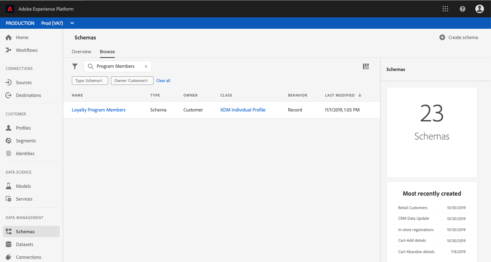

# (Alpha) Configurez un champ d’attribut calculé dans l’interface utilisateur.

>[!IMPORTANT]
>
>La fonctionnalité d’attribut calculé est actuellement en alpha et n’est pas disponible pour tous les utilisateurs. La documentation et les fonctionnalités peuvent changer.

Pour configurer un attribut calculé, vous devez d’abord identifier le champ dans lequel la valeur d’attribut calculé sera conservée. Vous pouvez créer ce champ à l’aide d’un mixin qui ajoutera le champ à un schéma existant ou en sélectionnant un champ que vous avez déjà défini dans un schéma.

>[!NOTE]
>
>Il n’est pas possible d’ajouter des attributs calculés à des champs au sein de mixins définis par Adobe. Le champ doit se trouver dans l’espace de noms `tenant`, ce qui signifie qu’il doit s’agir d’un champ que vous définissez et ajoutez à un schéma.

Pour définir avec succès un champ d&#39;attribut calculé, le schéma doit être activé pour [!DNL Profile] et s&#39;afficher dans le schéma d&#39;union de la classe sur laquelle le schéma est basé. Pour plus d&#39;informations sur les schémas et unions activés pour [!DNL Profile], consultez la section du guide du développeur [!DNL Schema Registry] sur [l&#39;activation d&#39;un schéma pour le Profil et l&#39;affichage des schémas d&#39;union](../../xdm/api/getting-started.md). Nous vous recommandons également de consulter la [section relative aux unions](../../xdm/schema/composition.md) dans la documentation des principes de base de la composition des schémas.

Le processus de ce didacticiel utilise un schéma [!DNL Profile] et suit les étapes de définition d&#39;un nouveau mixin contenant le champ d&#39;attribut calculé et s&#39;assurant qu&#39;il s&#39;agit de l&#39;espace de nommage correct. Si vous disposez déjà d’un champ qui se trouve dans l’espace de noms correct dans un schéma activé dans Profile, vous pouvez passer directement à l’étape de [création d’un attribut calculé](#create-a-computed-attribute).

## Affichage d’un schéma

Les étapes qui suivent utilisent l’interface utilisateur d’Adobe Experience Platform pour localiser un schéma, ajouter un mixin et définir un champ. Si vous préférez utiliser l&#39;API [!DNL Schema Registry], consultez le [Schéma Registry developer guide](../../xdm/api/getting-started.md) pour connaître les étapes de création d&#39;un mixin, d&#39;ajout d&#39;un mixin à un schéma et d&#39;activation d&#39;un schéma pour une utilisation avec [!DNL Real-time Customer Profile].

Dans l’interface utilisateur, cliquez sur **[!UICONTROL Schémas]** dans le rail de gauche et utilisez la barre de recherche dans l’onglet **[!UICONTROL Parcourir]** pour trouver rapidement le schéma que vous souhaitez mettre à jour.

Une fois le schéma localisé, cliquez sur son nom pour ouvrir l&#39;[!DNL Schema Editor] où vous pouvez apporter des modifications au schéma.

## Création d’un mixin

Pour créer un nouveau mixin, cliquez sur **[!UICONTROL Ajouter]** en regard de **[!UICONTROL Mixins]** dans la section **[!UICONTROL Composition]** située à gauche de l’éditeur. Cela ouvre la boîte de dialogue **[!UICONTROL Ajouter un mixin]** dans laquelle les mixins existants s’affichent. Cliquez sur le bouton radio **[!UICONTROL Créer un nouveau mixin]** qui vous permet de définir votre nouveau mixin.

Donnez un nom et une description au mixin, puis cliquez sur **[!UICONTROL Ajouter un mixin]** lorsque vous avez terminé.

## Ajout d’un champ attribut calculé au schéma

Votre nouveau mixin doit maintenant apparaître dans la section &quot;[!UICONTROL Mixins]&quot; sous &quot;[!UICONTROL Composition]&quot;. Cliquez sur le nom du mixin, ce qui fera apparaître plusieurs boutons **[!UICONTROL Ajouter un champ]** dans la section **[!UICONTROL Structure]** de l’éditeur.

Sélectionnez **[!UICONTROL Ajouter un champ]** en regard du nom du schéma afin d’ajouter un champ de niveau supérieur. Vous pouvez également ajouter le champ n’importe où dans le schéma que vous préférez.

Après avoir cliqué sur **[!UICONTROL Ajouter un champ]**, un nouvel objet portant l’identifiant du client s’ouvre et affiche que ce champ se trouve dans le bon espace de noms. Dans cet objet, un **[!UICONTROL Nouveau champ]** apparaît. Il s’agit du champ dans lequel vous définirez l’attribut calculé.

## Configuration du champ

À l’aide de la section **[!UICONTROL Propriétés du champ]** située sur le côté droit de l’éditeur, renseignez les informations nécessaires pour votre nouveau champ, notamment son nom, son nom d’affichage et son type.

>[!NOTE]
>
>Le type de champ doit être identique à celui de la valeur de l’attribut calculé. Par exemple, si la valeur de l’attribut calculé est une chaîne, le champ défini dans le schéma doit être une chaîne.

Une fois que vous avez terminé, cliquez sur **[!UICONTROL Appliquer]** et le nom du champ, ainsi que son type, s’afficheront dans la section **[!UICONTROL Structure]** de l’éditeur.

## Activer le schéma pour [!DNL Profile]

Avant de poursuivre, assurez-vous que le schéma a été activé dans [!DNL Profile]. Cliquez sur le nom du schéma dans la section **[!UICONTROL Structure]** de l’éditeur pour faire apparaître l’onglet **[!UICONTROL Propriétés du schéma]**. Si le curseur **[!UICONTROL Profil]** est bleu, le schéma a été activé pour [!DNL Profile].

>[!NOTE]
>
>L&#39;activation d&#39;un schéma pour [!DNL Profile] ne peut pas être annulée. Par conséquent, si vous cliquez sur le curseur une fois qu&#39;il a été activé, vous n&#39;avez pas à risquer de le désactiver.

Vous pouvez cliquer à présent sur **[!UICONTROL Enregistrer]** pour enregistrer le schéma mis à jour et poursuivre avec le reste du tutoriel d’utilisation de l’API.

## Étapes suivantes

Maintenant que vous avez créé un champ dans lequel sera stockée votre valeur d&#39;attribut calculée, vous pouvez créer l&#39;attribut calculé à l&#39;aide du point de terminaison de l&#39;API `/computedattributes`. Pour obtenir des instructions détaillées sur la création d&#39;un attribut calculé dans l&#39;API, suivez les étapes fournies dans le guide de point de terminaison de l&#39;API [attributs calculés](ca-api.md).