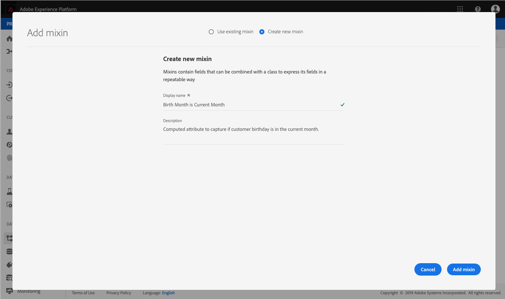

# (Alpha) Configuration d’un champ d’attribut calculé dans l’interface utilisateur

>[!IMPORTANT]
>
>La fonctionnalité d’attribut calculé est actuellement en version alpha et n’est pas disponible pour tous les utilisateurs. La documentation et les fonctionnalités peuvent changer.

Pour configurer un attribut calculé, vous devez d’abord identifier le champ dans lequel la valeur d’attribut calculé sera conservée. Ce champ peut être créé à l’aide d’un groupe de champs de schéma pour ajouter le champ à un schéma existant, ou en sélectionnant un champ que vous avez déjà défini dans un schéma.

>[!NOTE]
>
>Les attributs calculés ne peuvent pas être ajoutés aux champs dans des groupes de champs définis par Adobe. Le champ doit se trouver dans l’espace de noms `tenant`, ce qui signifie qu’il doit s’agir d’un champ que vous définissez et ajoutez à un schéma.

Pour définir correctement un champ attribut calculé, le schéma doit être activé pour [!DNL Profile] et apparaissent dans le schéma d’union de la classe sur laquelle le schéma est basé. Pour plus d’informations sur [!DNL Profile]schémas et unions activés, consultez la section de la section [!DNL Schema Registry] section du guide de développement sur [activation d’un schéma pour Profile et affichage des schémas d’union](../../xdm/api/getting-started.md). Nous vous recommandons également de consulter la [section relative aux unions](../../xdm/schema/composition.md) dans la documentation des principes de base de la composition des schémas.

Le workflow de ce tutoriel utilise une [!DNL Profile]schéma -enabled et suit les étapes de définition d’un nouveau groupe de champs contenant le champ attribut calculé et de vérification qu’il s’agit de l’espace de noms correct. Si vous disposez déjà d’un champ qui se trouve dans l’espace de noms correct dans un schéma activé dans Profile, vous pouvez passer directement à l’étape de [création d’un attribut calculé](#create-a-computed-attribute).

## Affichage d’un schéma

Les étapes suivantes utilisent l’interface utilisateur de Adobe Experience Platform pour localiser un schéma, ajouter un groupe de champs et définir un champ. Si vous préférez utiliser la variable [!DNL Schema Registry] API, reportez-vous à la section [Guide de développement du registre des schémas](../../xdm/api/getting-started.md) pour savoir comment créer un groupe de champs, ajouter un groupe de champs à un schéma et activer un schéma à utiliser avec [!DNL Real-Time Customer Profile].

Dans l’interface utilisateur, cliquez sur **[!UICONTROL Schémas]** dans le rail de gauche et utilisez la barre de recherche dans l’onglet **[!UICONTROL Parcourir]** pour trouver rapidement le schéma que vous souhaitez mettre à jour.

Une fois le schéma localisé, cliquez sur son nom pour ouvrir la [!DNL Schema Editor] où vous pouvez apporter des modifications au schéma.

## Créer un groupe de champs

Pour créer un groupe de champs, cliquez sur **[!UICONTROL Ajouter]** en regard de **[!UICONTROL Groupes de champs]** dans le **[!UICONTROL Composition]** dans la partie gauche de l’éditeur. Cela ouvre la fenêtre **[!UICONTROL Ajouter un groupe de champs]** où vous pouvez voir les groupes de champs existants. Cliquez sur le bouton radio pour **[!UICONTROL Créer un groupe de champs]** afin de définir votre nouveau groupe de champs.

Attribuez un nom et une description au groupe de champs, puis cliquez sur **[!UICONTROL Ajouter un groupe de champs]** une fois terminé.

## Ajout d’un champ attribut calculé au schéma

Votre nouveau groupe de champs doit maintenant apparaître dans le[!UICONTROL Groupes de champs]&quot; sous &quot;[!UICONTROL Composition]&quot;. Cliquez sur le nom du groupe de champs et plusieurs **[!UICONTROL Ajouter un champ]** les boutons s’affichent dans la **[!UICONTROL Structure]** de l’éditeur.

Sélectionnez **[!UICONTROL Ajouter un champ]** en regard du nom du schéma afin d’ajouter un champ de niveau supérieur. Vous pouvez également ajouter le champ n’importe où dans le schéma que vous préférez.

Après avoir cliqué sur **[!UICONTROL Ajouter un champ]**, un nouvel objet portant l’identifiant du client s’ouvre et affiche que ce champ se trouve dans le bon espace de noms. Dans cet objet, un **[!UICONTROL Nouveau champ]** apparaît. Il s’agit du champ dans lequel vous définirez l’attribut calculé.

## Configuration du champ

À l’aide de la section **[!UICONTROL Propriétés du champ]** située sur le côté droit de l’éditeur, renseignez les informations nécessaires pour votre nouveau champ, notamment son nom, son nom d’affichage et son type.

>[!NOTE]
>
>Le type de champ doit être identique à celui de la valeur de l’attribut calculé. Par exemple, si la valeur de l’attribut calculé est une chaîne, le champ défini dans le schéma doit être une chaîne.

Une fois que vous avez terminé, cliquez sur **[!UICONTROL Appliquer]** et le nom du champ, ainsi que son type, s’afficheront dans la section **[!UICONTROL Structure]** de l’éditeur.

## Activer le schéma pour [!DNL Profile]

Avant de poursuivre, assurez-vous que le schéma a été activé dans [!DNL Profile]. Cliquez sur le nom du schéma dans la section **[!UICONTROL Structure]** de l’éditeur pour faire apparaître l’onglet **[!UICONTROL Propriétés du schéma]**. Si la variable **[!UICONTROL Profil]** le curseur est bleu, le schéma a été activé pour [!DNL Profile].

>[!NOTE]
>
>Activation d’un schéma pour [!DNL Profile] ne peut pas être annulée. Par conséquent, si vous cliquez sur le curseur une fois qu’il a été activé, il n’est pas nécessaire de risquer de le désactiver.

Vous pouvez cliquer à présent sur **[!UICONTROL Enregistrer]** pour enregistrer le schéma mis à jour et poursuivre avec le reste du tutoriel d’utilisation de l’API.

## Étapes suivantes

Maintenant que vous avez créé un champ dans lequel votre valeur d’attribut calculé sera stockée, vous pouvez créer l’attribut calculé à l’aide de la variable `/computedattributes` Point d’entrée de l’API. Pour obtenir des instructions détaillées sur la création d’un attribut calculé dans l’API, suivez les étapes fournies dans la section [guide de point d’entrée de l’API des attributs calculés](ca-api.md).