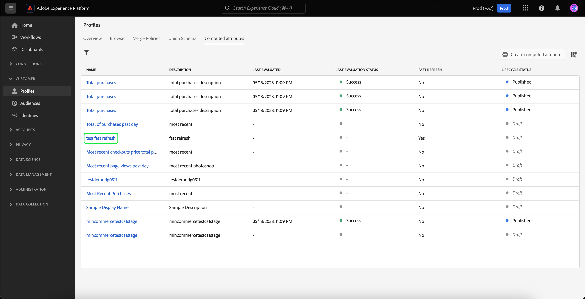
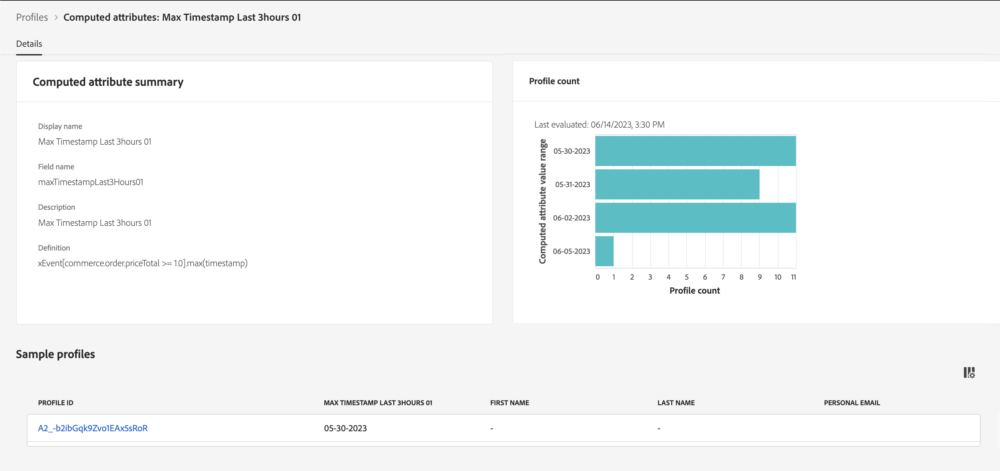

# Guide de l’interface utilisateur des attributs calculés

>[!NOTE]
>
>Pour accéder aux attributs calculés, vous devez disposer des autorisations appropriées (**Afficher les attributs calculés** et **Gérer les attributs calculés**). Pour plus d’informations sur les autorisations requises, veuillez lire la [documentation sur le contrôle d’accès](../../access-control/home.md). Pour savoir comment appliquer ces autorisations, consultez le [guide de gestion des autorisations](../../access-control/ui/permissions.md).

Dans Adobe Experience Platform, les attributs calculés sont des fonctions utilisées pour regrouper des données au niveau de l’événement en attributs au niveau du profil. Ces fonctions sont automatiquement calculées afin de pouvoir être utilisées dans la segmentation, l’activation et la personnalisation.

Ce document fournit un guide sur la création et la mise à jour des attributs calculés à l’aide de l’interface utilisateur de Adobe Experience Platform.

## Commencer

Ce guide de l’interface utilisateur nécessite une compréhension des différents services de [!DNL Experience Platform] impliqués dans la gestion des [!DNL Real-Time Customer Profiles]. Avant de lire ce guide ou de travailler dans l’interface utilisateur, consultez la documentation relative aux services suivants :

- [[!DNL Real-Time Customer Profile]](../home.md) : fournit un profil de consommateur unifié en temps réel, basé sur des données agrégées provenant de plusieurs sources.
- [[!DNL Experience Data Model (XDM) System]](../../xdm/home.md) : cadre normalisé selon lequel [!DNL Experience Platform] organise les données de l’expérience client.

## Affichage des attributs calculés {#view}

Dans l’interface utilisateur d’Experience Platform, sélectionnez **[!UICONTROL Profiles]** dans le volet de navigation de gauche, puis **[!UICONTROL Computed attributes]** pour afficher la liste des attributs calculés disponibles pour votre organisation. Cela inclut des informations sur le nom, la description, la date de dernière évaluation et le statut de la dernière évaluation de l’attribut calculé.

![La section [!UICONTROL Profile] et les onglets [!UICONTROL Computed attributes] sont mis en surbrillance et montrent aux utilisateurs comment accéder à la page de navigation des attributs calculés.](./images/ui/browse.png)

Pour sélectionner les champs visibles, vous pouvez sélectionner  pour ajouter ou supprimer les champs à afficher.

| Champ | Description |
| ----- | ----------- |
| [!UICONTROL Name] | Nom d’affichage de l’attribut calculé. |
| [!UICONTROL Description] | Description de l’attribut calculé. |
| [!UICONTROL Evaluation method] | Méthode d’évaluation de l’attribut calculé. Actuellement, seul le **batch** est pris en charge. |
| [!UICONTROL Last evaluated] | Cet horodatage représente la dernière exécution d’évaluation réussie. Seuls les événements qui se sont produits **auparavant** cet horodatage sont pris en compte dans la dernière évaluation réussie. |
| [!UICONTROL Last evaluation status] | Statut indiquant si l’attribut calculé a été calculé avec succès ou non lors de la dernière exécution de l’évaluation. Les valeurs possibles sont **[!UICONTROL Success]** ou **[!UICONTROL Failed]**. |
| [!UICONTROL Refresh frequency] | Indication de la fréquence à laquelle l’attribut calculé doit être actualisé. Les valeurs possibles sont horaires, quotidiennes, hebdomadaires ou mensuelles. |
| [!UICONTROL Fast refresh] | Valeur indiquant si l’actualisation rapide est activée ou non pour cet attribut de calcul. Si l’actualisation rapide est activée, l’attribut calculé peut être actualisé tous les jours, plutôt que toutes les semaines, toutes les deux semaines ou tous les mois. Cette valeur s’applique uniquement aux attributs calculés avec une période de recherche en amont plus longue que la base hebdomadaire. |
| [!UICONTROL Lifecycle status] | Statut actuel de l’attribut calculé. Il existe trois statuts possibles : <ul><li>**[!UICONTROL Draft]:** L’attribut calculé n’a **pas encore** de champ créé sur le schéma. Dans ce statut, l’attribut calculé peut être modifié. </li><li>**[!UICONTROL Published]:** L’attribut calculé comporte un champ créé sur le schéma et est prêt à être utilisé. Dans ce statut, l’attribut calculé **ne peut pas** est modifié.</li><li>**[!UICONTROL Inactive]:** L’attribut calculé est désactivé. Pour plus d’informations sur le statut inactif de , consultez la page [FAQ](./faq.md#inactive-status). </li> |
| [!UICONTROL Created] | Date et heure de création de l’attribut calculé. |
| [!UICONTROL Last modified] | Date et heure de la dernière modification de l’attribut calculé. |

Vous pouvez également filtrer les attributs calculés affichés en fonction du statut du cycle de vie. Sélectionnez l’icône .

Vous pouvez désormais choisir de filtrer les attributs calculés par statut ([!UICONTROL Draft], [!UICONTROL Published] et [!UICONTROL Inactive]).

![Les options par lesquelles vous pouvez filtrer les attributs calculés sont mises en surbrillance. Ces options comprennent [!UICONTROL Draft], [!UICONTROL Published] et [!UICONTROL Inactive].](./images/ui/view-filters.png)

De plus, vous pouvez sélectionner un attribut calculé pour afficher des informations plus détaillées à son sujet. Pour plus d’informations sur la page de détails des attributs calculés, consultez la section [Afficher les détails d’un attribut calculé](#view-details).

## Création d’un attribut calculé {#create}

Pour créer un attribut calculé, sélectionnez **[!UICONTROL Create computed attribute]** pour lancer le processus de création d’un attribut calculé.

![Le bouton [!UICONTROL Create computed attributes] est mis en surbrillance et indique aux utilisateurs comment accéder à la page Créer un attribut calculé &#x200B;](./images/ui/create.png).

La page **[!UICONTROL Create computed attribute]** s’affiche. Sur cette page, vous pouvez ajouter les informations de base de l’attribut calculé que vous souhaitez créer.

| Champ | Description |
| ----- | ----------- |
| [!UICONTROL Display name] | Nom par lequel l’attribut calculé sera connu. Vous devez conserver ce nom d’affichage unique pour chaque attribut calculé. En règle générale, ce nom d’affichage doit contenir des identifiants liés à l’attribut calculé. Par exemple, « Somme des achats de chaussures au cours des 7 derniers jours ». |
| [!UICONTROL Field name] | Nom utilisé pour faire référence à l’attribut calculé dans d’autres services en aval. Ce nom est automatiquement dérivé du nom d’affichage et écrit en CamelCase. |
| [!UICONTROL Description] | Description de l’attribut calculé que vous essayez de créer. |

![La section [!UICONTROL Basic information] de la page [!UICONTROL Create computed attribute] est mise en surbrillance.](./images/ui/basic-information.png)

Après avoir ajouté les détails de l’attribut calculé, vous pouvez commencer à définir vos règles.

### Définition des conditions de filtrage des événements

Pour créer une règle, sélectionnez d’abord les attributs dans la section **[!UICONTROL Events]** pour filtrer les événements sur lesquels vous souhaitez effectuer l’agrégation. Actuellement, seuls les attributs d’événement de type non tableau sont pris en charge.

![La section [!UICONTROL Events] est mise en surbrillance.](./images/ui/events.png)

Après avoir sélectionné l’attribut à utiliser dans la définition d’attribut calculé, vous pouvez choisir à quoi cette valeur sera comparée.

### Appliquer la fonction d’agrégation

Vous pouvez maintenant appliquer une fonction au champ à partir de la sortie conditionnelle. Sélectionnez tout d’abord le type de fonction d’agrégation . Les options disponibles sont les suivantes : [!UICONTROL Sum], [!UICONTROL Min], [!UICONTROL Max], [!UICONTROL Count] et [!UICONTROL Most Recent]. Vous trouverez plus d’informations sur ces fonctions dans la section [fonctions](./overview.md#functions) de la présentation des attributs calculés.

Après avoir choisi une fonction, vous pouvez choisir le champ sur lequel effectuer l’agrégation. Les champs éligibles à choisir dépendent de la fonction sélectionnée.

### Durée de recherche en amont

Après avoir appliqué la fonction d’agrégation, vous devez définir la période de recherche en amont de l’attribut calculé. Cette période de recherche en amont spécifie la durée pendant laquelle vous souhaitez agréger les événements. Cette durée de recherche en amont peut être exprimée en heures, jours, semaines ou mois.

### Actualisation rapide {#fast-refresh}

>[!CONTEXTUALHELP]
>id="platform_profile_computedAttributes_fastRefresh"
>title="Actualisation rapide"
>abstract="Une actualisation rapide vous permet de garder vos attributs à jour. L’activation de cette option vous permet d’actualiser quotidiennement vos attributs calculés, même pour des périodes de recherche en amont plus longues, ce qui vous permet de réagir rapidement aux activités de l’utilisateur ou de l’utilisatrice. Cette valeur s’applique uniquement aux attributs calculés avec une période de recherche en amont plus longue que la base hebdomadaire."

Lors de l’application de la fonction d’agrégation, vous pouvez activer l’actualisation rapide si la période de recherche en amont est supérieure à une semaine.

![La case à cocher [!UICONTROL Fast Refresh] est mise en surbrillance.](./images/ui/enable-fast-refresh.png)

Une actualisation rapide vous permet de garder vos attributs à jour. L’activation de cette option vous permet d’actualiser vos attributs calculés tous les jours, même pour des périodes de recherche en amont plus longues, ce qui vous permet de réagir rapidement aux activités des utilisateurs et utilisatrices.

Pour plus d’informations sur l’actualisation rapide, consultez la section [actualisation rapide](./overview.md#fast-refresh) de la présentation des attributs calculés.

Une fois ces étapes terminées, vous pouvez choisir d’enregistrer cet attribut calculé en tant que brouillon ou de le publier immédiatement.

![Les boutons [!UICONTROL Save as draft] et [!UICONTROL Publish] sont mis en surbrillance.](./images/ui/draft-or-publish.png)

## Affichage des détails d’un attribut calculé {#view-details}

Pour afficher les détails d’un attribut calculé, sélectionnez l’attribut calculé dont vous souhaitez afficher les détails sur la page [!UICONTROL **Parcourir**].

Le contenu de la page diffère selon que l’attribut calculé est **[!UICONTROL Published]** ou en **[!UICONTROL Draft]**.

### Attribut calculé publié {#published}

Lors de la sélection d’un attribut calculé publié, la page de détails des attributs calculés s’affiche.

Cette page affiche un résumé des détails de l’attribut calculé, ainsi qu’un graphique présentant la distribution des valeurs et les exemples de profils qui remplissent les critères de l’attribut calculé.

>[!NOTE]
>
>La répartition des valeurs reflète la répartition des valeurs d’attribut pour les profils au moment de la tâche d’échantillonnage. La valeur d’attribut calculée dans l’exemple de profil reflète la dernière valeur de profil fusionnée pour quelques exemples de profils.

### Brouillon d’attribut calculé {#draft}

Lors de la sélection d’un brouillon d’attribut calculé, la page **[!UICONTROL Edit computed attributes]** s’affiche. Cette page, à l’instar de la page [!UICONTROL Create computed attributes], vous permet de modifier les informations de base de votre attribut calculé, ainsi que sa définition, avant de vous permettre de mettre à jour le brouillon ou de le publier.

![La page [!UICONTROL Edit computed attributes] s’affiche.](./images/ui/edit.png)

## Utilisation des attributs calculés {#usage}

>[!IMPORTANT]
>
>Si vous utilisez un attribut calculé avec la fonction **Le plus récent** dans une définition de segment, vous **devez** inclure **les deux** la valeur et la valeur d’horodatage dans l’objet d’attribut calculé.
>
>Par exemple, si vous créez une définition de segment qui recherche « Tous les profils qui disposent d’une adresse e-mail valide » où le champ adresse e-mail est renseigné par un attribut calculé avec la fonction la plus récente, vous **devez** inclure à la fois la valeur « adresse e-mail » qui existe **et** la date et l’heure « adresse e-mail » qui existent.

Après avoir créé un attribut calculé, vous pouvez utiliser les attributs calculés **publiés** dans d’autres services en aval. Comme les attributs calculés sont des champs d’attribut de profil créés sur votre schéma d’union des profils, vous pouvez rechercher des valeurs d’attribut calculées pour un profil client en temps réel, les utiliser dans une audience, les activer vers une destination ou les utiliser pour la personnalisation dans les parcours de Adobe Journey Optimizer.

>[!NOTE]
>
>Les attributs calculés **ne peuvent pas** être utilisés dans les audiences **compositions**.

## Étapes suivantes

Pour en savoir plus sur les attributs calculés, consultez la [présentation des attributs calculés](./overview.md). Pour plus d’informations sur la création et la configuration des attributs calculés à l’aide de l’API, consultez le guide de développement [attributs calculés](./api.md).
