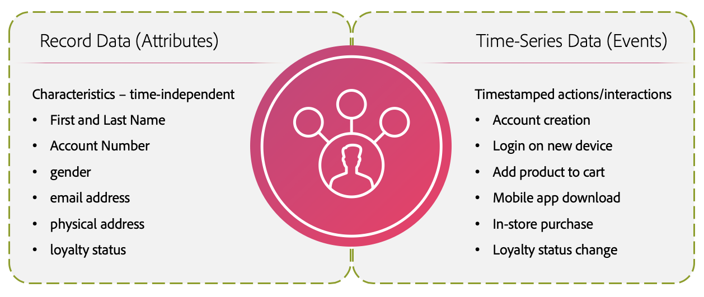

# Mécanismes de sécurisation par défaut pour les données [!DNL Real-Time Customer Profile] et la segmentation

Adobe Experience Platform vous permet de fournir des expériences cross-canal personnalisées basées sur des informations comportementales et des attributs du client sous la forme de profils client en temps réel. Pour prendre en charge cette nouvelle approche des profils, Experience Platform utilise un modèle de données hybride fortement dénormalisé qui diffère du modèle de données relationnelles traditionnel.

>[!IMPORTANT]
>
>Vérifiez vos droits de licence dans votre commande client et la [Description du produit](https://helpx.adobe.com/fr/legal/product-descriptions.html) correspondante sur les limites d’utilisation réelles en plus de cette page de mécanismes de sécurisation.
>
>Vous pouvez également utiliser le [service Capacity](../landing/license-usage-and-guardrails/capacity.md) pour surveiller et définir le débit de diffusion en continu et d’autres paramètres dans Experience Platform.

Ce document fournit des limites d’utilisation et de débit par défaut pour vous aider à modéliser vos données de profil afin d’optimiser les performances du système. Lors de la révision des mécanismes de sécurisation suivants, on suppose que vous avez correctement modélisé les données. Si vous avez des questions sur la manière de modéliser vos données, contactez votre représentant du service client.

>[!NOTE]
>
>La plupart des clients ne dépassent pas ces limites par défaut. Si vous souhaitez en savoir plus sur les limites personnalisées, contactez votre représentant de l’assistance clientèle.

## Prise en main

Les services Experience Platform suivants sont impliqués dans la modélisation des données du profil client en temps réel :

* [[!DNL Real-Time Customer Profile]](home.md) : créez des profils clients unifiés à l’aide de données provenant de plusieurs sources.
* [Identités](../identity-service/home.md) : identités Bridge provenant de sources de données disparates lors de leur ingestion dans Experience Platform.
* [Schémas](../xdm/home.md) : les schémas du modèle de données d’expérience (XDM) sont le cadre normalisé selon lequel Experience Platform organise les données d’expérience client.
* [Audiences](../segmentation/home.md) : le moteur de segmentation d’Experience Platform est utilisé pour créer des audiences à partir de vos profils clients en fonction des comportements et des attributs des clients.

## Types de limite

Ce document comprend deux types de limites par défaut :

| Type de mécanisme de sécurisation | Description |
| -------------- | ----------- |
| **Mécanisme de sécurisation des performances (limite soft)** | Les mécanismes de sécurisation de performances sont des limites d’utilisation liées à la portée de vos cas d’utilisation. Si vous dépassez les mécanismes de sécurisation des performances, vous pouvez rencontrer une dégradation des performances et une latence. Adobe n’est pas responsable de cette dégradation des performances. Les clients qui dépassent régulièrement un mécanisme de sécurisation des performances peuvent choisir de se procurer une licence pour une capacité supplémentaire afin d’éviter une dégradation des performances. |
| **Mécanismes de sécurisation appliqués par le système (limite Hard)** | Les mécanismes de sécurisation appliqués par le système sont appliqués par l’interface utilisateur ou l’API Real-Time CDP. Il s’agit de limites que vous ne pouvez pas dépasser, car l’interface utilisateur et l’API vous en empêcheront ou renverront une erreur. |

{style="table-layout:auto"}

>[!NOTE]
>
>Les limites décrites dans ce document sont constamment améliorées. Consultez régulièrement les mises à jour. Si vous souhaitez en savoir plus sur les limites personnalisées, contactez votre représentant de l’assistance clientèle.

## Limites du modèle de données

Les mécanismes de sécurisation suivants fournissent des limites recommandées lors de la modélisation des données du profil client en temps réel. Pour en savoir plus sur les entités principales et les entités de dimension, consultez la section sur les [types d’entités](#entity-types) dans l’Annexe.

### Mécanismes de sécurisation pour les entités principales

| Mécanisme de sécurisation | Limite | Type de limite | Description |
| --------- | ----- | ---------- | ----------- |
| Jeux de données de classe XDM Indivdual Profile | 20 | Mécanisme de sécurisation des performances | Il est recommandé d’utiliser au maximum 20 jeux de données qui exploitent la classe XDM Individual Profile. |
| Jeux de données de classe XDM ExperienceEvent | 20 | Mécanisme de sécurisation des performances | Il est recommandé d’utiliser au maximum 20 jeux de données qui exploitent la classe XDM ExperienceEvent. |
| Jeux de données de suites de rapports Adobe Analytics activés pour Profil | 1 | Mécanisme de sécurisation des performances | Un (1) jeu de données de suite de rapports Analytics maximum doit être activé pour Profil. Toute tentative d’activation de plusieurs jeux de données de suite de rapports Analytics pour Profil peut avoir des conséquences imprévues sur la qualité des données. Pour plus d’informations, voir la section sur les [Jeux de données Adobe Analytics](#aa-datasets) dans l’Annexe. |
| Relations à entités multiples | 5 | Mécanisme de sécurisation des performances | Il est recommandé d’établir au maximum 5 relations à entités multiples définies entre des entités principales et des entités de dimension. D’autres mappages de relation ne doivent pas être effectués tant qu’une relation existante n’est pas supprimée ou désactivée. |
| Profondeur JSON du champ d’ID utilisé dans les relations à entités multiples | 4 | Mécanisme de sécurisation des performances | La profondeur JSON maximale recommandée pour un champ d’ID utilisé dans les relations à entités multiples est de 4. Cela signifie que dans un schéma fortement imbriqué, les champs imbriqués de plus de 4 niveaux de profondeur ne doivent pas être utilisés comme champ d’ID dans une relation. |
| Cardinalité de tableau dans un fragment de profil | &lt;=500 | Mécanisme de sécurisation des performances | La cardinalité de tableau optimale dans un fragment de profil (données indépendantes du temps) est &lt;=500. |
| Cardinalité de tableau dans ExperienceEvent | &lt;=10 | Mécanisme de sécurisation des performances | La cardinalité optimale des tableaux dans un ExperienceEvent (données de série temporelle) est &lt;=10. |
| Nombre d’identités pour le graphique d’identités d’un profil individuel | 50 | Mécanisme de sécurisation mis en œuvre par le système | **Le nombre maximal d’identités dans un graphique d’identités pour un profil individuel est de 50.** Les profils comportant plus de 50 identités sont exclus de la segmentation, des exportations et des recherches. Pour plus d’informations, consultez le guide sur la [compréhension de la logique de suppression d’identité](../identity-service/guardrails.md#understanding-the-deletion-logic-when-an-identity-graph-at-capacity-is-updated). |

{style="table-layout:auto"}

### Mécanismes de sécurisation de l’entité de dimension

| Mécanisme de sécurisation | Limite | Type de limite | Description |
| --------- | ----- | ---------- | ----------- |
| Aucune donnée de série temporelle n’est autorisée pour les entités non [!DNL XDM Individual Profile]. | 0 | Mécanisme de sécurisation mis en œuvre par le système | **Les données de série temporelle ne sont pas autorisées pour les entités non [!DNL XDM Individual Profile] dans le service Profil.** Si un jeu de données de série temporelle est associé à un ID non [!DNL XDM Individual Profile], le jeu de données ne doit pas être activé pour [!DNL Profile]. |
| Aucune relation imbriquée | 0 | Mécanisme de sécurisation des performances | Vous ne devez pas créer de relation entre deux schémas non-[!DNL XDM Individual Profile]. La possibilité de créer des relations n’est pas recommandée pour les schémas qui ne font pas partie du schéma d’union [!DNL Profile]. |
| Profondeur JSON du champ de l’ID principal | 4 | Mécanisme de sécurisation des performances | La profondeur JSON maximale recommandée pour le champ de l’ID principal est de 4. Cela signifie que dans un schéma fortement imbriqué, vous ne devez pas choisir un champ comme identifiant principal qui est imbriqué à plus de 4 niveaux de profondeur. Un champ qui est au quatrième niveau d’imbrication peut être utilisé comme ID principal. |

{style="table-layout:auto"}

## Limites de taille des données

Les mécanismes de sécurisation suivants se rapportent à la taille des données et fournissent des limites recommandées pour les données qui peuvent être ingérées, stockées et interrogées comme prévu. Pour en savoir plus sur les entités principales et les entités de dimension, consultez la section sur les [types d’entités](#entity-types) dans l’Annexe.

>[!NOTE]
>
>La taille des données est mesurée en tant que données non compressées dans JSON au moment de l’ingestion.

### Mécanismes de sécurisation pour les entités principales

| Mécanisme de sécurisation | Limite | Type de limite | Description |
| --------- | ----- | ---------- | ----------- |
| Taille maximale d’ExperienceEvent | 10 Ko | Mécanisme de sécurisation mis en œuvre par le système | **La taille maximale d’un événement est de 10 Ko.** L’ingestion se poursuit, mais tous les événements de plus de 10 Ko seront ignorés. |
| Taille maximale d’enregistrement de profil | 100 Ko | Mécanisme de sécurisation mis en œuvre par le système | **La taille maximale d’un enregistrement de profil est de 100 Mo.** L’ingestion se poursuit, mais les enregistrements de profil supérieurs à 100 Ko seront ignorés. |
| Taille maximale du fragment de profil | 50 Mo | Mécanisme de sécurisation mis en œuvre par le système | **La taille maximale d’un fragment de profil est de 50 Mo.** La segmentation, les exportations et les recherches peuvent échouer pour tout [fragment de profil](#profile-fragments) qui dépasse 50 Mo. |
| Taille maximale de stockage du profil | 50 Mo | Mécanisme de sécurisation des performances | **La taille maximale d’un profil stocké est de 50 Mo.** Ajouter de nouveaux [fragments de profil](#profile-fragments) dans un profil de plus de 50 Mo affecte les performances du système. Par exemple, un profil peut contenir un fragment unique de 50 Mo ou plusieurs fragments répartis sur plusieurs jeux de données avec une taille totale de 50 Mo. Toute tentative de stockage d’un profil avec un fragment de plus de 50 Mo ou plusieurs fragments dont la taille totale est supérieure à 50 Mo aura une incidence sur les performances du système. |
| Nombre de lots Profile ou ExperienceEvent ingérés par jour | 90 | Mécanisme de sécurisation des performances | **Le nombre maximal de lots Profile ou ExperienceEvent ingérés par jour est de 90.** Cela signifie que le total combiné des lots Profile et ExperienceEvent ingérés chaque jour ne peut pas dépasser 90. L’ingestion de lots supplémentaires affectera les performances du système. |
| Nombre d’événements d’expérience par enregistrement de profil | 5 000 | Mécanisme de sécurisation des performances | **Le nombre maximal d’événements d’expérience par enregistrement de profil est de 5 000.** profils avec plus de 5 000 ExperienceEvents n’utiliseront que la **dernière** 5 000 ExperienceEvents lorsqu’ils seront utilisés avec la segmentation. |

{style="table-layout:auto"}

### Mécanismes de sécurisation de l’entité de dimension

| Mécanisme de sécurisation | Limite | Type de limite | Description |
| --------- | ----- | ---------- | ----------- |
| Taille totale pour toutes les entités de dimension | 5 Go | Mécanisme de sécurisation des performances | La taille totale recommandée pour toutes les entités dimensionnelles est de 5 Go. L’ingestion d’entités de dimension volumineuses peut affecter les performances du système. Par exemple, il n’est pas recommandé de charger un catalogue de produits de 10 Go en tant qu’entité de dimension. |
| Jeux de données par schéma d’entité dimensionnelle | 5 | Mécanisme de sécurisation des performances | Il est recommandé d’associer un maximum de 5 jeux de données à chaque schéma d’entité dimensionnelle. Par exemple, si vous créez un schéma pour les « produits » et ajoutez cinq jeux de données de contribution, vous ne devez pas créer un sixième jeu de données lié au schéma de produits. |
| Lots d’entités de dimension ingérés par jour | 4 par entité | Mécanisme de sécurisation des performances | Le nombre maximal recommandé de lots d’entités de dimension ingérés par jour est de 4 par entité. Par exemple, vous pouvez ingérer des mises à jour à un catalogue de produits jusqu’à 4 fois par jour. L’ingestion de lots d’entités de dimension supplémentaires pour la même entité peut affecter les performances du système. |

{style="table-layout:auto"}

## Mécanismes de sécurisation de la segmentation {#segmentation-guardrails}

Les mécanismes de sécurisation décrits dans cette section font référence au nombre et à la nature des audiences qu’une organisation peut créer dans Experience Platform, ainsi qu’au mappage et à l’activation d’audiences vers des destinations.

| Mécanisme de sécurisation | Limite | Type de limite | Description |
| --------- | ----- | ---------- | ----------- |
| Audiences par sandbox | 4 000 | Mécanisme de sécurisation des performances | Vous pouvez avoir jusqu’à 4 000 audiences **actives** par sandbox. Vous pouvez avoir plus de 4 000 audiences par organisation, à condition qu’il y en ait moins de 4 000 dans chaque sandbox **individuel**. Cela inclut les audiences par lots, en flux continu et Edge. Toute tentative de création d’audiences supplémentaires peut affecter les performances du système. En savoir plus sur la [création d’audiences](/help/segmentation/ui/segment-builder.md) via le créateur de segments. |
| Audiences Edge par sandbox | 150 | Mécanisme de sécurisation des performances | Vous pouvez avoir jusqu’à 150 audiences Edge **actives** par sandbox. Vous pouvez avoir plus de 150 audiences Edge par organisation, à condition qu’il y en ait moins de 150 dans chaque sandbox **individuel**. Toute tentative de création d’audiences Edge supplémentaires peut affecter les performances du système. En savoir plus sur les [ audiences Edge ](/help/segmentation/methods/edge-segmentation.md). |
| Débit d’Edge dans tous les sandbox | 1 500 TR/S | Mécanisme de sécurisation des performances | La segmentation d’Edge prend en charge une valeur maximale combinée de 1 500 événements entrants par seconde entrant dans Adobe Experience Platform Edge Network dans vos sandbox de production et de développement. La segmentation Edge peut prendre jusqu’à 350 millisecondes pour traiter un événement entrant après qu’il a accédé à Adobe Experience Platform Edge Network. En savoir plus sur les [ audiences Edge ](/help/segmentation/methods/edge-segmentation.md). |
| Audiences de diffusion en continu par sandbox | 500 | Mécanisme de sécurisation des performances | Vous pouvez avoir jusqu’à 500 audiences **actives** en flux continu par sandbox. Vous pouvez avoir plus de 500 audiences de diffusion en continu par organisation, à condition qu’il y en ait moins de 500 dans chaque sandbox **individuel**. Cela inclut les audiences en flux continu et Edge. Toute tentative de création d’audiences de diffusion en continu supplémentaires peut affecter les performances du système. En savoir plus sur les [ audiences de diffusion en continu ](/help/segmentation/methods/streaming-segmentation.md). |
| Débit de diffusion en continu sur toutes les sandbox | 1 500 TR/S | Mécanisme de sécurisation des performances | La segmentation en flux continu prend en charge une valeur maximale combinée de 1 500 événements entrants par seconde dans vos sandbox de production et de développement. La segmentation en flux continu peut prendre jusqu’à 5 minutes pour qualifier un profil pour l’appartenance à un segment. En savoir plus sur les [ audiences de diffusion en continu ](/help/segmentation/methods/streaming-segmentation.md). |
| Audiences par lot par sandbox | 4 000 | Mécanisme de sécurisation des performances | Vous pouvez avoir jusqu’à 4 000 audiences par lots **actives** par sandbox. Vous pouvez avoir plus de 4 000 audiences par lot par organisation, à condition qu’il y en ait moins de 4 000 dans chaque sandbox **individuel**. Toute tentative de création d’audiences par lots supplémentaires peut affecter les performances du système. |
| Audiences de compte par sandbox | 50 | Mécanisme de sécurisation mis en œuvre par le système | Vous pouvez créer un maximum de 50 audiences de compte dans un sandbox. Une fois que vous avez atteint 50 audiences dans un sandbox, la commande **[!UICONTROL Créer une audience]** est désactivée lors de la tentative de création d’une audience de compte. En savoir plus sur les [ audiences de compte ](/help/segmentation/types/account-audiences.md). |
| Compositions publiées par sandbox | 10 | Mécanisme de sécurisation des performances | Vous pouvez avoir un maximum de 10 compositions publiées dans un sandbox. Consultez le guide de l’interface utilisateur pour en savoir plus sur la [ composition de l’audience ](/help/segmentation/ui/audience-composition.md). **Remarque** : les compositions créées avec la composition d’audience fédérée ne sont **pas** comptabilisées avec ce mécanisme de sécurisation. |
| Taille maximale d’audience | 30 % | Mécanisme de sécurisation des performances | L’adhésion maximale recommandée d’une audience est de 30 % du nombre total de profils dans le système. Il est possible de créer des audiences avec plus de 30 % des profils en tant que membres ou plusieurs audiences volumineuses, mais cela aura un impact sur les performances du système. |
| Exécutions d’évaluation d’audience flexibles | 50 par an (sandbox de production) 100 par an (sandbox de développement) | Mécanisme de sécurisation mis en œuvre par le système | Vous avez un maximum de 50 exécutions d’évaluation d’audience flexibles par an par sandbox **de production**. Vous disposez d’un maximum de 100 exécutions d’évaluation d’audience flexibles par an par sandbox **de développement**. |
| Exécutions d’évaluation d’audience flexibles | 2 par jour | Mécanisme de sécurisation mis en œuvre par le système | Vous avez un maximum de 2 exécutions par jour par sandbox. |
| Audiences par exécution d’évaluation d’audience flexible | 20 | Mécanisme de sécurisation mis en œuvre par le système | Vous pouvez avoir un maximum de 20 audiences par exécution d’évaluation d’audience flexible. |

{style="table-layout:auto"}

## Disponibilité attendue

La section suivante décrit la disponibilité **attendue** des audiences et des politiques de fusion dans les services en aval tels que les destinations Real-Time CDP :

| Type de sandbox | Heure |
| ------------ | ---- |
| Sandbox existants | 1 heure |
| Nouveaux sandbox | 2 heures |
| Sandbox nouvellement réinitialisés | 2 heures |

{style="table-layout:auto"}

## Annexe

Cette section fournit des détails supplémentaires sur les limites de ce document.

### Types d’entités

Le modèle de données de magasin de [!DNL Profile] se compose de deux types d’entités principales : [entités principales](#primary-entity) et [entités de dimension](#dimension-entity).

#### entité du Principal

Une entité principale, ou entité de profil, fusionne les données pour former une « source unique de vérité » pour un individu. Ces données unifiées sont représentées à l’aide d’une « vue d’union ». Une vue d’union agrège les champs de tous les schémas qui implémentent la même classe dans un seul schéma d’union. Le schéma d’union pour [!DNL Real-Time Customer Profile] est un modèle de données hybride dénormalisé qui agit comme un conteneur pour tous les attributs de profil et événements comportementaux.

Les attributs indépendants du temps, également appelés « données d’enregistrement », sont modélisés à l’aide de [!DNL XDM Individual Profile], tandis que les données de série temporelle, également appelées « données d’événement », sont modélisées à l’aide de [!DNL XDM ExperienceEvent]. Comme les données d’enregistrement et de série temporelle sont ingérées dans Adobe Experience Platform, [!DNL Real-Time Customer Profile] commence à ingérer les données qui ont été activées pour son utilisation. Plus la quantité d’interactions et de détails ingérés est élevée, plus les profils deviennent robustes.

#### Entité Dimension

Bien que la banque de données de profil conservant les données de profil ne soit pas un magasin relationnel, Profile permet l’intégration à de petites entités de dimension afin de créer des audiences d’une manière simplifiée et intuitive. Cette intégration est connue sous le nom de [ segmentation d’entités multiples ](../segmentation/tutorials/multi-entity-segmentation.md).

Votre entreprise peut également définir des classes XDM pour décrire des éléments autres que des individus, tels que des magasins, des produits ou des propriétés. Ces schémas, qui sont modélisés à l’aide de classes XDM autres que la classe XDM Individual Profile, sont appelés « entités de dimension » (également appelées « entités de recherche ») et ne contiennent pas de données de série temporelle. Les schémas qui représentent des entités de dimension sont liés à des entités de profil par le biais de l’utilisation de [relations de schéma](../xdm/tutorials/relationship-ui.md).

Les entités de dimension fournissent des données de recherche qui aident et simplifient les définitions de segment multi-entités. Elles doivent être suffisamment petites pour que le moteur de segmentation puisse charger l’ensemble des données en mémoire pour un traitement optimal (recherche de point rapide).

### Fragments de profil

Dans ce document, plusieurs mécanismes de sécurisation font référence à des « fragments de profil ». Dans Experience Platform, plusieurs fragments de profil sont fusionnés pour former le profil client en temps réel. Chaque fragment représente une identité principale unique et l’enregistrement correspondant ou l’ensemble complet de données d’événement pour cet identifiant, dans un jeu de données déterminé. Pour en savoir plus sur les fragments de profil, consultez la section [Présentation des profils](home.md#profile-fragments-vs-merged-profiles).

### Politiques de fusion {#merge-policies}

Lorsque des données sont extraites de plusieurs sources, les politiques de fusion sont les règles utilisées par Experience Platform pour déterminer quelle est la priorité des données et quelles données seront combinées pour créer cette vue unifiée. Par exemple, si un client interagit avec votre marque sur plusieurs canaux, votre organisation dispose de plusieurs fragments de profil associés à ce client unique apparaissant dans plusieurs jeux de données. Lorsque ces fragments sont ingérés dans Experience Platform, ils sont fusionnés afin de créer un profil unique pour ce client. Quand les données provenant de plusieurs sources entrent en conflit, la politique de fusion détermine les informations à inclure dans le profil de la personne. Au maximum cinq (5) politiques de fusion utilisant le schéma `_xdm.context.profile` sont autorisées par sandbox. Pour en savoir plus sur les politiques de fusion, consultez la section [présentation des politiques de fusion](merge-policies/overview.md).

### Jeux de données de suites de rapports Adobe Analytics dans Experience Platform {#aa-datasets}

Plusieurs suites de rapports peuvent être activées pour Profil si tous les conflits de données sont résolus. Vous pouvez utiliser la fonctionnalité Préparation de données pour résoudre les conflits de données entre les eVar, les listes et les props. Pour en savoir plus sur l’utilisation de la fonctionnalité Préparation des données, consultez le [Guide de l’interface utilisateur du connecteur Adobe Analytics](../sources/tutorials/ui/create/adobe-applications/analytics.md).

## Étapes suivantes

Consultez la documentation suivante pour plus d’informations sur les autres mécanismes de sécurisation des services Experience Platform, sur les informations de latence de bout en bout et les informations de licence dans les documents de description du produit Real-Time CDP :

* [Mécanismes de sécurisation de Real-Time CDP](/help/rtcdp/guardrails/overview.md)
* [Diagrammes de latence de bout en bout](https://experienceleague.adobe.com/docs/blueprints-learn/architecture/architecture-overview/deployment/guardrails.html?lang=en#end-to-end-latency-diagrams) pour divers services Experience Platform.
* [Real-Time Customer Data Platform (B2C Edition - Packages Prime et Ultimate)](https://helpx.adobe.com/fr/legal/product-descriptions/real-time-customer-data-platform-b2c-edition-prime-and-ultimate-packages.html)
* [Real-Time Customer Data Platform (B2P - Packages Prime et Ultimate)](https://helpx.adobe.com/legal/product-descriptions/real-time-customer-data-platform-b2p-edition-prime-and-ultimate-packages.html)
* [Real-Time Customer Data Platform (B2B - Packages Prime et Ultimate)](https://helpx.adobe.com/legal/product-descriptions/real-time-customer-data-platform-b2b-edition-prime-and-ultimate-packages.html)
