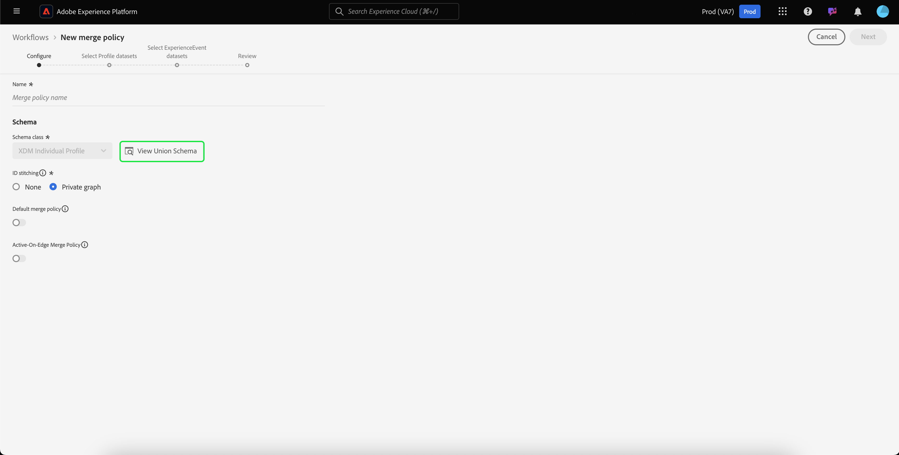
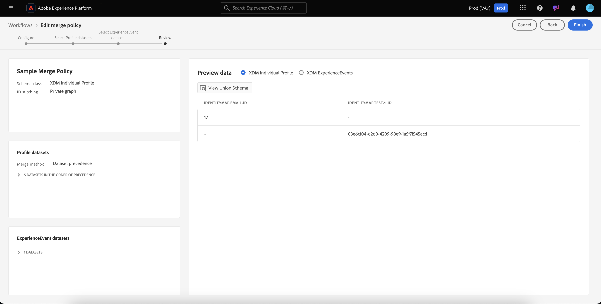

# Guide de l’interface utilisateur des stratégies de fusion

Adobe Experience Platform vous permet de rassembler des fragments de données provenant de plusieurs sources et de les combiner afin d’obtenir une vue complète de chaque client. Lorsque vous rassemblez ces données, les stratégies de fusion sont les règles utilisées par [!DNL Platform] pour déterminer la priorité des données et les données qui seront combinées pour créer la vue unifiée.

À l’aide d’API RESTful ou de l’interface utilisateur, vous pouvez créer des stratégies de fusion, gérer des stratégies existantes et définir une stratégie de fusion par défaut pour votre organisation dans l’interface utilisateur. Ce guide fournit des instructions détaillées sur l’utilisation de stratégies de fusion à l’aide de l’interface utilisateur de Adobe Experience Platform.

Pour en savoir plus sur les stratégies de fusion et le rôle qu’elles jouent dans Experience Platform, commencez par lire la [présentation des stratégies de fusion](overview.md).

## Prise en main

Ce guide nécessite une compréhension pratique de plusieurs fonctions [!DNL Experience Platform] importantes. Avant de suivre ce guide, veuillez consulter la documentation relative aux services suivants :

* [Real-time Customer Profile](../home.md) : fournit un profil client en temps réel unifié basé sur des données agrégées issues de plusieurs sources.
* [Service Adobe Experience Platform Identity](../../identity-service/home.md) : Active Real-time Customer Profile en établissant un lien entre les identités de sources de données disparates ingérées dans  [!DNL Platform].
* [Modèle de données d’expérience (XDM)](../../xdm/home.md)[!DNL Platform] : cadre normalisé selon lequel Experience organise les données d’expérience client.

## Affichage des stratégies de fusion {#view-merge-policies}

Dans l’interface utilisateur [!DNL Experience Platform], vous pouvez commencer à utiliser des stratégies de fusion en sélectionnant **[!UICONTROL Profils]** dans le volet de navigation de gauche, puis en sélectionnant l’onglet **[!UICONTROL Stratégies de fusion]** . Cet onglet comprend une liste de toutes les stratégies de fusion existantes pour votre organisation, ainsi que des détails pour chaque stratégie de fusion, y compris le nom de la stratégie, si la stratégie de fusion est la stratégie de fusion par défaut ou non et la classe de schéma à laquelle la stratégie de fusion se rapporte.

Pour sélectionner les détails visibles ou ajouter des colonnes supplémentaires à l’affichage, sélectionnez **[!UICONTROL Configurer les colonnes]** et cliquez sur le nom d’une colonne pour l’ajouter ou la supprimer de la vue.

## Création d’une stratégie de fusion {#create-a-merge-policy}

Pour créer une stratégie de fusion, sélectionnez **[!UICONTROL Créer une stratégie de fusion]** dans l’onglet Stratégies de fusion pour entrer dans le nouveau processus de stratégie de fusion.

Le workflow **[!UICONTROL Nouvelle stratégie de fusion]** nécessite que vous fournissiez des informations importantes pour votre nouvelle stratégie de fusion par le biais d’une série d’étapes guidées. Ces étapes sont décrites dans les sections qui suivent.

## [!UICONTROL Configuration] {#configure}

La première étape du processus vous permet de configurer votre stratégie de fusion en fournissant des informations de base. Ces informations incluent :

* **[!UICONTROL Nom]** : le nom de votre stratégie de fusion devrait être descriptif, mais concis.
* **[!UICONTROL Classe]** de schéma : Classe de schéma XDM associée à la stratégie de fusion. Cela spécifie la classe de schéma pour laquelle cette stratégie de fusion est créée. Les organisations peuvent créer plusieurs stratégies de fusion par classe de schéma. Actuellement, seule la classe [!UICONTROL XDM Individual Profile] est disponible dans l’interface utilisateur. Vous pouvez prévisualiser le schéma d’union pour la classe de schéma en sélectionnant **[!UICONTROL Afficher le schéma d’union]**. Pour plus d’informations, reportez-vous à la section [Affichage du schéma d’union](#view-union-schema) qui suit.
* **[!UICONTROL Combinaison d’identités]** : ce champ définit la manière de déterminer les identités liées d’un client. Il existe deux valeurs possibles pour la combinaison d’identités. Il est important de comprendre l’impact du type de combinaison d’identités sélectionné sur vos données. Pour en savoir plus, consultez la [présentation des stratégies de fusion](overview.md).
   * **[!UICONTROL Aucun]** : ne réalise pas de combinaison d’identités.
   * **[!UICONTROL Graphique privé]** : réalise des combinaisons d’identités basées sur votre graphique d’identités privé.
* **[!UICONTROL Stratégie de fusion par défaut]** : un bouton de basculement qui vous permet de sélectionner cette stratégie de fusion ou non comme stratégie par défaut pour votre organisation. Si le sélecteur est activé, un avertissement s’affiche vous demandant de confirmer que vous souhaitez modifier la stratégie de fusion par défaut de votre organisation. Voir la [présentation des stratégies de fusion](overview.md) pour en savoir plus sur les stratégies de fusion par défaut.
   

Une fois les champs obligatoires renseignés, vous pouvez sélectionner **[!UICONTROL Suivant]** pour poursuivre le workflow.

## [!UICONTROL Afficher le schéma d’union] {#view-union-schema}

Lors de la création ou de la modification d’une stratégie de fusion, vous pouvez afficher le schéma d’union de la classe de schéma choisie en sélectionnant **[!UICONTROL Afficher le schéma d’union]**.

Cela ouvre la boîte de dialogue [!UICONTROL Afficher le schéma d’union], qui affiche tous les schémas de contribution, les identités et les relations associés au schéma d’union. Vous pouvez utiliser la boîte de dialogue pour explorer le schéma d’union comme vous le feriez en accédant à l’onglet [!UICONTROL Schéma d’union] dans la section [!UICONTROL Profils] de l’interface utilisateur de Platform.

Pour plus d’informations sur les schémas d’union, y compris sur la manière d’interagir avec eux dans l’onglet [!UICONTROL Schéma d’union] ou la boîte de dialogue [!UICONTROL Afficher le schéma d’union] du processus des stratégies de fusion, consultez le [guide de l’interface utilisateur du schéma d’union](../ui/union-schema.md).

## [!UICONTROL Sélection de jeux de données Profile] {#select-profile-datasets}

Dans l’écran **[!UICONTROL Sélectionner les jeux de données de profil]**, vous devez sélectionner la **[!UICONTROL méthode de fusion]** que vous souhaitez utiliser pour votre stratégie de fusion. S’affiche également à l’écran le nombre total de [!UICONTROL jeux de données de profil] dans votre organisation qui se rapportent à la classe de schéma sélectionnée sur l’écran précédent.

Selon la méthode de fusion que vous choisissez, tous les jeux de données Profile seront fusionnés selon l’ordre dans lequel ils ont été mis à jour pour la dernière fois (ordre d’horodatage). Vous devrez également sélectionner les jeux de données Profile à inclure dans la stratégie de fusion et l’ordre dans lequel les fusionner (ordre de priorité du jeu de données).

Pour plus d’informations sur les méthodes de fusion, consultez la [présentation des stratégies de fusion](overview.md).

### Horodatage ordonné {#timestamp-ordered-profile}

Si vous sélectionnez **[!UICONTROL Horodatage ordonné]** comme méthode de fusion, les attributs des jeux de données les plus récemment mis à jour seront prioritaires. Cela s’applique à tous les jeux de données Profile.

>[!NOTE]
>
>Le nombre entre crochets en regard de **[!UICONTROL Jeux de données de profil]** (par exemple, `(37)` dans l’image affichée) indique le nombre total de jeux de données de profil qui seront inclus.

### Priorité du jeu de données {#dataset-precedence-profile}

La sélection de la **[!UICONTROL priorité du jeu de données]** comme méthode de fusion nécessite que vous sélectionniez les jeux de données Profile et que vous les priorisiez manuellement. Chaque jeu de données répertorié inclut également l’état du dernier lot ingéré ou affiche un avis indiquant qu’aucun lot n’a été ingéré dans ce jeu de données.

Vous pouvez sélectionner jusqu’à 50 jeux de données dans la liste des jeux de données à inclure dans la stratégie de fusion.

>[!NOTE]
>
>Le nombre entre crochets en regard de **[!UICONTROL Jeux de données de profil]** (par exemple, `(37)` dans l’image affichée) indique le nombre total de jeux de données de profil disponibles pour la sélection.

Lorsque des jeux de données sont sélectionnés, ils sont ajoutés à la section **[!UICONTROL Sélectionner des jeux de données]** , ce qui vous permet de faire glisser les jeux de données et de les classer selon la priorité souhaitée. Au fur et à mesure que les jeux de données sont ajustés dans la liste, l’ordinal (1, 2, 3, etc.) en regard du jeu de données se met à jour, affichant sa priorité (1 se voyant attribuer la priorité la plus élevée, puis 2 et plus).

La sélection d’un jeu de données met également à jour la section **[!UICONTROL Schéma d’union]**, affichant les champs du schéma d’union auquel chaque jeu de données contribue aux données. Pour plus d’informations sur les schémas d’union, y compris sur l’interaction avec les visualisations dans l’interface utilisateur, consultez le [guide de l’interface utilisateur des schémas d’union](../ui/union-schema.md)

## [!UICONTROL Sélection de jeux de données ExperienceEvent] {#select-experienceevent-datasets}

L’étape suivante du processus nécessite la sélection des jeux de données ExperienceEvent. Cet écran est influencé par la méthode de fusion que vous avez sélectionnée sur l’écran [[!UICONTROL Sélectionner les jeux de données de profil]](#select-profile-datasets) .

### Horodatage ordonné {#timestamp-ordered-experienceevent}

Si vous avez sélectionné **[!UICONTROL Horodatage ordonné]** comme méthode de fusion pour les jeux de données Profile, les attributs des jeux de données ExperienceEvent les plus récemment mis à jour seront également prioritaires ici.

>[!NOTE]
>
>Le nombre entre crochets en regard de **[!UICONTROL Jeux de données ExperienceEvent]** (par exemple, `(20)` dans l’image affichée) indique le nombre total de jeux de données ExperienceEvent créés par votre organisation et correspondant à la classe de schéma que vous avez sélectionnée dans l’écran de configuration de la stratégie de fusion.

### Priorité du jeu de données {#dataset-precedence-experienceevent}

Si vous avez sélectionné **[!UICONTROL Priorité du jeu de données]** comme méthode de fusion pour les jeux de données Profile, vous devez sélectionner les jeux de données ExperienceEvent à inclure. Vous pouvez sélectionner jusqu’à 50 jeux de données ExperienceEvent dans la liste des jeux de données.

>[!NOTE]
>
>Le nombre entre crochets en regard de **[!UICONTROL Jeux de données ExperienceEvent]** (par exemple, `(20)` dans l’image affichée) indique le nombre total de jeux de données ExperienceEvent créés par votre organisation et correspondant à la classe de schéma que vous avez sélectionnée dans l’écran de configuration de la stratégie de fusion.

Lorsque des jeux de données sont sélectionnés, ils apparaissent dans la section [!UICONTROL Sélectionner des jeux de données] .

Les jeux de données ExperienceEvent ne peuvent pas être triés manuellement. Au lieu de cela, les attributs des jeux de données ExperienceEvent sont ajoutés aux jeux de données Profile s’ils font partie du même fragment de profil.

Tout comme pour la sélection de jeux de données Profile, la sélection d’un jeu de données ExperienceEvent met également à jour la section **[!UICONTROL Schéma d’union]**, affichant les champs du schéma d’union auquel chaque jeu de données contribue aux données. Pour plus d’informations sur les schémas d’union, y compris sur l’interaction avec les visualisations dans l’interface utilisateur, consultez le [guide de l’interface utilisateur des schémas d’union](../ui/union-schema.md)

## [!UICONTROL Révision] {#review}

La dernière étape du processus consiste à examiner votre stratégie de fusion. L’écran **[!UICONTROL Réviser]** affiche des informations sur votre stratégie de fusion, y compris la méthode de combinaison d’identifiants sélectionnée, la méthode de fusion sélectionnée et les jeux de données inclus. (Pour afficher tous les jeux de données Profile ou ExperienceEvent inclus, sélectionnez le nombre de jeux de données à développer dans la liste déroulante.)

Le tableau **[!UICONTROL Prévisualiser les données]** qui présente des exemples d’enregistrements de profil à l’aide de votre stratégie de fusion est également inclus dans l’écran de révision. Cela vous permet de prévisualiser à quoi ressemble un profil client avant d’enregistrer votre stratégie de fusion.

Veillez à examiner soigneusement la configuration de votre stratégie de fusion et à prévisualiser les données avant de sélectionner **[!UICONTROL Terminer]** pour terminer le processus de création.

### Horodatage ordonné {#timestamp-ordered-review}

Si vous avez sélectionné **[!UICONTROL Horodatage ordonné]** comme méthode de fusion pour votre stratégie de fusion, la liste des jeux de données Profile inclut tous les jeux de données créés par votre organisation en rapport avec la classe de schéma, par ordre d’horodatage. La liste des jeux de données ExperienceEvent inclut tous les jeux de données créés par votre organisation pour la classe de schéma choisie et sera ajoutée aux jeux de données Profile.

Le tableau **[!UICONTROL Aperçu des données]** affiche des exemples d’enregistrements de profil en fonction d’un ordre d’horodatage des jeux de données. Cela vous permet de prévisualiser à quoi ressemble un profil client avant d’enregistrer votre stratégie de fusion.

### Priorité du jeu de données {#dataset-precedence-review}

Si vous avez sélectionné **[!UICONTROL Priorité du jeu de données]** comme méthode de fusion pour votre stratégie de fusion, les listes des jeux de données Profile et ExperienceEvent incluent uniquement les jeux de données Profile et ExperienceEvent que vous avez sélectionnés lors du processus de création, respectivement. L’ordre des jeux de données Profile doit correspondre à la priorité que vous avez spécifiée lors de la création. Dans le cas contraire, utilisez le bouton [!UICONTROL Précédent] pour revenir aux étapes précédentes du workflow et ajuster la priorité.

Le tableau **[!UICONTROL Aperçu des données]** affiche des exemples d’enregistrements de profil à l’aide des jeux de données sélectionnés. Cela vous permet de prévisualiser à quoi ressemble un profil client avant d’enregistrer votre stratégie de fusion.

### Mise à jour de la liste des stratégies de fusion {#updated-list}

Une fois le workflow terminé pour créer une stratégie de fusion, vous revenez à l’onglet **[!UICONTROL Stratégies de fusion]** . La liste des stratégies de fusion pour votre organisation doit maintenant inclure la stratégie de fusion que vous venez de créer.

## Modification d’une stratégie de fusion

Dans l’onglet [!UICONTROL Stratégies de fusion] , vous pouvez modifier une stratégie de fusion existante créée pour la classe [!DNL XDM Individual Profile] en sélectionnant le **[!UICONTROL nom de la stratégie]** pour la stratégie de fusion que vous souhaitez modifier.

Lorsque l’écran **[!UICONTROL Modifier la stratégie de fusion]** s’affiche, vous pouvez apporter des modifications au nom et à la méthode [!UICONTROL combinaison d’identifiants], ainsi que modifier si cette stratégie est ou non la stratégie de fusion par défaut de votre organisation.

Sélectionnez **[!UICONTROL Suivant]** pour continuer le processus de stratégie de fusion afin de mettre à jour la méthode de fusion et les jeux de données inclus dans la stratégie de fusion.

Une fois les modifications nécessaires effectuées, passez en revue votre stratégie de fusion et sélectionnez **[!UICONTROL Terminer]** pour enregistrer vos modifications et revenir à l’onglet [!UICONTROL Stratégies de fusion].

>[!WARNING]
>
>La modification d’une stratégie de fusion peut affecter la segmentation et les résultats des profils, car elle modifiera la manière dont les conflits de données sont résolus. Veillez à examiner soigneusement les modifications apportées à vos stratégies de fusion avant de les enregistrer.

## Violations de la politique de gouvernance des données

Lors de la création ou de la mise à jour d’une stratégie de fusion, une vérification est effectuée pour déterminer si la politique de fusion enfreint l’une des stratégies en matière d’utilisation des données définies par votre organisation. Les stratégies d’utilisation des données font partie de Adobe Experience Platform [!DNL Data Governance] et sont des règles qui décrivent les types d’actions marketing que vous êtes autorisé ou non à effectuer sur des données [!DNL Platform] spécifiques. Par exemple, si une stratégie de fusion a été utilisée pour créer un segment activé vers une destination tierce et que votre organisation dispose d’une stratégie d’utilisation des données empêchant l’exportation de données spécifiques vers des tiers, vous recevrez une **[!UICONTROL violation de la politique de gouvernance des données détectée]** lors de la tentative d’enregistrement de votre stratégie de fusion.

Cette notification inclut une liste des stratégies d’utilisation des données ayant été enfreintes et vous permet de consulter les détails de la violation en sélectionnant une stratégie depuis la liste. Lors de la sélection d’une stratégie ayant fait l’objet d’une violation, l’onglet **[!UICONTROL Liaison des données]** fournit la raison de la violation et les activations affectées, chacune fournissant plus de détails sur la manière dont la stratégie d’utilisation des données a été enfreinte.

Pour en savoir plus sur la manière dont la gouvernance des données est réalisée au sein d’Adobe Experience Platform, veuillez commencer par lire la [présentation de la gouvernance des données](../../data-governance/home.md).

## Étapes suivantes

Maintenant que vous avez créé et configuré des stratégies de fusion pour votre organisation, vous pouvez les utiliser pour ajuster l’affichage des profils clients dans Platform et pour créer des segments d’audience à partir de vos données de profil. Pour plus d’informations sur la création et l’utilisation des segments à l’aide de l’interface utilisateur et des API, consultez la [présentation de la segmentation](../../segmentation/home.md) .[!DNL Experience Platform]
