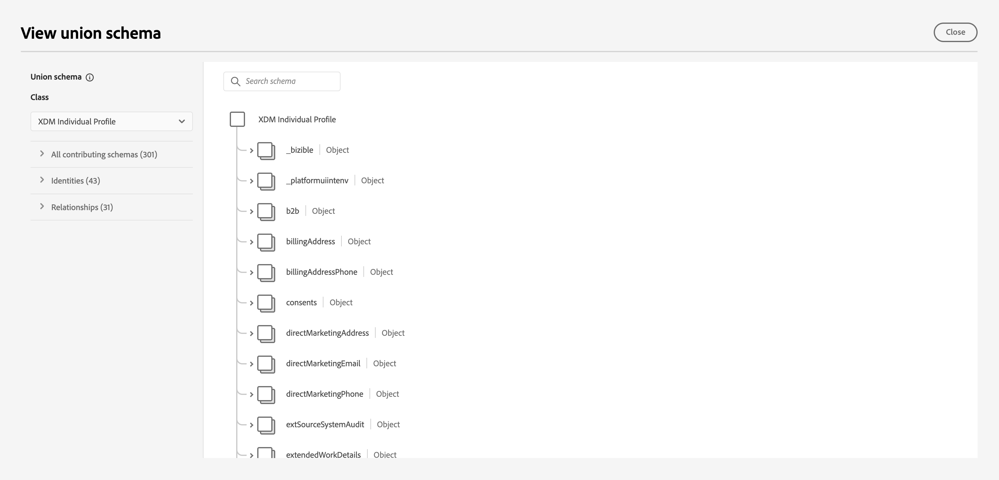
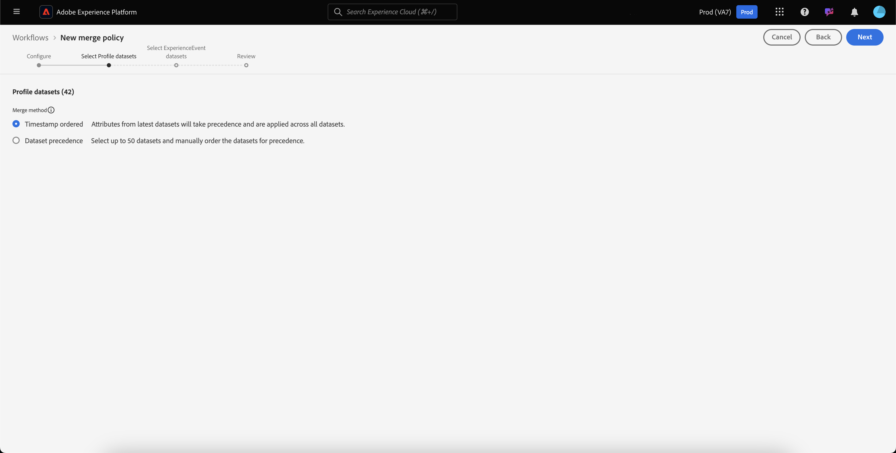

# Guide de l’interface utilisateur des politiques de fusion

Adobe Experience Platform permet de rassembler des données issues de plusieurs sources et de les combiner pour obtenir une vue complète de chacun de vos clients. Les politiques de fusion sont les règles utilisées par [!DNL Platform] pour déterminer quelle est la priorité des données et quelles données seront combinées pour créer cette vue unifiée.

À l’aide d’API RESTful ou de l’interface utilisateur, vous pouvez créer des politiques de fusion, gérer des politiques existantes et définir une politique de fusion par défaut pour votre organisation dans l’interface utilisateur. Ce guide fournit des instructions détaillées sur l’utilisation des politiques de fusion à l’aide de l’interface utilisateur (IU) d’Adobe Experience Platform.

Pour en savoir plus sur les politiques de fusion et le rôle qu’elles jouent dans Experience Platform, commencez par lire la [présentation des politiques de fusion](overview.md).

## Prise en main

Ce guide nécessite une compréhension pratique de plusieurs fonctions [!DNL Experience Platform] importantes. Avant de lire ce guide d’utilisation, veuillez consulter la documentation relative aux services suivants :

* [Profil client en temps réel](../home.md) : fournit un profil client en temps réel unifié basé sur des données agrégées issues de plusieurs sources.
* [Service Adobe Experience Platform Identity](../../identity-service/home.md) : active Real-time Customer Profile en rapprochant des identités de sources de données disparates ingérées dans [!DNL Platform].
* [Modèle de données d’expérience (XDM)](../../xdm/home.md) : cadre normalisé selon lequel [!DNL Platform] organise les données d’expérience client.

## Affichage des politiques de fusion {#view-merge-policies}

>[!CONTEXTUALHELP]
>id="platform_errors_uplib_101221_404"
>title="Stratégie de fusion introuvable"
>abstract="Cela signifie que Platform n’a pas pu trouver la stratégie de fusion demandée. Pour résoudre cette erreur, essayez l’une des solutions suivantes :<ul><li>Vérifiez que le bon identifiant de stratégie de fusion figure dans l’URL.</li><li>Assurez-vous de disposer de la bonne combinaison d’organisation et de sandbox pour accéder à la stratégie de fusion souhaitée.</li></ul>"

Dans l’interface utilisateur de [!DNL Experience Platform], vous pouvez commencer à utiliser des stratégies de fusion en sélectionnant **[!UICONTROL Profils]** dans le volet de navigation de gauche, puis en sélectionnant l’onglet **[!UICONTROL Stratégies de fusion]**.

Cet onglet comprend une liste de toutes les politiques de fusion existantes pour votre organisation, ainsi que des informations concernant chaque politique de fusion, y compris le nom de la politique, si la politique de fusion est la politique de fusion par défaut ou non et la classe de schéma à laquelle la politique de fusion se rapporte.

Pour sélectionner les détails visibles ou ajouter des colonnes supplémentaires à l’affichage, sélectionnez  et sélectionnez un nom de colonne pour l’ajouter ou la supprimer de la vue.

## Création d’une politique de fusion {#create-a-merge-policy}

Pour créer une stratégie de fusion, sélectionnez **[!UICONTROL Créer une stratégie de fusion]** dans l’onglet Stratégies de fusion pour lancer le workflow de création d’une stratégie de fusion.

Le workflow **[!UICONTROL Nouvelle stratégie de fusion]** nécessite que vous fournissiez des informations importantes pour votre nouvelle stratégie de fusion par le biais d’une série d’étapes guidées. Ces étapes sont décrites dans les sections qui suivent.

## [!UICONTROL Configuration] {#configure}

La première étape du workflow vous permet de configurer votre stratégie de fusion en fournissant des informations de base. Ces informations incluent :

* **[!UICONTROL Nom]** : le nom de votre politique de fusion devrait être descriptif, mais concis.
* **[!UICONTROL Classe de schéma]** : la classe de schéma XDM associée à la politique de fusion. Ceci permet de spécifier la classe de schéma pour laquelle cette politique de fusion est créée. Les organisations peuvent créer plusieurs politiques de fusion par classe de schéma. Actuellement, seule la classe [!UICONTROL Profil individuel XDM] est disponible dans l’interface utilisateur. Vous pouvez prévisualiser le schéma d’union pour la classe de schéma en sélectionnant **[!UICONTROL Afficher le schéma d’union]**. Pour plus d’informations, reportez-vous à la section [Affichage du schéma d’union](#view-union-schema) qui suit.
* **[!UICONTROL Combinaison d’identités]** : ce champ définit la manière de déterminer les identités liées d’un client. Il existe deux valeurs possibles pour la combinaison d’identités. Il est important de comprendre l’impact du type de combinaison d’identités sélectionné sur vos données. Pour en savoir plus, consultez la [présentation des politiques de fusion](overview.md).
   * **[!UICONTROL Aucun]** : ne réalise pas de combinaison d’identités.
   * **[!UICONTROL Graphique privé]** : réalise des combinaisons d’identités basées sur votre graphique d’identités privé.
* **[!UICONTROL Politique de fusion par défaut]** : un bouton de basculement qui vous permet de sélectionner cette politique de fusion ou non comme politique par défaut pour votre organisation. Si le sélecteur est activé, un avertissement s’affiche vous demandant de confirmer que vous souhaitez modifier la politique de fusion par défaut de votre organisation. Voir la [présentation des politiques de fusion](overview.md) pour en savoir plus sur les politiques de fusion par défaut.
  
* **[!UICONTROL Politique de fusion Active-On-Edge]** : bouton de basculement qui vous permet de choisir si cette politique de fusion sera Active-On-Edge (active sur le bord). Pour garantir que tous les consommateurs de profils utilisent la même vue sur les bords, les politiques de fusion peuvent être marquées comme Active-on-Edge (actives sur le bord). Pour qu’une audience soit activée en périphérie (indiquée comme audience en périphérie), elle doit être liée à une stratégie de fusion marquée comme active en périphérie. Si une audience est **et non** liée à une stratégie de fusion marquée comme active sur le serveur Edge, l’audience ne sera pas marquée comme active sur le serveur Edge et sera marquée comme une audience en continu. De plus, chaque environnement de test d’une organisation ne peut avoir qu’une stratégie de fusion **one** active sur le serveur Edge.

Une fois les champs obligatoires renseignés, vous pouvez sélectionner **[!UICONTROL Suivant]** pour poursuivre le workflow.

## [!UICONTROL Afficher le schéma d’union] {#view-union-schema}

Lors de la création ou de la modification d’une politique de fusion, vous pouvez afficher le schéma d’union de la classe de schéma choisie en sélectionnant **[!UICONTROL Afficher le schéma d’union]**.

Cela ouvre la boîte de dialogue [!UICONTROL Afficher le schéma d’union], qui affiche tous les schémas, identités et relations associés au schéma d’union. Vous pouvez utiliser la boîte de dialogue pour explorer le schéma d’union comme vous le feriez en accédant à l’onglet [!UICONTROL Schéma d’union] dans la section [!UICONTROL Profils] de l’interface utilisateur de Platform.

Pour plus d’informations sur les schémas d’union, y compris sur la manière d’interagir avec eux dans l’onglet [!UICONTROL Schéma d’union] ou la boîte de dialogue [!UICONTROL Afficher le schéma d’union] du workflow des stratégies de fusion, consultez le [guide de l’interface utilisateur du schéma d’union](../ui/union-schema.md).

## [!UICONTROL Sélection de jeux de données de profil] {#select-profile-datasets}

À l’écran **[!UICONTROL Sélection des jeux de données de profil]**, vous devez sélectionner la **[!UICONTROL méthode de fusion]** que vous souhaitez utiliser pour votre politique de fusion. S’affiche également à l’écran le nombre total de [!UICONTROL jeux de données de profil] dans votre organisation qui se rapportent à la classe de schéma sélectionnée à l’écran précédent.

En fonction de la méthode de fusion que vous choisissez, tous les jeux de données de profil seront fusionnés selon l’ordre dans lequel ils ont été mis à jour pour la dernière fois (horodatage ordonné). Vous devrez également sélectionner les jeux de données de profil à inclure dans la politique de fusion et l’ordre dans lequel les fusionner (ordre de priorité du jeu de données).

Pour plus d’informations sur les méthodes de fusion, consultez la [présentation des politiques de fusion](overview.md).

>[!BEGINTABS]

>[!TAB Horodatage ordonné]

Si vous sélectionnez **[!UICONTROL Horodatage ordonné]** comme méthode de fusion, les attributs des jeux de données les plus récemment mis à jour seront prioritaires. Cela s’applique à tous les jeux de données de profil.

>[!NOTE]
>
>Le nombre entre crochets en regard de **[!UICONTROL Jeux de données de profil]** (par exemple, `(37)` dans l’image affichée) indique le nombre total de jeux de données de profil qui seront inclus.

>[!TAB Priorité du jeu de données]

La sélection de la **[!UICONTROL priorité du jeu de données]** comme méthode de fusion nécessite que vous sélectionniez les jeux de données de profil et que vous établissiez manuellement leur priorité. Chaque jeu de données répertorié inclut également l’état du dernier lot ingéré ou affiche un avis indiquant qu’aucun lot n’a été ingéré dans ce jeu de données.

Vous pouvez sélectionner jusqu’à 50 jeux de données dans la liste des jeux de données à inclure dans la politique de fusion.

>[!NOTE]
>
>Le nombre entre crochets en regard de **[!UICONTROL Jeux de données de profil]** (par exemple, `(37)` dans l’image affichée) indique le nombre total de jeux de données de profil disponibles pour la sélection.

Lorsque des jeux de données sont sélectionnés, ils sont ajoutés à la section **[!UICONTROL Sélectionner des jeux de données]**, ce qui vous permet de faire glisser les jeux de données et de les classer selon la priorité souhaitée. Au fur et à mesure que les jeux de données sont ajustés dans la liste, le chiffre ordinal (1, 2, 3, etc.) en regard du jeu de données se met à jour, affichant sa priorité (1 se voyant attribuer la priorité la plus élevée, puis 2, etc.).

La sélection d’un jeu de données met également à jour la section **[!UICONTROL Schéma d’union]**, qui affiche les champs du schéma d’union auxquels chaque jeu de données apporte des données. Pour plus d’informations sur les schémas d’union, y compris sur l’interaction avec les visualisations dans l’interface utilisateur, consultez le [guide de l’interface utilisateur des schémas d’union](../ui/union-schema.md).

>[!ENDTABS]

## [!UICONTROL Sélection de jeux de données ExperienceEvent] {#select-experienceevent-datasets}

L’étape suivante du workflow nécessite la sélection de jeux de données ExperienceEvent. Cet écran est influencé par la méthode de fusion que vous avez sélectionnée à l’écran [[!UICONTROL Sélectionner les jeux de données de profil]](#select-profile-datasets).

>[!BEGINTABS]

>[!TAB Horodatage ordonné]

Si vous avez sélectionné **[!UICONTROL Horodatage ordonné]** comme méthode de fusion pour les jeux de données de profil, les attributs des jeux de données ExperienceEvent les plus récemment mis à jour seront également prioritaires ici.

>[!NOTE]
>
>Le nombre entre crochets en regard de **[!UICONTROL Jeux de données ExperienceEvent]** (par exemple, `(1)` dans l’image affichée) indique le nombre total de jeux de données ExperienceEvent créés par votre organisation et correspondant à la classe de schéma que vous avez sélectionnée dans l’écran de configuration de la politique de fusion.

>[!TAB Priorité du jeu de données]

Si vous avez sélectionné **[!UICONTROL Priorité du jeu de données]** comme méthode de fusion pour les jeux de données de profil, vous devez sélectionner les jeux de données ExperienceEvent à inclure. Vous pouvez sélectionner jusqu’à 50 jeux de données ExperienceEvent dans la liste des jeux de données.

>[!NOTE]
>
>Le nombre entre crochets en regard de **[!UICONTROL Jeux de données ExperienceEvent]** (par exemple, `(1)` dans l’image affichée) indique le nombre total de jeux de données ExperienceEvent créés par votre organisation et correspondant à la classe de schéma que vous avez sélectionnée dans l’écran de configuration de la politique de fusion.

Lorsque des jeux de données sont sélectionnés, ils apparaissent dans la section [!UICONTROL Sélectionner des jeux de données].

Les jeux de données ExperienceEvent ne peuvent pas être triés manuellement. Au lieu de cela, les attributs des jeux de données ExperienceEvent sont ajoutés aux jeux de données de profil s’ils font partie du même fragment de profil.

Tout comme pour la sélection de jeux de données de profil, la sélection d’un jeu de données ExperienceEvent met également à jour la section **[!UICONTROL Schéma d’union]**, qui affiche les champs du schéma d’union auquel chaque jeu de données apporte des données. Pour plus d’informations sur les schémas d’union, y compris sur l’interaction avec les visualisations dans l’interface utilisateur, consultez le [guide de l’interface utilisateur des schémas d’union](../ui/union-schema.md).

>[!ENDTABS]

## [!UICONTROL Révision] {#review}

La dernière étape du workflow consiste à examiner votre stratégie de fusion. L’écran **[!UICONTROL Réviser]** affiche des informations sur votre politique de fusion, y compris la méthode de combinaison d’identifiants sélectionnée, la méthode de fusion sélectionnée et les jeux de données inclus. (Pour afficher tous les jeux de données de profil ou ExperienceEvent inclus, sélectionnez le nombre de jeux de données à développer dans la liste déroulante.)

Le tableau **[!UICONTROL Prévisualiser les données]** qui présente des exemples d’enregistrements de profil créés à l’aide de votre politique de fusion est également inclus dans l’écran de révision. Cela vous permet de prévisualiser à quoi ressemble un profil client avant d’enregistrer votre politique de fusion.

Veillez à examiner soigneusement la configuration de votre stratégie de fusion et à prévisualiser les données avant de sélectionner **[!UICONTROL Terminer]** pour terminer le workflow de création.

>[!BEGINTABS]

>[!TAB Horodatage ordonné]

Si vous avez sélectionné **[!UICONTROL Horodatage ordonné]** comme méthode de fusion pour votre politique de fusion, la liste des jeux de données de profil inclut tous les jeux de données créés par votre organisation en rapport avec la classe de schéma, par ordre d’horodatage. La liste des jeux de données ExperienceEvent inclut tous les jeux de données créés par votre organisation pour la classe de schéma choisie et sera ajoutée aux jeux de données de profil.

Le tableau **[!UICONTROL Prévisualiser les données]** affiche des exemples d’enregistrements de profil en fonction d’un ordre d’horodatage des jeux de données. Cela vous permet de prévisualiser à quoi ressemble un profil client avant d’enregistrer votre politique de fusion.

Sélectionnez **[!UICONTROL Terminer]** pour créer votre nouvelle stratégie de fusion.

>[!TAB Priorité du jeu de données]

Si vous avez sélectionné **[!UICONTROL Priorité du jeu de données]** comme méthode de fusion pour votre stratégie de fusion, les listes des jeux de données de profil et ExperienceEvent incluent uniquement les jeux de données de profil et ExperienceEvent que vous avez sélectionnés lors du workflow de création, respectivement. L’ordre des jeux de données de profil doit correspondre à la priorité que vous avez spécifiée lors de la création. Dans le cas contraire, utilisez le bouton [!UICONTROL Précédent] pour revenir aux étapes précédentes du workflow et modifier la priorité.

Le tableau **[!UICONTROL Prévisualiser les données]** affiche des exemples d’enregistrements de profil à l’aide des jeux de données sélectionnés. Cela vous permet de prévisualiser à quoi ressemble un profil client avant d’enregistrer votre politique de fusion.

Sélectionnez **[!UICONTROL Terminer]** pour créer votre nouvelle stratégie de fusion.

>[!ENDTABS]

## Modification d’une politique de fusion {#edit}

Dans lʼonglet [!UICONTROL Politiques de fusion], vous pouvez modifier une politique de fusion existante créée pour la classe [!DNL XDM Individual Profile] en sélectionnant le **[!UICONTROL Nom de la politique]** pour la politique de fusion que vous souhaitez modifier.

Lorsque lʼécran **[!UICONTROL Modifier la politique de fusion]** apparaît, vous pouvez apporter des modifications au nom et à la méthode de [!UICONTROL combinaison dʼidentités] ainsi que déterminer si cette politique est ou non la politique de fusion par défaut pour votre organisation.

Sélectionnez **[!UICONTROL Suivant]** pour poursuivre le workflow de stratégie de fusion afin de mettre à jour la méthode de fusion et les jeux de données inclus dans la stratégie de fusion.

Une fois les modifications nécessaires effectuées, examinez votre politique de fusion et sélectionnez **[!UICONTROL Terminer]** pour enregistrer vos modifications et revenir à lʼonglet [!UICONTROL Politiques de fusion].

>[!WARNING]
>
>La modification dʼune politique de fusion peut affecter les résultats de la segmentation et des profils, car elle modifiera la manière dont les conflits de données sont résolus. Examinez soigneusement les modifications apportées à vos politiques de fusion avant de les enregistrer.

## Violations de la politique de gouvernance des données

Lors de la création ou de la mise à jour d’une stratégie de fusion, une vérification est effectuée pour déterminer si la politique de fusion enfreint l’une des stratégies en matière d’utilisation des données définies par votre organisation. Les stratégies d’utilisation des données font partie de la gouvernance des données de Adobe Experience Platform et sont des règles qui décrivent les types d’actions marketing que vous êtes autorisé ou non à effectuer sur des données [!DNL Platform] spécifiques.

Par exemple, si une stratégie de fusion a été utilisée pour créer une audience qui est activée vers une destination tierce et que votre organisation dispose d’une stratégie d’utilisation des données empêchant l’exportation de données spécifiques vers des tiers, vous recevrez une notification **[!UICONTROL Violations de la stratégie de gouvernance des données détectée]** lorsque vous tentez d’enregistrer votre stratégie de fusion.

Cette notification inclut une liste des politiques d’utilisation des données ayant été enfreintes et vous permet de consulter les détails de la violation en sélectionnant une politique depuis la liste. Si vous avez sélectionné une politique ayant fait lʼobjet dʼune infraction, lʼonglet **[!UICONTROL Liaison des données]** fournit un motif de violation et les activations concernées, chacun fournissant plus de détails sur la manière dont la politique dʼutilisation des données a été enfreinte.

Pour en savoir plus sur la manière dont la gouvernance des données est réalisée au sein d’Adobe Experience Platform, veuillez commencer par lire la [présentation de la gouvernance des données](../../data-governance/home.md).

## Étapes suivantes

Maintenant que vous avez créé et configuré des stratégies de fusion pour votre organisation, vous pouvez les utiliser pour ajuster l’affichage des profils clients dans Platform et pour créer des audiences à partir de vos données de profil. Pour plus d’informations sur la création et l’utilisation d’audiences à l’aide de l’interface utilisateur et des API [!DNL Experience Platform], consultez la [présentation de la segmentation](../../segmentation/home.md) .
