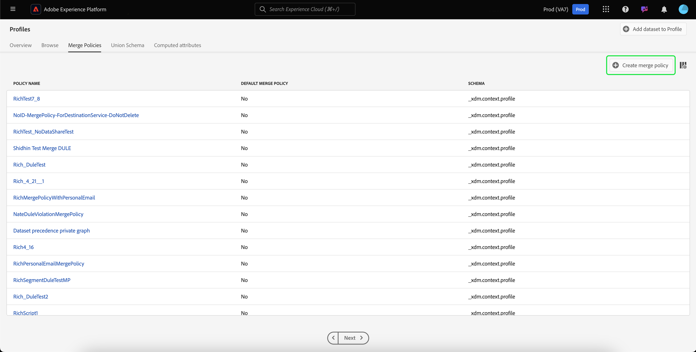

# Guide de l’utilisateur des stratégies de fusion

Adobe Experience Platform vous permet de rassembler des données à partir de plusieurs sources et de les combiner afin d’obtenir une vue complète de chacun de vos clients. Les stratégies de fusion sont les règles utilisées par Platform pour déterminer quelle est la priorité des données et quelles données seront combinées pour créer cette vue unifiée.

A l’aide des API RESTful ou de l’interface utilisateur, vous pouvez créer des stratégies de fusion, gérer des stratégies existantes et définir une stratégie de fusion par défaut pour votre entreprise. Ce guide fournit des instructions détaillées sur l’utilisation des stratégies de fusion à l’aide de l’interface utilisateur d’Adobe Experience Platform.

Si vous préférez utiliser des stratégies de fusion à l’aide de l’API Profil client en temps réel, suivez les instructions du didacticiel [sur l’API des stratégies de](../api/merge-policies.md)fusion.

## Prise en main

Ce guide nécessite une bonne compréhension des différents services Experience Platform impliqués dans les stratégies de fusion. Avant de commencer ce didacticiel, consultez la documentation relative aux services suivants :

* [Profil](../home.md)client en temps réel : Fournit un profil de consommation unifié en temps réel basé sur des données agrégées provenant de plusieurs sources.
* [Service](../../identity-service/home.md)d&#39;identité : Permet le Profil client en temps réel en rapprochant les identités des sources de données disparates qui sont incorporées dans la plate-forme.
* [Modèle de données d’expérience (XDM)](../../xdm/home.md): Cadre normalisé selon lequel la plate-forme organise les données d’expérience client.

## Stratégies de fusion de Vues

Dans l’interface utilisateur de la plateforme d’expérience, vous pouvez commencer à utiliser des stratégies de fusion et voir la liste des stratégies de fusion existantes de votre entreprise en cliquant sur **Profil** dans le rail de gauche, puis en sélectionnant l’onglet **Fusionner les stratégies** .

Les détails de chaque stratégie de fusion disponible pour votre organisation sont visibles sur le landing page, y compris le nom *de la* stratégie, la stratégie *de fusion* par défaut et le *Schéma*.

Pour sélectionner les détails visibles ou ajouter d&#39;autres colonnes à l&#39;affichage, sélectionnez l&#39;icône de sélection de colonnes sur la droite et cliquez sur le nom d&#39;une colonne pour l&#39;ajouter ou la supprimer de la vue.

## Création d’une stratégie de fusion

Pour créer une nouvelle stratégie de fusion, cliquez sur **Créer une stratégie** de fusion près de l’angle supérieur droit de l’onglet **Fusionner les stratégies** .

L’écran **Créer une stratégie** de fusion s’affiche, ce qui vous permet de fournir des informations importantes pour votre nouvelle stratégie de fusion.

* **Nom**: Le nom de votre stratégie de fusion doit être descriptif mais concis.
* **Schéma**: schéma associé à la stratégie de fusion. Cette option spécifie le schéma XDM pour lequel cette stratégie de fusion est créée. Les entreprises peuvent créer plusieurs stratégies de fusion par schéma.
* **Correspondance** d&#39;ID : Ce champ définit comment déterminer les identités associées d’un client. Il existe deux valeurs possibles :
   * **Aucun**: N&#39;effectuez aucune assemblage d&#39;identité.
   * **Graphique** privé : Effectuez des assemblages d’identité en fonction de votre graphique d’identité privé.
* **Fusion** d&#39;attribut : Un fragment de profil est l&#39;information de profil d&#39;une seule identité sur la liste des identités qui existent pour un client individuel. Lorsque le type de graphique d&#39;identité utilisé génère plusieurs identités, il existe un risque de conflit de valeurs de propriétés de profil et la priorité doit être spécifiée. L’utilisation de la fusion ** d’attributs vous permet de spécifier les valeurs de profil de jeux de données à classer par priorité en cas de conflit de fusion. Il existe deux valeurs possibles :
   * **Horodatage ordonné**: En cas de conflit, donner la priorité au profil mis à jour le plus récemment.
   * **Ordre de priorité** des jeux de données : Donner la priorité aux fragments de profil en fonction du jeu de données à partir duquel ils sont arrivés. Lorsque vous sélectionnez cette option, vous devez sélectionner les jeux de données connexes et leur ordre de priorité. Pour plus d&#39;informations, consultez les détails sur la priorité [des jeux de](#dataset-precedence) données ci-dessous.
* **Stratégie** de fusion par défaut : Bouton bascule qui vous permet de choisir si cette stratégie de fusion sera la stratégie par défaut de votre entreprise. Si le sélecteur est activé et que la nouvelle stratégie est enregistrée, votre précédente stratégie par défaut est automatiquement mise à jour pour ne plus être la stratégie par défaut.

### Ordre de priorité des jeux de données {#dataset-precedence}

Lors de la sélection d’une valeur de fusion ** Attribut, vous pouvez sélectionner la priorité ** Jeu de données qui vous permet de donner la priorité aux fragments de profil en fonction du jeu de données à partir duquel ils sont arrivés.

Par exemple, si votre entreprise avait des informations présentes dans un jeu de données qui sont préférées ou approuvées par rapport aux données d’un autre jeu de données, vous pouvez les utiliser.

Lors de la sélection de la priorité ** Jeu de données, un panneau distinct s&#39;ouvre, vous demandant de sélectionner dans les jeux de données ** disponibles (ou d&#39;utiliser la case à cocher pour sélectionner tous les jeux de données) ceux qui seront inclus. Vous pouvez ensuite faire glisser ces jeux de données dans le panneau Jeu de données ** sélectionnés et les faire glisser dans l’ordre de priorité approprié. Le jeu de données le plus élevé aura la priorité la plus élevée, puis le deuxième jeu de données sera le deuxième plus élevé, et ainsi de suite.

Une fois que vous avez terminé de créer la stratégie de fusion, cliquez sur **Enregistrer** pour revenir à l’onglet *Fusionner les stratégies* dans lequel votre nouvelle stratégie de fusion apparaît désormais dans la liste des stratégies.

## Modification d’une stratégie de fusion

Vous pouvez modifier une stratégie de fusion existante dans l&#39;onglet *Fusionner les stratégies* en cliquant sur le nom *de la* stratégie de fusion pour la stratégie de fusion que vous souhaitez modifier.

Lorsque l’écran *Modifier la stratégie* de fusion s’affiche, vous pouvez apporter des modifications au *nom*, au *Schéma*, au type d’assemblage d’ *ID et au type Attribute mergeType dede fusion, ainsi qu’indiquer si cette stratégie sera l’ de fusion par défaut de votre organisation.*****

>[!Note] :
>Vous ne pouvez pas modifier l’ID de stratégie de fusion, affiché en haut de l’écran de modification. Il s’agit d’un identifiant généré par le système en lecture seule qui ne peut pas être modifié.

Une fois les modifications nécessaires effectuées, cliquez sur **Enregistrer** pour revenir à l’onglet Stratégies *de* fusion dans lequel les informations de stratégie de fusion mises à jour sont désormais visibles.

## Violations de la stratégie de gouvernance des données

Lors de la création ou de la mise à jour d’une stratégie de fusion, une vérification est effectuée pour déterminer si la stratégie de fusion enfreint l’une des stratégies d’utilisation des données définies par votre organisation. Les stratégies d’utilisation des données font partie de la gouvernance des données de la plate-forme Adobe Experience et sont des règles qui décrivent les types d’actions marketing que vous pouvez exécuter sur des données de plateforme spécifiques ou dont vous êtes limité à l’exécution. Par exemple, si une stratégie de fusion a été utilisée pour créer un segment qui s’est activé sur une destination tierce et si votre entreprise disposait d’une stratégie d’utilisation des données empêchant l’exportation de données spécifiques vers des tiers, vous recevriez une notification de &quot;violation de la stratégie de gouvernance des données détectée&quot; lorsque vous tentiez d’enregistrer votre stratégie de fusion.

Cette notification comprend une liste de stratégies d’utilisation des données qui ont été violées et vous permet de vue des détails de la violation en sélectionnant une stratégie dans la liste. Lors de la sélection d’une stratégie violée, l’onglet lignage *de* données fournit la *raison de la violation* et les activations ** affectées, chacune fournissant plus de détails sur la manière dont la stratégie d’utilisation des données a été violée.

Pour en savoir plus sur la manière dont la gouvernance des données est effectuée dans Adobe Experience Platform, lisez tout d’abord l’aperçu [de la gouvernance des](../../data-governance/home.md)données.

## Étapes suivantes

Maintenant que vous avez créé et configuré des stratégies de fusion pour votre organisation IMS, vous pouvez les utiliser pour créer des segments d’audience à partir de vos données de profil. Pour plus d’informations sur la création et l’utilisation de segments à l’aide de la plate-forme d’expérience, voir la présentation [de la](../../segmentation/home.md) segmentation.