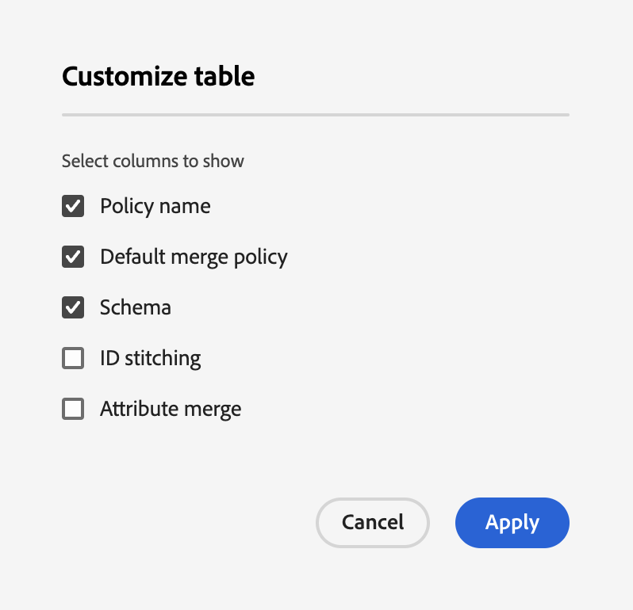

# Guide de l’utilisateur des stratégies de fusion

Adobe Experience Platform vous permet de rassembler des données à partir de plusieurs sources et de les combiner afin de voir un  complet de chacun de vos clients individuels. Les stratégies de fusion sont les règles utilisées par Platform pour déterminer quelle est la priorité des données et quelles données seront combinées pour créer cette vue unifiée.

A l’aide des API RESTful ou de l’interface utilisateur, vous pouvez créer des stratégies de fusion, gérer des stratégies existantes et définir une stratégie de fusion par défaut pour votre entreprise. Ce guide fournit des instructions détaillées sur l’utilisation des stratégies de fusion à l’aide de l’interface utilisateur d’Adobe Experience Platform.

Si vous préférez utiliser des stratégies de fusion à l’aide de l’API  client en temps réel, suivez les instructions décrites dans le didacticiel [sur l’API des stratégies de](../api/merge-policies.md)fusion.

## Prise en main

Ce guide nécessite une compréhension pratique des différents services Experience Platform impliqués dans les stratégies de fusion. Avant de commencer ce didacticiel, veuillez consulter la documentation des services suivants :

* du client en temps réel : Fournit un client en temps réel unifié basé sur des données agrégées provenant de plusieurs sources.
* [Service](../../identity-service/home.md)d&#39;identité : Permet d’activer les  de clients en temps réel en rapprochant les identités des sources de données disparates qui sont assimilées dans la plateforme.
* [Modèle de données d’expérience (XDM)](../../xdm/home.md): Cadre normalisé selon lequel la plateforme organise les données d’expérience client.

## Stratégies de fusion 

Dans l’interface utilisateur de la plate-forme d’expérience, vous pouvez commencer à travailler avec les stratégies de fusion et voir un des stratégies de fusion existantes de votre entreprise en cliquant sur **de** dans le rail de gauche, puis en sélectionnant l’onglet **Fusionner les stratégies** .

Les détails de chaque stratégie de fusion disponible pour votre organisation sont visibles sur le  de, y compris le nom *de la* stratégie, la stratégie *de fusion par* défaut et les *de*.

Pour sélectionner les détails visibles ou ajouter d’autres colonnes à l’affichage, sélectionnez l’icône de sélection de colonne sur la droite et cliquez sur le nom d’une colonne pour l’ajouter ou la supprimer de la .

## Création d’une stratégie de fusion

Pour créer une stratégie de fusion, cliquez sur **Créer une stratégie** de fusion dans la partie supérieure droite de l’onglet **Fusionner les stratégies** .

L’écran **Créer une stratégie** de fusion s’affiche, ce qui vous permet de fournir des informations importantes pour votre nouvelle stratégie de fusion.

* **Nom**: Le nom de votre stratégie de fusion doit être descriptif mais concis.
* ****:  associé à la stratégie de fusion. Indique le  XDM pour lequel cette stratégie de fusion est créée. Les entreprises peuvent créer plusieurs stratégies de fusion par.
* **Pixellisation** des identifiants : Ce champ définit comment déterminer les identités associées d’un client. Il existe deux valeurs possibles :
   * **Aucun**: Ne pas assembler d&#39;identité.
   * **Graphique** privé : Effectuez des assemblages d’identité en fonction du graphique de votre identité privée.
* **Fusion** d’attributs : Un fragment de  est l’information  de d’une seule identité parmi les  d’identités existant pour un client individuel. Lorsque le type de graphique d&#39;identité utilisé génère plusieurs identités, il existe un risque de conflit entre les valeurs de propriété  et la priorité doit être spécifiée. L’utilisation de la fusion ** d’attributs permet de spécifier les valeurs  jeu de données à classer par priorité en cas de conflit de fusion. Il existe deux valeurs possibles :
   * **Horodatage trié**: En cas de conflit, donner la priorité au  qui a été mis à jour le plus récemment.
   * **Priorité** du jeu de données : Attribuez la priorité aux fragments  en fonction du jeu de données à partir duquel ils sont arrivés. Lorsque vous sélectionnez cette option, vous devez sélectionner les jeux de données connexes et leur ordre de priorité. Pour plus d’informations, voir les détails sur la priorité [des jeux de](#dataset-precedence) données ci-dessous.
* **Stratégie** de fusion par défaut : Bouton bascule qui vous permet de choisir si cette stratégie de fusion sera la valeur par défaut de votre entreprise. Si le sélecteur est activé et que la nouvelle stratégie est enregistrée, votre précédente stratégie par défaut est automatiquement mise à jour pour ne plus être la stratégie par défaut.

### Priorité du jeu de données {#dataset-precedence}

Lors de la sélection d’une valeur de fusion ** Attribut, vous pouvez sélectionner *la priorité* Jeu de données qui vous permet de donner la priorité aux fragments de  en fonction du jeu de données à partir duquel ils sont venus.

Par exemple, si votre entreprise avait des informations présentes dans un jeu de données qui sont préférées ou approuvées par rapport aux données d’un autre jeu de données,

Lors de la sélection de la priorité *Jeu de* données, un panneau distinct s’ouvre, vous demandant de sélectionner les jeux de données ** disponibles (ou d’utiliser la case à cocher pour sélectionner tous les jeux de données à inclure). Vous pouvez ensuite faire glisser ces jeux de données dans le panneau Jeu de données ** sélectionné et les faire glisser dans l’ordre de priorité correct. Le jeu de données supérieur se voit attribuer la priorité la plus élevée, puis le deuxième jeu de données est le deuxième plus élevé, etc.

Une fois la stratégie de fusion terminée, cliquez sur **Enregistrer** pour revenir à l’onglet *Fusionner les stratégies* dans lequel votre nouvelle stratégie de fusion apparaît désormais dans le  des stratégies.

## Modification d’une stratégie de fusion

Vous pouvez modifier une stratégie de fusion existante dans l’onglet *Fusionner les stratégies* en cliquant sur le nom *de la* stratégie de fusion que vous souhaitez modifier.

Lorsque l’écran *Modifier la stratégie* de fusion s’affiche, vous pouvez apporter des modifications au type de fusion ** Nom *,**, d’ID et de Attribut ainsi qu’au type de fusion, et indiquer si cette stratégie sera ou non le de fusion par défaut de votre organisation.*****

>[!Note] :
>Vous ne pouvez pas modifier l’ID de stratégie de fusion, affiché en haut de l’écran de modification. Il s’agit d’un identifiant généré par le système en lecture seule qui ne peut pas être modifié.

Une fois les modifications nécessaires effectuées, cliquez sur **Enregistrer** pour revenir à l’onglet Stratégies *de* fusion dans lequel les informations de stratégie de fusion mises à jour sont désormais visibles.

## Étapes suivantes

Maintenant que vous avez créé et configuré des stratégies de fusion pour votre organisation IMS, vous pouvez les utiliser pour créer   segments de à partir de vos données de. Pour plus d’informations sur la création et l’utilisation de segments à l’aide d’Experience Platform, reportez-vous à la présentation [de la](../../segmentation/home.md) segmentation.