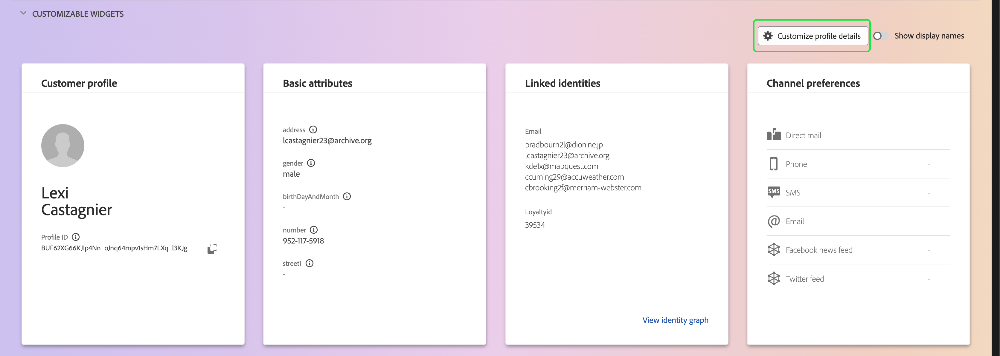

# Personnalisation détaillée du [!DNL Real-Time Customer Profile] {#profile-detail-customization}

Dans l’interface utilisateur de Adobe Experience Platform, vous pouvez afficher des données [!DNL Real-Time Customer Profile] et interagir avec elles sous la forme de profils client. Les informations de profil affichées dans l’interface utilisateur ont été fusionnées à partir de plusieurs fragments de profil afin de former une vue unique de chaque client individuel. Cela inclut des détails tels que les attributs de base, les identités liées et les préférences de canal. Les champs par défaut affichés dans les profils peuvent également être modifiés au niveau de l’organisation afin d’afficher les attributs de [!DNL Profile] préférés. Ce guide fournit des instructions détaillées pour personnaliser l’affichage des données [!DNL Profile] dans l’interface utilisateur d’Experience Platform.

Pour obtenir un guide complet sur l’interface utilisateur des profils, consultez le [guide de l’interface utilisateur des profils](user-guide.md).

## Réorganiser et redimensionner les cartes {#reorder-and-resize-cards}

Dans l’onglet **[!UICONTROL Détail]** du profil client, vous pouvez sélectionner **[!UICONTROL Personnaliser les détails du profil]** afin de redimensionner et de réorganiser les cartes existantes.

Après avoir choisi de modifier le tableau de bord, vous pouvez réorganiser les cartes en sélectionnant le titre des cartes et en les faisant glisser et en les déposant dans l’ordre souhaité. Vous pouvez également redimensionner une carte en sélectionnant le symbole d’angle dans le coin inférieur droit de la carte (`⌟`) et en faisant glisser la carte à la taille souhaitée. Dans cet exemple, la vignette **[!UICONTROL Attributs de base]** est en cours de redimensionnement.

La carte sélectionnée s’ajuste à la taille souhaitée et les cartes environnantes sont repositionnées dynamiquement. Cela peut entraîner le déplacement de certaines cartes vers d’autres lignes. Il vous faut alors faire défiler l’écran vers le bas pour afficher toutes les cartes. Par exemple, lorsque la carte « [!UICONTROL Attributs de base] » est redimensionnée, la carte « [!UICONTROL Identités liées] » n’est plus visible sur la ligne supérieure et apparaît désormais sur une nouvelle deuxième ligne du profil (non affichée). Pour renvoyer la carte « [!UICONTROL Identités liées] » à la ligne supérieure, vous pouvez la faire glisser et la déposer à la position actuelle de la carte « [!UICONTROL Préférences de canal] ».

## Modifier et supprimer des cartes

Outre le redimensionnement et la réorganisation des cartes, vous pouvez modifier le contenu de certaines cartes et supprimer entièrement certaines cartes du tableau de bord. Sélectionnez les points de suspension (`...`) dans le coin supérieur droit de la carte pour la modifier ou la supprimer. Une liste déroulante s’ouvre avec des options de modification ou de suppression de la carte, selon les propriétés de la carte sélectionnée.

>[!NOTE]
>
>Certaines cartes ne peuvent pas être modifiées ni supprimées. Cela est dû au fait que certaines cartes contiennent des informations en lecture seule ou obligatoires. Si une carte ne comporte pas d’ellipses dans le coin supérieur droit, elle contient des informations en lecture seule ET requises et ne peut pas être modifiée ni supprimée. Si une carte comporte des points de suspension dans son coin et que vous la sélectionnez pour n’afficher qu’une option de suppression, les informations de la carte sont en lecture seule et ne peuvent pas être modifiées.

Sélectionnez **[!UICONTROL Modifier]** dans la liste déroulante pour ouvrir l’espace de travail **[!UICONTROL Modifier le widget]** où vous pouvez mettre à jour le titre de la carte, réorganiser ou supprimer les attributs visibles, ou ajouter des attributs supplémentaires à l’aide du bouton **[!UICONTROL Ajouter des attributs]**.

## Ajouter des attributs {#add-attributes}

Dans l’écran **[!UICONTROL Modifier le widget]**, sélectionnez **[!UICONTROL Ajouter des attributs]** dans le coin supérieur droit de la carte pour commencer à ajouter des attributs à cette carte.

Lorsque la boîte de dialogue **[!UICONTROL Sélectionner le champ de schéma d’union]** s’ouvre, le côté gauche de la boîte de dialogue affiche le schéma d’union complet [!UICONTROL Profil individuel XDM], avec les champs imbriqués en dessous. Pour plus d’informations sur les schémas d’union, reportez-vous à la section [schémas d’union [!DNL Profile] du guide d’utilisation](user-guide.md#union-schema).

La section **[!UICONTROL Attributs sélectionnés]** située dans la partie droite de la boîte de dialogue affiche les attributs actuellement inclus dans la carte que vous modifiez. Vous pouvez également supprimer et réorganiser les attributs ici. Le nombre total d’attributs sélectionnés s’affiche, ainsi que le nombre maximal d’attributs (20) pouvant être ajoutés à une seule carte.

Vous pouvez sélectionner n’importe quel champ de schéma d’union disponible pour personnaliser les attributs de la carte que vous modifiez. Lors de la sélection des champs, vous pouvez choisir d’afficher le nom du chemin d’accès au fichier ou le nom d’affichage. Pour basculer entre ces deux affichages, activez le bouton (bascule) **[!UICONTROL Afficher les noms d’affichage]**.

![Le bouton (bascule) [!UICONTROL Afficher les noms d’affichage] est mis en surbrillance dans la page Détails du profil.](../images/profile-customization/show-display-names.png)

Les champs sélectionnés s’affichent avec une coche en regard d’eux et sont automatiquement ajoutés à la liste des attributs sélectionnés. Une fois que vous avez ajouté tous les attributs que vous souhaitez afficher sur la carte, choisissez **[!UICONTROL Sélectionner]** pour revenir à l’écran **[!UICONTROL Modifier le widget]**.

Lorsque vous revenez à l’écran **[!UICONTROL Modifier le widget]**, la liste des attributs de la carte doit désormais être mise à jour pour refléter vos choix. Vous pouvez toujours supprimer ou réorganiser les attributs de la carte, ou modifier le titre de la carte si nécessaire. Une fois vos modifications terminées, sélectionnez **[!UICONTROL Enregistrer]** pour les enregistrer.

Après l’enregistrement, vous revenez à l’onglet **[!UICONTROL Détail]** où la carte et les attributs mis à jour sont visibles.

## Ajouter une nouvelle carte {#add-a-new-card}

Pour personnaliser davantage l’aspect des profils dans Experience Platform, vous pouvez choisir d’ajouter de nouvelles cartes au tableau de bord et de sélectionner les attributs à afficher sur ces cartes. Pour commencer, sélectionnez **[!UICONTROL Modifier le tableau de bord]** dans l’onglet **[!UICONTROL Détail]**.

Sélectionnez ensuite **[!UICONTROL Ajouter un widget]** dans le coin supérieur gauche du tableau de bord.

Lorsque vous choisissez d’ajouter une nouvelle carte, l’écran **[!UICONTROL Modifier le widget]** s’ouvre. Vous pouvez y saisir le titre de la nouvelle carte et sélectionner les attributs que vous souhaitez que la carte affiche. Pour commencer à ajouter des attributs à la carte, sélectionnez **[!UICONTROL Ajouter des attributs]**.

Lorsque la boîte de dialogue **[!UICONTROL Sélectionner le champ de schéma d’union]** s’ouvre, le côté gauche de la boîte de dialogue affiche l’intégralité du schéma d’union [!UICONTROL Profil individuel XDM] et la section **[!UICONTROL Attributs sélectionnés]** sur le côté droit de la boîte de dialogue affiche les attributs que vous sélectionnez pour votre carte. Pour plus d’informations sur l’ajout d’attributs, consultez la section [ sur l’ajout d’attributs ](#add-attributes) qui apparaît plus haut dans ce document.

Le nombre total d’attributs sélectionnés s’affiche, ainsi que le nombre maximal d’attributs (20) pouvant être ajoutés à une seule carte. Vous pouvez également supprimer et réorganiser vos attributs sélectionnés à partir de cet écran. Une fois que vous avez ajouté tous les attributs que vous souhaitez afficher sur la carte, choisissez **[!UICONTROL Sélectionner]** pour revenir à l’écran **[!UICONTROL Modifier le widget]**.

Lorsque vous revenez à l’écran **[!UICONTROL Modifier le widget]**, la liste des attributs sur la carte doit refléter vos choix de l’écran précédent. Vous pouvez également réorganiser et supprimer les attributs de carte selon vos besoins.

Pour enregistrer votre nouvelle carte, vous devez d’abord fournir un **[!UICONTROL Titre de la carte]**, puis sélectionner **[!UICONTROL Enregistrer]** et terminer le processus de création de la carte.

Après l’enregistrement, vous revenez à l’onglet **[!UICONTROL Détail]** où votre nouvelle carte et vos nouveaux attributs sont visibles.

## Restaurer les cartes par défaut

Si, à tout moment, vous décidez que vous souhaitez restaurer les cartes par défaut qui ont été supprimées depuis, vous avez la possibilité de le faire rapidement et facilement. Tout d’abord, sélectionnez **[!UICONTROL Modifier le tableau de bord]**, puis sélectionnez **[!UICONTROL Restaurer les cartes par défaut]**. Une fois les cartes par défaut visibles, vous pouvez sélectionner **[!UICONTROL Enregistrer]** pour enregistrer vos modifications ou sélectionner **[!UICONTROL Annuler]** si vous ne souhaitez pas restaurer les cartes par défaut.

## Étapes suivantes

En suivant ce document, vous devriez maintenant pouvoir mettre à jour la vue Profil de votre organisation, y compris l’ajout et la suppression de cartes, la modification des détails et attributs des cartes, ainsi que la réorganisation et le redimensionnement des cartes. Pour en savoir plus sur l’utilisation des données de [!DNL Profile] dans l’interface utilisateur d’Experience Platform, reportez-vous au guide d’utilisation [[!DNL Profile] ](user-guide.md).
