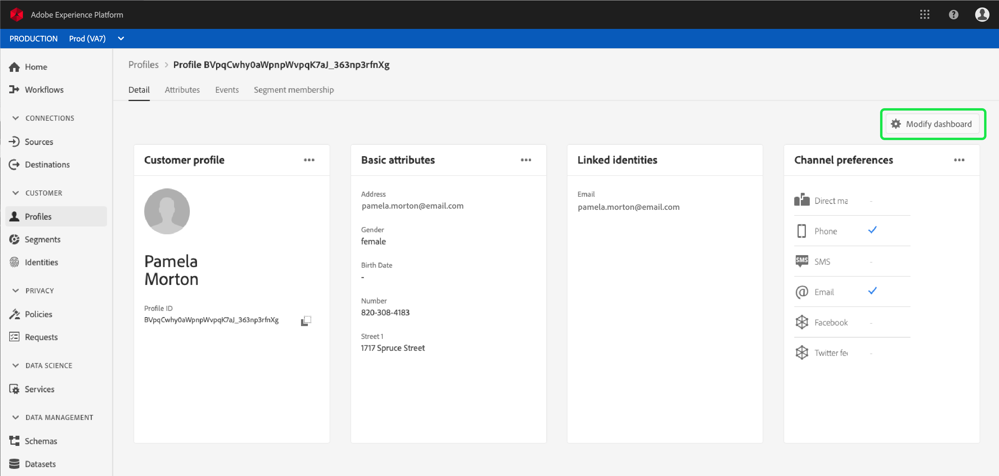
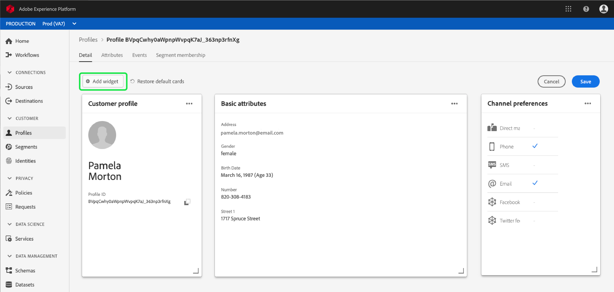

# [!DNL Real-time Customer Profile] personnalisation détaillée  {#profile-detail-customization}

Dans l’interface utilisateur de Adobe Experience Platform, vous pouvez vue et interagir avec des données [!DNL Real-time Customer Profile] sous la forme de profils client. Les informations de profil affichées dans l’interface utilisateur ont été fusionnées à partir de plusieurs fragments de profil afin de former une seule vue pour chaque client. Cela inclut des détails tels que les attributs de base, les identités liées et les préférences de canal. Les champs par défaut affichés dans les profils peuvent également être modifiés au niveau de l&#39;organisation pour afficher les attributs [!DNL Profile] préférés. Ce guide fournit des instructions détaillées pour personnaliser la manière dont les données [!DNL Profile] sont affichées dans l’interface utilisateur de la plate-forme.

Pour obtenir un guide complet sur l&#39;interface utilisateur des Profils, consultez le [guide de l&#39;interface utilisateur du Profil](user-guide.md).

## Réorganiser et redimensionner les cartes {#reorder-and-resize-cards}

Dans l&#39;onglet **[!UICONTROL Détails]** du profil client, vous pouvez sélectionner **[!UICONTROL Modifier le tableau de bord]** afin de redimensionner et de réorganiser les cartes existantes.

Après avoir choisi de modifier le tableau de bord, vous pouvez réorganiser les cartes en sélectionnant le titre de la carte, en les faisant glisser et en les déposant dans l’ordre souhaité. Vous pouvez également redimensionner une carte en sélectionnant le symbole d’angle dans le coin inférieur droit de la carte (`⌟`) et en faisant glisser la carte jusqu’à la taille souhaitée. Dans cet exemple, la carte **[!UICONTROL Attributs de base]** est en cours de redimensionnement.

La carte sélectionnée s’ajuste à la taille souhaitée et les cartes environnantes sont repositionnées dynamiquement. Cela peut entraîner le déplacement de certaines cartes vers d&#39;autres lignes, ce qui nécessite un défilement vers le bas pour afficher toutes les cartes. Par exemple, lorsque la carte &quot;[!UICONTROL Attributs de base]&quot; est redimensionnée, la carte &quot;[!UICONTROL Identités liées]&quot; n’est plus visible sur la ligne supérieure et s’affiche désormais sur une nouvelle ligne du profil (non affichée). Pour renvoyer la carte &quot;[!UICONTROL Identités liées]&quot; à la ligne supérieure, vous pouvez la faire glisser et la déposer à la position actuelle de la carte &quot;[!UICONTROL Préférences de Canal]&quot;.

## Modification et suppression de cartes

Outre le redimensionnement et la réorganisation des cartes, vous pouvez modifier le contenu de certaines cartes et supprimer certaines cartes du tableau de bord. Sélectionnez les ellipses (`...`) dans le coin supérieur droit de la carte afin de les modifier ou de les supprimer. Cette option ouvre une liste déroulante contenant des options permettant de modifier ou de supprimer la carte, en fonction des propriétés de la carte sélectionnée.

>[!NOTE]
>
>Toutes les cartes ne peuvent pas être modifiées ou supprimées. En effet, certaines cartes contiennent des informations en lecture seule ou obligatoires. Si une carte n&#39;a pas d&#39;ellipses dans le coin supérieur droit, elle contient des informations en lecture seule ET obligatoires et ne peut pas être modifiée ni supprimée. Si une carte comporte des points de suspension dans le coin et que sa sélection n&#39;affiche qu&#39;une option de suppression de la carte, les informations de la carte sont en lecture seule et ne peuvent pas être modifiées.

Sélectionnez **[!UICONTROL Modifier]** dans la liste déroulante pour ouvrir l&#39;espace de travail **[!UICONTROL Modifier le widget]**, où vous pouvez mettre à jour le titre de la carte, réorganiser ou supprimer les attributs visibles, ou ajouter d&#39;autres attributs à l&#39;aide du bouton **[!UICONTROL Ajouter les attributs]**.

## Attributs d&#39;Ajoute {#add-attributes}

Dans l&#39;écran **[!UICONTROL Modifier le widget]**, sélectionnez **[!UICONTROL Ajouter les attributs]** dans le coin supérieur droit de la carte pour commencer à ajouter des attributs à cette carte.

Lorsque la boîte de dialogue **[!UICONTROL Sélectionner le schéma d&#39;union]** s&#39;ouvre, le côté gauche de la boîte de dialogue affiche le [!UICONTROL schéma d&#39;union individuel ] XDM complet, avec des champs imbriqués sous le champ. Pour plus d&#39;informations sur les schémas d&#39;union, consultez la section [schémas d&#39;union du  [!DNL Profile] guide d&#39;utilisateur](user-guide.md#union-schema).

La section **[!UICONTROL Attributs sélectionnés]** située sur le côté droit de la boîte de dialogue affiche les attributs actuellement inclus dans la carte que vous modifiez. Vous pouvez également supprimer et réorganiser les attributs ici. Le nombre total d’attributs sélectionnés s’affiche, ainsi que le nombre maximal d’attributs (20) pouvant être ajoutés à une seule carte.

Vous pouvez sélectionner n’importe quel champ de schéma d’union disponible pour personnaliser les attributs de la carte que vous modifiez. Les champs sélectionnés s’affichent avec une coche en regard d’eux et sont automatiquement ajoutés à la liste des attributs sélectionnés. Après avoir ajouté tous les attributs que vous souhaitez afficher sur la carte, choisissez **[!UICONTROL Sélectionner]** pour revenir à l’écran **[!UICONTROL Modifier le widget]**.

Lorsque vous revenez à l’écran **[!UICONTROL Modifier le widget]**, la liste des attributs sur la carte doit maintenant être mise à jour pour refléter vos choix. Vous pouvez toujours supprimer ou réorganiser les attributs de la carte ou modifier le titre de la carte si nécessaire. Une fois vos modifications terminées, sélectionnez **[!UICONTROL Enregistrer]** pour les enregistrer.

Après l’enregistrement, vous revenez à l’onglet **[!UICONTROL Détail]** où la carte et les attributs mis à jour sont visibles.

## Ajouter une nouvelle carte {#add-a-new-card}

Pour personnaliser davantage l’aspect des profils dans l’Experience Platform, vous pouvez choisir d’ajouter de nouvelles cartes au tableau de bord et de sélectionner les attributs à afficher sur ces cartes. Pour commencer, sélectionnez **[!UICONTROL Modifier le tableau de bord]** dans l&#39;onglet **[!UICONTROL Détails]**.

Ensuite, sélectionnez **[!UICONTROL Ajouter widget]** dans le coin supérieur gauche du tableau de bord.

Le fait de choisir d&#39;ajouter une nouvelle carte ouvre l&#39;écran **[!UICONTROL Modifier le widget]** où vous pouvez fournir un titre pour la nouvelle carte et choisir les attributs que vous souhaitez que la carte affiche. Pour commencer à ajouter des attributs à la carte, sélectionnez **[!UICONTROL Ajouter des attributs]**.

Lorsque la boîte de dialogue **[!UICONTROL Sélectionner un schéma d&#39;union]** s&#39;ouvre, la partie gauche de la boîte de dialogue affiche le [!UICONTROL Profil individuel XDM] schéma d&#39;union complet et la section **[!UICONTROL Attributs sélectionnés]** située sur la partie droite de la boîte de dialogue affiche les attributs que vous sélectionnez pour votre carte. Pour plus d&#39;informations sur l&#39;ajout d&#39;attributs, consultez la section [sur l&#39;ajout d&#39;attributs](#add-attributes) qui s&#39;affiche plus haut dans ce document.

Le nombre total d’attributs sélectionnés s’affiche, ainsi que le nombre maximal d’attributs (20) pouvant être ajoutés à une seule carte. Vous pouvez également supprimer et réorganiser les attributs sélectionnés de cet écran. Après avoir ajouté tous les attributs que vous souhaitez afficher sur la carte, choisissez **[!UICONTROL Sélectionner]** pour revenir à l’écran **[!UICONTROL Modifier le widget]**.

Lorsque vous revenez à l’écran **[!UICONTROL Modifier le widget]**, la liste des attributs sur la carte doit refléter vos choix dans l’écran précédent. Vous pouvez également réorganiser et supprimer des attributs de carte si nécessaire.

Pour enregistrer votre nouvelle carte, vous devez d&#39;abord fournir un **[!UICONTROL titre de carte]**, puis vous pourrez sélectionner **[!UICONTROL Enregistrer]** et terminer le processus de création de carte.

Après l’enregistrement, vous revenez à l’onglet **[!UICONTROL Détail]** où sont visibles votre nouvelle carte et vos attributs.

## Restaurer les cartes par défaut

Si vous décidez à tout moment de restaurer les cartes par défaut qui ont été supprimées depuis, vous avez la possibilité de le faire rapidement et facilement. Tout d&#39;abord, sélectionnez **[!UICONTROL Modifier le tableau de bord]**, puis **[!UICONTROL Restaurer les cartes par défaut]**. Une fois les cartes par défaut visibles, vous pouvez sélectionner **[!UICONTROL Enregistrer]** pour enregistrer vos modifications ou sélectionner **[!UICONTROL Annuler]** si vous ne souhaitez pas restaurer les cartes par défaut.

## Étapes suivantes

En suivant ce document, vous devez maintenant être en mesure de mettre à jour la vue de profil de votre organisation, y compris l&#39;ajout et la suppression de cartes, la modification des détails et des attributs des cartes, ainsi que la réorganisation et le redimensionnement des cartes. Pour en savoir plus sur l&#39;utilisation des données [!DNL Profile] dans l&#39;interface utilisateur Experience Platform, consultez le [[!DNL Profile] guide d&#39;utilisateur](user-guide.md).
