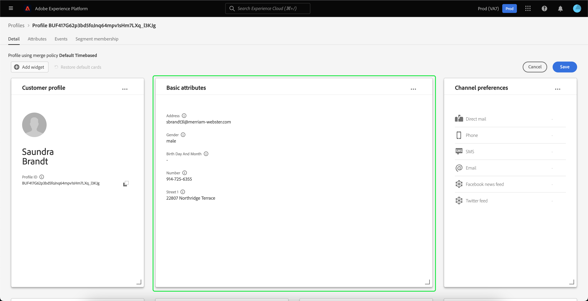

# Personnalisation détaillée du [!DNL Real-Time Customer Profile] {#profile-detail-customization}

Dans l’interface utilisateur de Adobe Experience Platform, vous pouvez afficher et interagir avec les données [!DNL Real-Time Customer Profile] sous la forme de profils client. Les informations de profil affichées dans l’interface utilisateur ont été fusionnées à partir de plusieurs fragments de profil afin de former une vue unique de chaque client. Cela inclut des détails tels que les attributs de base, les identités liées et les préférences de canal. Les champs par défaut affichés dans les profils peuvent également être modifiés au niveau de l’organisation pour afficher les attributs [!DNL Profile] préférés. Ce guide fournit des instructions détaillées pour personnaliser la manière dont les données [!DNL Profile] s’affichent dans l’interface utilisateur de Platform.

Pour obtenir un guide complet sur l’interface utilisateur des profils, consultez le [guide de l’interface utilisateur des profils](user-guide.md).

## Réorganiser et redimensionner les cartes {#reorder-and-resize-cards}

Dans l’onglet **[!UICONTROL Détail]** du profil client, vous pouvez sélectionner **[!UICONTROL Personnaliser les détails du profil]** afin de redimensionner et de réorganiser les cartes existantes.

Après avoir choisi de modifier le tableau de bord, vous pouvez réorganiser les cartes en sélectionnant le titre de la carte, en les faisant glisser et en les déposant dans l’ordre souhaité. Vous pouvez également redimensionner une carte en sélectionnant le symbole de l’angle dans le coin inférieur droit de la carte (`⌟`) et en faisant glisser la carte à la taille souhaitée. Dans cet exemple, la carte **[!UICONTROL Attributs de base]** est en cours de redimensionnement.

La carte sélectionnée s’ajuste à la taille souhaitée et les cartes environnantes sont repositionnées dynamiquement. Cela peut entraîner le déplacement de certaines cartes vers d’autres lignes, ce qui nécessite de faire défiler la page vers le bas pour afficher toutes les cartes. Par exemple, lorsque la carte &quot;[!UICONTROL Attributs de base]&quot; est redimensionnée, la carte &quot;[!UICONTROL Identités liées]&quot; n’est plus visible sur la ligne supérieure et apparaît désormais sur une nouvelle deuxième ligne dans le profil (non affichée). Pour renvoyer la carte &quot;[!UICONTROL Identités liées]&quot; à la ligne supérieure, vous pouvez la faire glisser et la déposer à la position actuelle de la carte &quot;[!UICONTROL Préférences de canal]&quot;.

## Modification et suppression de cartes

Outre le redimensionnement et la réorganisation des cartes, vous pouvez modifier le contenu de certaines cartes et supprimer entièrement certaines cartes du tableau de bord. Sélectionnez les ellipses (`...`) dans le coin supérieur droit de la carte pour la modifier ou la supprimer. Une liste déroulante s’ouvre alors avec des options permettant de modifier ou de supprimer la carte, selon les propriétés de la carte sélectionnée.

>[!NOTE]
>
>Toutes les cartes ne peuvent pas être modifiées ni supprimées. En effet, certaines cartes contiennent des informations en lecture seule ou obligatoires. Si une carte ne comporte pas de ellipse dans le coin supérieur droit, elle contient des informations requises EN lecture seule ET ne peut pas être modifiée ni supprimée. Si une carte comporte des ellipses dans le coin et que la sélection de cette option n’affiche qu’une option pour la supprimer, les informations de la carte sont en lecture seule et ne peuvent pas être modifiées.

Sélectionnez **[!UICONTROL Modifier]** dans la liste déroulante pour ouvrir l’espace de travail **[!UICONTROL Modifier le widget]**, où vous pouvez mettre à jour le titre de la carte, réorganiser ou supprimer les attributs visibles, ou ajouter des attributs supplémentaires à l’aide du bouton **[!UICONTROL Ajouter des attributs]**.

## Ajouter des attributs {#add-attributes}

Dans l’écran **[!UICONTROL Modifier le widget]**, sélectionnez **[!UICONTROL Ajouter des attributs]** dans le coin supérieur droit de la carte pour commencer à ajouter des attributs à cette carte.

Lorsque la boîte de dialogue **[!UICONTROL Sélectionner le champ de schéma d’union]** s’ouvre, le côté gauche de la boîte de dialogue affiche le schéma d’union [!UICONTROL XDM Individual Profile] complet, avec des champs imbriqués en dessous. Pour plus d’informations sur les schémas d’union, reportez-vous à la section [ schémas d’union du  [!DNL Profile] guide de l’utilisateur](user-guide.md#union-schema).

La section **[!UICONTROL Attributs sélectionnés]** située à droite de la boîte de dialogue affiche les attributs actuellement inclus dans la carte que vous modifiez. Vous pouvez également supprimer et réorganiser les attributs ici. Le nombre total d’attributs sélectionnés s’affiche, ainsi que le nombre maximal d’attributs (20) pouvant être ajoutés à une seule carte.

Vous pouvez sélectionner l’un des champs de schéma d’union disponibles pour personnaliser les attributs de la carte que vous modifiez. Lors de la sélection des champs, vous pouvez choisir d’afficher le chemin du fichier ou le nom d’affichage. Pour basculer entre ces deux affichages, sélectionnez la bascule **[!UICONTROL Afficher les noms d’affichage]** .

![Le bouton bascule [!UICONTROL Afficher les noms d&#39;affichage] est mis en surbrillance dans la page Détails du profil.](../images/profile-customization/show-display-names.png)

Les champs sélectionnés sont accompagnés d’une coche et sont automatiquement ajoutés à la liste des attributs sélectionnés. Une fois que vous avez ajouté tous les attributs que vous souhaitez afficher sur la carte, choisissez **[!UICONTROL Sélectionner]** pour revenir à l’écran **[!UICONTROL Modifier le widget]**.

Lorsque vous revenez à l’écran **[!UICONTROL Modifier le widget]**, la liste des attributs de la carte doit maintenant être mise à jour pour refléter vos choix. Vous pouvez toujours supprimer ou réorganiser les attributs de carte ou modifier le titre de la carte selon vos besoins. Une fois vos modifications terminées, sélectionnez **[!UICONTROL Enregistrer]** pour enregistrer vos modifications.

Après l’enregistrement, vous revenez à l’onglet **[!UICONTROL Détail]** où la carte et les attributs mis à jour sont visibles.

## Ajouter une nouvelle carte {#add-a-new-card}

Pour personnaliser davantage l’aspect des profils dans Experience Platform, vous pouvez choisir d’ajouter de nouvelles cartes au tableau de bord et de sélectionner les attributs que vous souhaitez afficher sur ces cartes. Pour commencer, sélectionnez **[!UICONTROL Modifier le tableau de bord]** dans l’onglet **[!UICONTROL Détail]**.

Ensuite, sélectionnez **[!UICONTROL Ajouter un widget]** dans le coin supérieur gauche du tableau de bord.

Si vous choisissez d’ajouter une nouvelle carte, l’écran **[!UICONTROL Modifier le widget]** s’ouvre, dans lequel vous pouvez fournir un titre pour la nouvelle carte et sélectionner les attributs que vous souhaitez afficher. Pour commencer à ajouter des attributs à la carte, sélectionnez **[!UICONTROL Ajouter des attributs]**.

Lorsque la boîte de dialogue **[!UICONTROL Sélectionner le champ de schéma d’union]** s’ouvre, le côté gauche de la boîte de dialogue affiche le schéma d’union [!UICONTROL XDM Individual Profile] complet et la section **[!UICONTROL Attributs sélectionnés]** sur le côté droit de la boîte de dialogue affiche les attributs que vous sélectionnez pour votre carte. Pour plus d’informations sur l’ajout d’attributs, reportez-vous à la section [sur l’ajout d’attributs](#add-attributes) qui s’affiche plus haut dans ce document.

Le nombre total d’attributs sélectionnés s’affiche, ainsi que le nombre maximal d’attributs (20) pouvant être ajoutés à une seule carte. Vous pouvez également supprimer et réorganiser vos attributs sélectionnés à partir de cet écran. Une fois que vous avez ajouté tous les attributs que vous souhaitez afficher sur la carte, choisissez **[!UICONTROL Sélectionner]** pour revenir à l’écran **[!UICONTROL Modifier le widget]**.

Lorsque vous revenez à l’écran **[!UICONTROL Modifier le widget]**, la liste des attributs de la carte doit refléter les choix que vous avez faits à l’écran précédent. Vous pouvez également réorganiser et supprimer des attributs de carte selon vos besoins.

Pour enregistrer votre nouvelle carte, vous devez d’abord fournir un **[!UICONTROL titre de carte]**, puis sélectionner **[!UICONTROL Enregistrer]** et terminer le processus de création de carte.

Après l’enregistrement, vous revenez à l’onglet **[!UICONTROL Détail]** où votre nouvelle carte et vos nouveaux attributs sont visibles.

## Restaurer les cartes par défaut

Si vous décidez à tout moment de restaurer les cartes par défaut qui ont été supprimées depuis, vous avez la possibilité de le faire rapidement et facilement. Tout d&#39;abord, sélectionnez **[!UICONTROL Modifier le tableau de bord]**, puis sélectionnez **[!UICONTROL Restaurer les cartes par défaut]**. Une fois les cartes par défaut visibles, vous pouvez sélectionner **[!UICONTROL Enregistrer]** pour enregistrer vos modifications ou **[!UICONTROL Annuler]** si vous ne souhaitez pas restaurer les cartes par défaut.

## Étapes suivantes

En suivant ce document, vous devriez maintenant pouvoir mettre à jour la vue de profil de votre entreprise, y compris l’ajout et la suppression de cartes, la modification des détails et des attributs de carte, ainsi que la réorganisation et le redimensionnement des cartes. Pour plus d’informations sur l’utilisation des données [!DNL Profile] dans l’interface utilisateur de l’Experience Platform, reportez-vous au [[!DNL Profile] guide d’utilisation](user-guide.md).
