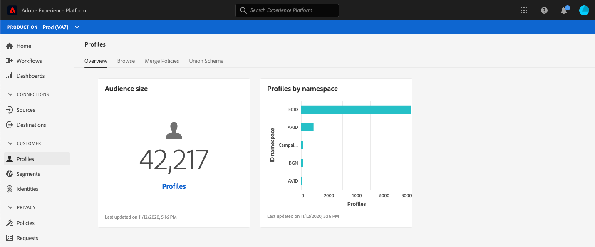

# Tableau de bord [!UICONTROL Profils] {#profile-dashboard}

L’interface utilisateur d’Adobe Experience Platform fournit un tableau de bord grâce auquel vous pouvez afficher des informations importantes sur vos données [!DNL Real-Time Customer Profile], présentées ainsi lors d’un instantané quotidien.

Pour obtenir des instructions détaillées sur l’accès au tableau de bord [!UICONTROL Profils] et les interactions avec celui-ci dans l’interface utilisateur, ainsi que pour en savoir plus sur les mesures disponibles affichées dans le tableau de bord, consultez le guide du tableau de bord [[!UICONTROL Profils]](../../dashboards/guides/profiles.md).

Pour découvrir toutes les fonctionnalités des tableaux de bord dans l’interface utilisateur d’Experience Platform, commencez par lire la [présentation des tableaux de bord](../../dashboards/home.md).

