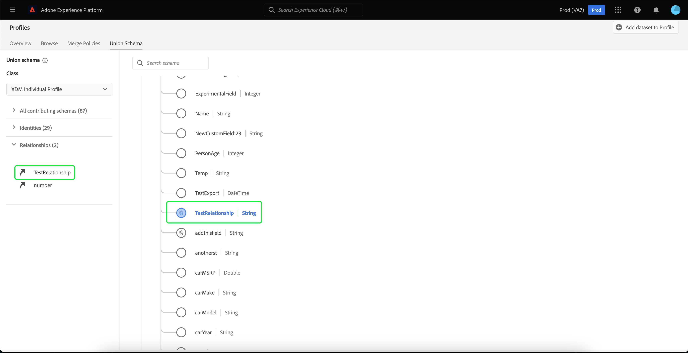

# Guide de l’interface utilisateur [!UICONTROL Schéma d’union]

Dans l’interface utilisateur (IU) de Adobe Experience Platform, vous pouvez facilement afficher n’importe quel schéma d’union de votre organisation et prévisualiser les champs, les identités, les relations et les schémas de contribution pour une classe spécifique. Ce guide fournit des informations détaillées sur la manière d’afficher et d’explorer les schémas d’union à l’aide de l’interface utilisateur d’Experience Platform.

## Commencer {#getting-started}

Ce guide de l’interface utilisateur nécessite une compréhension des différents services [!DNL Experience Platform] impliqués dans la gestion des données du profil client en temps réel. Avant de lire ce guide ou de travailler dans l’interface utilisateur, consultez la documentation relative aux services suivants :

* [[!DNL Real-Time Customer Profile]](../home.md) : fournit un profil de consommateur unifié en temps réel, basé sur des données agrégées provenant de plusieurs sources.
* [[!DNL Identity Service]](../../identity-service/home.md) : permet l’[!DNL Real-Time Customer Profile] en établissant un lien entre les identités de sources de données disparates lors de leur ingestion dans [!DNL Experience Platform].
* [[!DNL Experience Data Model (XDM)]](../../xdm/home.md) : cadre normalisé selon lequel [!DNL Experience Platform] organise les données de l’expérience client.

## Comprendre les schémas d’union {#understanding-union-schemas}

>[!CONTEXTUALHELP]
>id="rtcdp_collaboration_union_schema"
>title="Schémas d’union"
>abstract=""

<!-- The above contextual help is used in the Collaboration UI for a read more link. -->

Le profil client en temps réel vous permet de créer des profils robustes et centralisés contenant des attributs de client et des événements horodatés pour chaque interaction client sur les systèmes intégrés à Adobe Experience Platform. Le format et la structure de ces données sont fournis par les schémas de modèle de données d’expérience (XDM), chaque schéma étant basé sur une classe XDM et contenant des champs compatibles avec cette classe.

Les schémas peuvent être créés pour plusieurs cas d’utilisation, en référençant la même classe mais contenant des champs spécifiques à leur utilisation. Lorsqu’un schéma est activé pour Profil, il fait partie d’un schéma d’union. En d’autres termes, les schémas d’union sont composés de plusieurs schémas qui partagent la même classe et qui ont été activés pour Profile. Le schéma d’union permet de visualiser une fusion de tous les champs contenus dans les schémas partageant la même classe. Le profil client en temps réel utilise le schéma d’union pour créer une vue d’ensemble de chaque client individuel.

L’utilisation des schémas d’union nécessite une compréhension approfondie des schémas XDM. Pour plus d’informations, commencez par lire les [principes de base de la composition des schémas](../../xdm/schema/composition.md).

## Affichage des schémas d’union {#view-union-schemas}

Pour accéder aux schémas d’union dans l’interface utilisateur d’Experience Platform, sélectionnez **[!UICONTROL Profils]** dans le volet de navigation de gauche, puis sélectionnez l’onglet **[!UICONTROL Schéma d’union]**. L’onglet [!UICONTROL  Schéma d’union ] s’ouvre pour afficher le schéma d’union de la classe actuellement sélectionnée.

## Sélectionner une classe {#select-a-class}

Pour afficher le schéma d’union pour une classe XDM spécifique, sélectionnez la classe dans le menu déroulant **[!UICONTROL Classe]**. Étant donné que toutes les classes n’ont pas de schémas d’union, seules les classes avec des schémas d’union (c’est-à-dire celles dont les schémas ont été activés pour Profile) sont disponibles dans la liste déroulante.

Une fois une classe sélectionnée, le schéma affiché est mis à jour pour refléter le schéma d’union de la classe sélectionnée. Par exemple, vous pouvez sélectionner **[!UICONTROL Profil individuel XDM]** pour afficher le schéma d’union de cette classe.

## Explorer les schémas d’union {#explore-union-schemas}

Vous pouvez explorer le schéma d’union en faisant défiler l’écran vers le haut et vers le bas pour afficher la structure complète du schéma, puis en sélectionnant un crochet droit (`>`) pour développer les champs imbriqués.

Sélectionnez un champ pour en afficher les détails, notamment le nom d’affichage, le type de données, la description, le chemin, la date de création et la date de dernière modification. Vous pouvez également afficher une liste de schémas de contribution contenant le champ que vous avez sélectionné.

La sélection du nom d’un schéma de contribution révèle les noms des jeux de données associés à ce schéma qui ingèrent des données dans le champ sélectionné. Chaque nom de jeu de données s’affiche sous la forme d’un lien. La sélection d’un nom de jeu de données ouvre l’onglet Activité de ce jeu de données dans une nouvelle fenêtre.

Pour plus d’informations sur les jeux de données, notamment sur l’affichage de l’activité des jeux de données et la prévisualisation des données des jeux de données dans l’interface utilisateur, consultez le [guide de l’interface utilisateur des jeux de données](../../catalog/datasets/user-guide.md).

## Afficher les schémas de contribution {#view-contributing-schemas}

Vous pouvez également afficher les schémas spécifiques qui contribuent au schéma d’union en sélectionnant **[!UICONTROL Tous les schémas de contribution]** pour développer la liste des schémas. Selon la classe que vous avez sélectionnée et le nombre de schémas créés par votre organisation dans Experience Platform, il peut s’agir d’une liste courte contenant un seul schéma ou d’une liste longue contenant de nombreux schémas.

La sélection du nom d’un schéma spécifique met en surbrillance les champs du schéma d’union qui font partie du schéma que vous avez sélectionné. Une fois qu’un schéma est sélectionné, le schéma d’union est grisé avec des barres noires indiquant les champs qui font partie du schéma de contribution.

## Affichage des identités {#view-identities}

Grâce à l’interface utilisateur, vous pouvez afficher une liste des identités incluses dans le schéma d’union en sélectionnant **[!UICONTROL Identités]** pour développer la liste.

Si vous sélectionnez une identité individuelle dans la liste, le schéma affiché est automatiquement mis à jour selon les besoins pour afficher le champ d’identité. Cela peut inclure le développement de plusieurs champs si le champ d’identité est imbriqué.

Le champ Identité est mis en surbrillance dans le schéma d’union et les détails de l’identité sont affichés dans la partie droite de l’écran. Les détails incluent une liste des schémas contributeurs contenant le champ d’identité et vous pouvez effectuer une analyse en profondeur pour trouver des liens vers les jeux de données liés à ce schéma qui ingèrent des données dans le champ d’identité sélectionné.

## Afficher les relations {#view-relationships}

L’interface utilisateur du schéma d’union vous permet également de voir les relations qui ont été définies pour les schémas en fonction de la classe de schéma sélectionnée. La définition d’une relation est un moyen de connecter deux schémas appartenant à différentes classes afin d’obtenir des informations plus complexes sur les données client.

Si des relations ont été établies pour la classe sélectionnée, si vous sélectionnez **[!UICONTROL Relations]**, une liste de champs utilisés pour créer des relations s’affiche. Tous les schémas n’utilisent pas ou n’ont pas besoin que des relations soient définies. Il est donc courant que la section Relations ne contienne aucun champ.

Pour en savoir plus sur les relations de schéma, y compris sur la manière de les définir à l’aide de l’interface utilisateur, consultez [ce document sur les relations de schéma](../../xdm/tutorials/relationship-ui.md).

Si vous sélectionnez un champ de relation dans la liste, le schéma affiché est mis à jour selon les besoins pour afficher le champ de relation en surbrillance. Cela peut inclure le développement de plusieurs champs si le champ de relation est imbriqué.

## Étapes suivantes

Grâce à ce guide, vous savez désormais comment afficher et parcourir les schémas d’union à l’aide de l’interface utilisateur de [!DNL Experience Platform]. Pour plus d’informations sur les schémas, y compris sur leur utilisation dans Experience Platform, commencez par lire la [présentation du système XDM](../../xdm/home.md).
