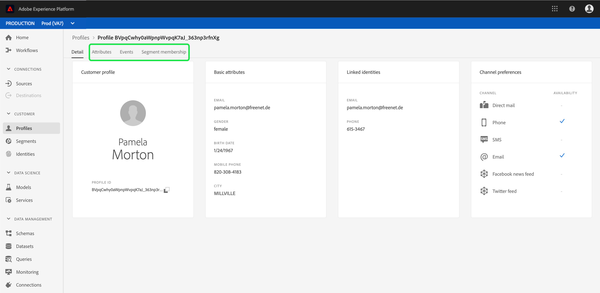

# Guide de l’interface utilisateur du [!DNL Real-time Customer Profile]

[!DNL Real-time Customer Profile] offre une vue d’ensemble de chaque client en combinant des données issues de plusieurs canaux, notamment des données en ligne, hors ligne, CRM et tierces. Ce document sert de guide pour interagir avec les données [!DNL Real-time Customer Profile] dans l’interface utilisateur de Adobe Experience Platform.

## Prise en main

Ce guide de l’interface utilisateur nécessite une compréhension des différents services [!DNL Experience Platform] impliqués dans la gestion de [!DNL Real-time Customer Profiles]. Avant de lire ce guide ou de travailler dans l’interface utilisateur, consultez la documentation relative aux services suivants :

* [[!DNL Real-time Customer Profile]](../home.md) : fournit un profil client en temps réel unifié basé sur des données agrégées issues de plusieurs sources.
* [[!DNL Identity Service]](../../identity-service/home.md): Permet  [!DNL Real-time Customer Profile] en rapprochant des identités de sources de données disparates lors de leur ingestion dans  [!DNL Platform].
* [[!DNL Experience Data Model (XDM)]](../../xdm/home.md) : cadre normalisé selon lequel [!DNL Platform] organise les données de l’expérience client.

## Présentation

Dans l’interface utilisateur de l’Experience Platform, sélectionnez **[!UICONTROL Profils]** dans le volet de navigation de gauche pour ouvrir l’onglet **[!UICONTROL Aperçu]** affichant le tableau de bord [!UICONTROL Profils].

>[!NOTE]
>
>Si votre organisation est une nouvelle entreprise de Platform et qu’elle ne dispose pas encore de jeux de données ou de stratégies de fusion principaux, le tableau de bord [!UICONTROL Profils] n’est pas visible. L’onglet [!UICONTROL Aperçu] contient des liens et de la documentation pour vous aider à prendre en main Real-time Customer Profile.

###  Tableau de bord des profils  {#profile-dashboard}

Le tableau de bord **[!UICONTROL Profils]** décrit les mesures clés liées aux données de profil de votre entreprise.

Pour en savoir plus, consultez le [Guide du tableau de bord du profil](../../dashboards/guides/profiles.md).

## Parcourir

Sélectionnez l’onglet **[!UICONTROL Parcourir]** afin de parcourir les profils par identité.

### Mesures de profil {#profile-metrics}

Sur le côté droit de l’onglet **[!UICONTROL Parcourir]** se trouvent plusieurs mesures importantes liées à vos données de profil, notamment votre [nombre total de profils](#profile-count) ainsi qu’une liste de [profils par espace de noms](#profiles-by-namespace).

Ces mesures de profil sont évaluées à l’aide de la stratégie de fusion par défaut de votre organisation. Pour plus d’informations sur l’utilisation des stratégies de fusion, y compris sur la définition d’une stratégie de fusion par défaut, consultez la [présentation des stratégies de fusion](../merge-policies/overview.md).

Outre ces mesures, la section des mesures de profil fournit également une date et une heure de dernière mise à jour, indiquant le moment où les mesures ont été évaluées pour la dernière fois.

### Nombre de profils {#profile-count}

Le nombre de profils affiche le nombre total de profils de votre organisation dans [!DNL Experience Platform], une fois que la stratégie de fusion par défaut de votre organisation a fusionné des fragments de profil pour former un seul profil pour chaque client individuel. En d’autres termes, votre organisation peut disposer de plusieurs fragments de profil liés à un seul client qui interagit avec votre marque sur différents canaux, mais ces fragments sont fusionnés (selon la stratégie de fusion par défaut) et renvoient le nombre de profils « 1 », car ils sont tous liés à la même personne.

Le nombre de profils inclut également les profils avec des attributs (données d’enregistrement) ainsi que les profils contenant uniquement des données de série temporelle (événement), tels que les profils Adobe Analytics. Le nombre de profils est régulièrement actualisé afin de fournir un nombre total de profils à jour dans Platform.

Lorsque l’ingestion d’enregistrements dans la boutique [!DNL Profile] augmente ou diminue le nombre de plus de 5 %, une tâche est déclenchée pour mettre à jour le nombre. Pour les workflows de données en flux continu, une vérification est effectuée sur une base horaire afin de déterminer si le seuil de 5 % d’augmentation ou de diminution a été atteint. Si tel est le cas, une tâche est automatiquement déclenchée pour mettre à jour le nombre de profils. Pour l’ingestion par lots, dans les 15 minutes suivant l’ingestion réussie d’un lot dans la banque de profils, si le seuil de 5 % d’augmentation ou de diminution est atteint, une tâche est exécutée pour mettre à jour le nombre de profils.

### Profils par espace de noms {#profiles-by-namespace}

La mesure **[!UICONTROL Profils par espace de noms]** affiche le nombre total et la ventilation des espaces de noms sur tous les profils fusionnés de votre banque de profils. Le nombre total de profils par espace de noms (c’est-à-dire en additionnant les valeurs affichées pour chaque espace de noms) sera toujours supérieur à la mesure du nombre de profils, car plusieurs espaces de noms peuvent y être associés. Par exemple, si un client interagit avec votre marque sur plusieurs canaux, plusieurs espaces de noms seront associés à ce client individuel.

Tout comme la mesure [nombre de profils](#profile-count), lorsque l’ingestion d’enregistrements dans la boutique [!DNL Profile] augmente ou diminue le nombre de plus de 5 %, une tâche est déclenchée pour mettre à jour les mesures d’espace de noms. Pour les workflows de données en flux continu, une vérification est effectuée sur une base horaire afin de déterminer si le seuil de 5 % d’augmentation ou de diminution a été atteint. Si tel est le cas, une tâche est automatiquement déclenchée pour mettre à jour le nombre de profils. Pour l’ingestion par lots, dans les 15 minutes suivant l’ingestion réussie d’un lot dans le magasin [!DNL Profile], si le seuil d’augmentation ou de diminution de 5 % est atteint, une tâche est exécutée pour mettre à jour les mesures.

### Stratégie de fusion

Le sélecteur **[!UICONTROL Stratégie de fusion]** sélectionne automatiquement la stratégie de fusion par défaut pour votre organisation. Si vous ne souhaitez pas utiliser cette stratégie de fusion, vous pouvez sélectionner `X` en regard de la stratégie de fusion par défaut pour ouvrir la boîte de dialogue **[!UICONTROL Sélectionner la stratégie de fusion]** dans laquelle vous pouvez choisir une autre stratégie de fusion.

Pour en savoir plus sur les stratégies de fusion et leur rôle dans Platform, consultez la [présentation des stratégies de fusion](../merge-policies/overview.md).

### Espace de noms d’identité

Le sélecteur **[!UICONTROL Espace de noms d’identité]** ouvre une boîte de dialogue dans laquelle vous pouvez choisir l’espace de noms d’identité par lequel vous souhaitez effectuer une recherche. Vous pouvez personnaliser les attributs affichés à partir de votre recherche en sélectionnant l’icône de filtre et en choisissant les attributs que vous souhaitez ajouter ou supprimer.

Dans la boîte de dialogue **[!UICONTROL Sélectionner l’espace de noms d’identité]**, choisissez l’espace de noms par lequel vous souhaitez effectuer une recherche ou utilisez la barre de recherche dans la boîte de dialogue pour commencer à saisir le nom d’un espace de noms. Vous pouvez sélectionner un espace de noms pour afficher des détails supplémentaires. Une fois l’espace de noms trouvé, vous pouvez sélectionner le bouton radio et appuyer sur **[!UICONTROL Sélectionner]** pour continuer.

### Valeur d’identité

Après avoir sélectionné un espace de noms d’identité, vous revenez à l’onglet **[!UICONTROL Parcourir]** où vous pouvez saisir une **[!UICONTROL valeur d’identité]**. Cette valeur est spécifique à un profil client individuel et doit être une entrée valide pour l’espace de noms fourni. Par exemple, la sélection de l’espace de noms d’identité &quot;E-mail&quot; nécessite une valeur d’identité sous la forme d’une adresse électronique valide.

Une fois qu’une valeur a été saisie, sélectionnez **[!UICONTROL Afficher le profil]** et un seul profil correspondant à la valeur est renvoyé. Sélectionnez l’ **[!UICONTROL ID de profil]** pour afficher les détails du profil.

### Détails du profil {#profile-detail}

Lors de la sélection de l’**[!UICONTROL ID de profil]**, l’onglet **[!UICONTROL Détail]** s’affiche. Les informations de profil affichées dans l’onglet **[!UICONTROL Détail]** ont été fusionnées à partir de plusieurs fragments de profil pour former une vue unique de chaque client. Cela inclut les détails du client tels que les attributs de base, les identités liées et les préférences de canal. Les champs par défaut affichés peuvent également être modifiés au niveau de l’organisation afin d’afficher les attributs de profil préférés. Pour en savoir plus sur la personnalisation de ces champs, y compris des instructions étape par étape pour l’ajout et la suppression des attributs et le redimensionnement des panneaux de tableau de bord, consultez le [guide de personnalisation des détails du profil](profile-customization.md).

Vous pouvez afficher des informations supplémentaires relatives au profil individuel en sélectionnant un autre des onglets disponibles. Ces onglets comprennent des attributs, des événements et l’appartenance à un segment, qui affichent les segments pour lesquels le profil est actuellement qualifié.

## Stratégies de fusion

Dans le menu **[!UICONTROL Profils]** principal, sélectionnez l’onglet **[!UICONTROL Stratégies de fusion]** pour afficher la liste des stratégies de fusion appartenant à votre organisation. Chaque stratégie répertoriée affiche son nom, qu’il s’agisse de la stratégie de fusion par défaut ou de la classe de schéma à laquelle elle s’applique.

Pour plus d’informations sur les stratégies de fusion, consultez [Présentation des stratégies de fusion](../merge-policies/overview.md).

## Schéma d’union {#union-schema}

Dans le menu **[!UICONTROL Profils]** principal, sélectionnez l’onglet **[!UICONTROL Schéma d’union]** pour afficher les schémas d’union disponibles pour vos données ingérées. Un schéma d’union est une combinaison de tous les champs [!DNL Experience Data Model] (XDM) de la même classe, dont les schémas ont été activés pour une utilisation dans [!DNL Real-time Customer Profile].

Pour plus d’informations sur les schémas d’union, consultez le [guide de l’interface utilisateur des schémas d’union](union-schema.md).

## Étapes suivantes

En lisant ce guide, vous savez maintenant comment afficher et gérer vos données [!DNL Profile] à l’aide de l’interface utilisateur [!DNL Experience Platform]. Pour plus d’informations sur l’utilisation des données de profil à l’aide de l’API Real-time Customer Profile, consultez le [guide de développement de profil](../api/overview.md).
