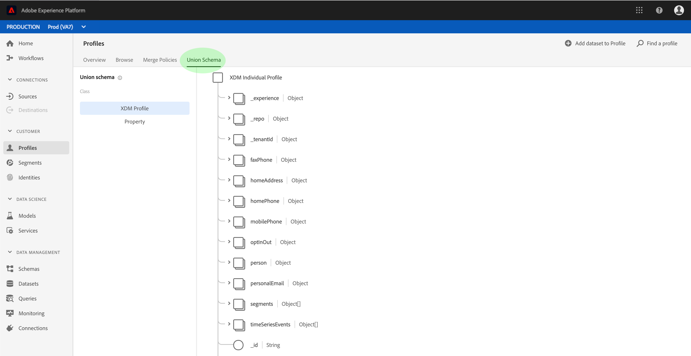

# Guide de l’utilisateur  des clients en temps réel

Le profil client en temps réel offre une vue d’ensemble de chaque client en combinant des données issues de plusieurs canaux, notamment des données en ligne, hors ligne, GRC et tierces.

Ce sert de guide pour l’interaction avec le client en temps réel  dans l’interface utilisateur d’Adobe Experience Platform.

## Prise en main

Ce guide d’utilisation nécessite une compréhension des différents services de la plateforme d’expérience impliqués dans la gestion des  de clients en temps réel. Avant de lire ce guide d’utilisation, veuillez consulter la documentation des services suivants :

* du client en temps réel : Fournit un client en temps réel unifié basé sur des données agrégées provenant de plusieurs sources.
* [Service](../../identity-service/home.md)d&#39;identité : Permet d’activer les  de clients en temps réel en rapprochant les identités des sources de données disparates qui sont assimilées dans la plateforme.
* [Modèle de données d’expérience (XDM)](../../xdm/home.md): Cadre normalisé selon lequel la plateforme organise les données d’expérience client.

## Présentation du profil

Dans l’interface utilisateur [de la plateforme](http://platform.adobe.com)d’expérience, cliquez sur **de**_dans le volet de navigation de gauche pour ouvrir l’onglet_ Aperçu _dans l’espace de travail du._ Cet onglet affiche plusieurs widgets qui fournissent des informations de haut niveau sur le magasin de  de, notamment le nombre total d’adressables, le nombre d’enregistrements dela semaine écoulée et les statistiques concernant les enregistrements réussis et ayant échoué pour la même période.

##  d’exemples 

Cliquez sur **Parcourir** pour  un exemple de de l’ del’ disponible. Cet exemple inclut jusqu’à 50  de votre nombre total de . Les exemples sont actualisés par une tâche automatique qui sélectionne de nouvelles données de lors de leur assimilation. Chaque répertorié affiche son ID, son prénom, son nom et son adresse électronique personnelle. Un clic sur l’ID d’un répertorié  affiche ses détails dans le lecteur de  de .

Vous pouvez personnaliser les attributs affichés dans le  en cliquant sur l’icône du sélecteur de colonnes. Vous affichez ainsi un déroulant contenant des attributs  de courants que vous pouvez ajouter ou supprimer.

### Nombre de {#profile-count}

Le nombre de  de votre organisation affiche le nombre total de  votre organisation dans la plateforme d’expérience, une fois que la stratégie de fusion par défaut de votre organisation a fusionné des fragments deformulaire pour former un seul et même pour chaque client. En d’autres termes, votre entreprise peut avoir plusieurs fragments de  de liés à un client unique qui interagit avec votre marque sur différents  de votre, mais ces fragments sont fusionnés ensemble (selon la stratégie de fusion par défaut) et renvoient un nombre de &quot;1&quot;  car ils sont tous liés à la même personne.

Le nombre de  inclut également des  de avec des attributs (données d’enregistrement) ainsi que des  (par exemple, le d’Adobe Analytics) contenant uniquement des données de série chronologique (de données). Le décompte est régulièrement actualisé afin de fournir un nombre total actualisé de  dans la plateforme. Chaque fois qu’une ingestion de  augmente ou diminue le nombre de plus de 5 %, une tâche est automatiquement déclenchée pour mettre à jour le nombre. Si votre entreprise utilise l’assimilation en flux continu, les tâches sont planifiées pour s’exécuter toutes les heures afin de récupérer les données nouvellement assimilées.

### de recherche

Si vous connaissez une identité liée pour un  particulier (comme son adresse électronique), vous pouvez rechercher ce  en cliquant sur **Rechercher un**. Il s’agit de la manière la plus fiable d’accéder à un  spécifique, qu’il apparaisse dans le des échantillons.

Dans la boîte de dialogue qui s’affiche, sélectionnez un ID   approprié dans le déroulant  (&quot;Courriel&quot; dans cet exemple) et saisissez la valeur d’ID ci-dessous avant de cliquer sur **OK**. S’il est trouvé, les détails du ciblé s’affichent dans le lecteur de  de, comme décrit dans la section suivante.

### Visionneuse de profils {#profile-viewer}

Lors de la sélection ou de la recherche d’un  de spécifique, l’écran _Détails_ de la visionneuse de  de s’affiche. Cette page affiche des informations sur le  de sélectionné, telles que les attributs de base de l’, les identités liées et les  de contact disponibles. Les informations de  affichées ont été fusionnées à partir de plusieurs fragments de  afin de former un seul et unique  du client individuel.

Le lecteur de  de fournit également des onglets qui vous permettent de des  et de segmenter les abonnements associés à ce, le cas échéant.

## Stratégies de fusion

Cliquez sur **Fusionner les stratégies** pour  un de stratégies de fusion appartenant à votre organisation. Chaque stratégie répertoriée affiche son nom, qu’il s’agisse ou non de la stratégie de fusion par défaut et du  auquel elle s’applique.

Pour plus d’informations sur l’utilisation des stratégies de fusion dans l’interface utilisateur, consultez le guide [d’utilisation des stratégies de](merge-policies.md)fusion.

##   

Cliquez sur **** pourle dede l’de la banque de données de votre. Un   est une fusion de tous les champs de modèle de données d’expérience (XDM) de la même classe, dont les ont été activés pour une utilisation dans le de clients en temps réel. Cliquez sur une classe dans le de gauche pour  la structure de son  dedela trame.

Pour plus d&#39;informations sur le  et son rôle dans le de clients en temps réel, reportez-vous à la section sur   dans le guidede composition du.

## Étapes suivantes

En lisant ce guide, vous savez maintenant comment et gérer vos données  à l’aide de l’interface utilisateur de la plateforme d’expérience. Pour plus d’informations sur la manière d’exploiter les données en temps réel des clients pour générer  segments de, reportez-vous à la documentation [sur la](../../segmentation/home.md)segmentation.