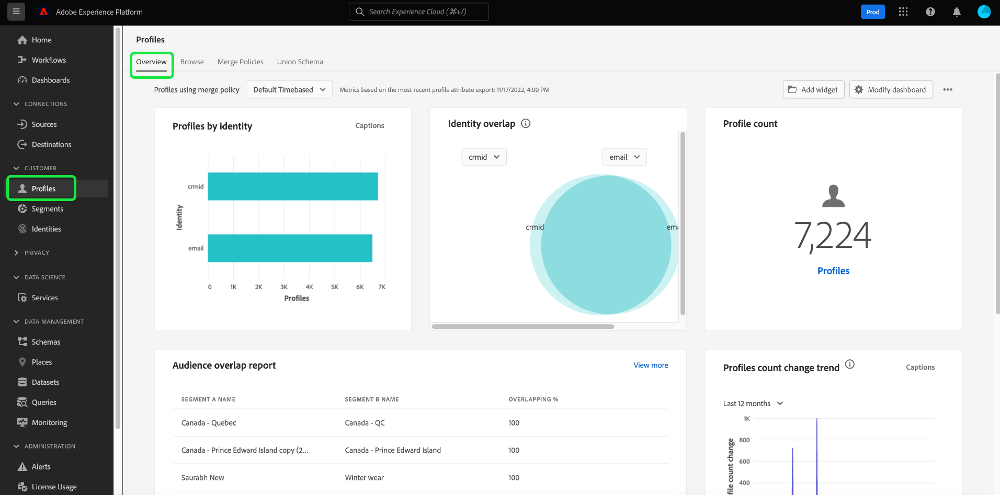

# Guide de l’interface utilisateur de [!DNL Real-Time Customer Profile]

[!DNL Real-Time Customer Profile] crée une vue d’ensemble de chacun de vos clients, en combinant des données provenant de plusieurs canaux, y compris des données en ligne, hors ligne, CRM et tierces. Ce document sert de guide pour interagir avec les données [!DNL Real-Time Customer Profile] dans l’interface utilisateur de Adobe Experience Platform.

## Commencer

Ce guide de l’interface utilisateur nécessite une compréhension des différents services [!DNL Experience Platform] impliqués dans la gestion de [!DNL Real-Time Customer Profiles]. Avant de lire ce guide ou de travailler dans l’interface utilisateur, consultez la documentation relative aux services suivants :

* [[!DNL Real-Time Customer Profile] overview](../home.md) : fournit un profil client en temps réel unifié basé sur des données agrégées provenant de plusieurs sources.
* [[!DNL Identity Service]](../../identity-service/home.md) : active [!DNL Real-Time Customer Profile] en rapprochant des identités de sources de données disparates lors de leur ingestion dans [!DNL Platform].
* [[!DNL Experience Data Model (XDM)]](../../xdm/home.md) : cadre normalisé selon lequel [!DNL Platform] organise les données de l’expérience client.

## [!UICONTROL Vue d’ensemble]

Dans l’interface utilisateur de l’Experience Platform, sélectionnez **[!UICONTROL Profils]** dans le volet de navigation de gauche pour ouvrir l’onglet **[!UICONTROL Aperçu]** affichant le tableau de bord du profil.

>[!NOTE]
>
>Si votre organisation est une nouvelle entreprise de Platform et qu’elle ne dispose pas encore de jeux de données de profil actifs ni de stratégies de fusion créés, le tableau de bord [!UICONTROL Profils] n’est pas visible. À la place, l’onglet [!UICONTROL Aperçu] affiche des liens et de la documentation pour vous aider à prendre en main Real-time Customer Profile.

### Tableau de bord du profil {#profile-dashboard}

Le tableau de bord du profil décrit les mesures clés liées aux données de profil de votre entreprise.

Pour en savoir plus, consultez le [guide de tableau de bord de profil](../../dashboards/guides/profiles.md).

## Mesures des onglets [!UICONTROL Parcourir]

Sélectionnez l’onglet **[!UICONTROL Parcourir]** pour afficher plusieurs mesures liées aux données de profil de votre entreprise. Vous pouvez également utiliser cet onglet pour parcourir la banque de profils à l’aide d’une stratégie de fusion ou d’une identité, comme indiqué dans la section suivante de ce guide.

Sur le côté droit de l&#39;onglet **[!UICONTROL Parcourir]** se trouve le [nombre de profils](#profile-count) ainsi qu&#39;une liste de [profils par espace de noms](#profiles-by-namespace).

>[!NOTE]
>
>Ces mesures de profil peuvent différer des mesures affichées sur le [tableau de bord du profil](#profile-dashboard), car elles sont évaluées à l’aide de la stratégie de fusion par défaut de votre organisation. Pour plus d’informations sur l’utilisation des stratégies de fusion, y compris sur la définition d’une stratégie de fusion par défaut, consultez la [présentation des stratégies de fusion](../merge-policies/overview.md).

Outre ces mesures, cette section fournit une date et une heure de dernière mise à jour, indiquant le moment où les mesures ont été évaluées pour la dernière fois.

### Nombre de profils {#profile-count}

Le nombre de profils affiche le nombre total de profils de votre organisation dans Experience Platform, une fois que la politique de fusion par défaut de votre organisation a fusionné des fragments de profil afin de former un seul et même profil pour chaque client. En d’autres termes, votre organisation peut disposer de plusieurs fragments de profil liés à un seul client qui interagit avec votre marque sur différents canaux, mais ces fragments sont fusionnés (selon la politique de fusion par défaut) et renvoient le nombre de profils « 1 », car ils sont tous liés à la même personne.

Le nombre de profils inclut également les profils avec des attributs (données d’enregistrement) ainsi que les profils contenant uniquement des données de série temporelle (événement), tels que les profils Adobe Analytics. Le nombre de profils est régulièrement actualisé afin de fournir un nombre total de profils à jour dans Platform.

#### Mise à jour de la mesure de comptage des profils

Lorsque l’ingestion d’enregistrements dans la boutique [!DNL Profile] augmente ou réduit le nombre de plus de 5 %, une tâche est déclenchée pour mettre à jour le nombre. Pour les workflows de données en flux continu, une vérification est effectuée sur une base horaire afin de déterminer si le seuil de 5 % d’augmentation ou de diminution a été atteint. Si tel est le cas, une tâche est automatiquement déclenchée pour mettre à jour le nombre de profils. Pour l’ingestion par lots, dans les 15 minutes suivant l’ingestion réussie d’un lot dans la banque de profils, si le seuil de 5 % d’augmentation ou de diminution est atteint, une tâche est exécutée pour mettre à jour le nombre de profils.

### [!UICONTROL  Profils par espace de noms] {#profiles-by-namespace}

La mesure **[!UICONTROL Profils par espace de noms]** affiche le nombre total et la ventilation des espaces de noms sur tous les profils fusionnés de votre banque de profils. Le nombre total de profils par espace de noms (c’est-à-dire en additionnant les valeurs affichées pour chaque espace de noms) sera toujours supérieur à la mesure du nombre de profils, car plusieurs espaces de noms peuvent y être associés. Par exemple, si un client interagit avec votre marque sur plusieurs canaux, plusieurs espaces de noms seront associés à ce client individuel.

#### Mise à jour de la mesure [!UICONTROL Profils par espace de noms]

Tout comme la mesure [ profile count](#profile-count) , lorsque l’ingestion d’enregistrements dans la boutique [!DNL Profile] augmente ou diminue le nombre de plus de 5 %, une tâche est déclenchée pour mettre à jour les mesures d’espace de noms. Pour les workflows de données en flux continu, une vérification est effectuée sur une base horaire afin de déterminer si le seuil de 5 % d’augmentation ou de diminution a été atteint. Si tel est le cas, une tâche est automatiquement déclenchée pour mettre à jour le nombre de profils. Pour l’ingestion par lots, dans les 15 minutes suivant l’ingestion réussie d’un lot dans le magasin [!DNL Profile], si le seuil de 5 % d’augmentation ou de diminution est atteint, une tâche est exécutée pour mettre à jour les mesures.

## Utilisez l’onglet [!UICONTROL Parcourir] pour afficher les profils

Dans l’onglet **[!UICONTROL Parcourir]** , vous pouvez afficher des exemples de profils à l’aide d’une stratégie de fusion ou rechercher des profils spécifiques à l’aide d’un espace de noms et d’une valeur d’identité.

### Parcourir par [!UICONTROL Stratégie de fusion]

Par défaut, l’onglet **[!UICONTROL Parcourir]** est défini sur la stratégie de fusion par défaut de votre organisation. Pour choisir une autre stratégie de fusion, sélectionnez le `X` en regard du nom de la stratégie de fusion, puis utilisez le sélecteur pour ouvrir la boîte de dialogue **[!UICONTROL Sélectionner la stratégie de fusion]**.

>[!NOTE]
>
>Si aucune stratégie de fusion n’est sélectionnée, utilisez le bouton de sélecteur en regard du champ **[!UICONTROL Stratégie de fusion]** pour ouvrir la boîte de dialogue de sélection.

Pour choisir une stratégie de fusion dans la boîte de dialogue **[!UICONTROL Sélectionner une stratégie de fusion]**, cliquez sur le bouton radio en regard du nom de la stratégie, puis utilisez **[!UICONTROL Sélectionner]** pour revenir à l’onglet [!UICONTROL Parcourir]. Vous pouvez ensuite sélectionner **[!UICONTROL Afficher]** pour actualiser les exemples de profils et voir un échantillon de profils auxquels la nouvelle stratégie de fusion est appliquée.

Les profils affichés représentent un échantillon de 20 profils au maximum de la banque de profils de votre entreprise, une fois la stratégie de fusion sélectionnée appliquée. Les exemples de profils pour la stratégie de fusion sélectionnée sont actualisés lorsque de nouvelles données sont ajoutées à la banque de profils de votre entreprise.

Pour afficher les détails de l’un des exemples de profils, sélectionnez l’ **[!UICONTROL ID de profil]**. Pour plus d’informations, reportez-vous à la section plus loin de ce guide sur l’ [affichage des détails du profil](#profile-detail).

Pour en savoir plus sur les stratégies de fusion et leur rôle dans Platform, consultez la [présentation des stratégies de fusion](../merge-policies/overview.md).

### Parcourir par [!UICONTROL Identity] {#browse-identity}

Dans l’onglet **[!UICONTROL Parcourir]**, vous pouvez utiliser un espace de noms d’identité afin de rechercher un profil spécifique par une valeur d’identité. Pour naviguer selon une identité, vous devez fournir une stratégie de fusion, un espace de noms d’identité et une valeur d’identité.

Si nécessaire, utilisez le sélecteur **[!UICONTROL Stratégie de fusion]** pour ouvrir la boîte de dialogue **[!UICONTROL Sélectionner une stratégie de fusion]** et sélectionnez la stratégie de fusion que vous souhaitez utiliser.

Utilisez ensuite le sélecteur **[!UICONTROL Identity namespace]** pour ouvrir la boîte de dialogue **[!UICONTROL Sélectionner l’espace de noms d’identité]** et choisissez l’espace de noms par lequel vous souhaitez effectuer une recherche. Si votre organisation dispose de nombreux espaces de noms, vous pouvez utiliser la barre de recherche dans la boîte de dialogue pour commencer à saisir le nom d’un espace de noms.

Vous pouvez sélectionner un espace de noms pour afficher des détails supplémentaires ou sélectionner le bouton radio pour choisir un espace de noms. Vous pouvez ensuite utiliser **[!UICONTROL Sélectionner]** pour continuer.

Après avoir sélectionné un [!UICONTROL espace de noms d’identité] et revenir à l’onglet [!UICONTROL Parcourir], vous pouvez saisir une **[!UICONTROL valeur d’identité]** associée à l’espace de noms que vous avez sélectionné.

>[!NOTE]
>
>Cette valeur est spécifique à un profil client individuel et doit être une entrée valide pour l’espace de noms fourni. Par exemple, la sélection de l’espace de noms d’identité &quot;E-mail&quot; nécessite une valeur d’identité sous la forme d’une adresse électronique valide.

Une fois qu’une valeur a été saisie, sélectionnez **[!UICONTROL Affichage]** et un seul profil correspondant à la valeur est renvoyé. Sélectionnez l’ **[!UICONTROL ID de profil]** pour afficher les détails du profil.

## Afficher les détails du profil {#profile-detail}

>[!CONTEXTUALHELP]
>id="platform_errors_uplib_201001_404"
>title="Entité introuvable"
>abstract="Cela signifie que Platform n’a pas pu trouver l’entité demandée. Pour résoudre cette erreur, essayez l’une des solutions suivantes :<ul><li>Assurez-vous que l’identifiant de profil correct est répertorié dans l’URL de l’entité à laquelle vous essayez d’accéder.</li><li>Assurez-vous que vous disposez de la combinaison deorganisation et de sandbox correcte pour l’entité à laquelle vous essayez d’accéder.</li></ul>"

Après avoir sélectionné un **[!UICONTROL ID de profil]**, l’onglet **[!UICONTROL Détail]** s’ouvre. Les informations de profil affichées dans l’onglet **[!UICONTROL Détail]** ont été fusionnées à partir de plusieurs fragments de profil pour former une vue unique de chaque client. Cela inclut les détails du client tels que les attributs de base, les identités liées et les préférences de canal.

Les champs par défaut affichés peuvent également être modifiés au niveau de l’organisation afin d’afficher les attributs de profil préférés. Pour en savoir plus sur la personnalisation de ces champs, y compris des instructions étape par étape pour ajouter et supprimer des attributs et redimensionner les panneaux du tableau de bord, consultez le [guide de personnalisation des détails du profil](profile-customization.md).

Vous pouvez également choisir de basculer entre l’affichage des noms d’attribut comme noms d’affichage et leur nom de chemin d’accès de champ. Pour basculer entre ces deux affichages, sélectionnez la bascule **[!UICONTROL Afficher les noms d’affichage]** .

Pour afficher des informations supplémentaires relatives au profil client individuel, sélectionnez l’un des autres onglets disponibles. Ces onglets comprennent les attributs, les événements et l’onglet abonnement à l’audience qui affiche les audiences pour lesquelles le profil est actuellement qualifié.

### Onglet Attributs

L’onglet **[!UICONTROL Attributs]** fournit une vue de liste résumant tous les attributs associés à un seul profil, une fois la stratégie de fusion spécifiée appliquée.

Ces attributs peuvent également être affichés sous la forme d’un objet JSON en sélectionnant **[!UICONTROL Afficher JSON]**. Cela s’avère utile pour les utilisateurs qui souhaitent mieux comprendre comment les attributs de profil sont ingérés dans Platform.

Pour afficher les attributs disponibles dans Edge, sélectionnez **[!UICONTROL Edge]** dans le sélecteur d’emplacement de données.

Pour plus d’informations sur les profils Edge, consultez la [documentation sur les profils Edge](../edge-profiles.md).

### Onglet Événements

L’onglet **[!UICONTROL Événements]** contient les données des 100 événements d’expérience les plus récents associés au client. Ces données peuvent inclure les ouvertures de courrier électronique, les activités de panier et les pages vues. La sélection de **[!UICONTROL Afficher tout]** pour chaque événement individuel fournit des champs et des valeurs supplémentaires capturés dans le cadre de l’événement.

Les événements peuvent également être visualisés en tant qu’objet JSON en sélectionnant **[!UICONTROL Afficher JSON]**. Cela s’avère utile pour comprendre comment les événements sont capturés dans Platform.

### Onglet abonnement à l’audience

L’onglet **[!UICONTROL Appartenance à une audience]** affiche une liste avec le nom et la description des audiences auxquelles le profil client individuel appartient actuellement. Cette liste est mise à jour automatiquement lorsque le profil est admissible ou expire à partir des audiences. Le nombre total d&#39;audiences pour lesquelles le profil est actuellement qualifié s&#39;affiche sur le côté droit de l&#39;onglet.

Pour plus d’informations sur la segmentation dans Experience Platform, reportez-vous à la [documentation d’Adobe Experience Platform Segmentation Service](../../segmentation/home.md).

Pour afficher l’appartenance à l’audience des profils disponibles dans Edge, sélectionnez **[!UICONTROL Edge]** dans le sélecteur d’emplacement de données. Vous trouverez plus d’informations sur la segmentation Edge dans le [guide de segmentation Edge](../../segmentation/ui/edge-segmentation.md).

## Politiques de fusion

Dans le menu principal **[!UICONTROL Profils]**, sélectionnez l’onglet **[!UICONTROL Stratégies de fusion]** pour afficher la liste des stratégies de fusion appartenant à votre organisation. Chaque stratégie répertoriée affiche son nom, qu’il s’agisse de la stratégie de fusion par défaut ou de la classe de schéma à laquelle elle s’applique.

Pour plus d’informations sur les politiques de fusion, consultez [Présentation des politiques de fusion](../merge-policies/overview.md).

## Schéma d’union {#union-schema}

Dans le menu principal **[!UICONTROL Profils]**, sélectionnez l’onglet **[!UICONTROL Schéma d’union]** pour afficher les schémas d’union disponibles pour vos données ingérées. Un schéma d’union est une fusion de tous les champs [!DNL Experience Data Model] (XDM) de la même classe, dont les schémas ont été activés pour une utilisation dans [!DNL Real-Time Customer Profile].

Pour plus d’informations sur les schémas d’union, consultez le [guide de l’interface utilisateur des schémas d’union](union-schema.md).

## Attributs calculés {#computed-attributes}

Dans le menu principal **[!UICONTROL Profils]**, sélectionnez l’onglet **[!UICONTROL Attributs calculés]** pour afficher la liste des attributs calculés qui appartiennent à votre organisation.

Pour plus d’informations sur les attributs calculés, consultez la [présentation des attributs calculés](../computed-attributes/overview.md). Pour plus d’informations sur l’utilisation des attributs calculés dans l’interface utilisateur de Platform, consultez le [guide de l’interface utilisateur des attributs calculés](../computed-attributes/ui.md).

## Étapes suivantes

En lisant ce guide, vous savez comment afficher et gérer les données de profil de votre entreprise à l’aide de l’interface utilisateur d’Experience Platform. Pour plus d’informations sur l’utilisation des données de profil à l’aide des API Experience Platform, reportez-vous au [guide de l’API Real-Time Customer Profile](../api/overview.md).
