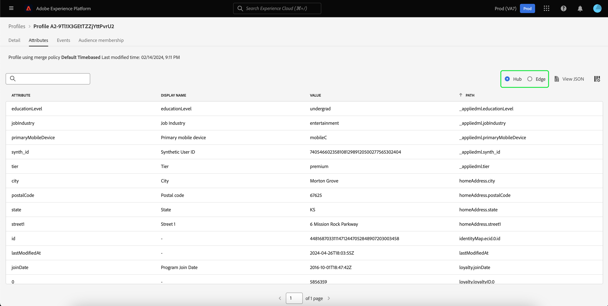

# Guide de l’interface utilisateur de [!DNL Real-Time Customer Profile]

[!DNL Real-Time Customer Profile] offre une vue d’ensemble de chaque client en combinant des données issues de plusieurs canaux, notamment des données en ligne, hors ligne, CRM et tierces. Ce document sert de guide pour interagir avec les données [!DNL Real-Time Customer Profile] dans l’interface utilisateur (IU) de Adobe Experience Platform.

## Commencer

Ce guide de l’interface utilisateur nécessite une compréhension des différents services de [!DNL Experience Platform] impliqués dans la gestion des [!DNL Real-Time Customer Profiles]. Avant de lire ce guide ou de travailler dans l’interface utilisateur, consultez la documentation relative aux services suivants :

* [[!DNL Real-Time Customer Profile] présentation ](../home.md) : fournit un profil client en temps réel unifié basé sur des données agrégées issues de plusieurs sources.
* [[!DNL Identity Service]](../../identity-service/home.md) : permet l’[!DNL Real-Time Customer Profile] en établissant un lien entre les identités de sources de données disparates lors de leur ingestion dans [!DNL Platform].
* [[!DNL Experience Data Model (XDM)]](../../xdm/home.md) : cadre normalisé selon lequel [!DNL Platform] organise les données de l’expérience client.

## [!UICONTROL Vue d’ensemble]

Dans l’interface utilisateur d’Experience Platform, sélectionnez **[!UICONTROL Profils]** dans le volet de navigation de gauche pour ouvrir l’onglet **[!UICONTROL Présentation]** qui affiche le tableau de bord des profils.

>[!NOTE]
>
>Si votre organisation débute sur Platform et n’a pas encore de jeux de données de profils actifs ou de politiques de fusion créés, le tableau de bord [!UICONTROL Profils] n’est pas visible. À la place, l’onglet [!UICONTROL Aperçu] affiche des liens et de la documentation pour vous aider à prendre en main le profil client en temps réel.

### Tableau de bord du profil {#profile-dashboard}

Le tableau de bord des profils décrit les mesures clés liées aux données de profil de votre organisation.

Pour en savoir plus, consultez le [guide du tableau de bord des profils](../../dashboards/guides/profiles.md).

## Mesures de l’onglet [!UICONTROL Parcourir]

Sélectionnez l’onglet **[!UICONTROL Parcourir]** pour afficher plusieurs mesures liées aux données de profil de votre organisation. Vous pouvez également utiliser cet onglet pour parcourir la banque de profils à l’aide d’une politique de fusion ou d’une identité, comme indiqué dans la section suivante de ce guide.

Sur le côté droit de l’onglet **[!UICONTROL Parcourir]** se trouve le [nombre de profils](#profile-count) ainsi qu’une liste des [profils par espace de noms](#profiles-by-namespace).

>[!NOTE]
>
>Ces mesures de profil peuvent différer des mesures affichées dans le [tableau de bord des profils](#profile-dashboard) car elles sont évaluées à l’aide de la politique de fusion par défaut de votre organisation. Pour plus d’informations sur l’utilisation des politiques de fusion, notamment sur la définition d’une politique de fusion par défaut, consultez la [ présentation des politiques de fusion ](../merge-policies/overview.md).

Outre ces mesures, cette section fournit une date et une heure de la dernière mise à jour, indiquant la date et l’heure de la dernière évaluation des mesures.

### Nombre de profils {#profile-count}

Le nombre de profils affiche le nombre total de profils de votre organisation dans Experience Platform, une fois que la politique de fusion par défaut de votre organisation a fusionné des fragments de profil afin de former un seul et même profil pour chaque client. En d’autres termes, votre organisation peut disposer de plusieurs fragments de profil liés à un seul client qui interagit avec votre marque sur différents canaux, mais ces fragments sont fusionnés (selon la politique de fusion par défaut) et renvoient le nombre de profils « 1 », car ils sont tous liés à la même personne.

Le nombre de profils inclut également les profils avec attributs (données d’enregistrement) ainsi que les profils contenant uniquement des données de série temporelle (événement), tels que les profils Adobe Analytics. Le nombre de profils est actualisé régulièrement afin de fournir un nombre total de profils à jour dans Platform.

#### Mise à jour de la mesure du nombre de profils

Lorsque l’ingestion d’enregistrements dans la boutique [!DNL Profile] augmente ou réduit le nombre de plus de 5 %, une tâche est déclenchée pour mettre à jour le nombre. Pour les workflows de données en flux continu, une vérification est effectuée toutes les heures afin de déterminer si le seuil d’augmentation ou de diminution de 5 % a été atteint. Si c’est le cas, une tâche est automatiquement déclenchée pour mettre à jour le nombre de profils. Pour l’ingestion par lots, dans les 15 minutes suivant l’ingestion réussie d’un lot dans la banque de profils, si le seuil d’augmentation ou de diminution de 5 % est atteint, une tâche est exécutée pour mettre à jour le nombre de profils.

### [!UICONTROL  Profils par espace de noms ] {#profiles-by-namespace}

La mesure **[!UICONTROL Profils par espace de noms]** affiche le nombre total et la répartition des espaces de noms sur tous les profils fusionnés de votre banque de profils. Le nombre total de profils par espace de noms (en d’autres termes, en additionnant les valeurs affichées pour chaque espace de noms) sera toujours supérieur à la mesure du nombre de profils, car plusieurs espaces de noms peuvent être associés à un profil. Par exemple, si un client interagit avec votre marque sur plusieurs canaux, plusieurs espaces de noms seront associés à ce client individuel.

#### Mise à jour de la mesure [!UICONTROL Profils par espace de noms]

De la même manière que pour la mesure [nombre de profils](#profile-count), lorsque l’ingestion d’enregistrements dans la banque de [!DNL Profile] augmente ou réduit le nombre de plus de 5 %, une tâche est déclenchée pour mettre à jour les mesures d’espace de noms. Pour les workflows de données en flux continu, une vérification est effectuée toutes les heures afin de déterminer si le seuil d’augmentation ou de diminution de 5 % a été atteint. Si c’est le cas, une tâche est automatiquement déclenchée pour mettre à jour le nombre de profils. Pour l’ingestion par lots, dans les 15 minutes suivant l’ingestion réussie d’un lot dans la boutique [!DNL Profile], si le seuil d’augmentation ou de diminution de 5 % est atteint, une tâche est exécutée pour mettre à jour les mesures.

## Utilisez l’onglet [!UICONTROL  Parcourir ] pour afficher les profils

Sur l’onglet **[!UICONTROL Parcourir]** vous pouvez afficher des profils types à l’aide d’une politique de fusion ou rechercher des profils spécifiques à l’aide d’un espace de noms d’identité et d’une valeur.

### Parcourir par [!UICONTROL politique de fusion]

L’onglet **[!UICONTROL Parcourir]** est défini sur la politique de fusion par défaut de votre organisation. Pour choisir une autre politique de fusion, sélectionnez la `X` à côté du nom de la politique de fusion, puis utilisez le sélecteur pour ouvrir la boîte de dialogue **[!UICONTROL Sélectionner la politique de fusion]**.

>[!NOTE]
>
>Si aucune politique de fusion n’est sélectionnée, utilisez le bouton de sélection situé en regard du champ **[!UICONTROL Politique de fusion]** pour ouvrir la boîte de dialogue de sélection.

Pour choisir une politique de fusion dans la boîte de dialogue **[!UICONTROL Sélectionner la politique de fusion]**, sélectionnez le bouton radio en regard du nom de la politique, puis utilisez **[!UICONTROL Sélectionner]** pour revenir à l’onglet [!UICONTROL Parcourir]. Vous pouvez ensuite sélectionner **[!UICONTROL Affichage]** pour actualiser les exemples de profils et afficher un échantillon de profils avec la nouvelle politique de fusion appliquée.

Les profils affichés représentent un échantillon de 20 profils maximum provenant de la banque de profils de votre organisation, après l’application de la politique de fusion sélectionnée. Les exemples de profils pour la politique de fusion sélectionnée sont actualisés lorsque de nouvelles données sont ajoutées au magasin de profils de votre organisation.

Pour afficher les détails de l’un des profils types, sélectionnez l’**[!UICONTROL Identifiant de profil]**. Pour plus d’informations, reportez-vous à la section suivante de ce guide sur l’[affichage des détails du profil](#profile-detail).

Pour en savoir plus sur les politiques de fusion et leur rôle dans Platform, consultez la [ présentation des politiques de fusion ](../merge-policies/overview.md).

### Parcourir par [!UICONTROL identité] {#browse-identity}

Dans l’onglet **[!UICONTROL Parcourir]**, vous pouvez utiliser un espace de noms d’identité pour rechercher un profil spécifique par une valeur d’identité. Pour naviguer en fonction d’une identité, vous devez fournir une politique de fusion, un espace de noms d’identité et une valeur d’identité.

Si nécessaire, utilisez le sélecteur **[!UICONTROL Politique de fusion]** pour ouvrir la boîte de dialogue **[!UICONTROL Sélectionner la politique de fusion]** et sélectionnez la politique de fusion à utiliser.

Utilisez ensuite le sélecteur **[!UICONTROL Espace de noms d’identité]** pour ouvrir la boîte de dialogue **[!UICONTROL Sélectionner un espace de noms d’identité]** et choisissez l’espace de noms selon lequel vous souhaitez effectuer une recherche. Si votre organisation dispose de nombreux espaces de noms, vous pouvez utiliser la barre de recherche de la boîte de dialogue pour commencer à saisir le nom d’un espace de noms.

Vous pouvez sélectionner un espace de noms pour afficher des détails supplémentaires ou sélectionner le bouton radio pour choisir un espace de noms. Vous pouvez ensuite utiliser **[!UICONTROL Sélectionner]** pour continuer.

Après avoir sélectionné un [!UICONTROL Espace de noms d’identité] et renvoyé à l’onglet [!UICONTROL Parcourir], vous pouvez saisir une **[!UICONTROL valeur d’identité]** liée à l’espace de noms que vous avez sélectionné.

>[!NOTE]
>
>Cette valeur est spécifique à un profil client individuel et doit être une entrée valide pour l’espace de noms fourni. Par exemple, la sélection de l’espace de noms d’identité « E-mail » nécessite une valeur d’identité sous la forme d’une adresse e-mail valide.

Une fois qu’une valeur a été saisie, sélectionnez **[!UICONTROL Afficher]** et un seul profil correspondant à la valeur est renvoyé. Sélectionnez l’**[!UICONTROL Identifiant de profil]** pour afficher les détails du profil.

## Afficher les détails du profil {#profile-detail}

>[!CONTEXTUALHELP]
>id="platform_errors_uplib_201001_404"
>title="Entité introuvable"
>abstract="Cela signifie que Platform n’a pas pu trouver l’entité demandée. Pour résoudre cette erreur, essayez l’une des solutions suivantes :<ul><li>Assurez-vous que l’identifiant de profil correct est répertorié dans l’URL de l’entité à laquelle vous essayez d’accéder.</li><li>Assurez-vous que vous disposez de la combinaison deorganisation et de sandbox correcte pour l’entité à laquelle vous essayez d’accéder.</li></ul>"

Après avoir sélectionné un **[!UICONTROL Identifiant de profil]**, l’onglet **[!UICONTROL Détail]** s’ouvre. Les informations de profil affichées dans l’onglet **[!UICONTROL Détail]** ont été fusionnées à partir de plusieurs fragments de profil afin de former une vue unique du client individuel. Cela inclut les détails du client tels que les attributs de base, les identités liées et les préférences de canal.

Les champs par défaut affichés peuvent également être modifiés au niveau de l’organisation afin d’afficher les attributs de profil préférés. Pour en savoir plus sur la personnalisation de ces champs, y compris les instructions détaillées sur l’ajout et la suppression d’attributs et le redimensionnement des panneaux du tableau de bord, consultez le [guide de personnalisation des détails du profil](profile-customization.md).

Vous pouvez également choisir d’afficher ou non les noms des attributs sous forme de noms d’affichage et de chemins d’accès aux champs. Pour basculer entre ces deux affichages, activez le bouton (bascule) **[!UICONTROL Afficher les noms d’affichage]**.

Pour afficher des informations supplémentaires relatives au profil client individuel, sélectionnez l’un des autres onglets disponibles. Ces onglets comprennent les attributs, les événements et l’onglet appartenance à l’audience qui affiche les audiences pour lesquelles le profil est actuellement qualifié.

### Onglet Attributs

L’onglet **[!UICONTROL Attributs]** fournit une vue de liste résumant tous les attributs liés à un seul profil, après l’application de la politique de fusion spécifiée.

Ces attributs peuvent également être affichés en tant qu’objet JSON en sélectionnant **[!UICONTROL Afficher JSON]**. Cela s’avère utile pour les utilisateurs et utilisatrices qui souhaitent mieux comprendre comment les attributs de profil sont ingérés dans Platform.

Pour afficher les attributs disponibles dans Edge, sélectionnez **[!UICONTROL Edge]** dans le sélecteur d’emplacement des données.

Pour plus d’informations sur les profils Edge, veuillez lire la [documentation des profils Edge](../edge-profiles.md).

### Onglet Événements

L’onglet **[!UICONTROL Événements]** contient des données provenant des 100 ExperienceEvents les plus récents associés au client ou à la cliente. Ces données peuvent inclure les ouvertures d’e-mail, les activités de panier et les pages vues. La sélection de l’option **[!UICONTROL Afficher tout]** pour un événement individuel fournit des champs supplémentaires et des valeurs capturées dans le cadre de l’événement.

Les événements peuvent également être affichés en tant qu’objet JSON en sélectionnant **[!UICONTROL Afficher JSON]**. Cela permet de comprendre comment les événements sont capturés dans Platform.

### Onglet Appartenance à une audience

L’onglet **[!UICONTROL Appartenance à une audience]** affiche une liste avec le nom et la description des audiences auxquelles le profil client individuel appartient actuellement. Cette liste est automatiquement mise à jour lorsque le profil est admissible pour les audiences ou arrive à expiration. Le nombre total d’audiences pour lesquelles le profil est actuellement qualifié s’affiche sur le côté droit de l’onglet.

Pour plus d’informations sur la segmentation dans Experience Platform, reportez-vous à la [documentation du service de segmentation d’Adobe Experience Platform](../../segmentation/home.md).

Pour afficher l’appartenance à l’audience des profils disponibles sur Edge, sélectionnez **[!UICONTROL Edge]** dans le sélecteur d’emplacement des données. Vous trouverez plus d’informations sur la segmentation Edge dans le [guide de segmentation Edge](../../segmentation/methods/edge-segmentation.md).

## Politiques de fusion

Dans le menu principal **[!UICONTROL Profils]**, sélectionnez l’onglet **[!UICONTROL Politiques de fusion]** pour afficher une liste des politiques de fusion appartenant à votre organisation. Chaque politique répertoriée affiche son nom, qu’il s’agisse de la politique de fusion par défaut ou non, ainsi que la classe de schéma à laquelle elle s’applique.

Pour plus d’informations sur les politiques de fusion, consultez [Présentation des politiques de fusion](../merge-policies/overview.md).

## Schéma d’union {#union-schema}

Dans le menu principal **[!UICONTROL Profils]**, sélectionnez l’onglet **[!UICONTROL Schéma d’union]** pour afficher les schémas d’union disponibles pour vos données ingérées. Un schéma d’union est une fusion de tous les champs [!DNL Experience Data Model] (XDM) sous la même classe, dont les schémas ont été activés pour une utilisation dans [!DNL Real-Time Customer Profile].

Pour plus d’informations sur les schémas d’union, consultez le [guide de l’interface utilisateur des schémas d’union](union-schema.md).

## Attributs calculés {#computed-attributes}

Dans le menu principal **[!UICONTROL Profils]**, sélectionnez l’onglet **[!UICONTROL Attributs calculés]** pour afficher une liste des attributs calculés appartenant à votre organisation.

Pour plus d’informations sur les attributs calculés, consultez la [présentation des attributs calculés](../computed-attributes/overview.md). Pour plus d’informations sur l’utilisation des attributs calculés dans l’interface utilisateur de Platform, consultez le [guide de l’interface utilisateur des attributs calculés](../computed-attributes/ui.md).

## Étapes suivantes

En lisant ce guide, vous savez comment afficher et gérer les données de profil de votre organisation à l’aide de l’interface utilisateur d’Experience Platform. Pour plus d’informations sur l’utilisation des données de profil à l’aide des API Experience Platform, reportez-vous au guide [Real-time Customer Profile API guide](../api/overview.md).
