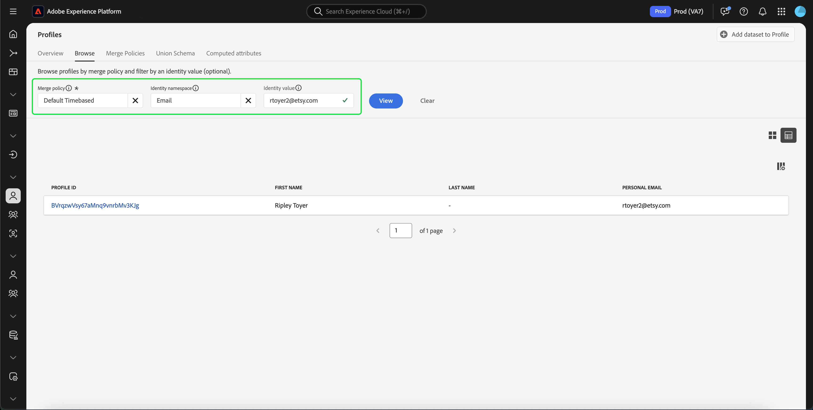

# Guide de l’interface utilisateur de [!DNL Real-Time Customer Profile]

[!DNL Real-Time Customer Profile] offre une vue d’ensemble de chaque client en combinant des données issues de plusieurs canaux, notamment des données en ligne, hors ligne, CRM et tierces. Ce document sert de guide pour interagir avec les données [!DNL Real-Time Customer Profile] dans l’interface utilisateur (IU) de Adobe Experience Platform.

## Prise en main

Ce guide de l’interface utilisateur nécessite une compréhension des différents services de [!DNL Experience Platform] impliqués dans la gestion des [!DNL Real-Time Customer Profiles]. Avant de lire ce guide ou de travailler dans l’interface utilisateur, consultez la documentation relative aux services suivants :

* [[!DNL Real-Time Customer Profile] présentation &#x200B;](../home.md) : fournit un profil client en temps réel unifié basé sur des données agrégées issues de plusieurs sources.
* [[!DNL Identity Service]](../../identity-service/home.md) : permet l’[!DNL Real-Time Customer Profile] en établissant un lien entre les identités de sources de données disparates lors de leur ingestion dans [!DNL Experience Platform].
* [[!DNL Experience Data Model (XDM)]](../../xdm/home.md) : cadre normalisé selon lequel [!DNL Experience Platform] organise les données de l’expérience client.

## [!UICONTROL Overview]

Dans l’interface utilisateur d’Experience Platform, sélectionnez **[!UICONTROL Profiles]** dans le volet de navigation de gauche pour ouvrir l’onglet **[!UICONTROL Overview]** affichant le tableau de bord des profils.

>[!NOTE]
>
>Si votre organisation débute avec Experience Platform et n’a pas encore de jeux de données de profils actifs ou de politiques de fusion créés, le tableau de bord [!UICONTROL Profiles] n’est pas visible. À la place, l’onglet [!UICONTROL Overview] affiche des liens et de la documentation pour vous aider à prendre en main le profil client en temps réel.

### Tableau de bord du profil {#profile-dashboard}

Le tableau de bord des profils décrit les mesures clés liées aux données de profil de votre organisation.

Pour en savoir plus, consultez le [guide du tableau de bord des profils](../../dashboards/guides/profiles.md).

## onglet [!UICONTROL Browse]

Dans l’onglet **[!UICONTROL Browse]** , vous pouvez afficher vos profils dans une vue **carte** ou **graphique** en cliquant sur le bouton (bascule).

De plus, vous pouvez parcourir vos profils à l’aide d’une politique de fusion ou rechercher des profils spécifiques à l’aide d’un espace de noms d’identité et d’une valeur.

### Parcourir par [!UICONTROL Merge policy]

L’onglet **[!UICONTROL Browse]** est défini sur la politique de fusion par défaut de votre organisation. Pour choisir une autre politique de fusion, sélectionnez la `X` à côté du nom de la politique de fusion, puis utilisez le sélecteur pour ouvrir la boîte de dialogue de **[!UICONTROL Select merge policy]**.

>[!NOTE]
>
>Si aucune politique de fusion n’est sélectionnée, utilisez le bouton de sélection situé en regard du champ **[!UICONTROL Merge policy]** pour ouvrir la boîte de dialogue de sélection.

Pour choisir une politique de fusion dans la boîte de dialogue **[!UICONTROL Select merge policy]**, sélectionnez le bouton radio à côté du nom de la politique, puis utilisez **[!UICONTROL Select]** pour revenir à l’onglet [!UICONTROL Browse] . Vous pouvez ensuite sélectionner **[!UICONTROL View]** pour actualiser les exemples de profils et afficher un échantillon de profils avec la nouvelle politique de fusion appliquée.

Les profils affichés représentent un échantillon de 20 profils maximum provenant de la banque de profils de votre organisation, après l’application de la politique de fusion sélectionnée. Les exemples de profils pour la politique de fusion sélectionnée sont actualisés lorsque de nouvelles données sont ajoutées au magasin de profils de votre organisation.

Pour afficher les détails de l’un des profils types, sélectionnez l’**[!UICONTROL Profile ID]**. Pour plus d’informations, reportez-vous à la section suivante de ce guide sur l’[affichage des détails du profil](#profile-detail).

Pour en savoir plus sur les politiques de fusion et leur rôle dans Experience Platform, consultez la [&#x200B; présentation des politiques de fusion &#x200B;](../merge-policies/overview.md).

### Parcourir par [!UICONTROL Identity] {#browse-identity}

Sur l’onglet **[!UICONTROL Browse]** , vous pouvez utiliser un espace de noms d’identité pour rechercher un profil spécifique par une valeur d’identité. Pour naviguer en fonction d’une identité, vous devez fournir une politique de fusion, un espace de noms d’identité et une valeur d’identité.

Si nécessaire, utilisez le sélecteur de **[!UICONTROL Merge policy]** pour ouvrir la boîte de dialogue **[!UICONTROL Select merge policy]** et sélectionnez la politique de fusion à utiliser.

Utilisez ensuite le sélecteur de **[!UICONTROL Identity namespace]** pour ouvrir la boîte de dialogue **[!UICONTROL Select identity namespace]** et choisissez l’espace de noms selon lequel vous souhaitez effectuer une recherche. Si votre organisation dispose de nombreux espaces de noms, vous pouvez utiliser la barre de recherche de la boîte de dialogue pour commencer à saisir le nom d’un espace de noms.

Vous pouvez sélectionner un espace de noms pour afficher des détails supplémentaires ou sélectionner le bouton radio pour choisir un espace de noms. Vous pouvez ensuite utiliser **[!UICONTROL Select]** pour continuer.

Après avoir sélectionné un [!UICONTROL Identity namespace] et renvoyé à l’onglet [!UICONTROL Browse] , vous pouvez saisir un **[!UICONTROL Identity value]** associé à l’espace de noms que vous avez sélectionné.

>[!NOTE]
>
>Cette valeur est spécifique à un profil client individuel et doit être une entrée valide pour l’espace de noms fourni. Par exemple, la sélection de l’espace de noms d’identité « E-mail » nécessite une valeur d’identité sous la forme d’une adresse e-mail valide.

Une fois qu’une valeur a été saisie, sélectionnez **[!UICONTROL View]** et un seul profil correspondant à la valeur est renvoyé. Sélectionnez la **[!UICONTROL Profile ID]** pour afficher un profil.

## Afficher le profil {#view-profile}

>[!CONTEXTUALHELP]
>id="platform_errors_uplib_201001_404"
>title="Entité introuvable"
>abstract="Cela signifie qu’Experience Platform n’a pas pu trouver l’entité demandée. Pour résoudre cette erreur, essayez l’une des solutions suivantes :<ul><li>Assurez-vous que l’identifiant de profil correct est répertorié dans l’URL de l’entité à laquelle vous essayez d’accéder.</li><li>Assurez-vous que vous disposez de la combinaison deorganisation et de sandbox correcte pour l’entité à laquelle vous essayez d’accéder.</li></ul>"

Après avoir sélectionné un **[!UICONTROL Profile ID]**, l’onglet **[!UICONTROL Detail]** s’ouvre. Les informations de profil affichées dans l’onglet **[!UICONTROL Detail]** ont été fusionnées à partir de plusieurs fragments de profil afin de former une vue unique de chaque client. Cela inclut les détails du client tels que les attributs de base, les identités liées et les préférences de canal.

En outre, vous pouvez afficher d’autres détails sur les profils, tels que ses [attributs](#attributes), [événements](#events) et [appartenance à l’audience](#audience-membership).

### Onglet Détails {#profile-detail}

L’onglet **[!UICONTROL Details]** fournit des informations plus détaillées sur le profil sélectionné et est divisé en quatre sections : informations sur le profil client, widgets AI insight, widgets personnalisables et widgets auto-classés.

De plus, vous pouvez activer ou désactiver l’affichage des informations générées par l’IA, afficher les détails de hub par rapport à edge et afficher les détails dans la vue graphique.

#### Informations du profil client {#customer-profile-insights}

La section **[!UICONTROL Customer profile insights]** présente brièvement les attributs du profil. Cela inclut l’identifiant du profil, l’adresse e-mail, le numéro de téléphone, le sexe, la date de naissance, ainsi que les identités et les appartenances à l’audience du profil.

#### Widgets d’informations d’IA {#ai-insight-widgets}

>[!IMPORTANT]
>
>Si vous êtes un client de Healthcare Shield, vous ne pourrez **pas** utiliser les widgets AI insight.

La section **[!UICONTROL AI insight widgets]** affiche les widgets générés par l’IA. Ces widgets fournissent des informations rapides sur le profil, en fonction des données du profil, y compris les données démographiques (telles que l’âge, le sexe ou le lieu), les comportements d’utilisateur (tels que l’historique des achats, l’activité du site web ou l’engagement sur les médias sociaux), ainsi que les données psychographiques (tels que les intérêts, les préférences ou les choix de style de vie). Tous les widgets d’IA utilisent des données qui **existent déjà** dans le profil.

#### Widgets personnalisables {#customizable-widgets}

La section **[!UICONTROL Customizable widgets]** affiche des widgets que vous pouvez personnaliser en fonction des besoins de votre entreprise. Vous pouvez regrouper les attributs dans des widgets distincts, supprimer les widgets indésirables ou ajuster la disposition des widgets.

Les champs par défaut affichés peuvent également être modifiés au niveau de l’organisation afin d’afficher les attributs de profil préférés. Pour en savoir plus sur la personnalisation de ces champs, y compris les instructions détaillées sur l’ajout et la suppression d’attributs et le redimensionnement des panneaux du tableau de bord, consultez le [guide de personnalisation des détails du profil](profile-customization.md).

Vous pouvez également choisir d’afficher ou non les noms des attributs sous forme de noms d’affichage et de chemins d’accès aux champs. Pour basculer entre ces deux affichages, sélectionnez le bouton (bascule) **[!UICONTROL Show display names]**.

#### Widgets classés automatiquement {#auto-classified-widgets}

La section **[!UICONTROL Auto-classified widgets]** affiche des widgets qui exploitent le schéma d’union pour déterminer les groupes de champs sources auxquels appartient un attribut, fournissant ainsi un contexte plus clair sur l’origine des données. Vous pouvez utiliser la barre de recherche pour rechercher plus facilement des mots-clés dans vos widgets.

Ces widgets combinent les données d’événement (avec le widget Événements d’expérience) et les données d’attribut, ce qui vous permet d’avoir une vue unifiée de votre profil. Vous pouvez utiliser ces widgets pour explorer la structure des données de votre profil afin de mieux structurer vos [&#x200B; widgets personnalisables &#x200B;](#customizable-widgets).

>[!NOTE]
>
>S’il existe plusieurs groupes de champs source, les widgets n’utilisent que **une** des options disponibles.

### Onglet Attributs {#attributes}

L’onglet **[!UICONTROL Attributes]** fournit une vue Liste résumant tous les attributs liés à un seul profil, après l’application de la politique de fusion spécifiée.

Ces attributs peuvent également être affichés en tant qu’objet JSON en sélectionnant pour **[!UICONTROL View JSON]**. Cela s’avère utile pour les utilisateurs et utilisatrices qui souhaitent mieux comprendre comment les attributs de profil sont ingérés dans Experience Platform.

Pour afficher les attributs disponibles dans Edge, sélectionnez **[!UICONTROL Edge]** dans le sélecteur d’emplacement des données.

Pour plus d’informations sur les profils Edge, veuillez lire la [documentation des profils Edge](../edge-profiles.md).

### Onglet Événements {#events}

L’onglet **[!UICONTROL Events]** contient les données des 100 ExperienceEvent les plus récents associés au client. Ces données peuvent inclure les ouvertures d’e-mail, les activités de panier et les pages vues. La sélection de **[!UICONTROL View all]** pour un événement individuel fournit des champs supplémentaires et des valeurs capturées dans le cadre de l’événement.

Les événements peuvent également être affichés en tant qu’objet JSON en sélectionnant pour **[!UICONTROL View JSON]**. Cela permet de comprendre comment les événements sont capturés dans Experience Platform.

### Onglet Appartenance à une audience {#audience-membership}

L’onglet **[!UICONTROL Audience membership]** affiche une liste avec le nom et la description des audiences auxquelles le profil client individuel appartient actuellement. Cette liste est automatiquement mise à jour lorsque le profil est admissible pour les audiences ou arrive à expiration. Le nombre total d’audiences pour lesquelles le profil est actuellement qualifié s’affiche sur le côté droit de l’onglet.

Pour plus d’informations sur la segmentation dans Experience Platform, reportez-vous à la [documentation du service de segmentation d’Adobe Experience Platform](../../segmentation/home.md).

Pour afficher l’appartenance à l’audience des profils disponibles sur Edge, sélectionnez **[!UICONTROL Edge]** dans le sélecteur d’emplacement des données. Vous trouverez plus d’informations sur la segmentation Edge dans le [guide de segmentation Edge](../../segmentation/methods/edge-segmentation.md).

## Politiques de fusion

Dans le menu **[!UICONTROL Profiles]** principal, sélectionnez l’onglet **[!UICONTROL Merge Policies]** pour afficher la liste des politiques de fusion appartenant à votre organisation. Chaque politique répertoriée affiche son nom, qu’il s’agisse de la politique de fusion par défaut ou non, ainsi que la classe de schéma à laquelle elle s’applique.

Pour plus d’informations sur les politiques de fusion, consultez [Présentation des politiques de fusion](../merge-policies/overview.md).

## Schéma d’union {#union-schema}

Dans le menu **[!UICONTROL Profiles]** principal, sélectionnez l’onglet **[!UICONTROL Union Schema]** pour afficher les schémas d’union disponibles pour vos données ingérées. Un schéma d’union est une fusion de tous les champs [!DNL Experience Data Model] (XDM) sous la même classe, dont les schémas ont été activés pour une utilisation dans [!DNL Real-Time Customer Profile].

Pour plus d’informations sur les schémas d’union, consultez le [guide de l’interface utilisateur des schémas d’union](union-schema.md).

## Attributs calculés {#computed-attributes}

Dans le menu **[!UICONTROL Profiles]** principal, sélectionnez l’onglet **[!UICONTROL Computed attributes]** pour afficher la liste des attributs calculés appartenant à votre organisation.

Pour plus d’informations sur les attributs calculés, consultez la [présentation des attributs calculés](../computed-attributes/overview.md). Pour plus d’informations sur l’utilisation des attributs calculés dans l’interface utilisateur d’Experience Platform, consultez le [&#x200B; guide de l’interface utilisateur des attributs calculés](../computed-attributes/ui.md).

## Étapes suivantes

En lisant ce guide, vous savez comment afficher et gérer les données de profil de votre organisation à l’aide de l’interface utilisateur d’Experience Platform. Pour plus d’informations sur l’utilisation des données de profil à l’aide des API Experience Platform, reportez-vous au guide [Real-time Customer Profile API guide](../api/overview.md).
