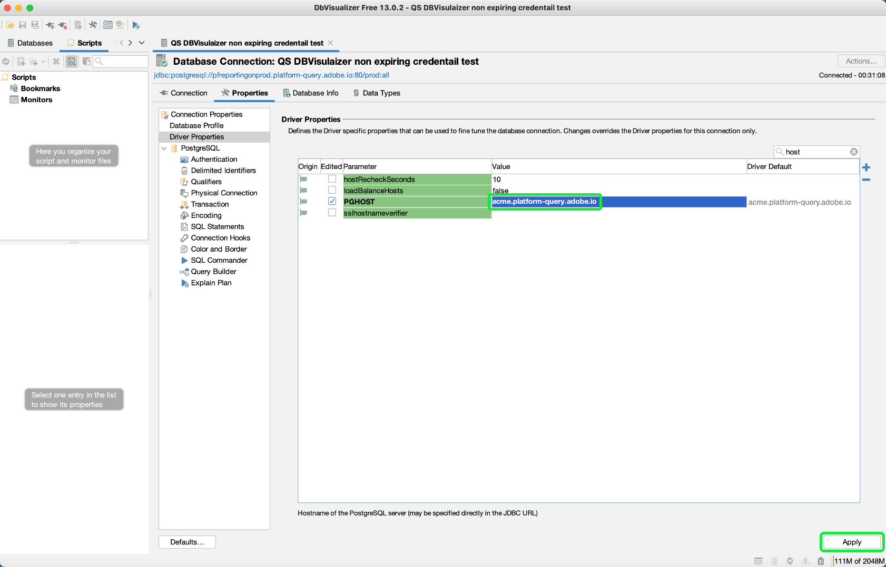

# Connexion [!DNL DbVisualizer] to [!DNL Query Service] {#connect-dbvisualizer}

Ce document décrit les étapes à suivre pour connecter la variable [!DNL DbVisualizer] outil de base de données avec Adobe Experience Platform [!DNL Query Service].

## Prise en main

Ce guide nécessite que vous ayez déjà accès à la fonction [!DNL DbVisualizer] de l’appli de bureau et connaissent comment naviguer dans son interface. Pour télécharger le [!DNL DbVisualizer] pour plus d’informations, voir [officiel [!DNL DbVisualizer] documentation](https://www.dbvis.com/download/).

>[!NOTE]
>
>Il y a [!DNL Windows], [!DNL macOS], et [!DNL Linux] versions de [!DNL DbVisualizer]. Les captures d’écran de ce guide ont été réalisées à l’aide de la méthode [!DNL macOS] application de bureau . Il peut y avoir des incohérences mineures dans l’interface utilisateur entre les versions.

Pour acquérir les informations d’identification nécessaires à la connexion [!DNL  DbVisualizer] pour Experience Platform, vous devez avoir accès à l’espace de travail Requêtes dans l’interface utilisateur de Platform. Contactez votre administrateur de l’organisation IMS si vous n’avez pas actuellement accès à l’espace de travail Requêtes .

## Création d’une connexion à une base de données {#connect-database}

Une fois que vous avez installé l’appli de bureau sur votre ordinateur local, démarrez l’application et sélectionnez **[!DNL Create a Database Connection]** à partir de la [!DNL DbVisualizer] . Sélectionnez **[!DNL Create a Connection]** dans le panneau situé à droite.

![Le [!DNL DbVisualizer] menu principal avec &quot;Créer une connexion à la base de données&quot; en surbrillance.](../images/clients/dbvisualizer/create-db-connection.png)

Utilisez la barre de recherche ou sélectionnez [!DNL PostgreSQL] dans la liste déroulante nom du pilote. L’espace de travail Connexion à la base de données s’affiche.

![menu déroulant du nom du pilote avec [!DNL PostgreSQL] surlignée.](../images/clients/dbvisualizer/driver-name.png)

### Définir les propriétés de votre connexion {#properties}

Dans l&#39;espace de travail Connexion à la base de données , sélectionnez le **[!DNL Properties]** , suivie de la fonction **[!DNL Driver Properties]** dans la barre latérale de navigation.

Saisissez ensuite les propriétés du pilote décrites dans le tableau ci-dessous.

>[!IMPORTANT]
>
>Pour connecter DBVisualizer à Adobe Experience Platform, vous devez activer l’utilisation de SSL. Voir [Documentation sur les modes SSL](./ssl-modes.md) pour en savoir plus sur la prise en charge du protocole SSL pour les connexions tierces à Adobe Experience Platform Query Service et sur la connexion à l’aide de `verify-full` Mode SSL.

| Propriété | Description |
| ------ | ------ |
| `PGHOST` | Le nom d’hôte de la variable [!DNL PostgreSQL] serveur. Cette valeur est votre Experience Platform **[!UICONTROL Hôte] credential**. |
| `ssl` | Définition de la valeur SSL `1` pour activer l’utilisation de SSL. |
| `sslmode` | Cela contrôle le niveau de protection SSL. Il est recommandé d’utiliser la variable `require` Mode SSL lors de la connexion de clients tiers à Adobe Experience Platform. Le `require` Le mode garantit que le cryptage est requis sur toutes les communications et que le réseau est approuvé pour se connecter au bon serveur. La validation du certificat SSL du serveur n’est pas requise. |
| `user` | Le nom d’utilisateur connecté à la base de données est votre ID d’organisation. Il s’agit d’une chaîne alphanumérique se terminant par `@Adobe.Org`. Cette valeur est votre Experience Platform **[!UICONTROL Nom d’utilisateur] credential**. |

Utilisez la barre de recherche pour rechercher chaque propriété, puis sélectionnez la cellule correspondante pour la valeur du paramètre. La cellule est mise en surbrillance en bleu. Saisissez vos informations d’identification Platform dans le champ de valeur et sélectionnez **[!DNL Apply]** pour ajouter la propriété driver.

>[!NOTE]
>
>Pour ajouter une seconde `user` profil, sélectionnez `user` dans la colonne paramètre , sélectionnez l’icône bleue + (plus) pour ajouter les informations d’identification de chaque utilisateur. Sélectionner **[!DNL Apply]** pour ajouter la propriété driver.

Le [!DNL Edited] affiche une coche pour indiquer que la valeur du paramètre a été mise à jour.

### Entrée[!DNL Query Service] informations

Pour rechercher les informations d’identification nécessaires à la connexion de BBVisualizer à Query Service, connectez-vous à l’interface utilisateur de Platform et sélectionnez **[!UICONTROL Requêtes]** à partir du volet de navigation de gauche, suivi de **[!UICONTROL Informations d’identification]**. Pour plus d’informations sur la recherche de **hôte**, **port**, **base**, **username**, et **password** informations d’identification, veuillez lire [guide des informations d’identification](../ui/credentials.md).

>[!IMPORTANT]
>
>[!DNL Query Service] propose également des informations d’identification non expirantes pour permettre une configuration unique avec des clients tiers. Consultez la documentation pour [instructions complètes sur la génération et l’utilisation des informations d’identification non arrivant à expiration](../ui/credentials.md#non-expiring-credentials). Il est nécessaire de terminer ce processus si vous souhaitez connecter BDVisualizer en tant que configuration unique. Le `credential` et `technicalAccountId` les valeurs acquises constituent la valeur de DBVisualizer. `password` .

## Authentification

Pour exiger une authentification par identifiant utilisateur et mot de passe chaque fois qu’une connexion est établie, sélectionnez **[!DNL Authentication]** de la barre latérale de navigation sous [!DNL PostgreSQL].

Dans le panneau Authentification de connexion , cochez les deux options **[!DNL Require Userid]** et **[!DNL Require Password]** , puis sélectionnez **[!DNL Apply]**.

![Panneau Authentification pour [!DNL PostgreSQL] Connexion à la base de données avec les cases à cocher Exiger un identifiant utilisateur et un mot de passe mises en surbrillance.](../images/clients/dbvisualizer/connection-authentication.png)

## Connecter  à Platform

Vous pouvez établir une connexion à l’aide d’informations d’identification arrivant à expiration ou non arrivant à expiration. Pour établir une connexion, sélectionnez la variable **[!DNL Connection]** dans l’espace de travail Connexion à la base de données et saisissez les informations d’identification de votre Experience Platform pour les paramètres suivants.

>[!NOTE]
>
>Toutes les informations d’identification requises par BDVisualizer dans le tableau ci-dessous sont les mêmes pour les informations d’identification arrivant à expiration et non arrivant à expiration, sauf indication contraire dans la description du paramètre.

| Paramètre de connexion | Description |
|---|---|
| **[!UICONTROL Nom]** | Créez un nom pour votre connexion. Il est recommandé de fournir un nom convivial pour reconnaître la connexion. |
| **[!UICONTROL Serveur de base de données]** | C’est votre Experience Platform. **[!UICONTROL Hôte]** informations d’identification. |
| **[!UICONTROL Port de la base de données]** | Le port pour [!DNL Query Service]. Vous devez utiliser le port **80** pour vous connecter à [!DNL Query Service]. |
| **[!UICONTROL Base de données]** | Utilisez votre Experience Platform **[!UICONTROL Base]** valeur d’identification : `prod:all`. |
| **[!UICONTROL Database Userid]** | Il s’agit de votre ID d’organisation Platform. Utilisez votre Experience Platform **[!UICONTROL Nom d’utilisateur]** valeur credential. L’identifiant sera au format de `ORG_ID@AdobeOrg`. |
| **[!UICONTROL Mot de passe de la base de données]** | Cette chaîne alphanumérique est votre Experience Platform **[!UICONTROL Mot de passe]** credential.Si vous souhaitez utiliser des informations d’identification non expirantes, cette valeur correspond aux arguments concaténés du `technicalAccountID` et le `credential` téléchargé dans le fichier de configuration JSON. La valeur du mot de passe se présente comme suit : {technicalAccountId}:{credential}. Le fichier de configuration JSON pour les informations d’identification non arrivant à expiration est un téléchargement unique lors de leur initialisation, dont Adobe ne conserve pas de copie. |

Après avoir saisi toutes les informations d’identification pertinentes, sélectionnez **[!DNL Connect]**.

![Le [!DNL PostgreSQL] Espace de travail Connexion à la base de données avec l&#39;onglet Connexion et le bouton Connexion en surbrillance.](../images/clients/dbvisualizer/connect.png)

Le [!DNL Connect] s’affiche à la première occasion de la session.

![La connexion : [!DNL PostgreSQL] avec les champs de texte Database Userid et Database Password en surbrillance.](../images/clients/dbvisualizer/connect-dialog.png)

Saisissez votre identifiant utilisateur et votre mot de passe, puis sélectionnez **[!DNL Connect]**. Un message s’affiche dans le journal pour confirmer la connexion.

## Étapes suivantes

Maintenant que vous êtes connecté [!DNL DbVisualizer] avec [!DNL Query Service], vous pouvez utiliser [!DNL DbVisualizer] pour écrire des requêtes. Pour plus d’informations sur la manière d’écrire et d’exécuter des requêtes, veuillez lire la section [guide sur l&#39;exécution des requêtes](../best-practices/writing-queries.md).
