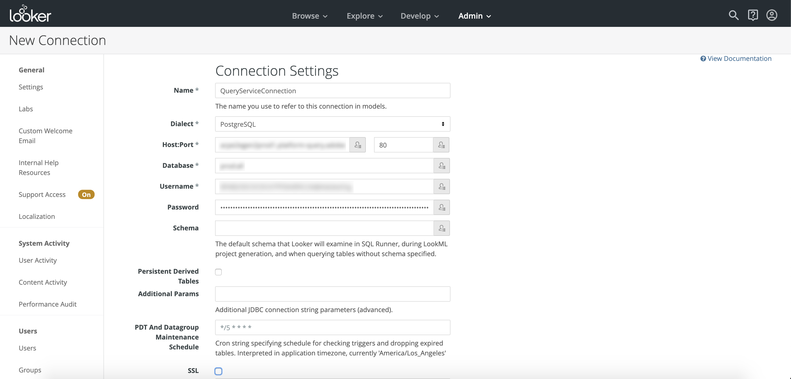

# Se connecter avec Looker

Pour connecter Looker à Adobe Service sur Adobe Experience Platform, procédez comme suit :

Après vous être connecté à Looker, cliquez sur **Admin**, puis sur **Connexions**.

Sur cette page, cliquez sur **Nouvelle connexion**.

A partir de là, vous pouvez remplir les détails des paramètres de connexion.

- **Nom :** Nom de votre connexion.
- **Dialecte :** Le dialecte utilisé pour la base de données SQL. Le service  utilise **PostgreSQL**.
- **Hôte et port :** Point de terminaison hôte et son port pour le service de .
- **Base de données :** Base de données qui sera utilisée.
- **Nom d’utilisateur et mot de passe :** Informations de connexion qui seront utilisées. Le nom d&#39;utilisateur se présente sous la forme `ORG_ID@AdobeOrg`.

>[!NOTE] Pour plus d’informations sur la recherche de votre hôte et de votre port, du nom de la base de données et des informations d’identification de connexion, consultez la page [d’identification de la plateforme](https://platform.adobe.com/query/configuration). Pour rechercher vos informations d’identification, connectez-vous à Platform, cliquez sur ****, puis sur **Credentials**.

Après avoir entré les détails de votre connexion, cliquez sur **Tester ces paramètres** pour vous assurer que vos informations d’identification fonctionnent correctement. Si tel est le cas, un message indiquant que vous pouvez vous connecter s’affiche ci-dessous. Si votre connexion est réussie, cliquez sur **Ajouter Connexion** pour créer votre connexion.

## Étapes suivantes

Maintenant que vous êtes connecté à Service, vous pouvez utiliser Looker pour écrire des  de. Pour plus d&#39;informations sur la façon d&#39;écrire et d&#39;exécuter des  de, veuillez lire le [guide](../creating-queries/creating-queries.md)de  de en cours d&#39;exécution.