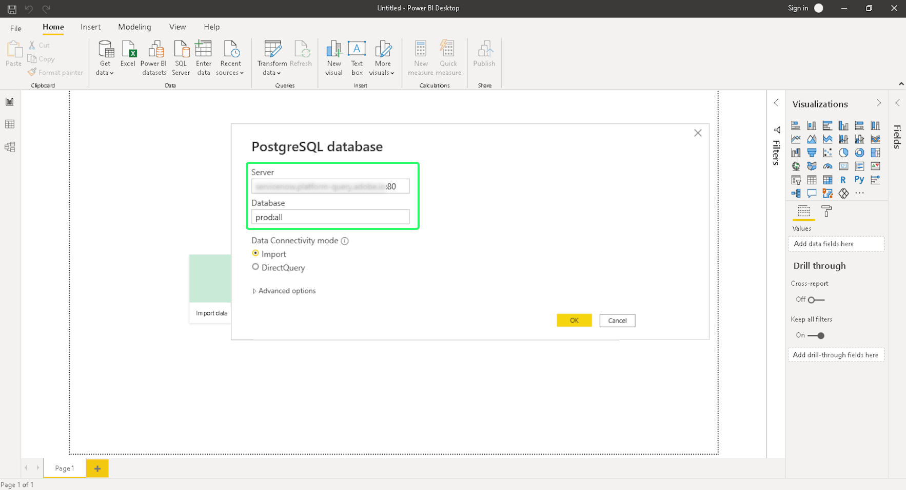

# Connexion de Power BI à Query Service

Ce document décrit les étapes à suivre pour connecter Power BI Desktop à Adobe Experience Platform Query Service.

## Prise en main

Ce guide nécessite que vous ayez déjà accès à l’appli de bureau Power BI et que vous sachiez comment naviguer dans son interface. Pour télécharger Power BI Desktop ou pour plus d’informations, voir [documentation officielle sur les Power BI](https://docs.microsoft.com/fr-FR/power-bi/).

>[!IMPORTANT]
>
> L’application de bureau Power BI est **only** disponible sur les périphériques Windows.

Pour obtenir les informations d’identification nécessaires à la connexion de Power BI à Experience Platform, vous devez avoir accès à l’espace de travail Requêtes dans l’interface utilisateur de Platform. Contactez votre administrateur de l’organisation IMS si vous n’avez pas actuellement accès à l’espace de travail Requêtes .

Après l’installation de Power BI, vous devez installer `Npgsql`, un package de pilote .NET pour PostgreSQL. Vous trouverez plus d’informations sur Npgsql dans la section [Documentation Npgsql](https://www.npgsql.org/doc/index.html).

>[!IMPORTANT]
>
>Vous devez télécharger la version v4.0.10 ou antérieure, car les versions plus récentes génèrent des erreurs.

Sous &quot;[!DNL Npgsql GAC Installation]&quot; sur l’écran de configuration personnalisé, sélectionnez **[!DNL Will be installed on local hard drive]**.

Pour vous assurer que Npgsql a été correctement installé, redémarrez votre ordinateur avant de passer aux étapes suivantes.

## Connexion de Power BI à Query Service {#connect-power-bi}

Pour connecter Power BI à Query Service, ouvrez le Power BI et sélectionnez **[!DNL Get Data]** dans le ruban du menu supérieur.

Saisissez &quot;PostgreSQL&quot; dans la barre de recherche pour limiter la liste des sources de données. Sous les résultats qui s’affichent, sélectionnez **[!DNL PostgreSQL database]**, suivie de **[!DNL Connect]**.

La boîte de dialogue Base de données PostgreSQl s’affiche, vous demandant des valeurs pour votre serveur et votre base de données. Ces valeurs proviennent de vos informations d’identification Adobe Experience Platform. Pour trouver vos informations d’identification, connectez-vous à l’interface utilisateur de Platform et sélectionnez **[!UICONTROL Requêtes]** à partir du volet de navigation de gauche, suivi de **[!UICONTROL Informations d’identification]**. Pour plus d’informations sur la recherche du nom de la base de données, de l’hôte, du port et des informations de connexion, consultez la section [guide des informations d’identification](../ui/credentials.md).

Pour le **[!DNL Server]** dans Power BI, saisissez la valeur de l’hôte figurant dans la section Informations d’identification de Query Service . Pour la production, ajoutez le port `:80` à la fin de la chaîne hôte. Par exemple : `made-up.platform-query.adobe.io:80`.

Le **[!DNL Database]** peut être &quot;all&quot; ou un nom de table de jeu de données. Par exemple : `prod:all`.

>[!IMPORTANT]
>
>Les structures de données imbriquées dans des outils de BI tiers peuvent être aplaties afin d’améliorer leur convivialité et de réduire la charge de travail requise pour récupérer, analyser, transformer et générer des rapports sur les données. Consultez la documentation relative à la[`FLATTEN` fonctionnalité](../best-practices/flatten-nested-data.md) pour savoir comment activer ce paramètre lors de la connexion à une base de données.

### Mode Connectivité des données

Ensuite, vous pouvez sélectionner votre **[!DNL Data Connectivity mode]**. Sélectionner **[!DNL Import]** suivie de **[!DNL OK]** pour afficher la liste de tous les tableaux disponibles, ou sélectionnez **[!DNL DirectQuery]** pour interroger directement la source de données sans importer ou copier directement des données dans Power BI.

Pour en savoir plus sur **[!DNL Import]** , veuillez lire la section sur [importation d&#39;un tableau](#import). Pour en savoir plus sur **[!DNL DirectQuery]** , veuillez lire la section sur [interrogation d’un jeu de données sans importer de données](#direct-query).

Sélectionner **[!DNL OK]** après avoir confirmé les détails de votre base de données.

### Authentification

Une invite vous demandant votre nom d’utilisateur, votre mot de passe et vos paramètres d’application s’affiche. Dans ce cas, le nom d’utilisateur est votre ID d’organisation et le mot de passe est votre jeton d’authentification. Les deux se trouvent sur la page des informations d’identification de Query Service.

Renseignez ces informations, puis sélectionnez **[!DNL Connect]** pour passer à l’étape suivante.

## Importer un tableau {#import}

En sélectionnant la variable **[!DNL Import]** [!DNL Data Connectivity mode], le jeu de données complet est importé, ce qui vous permet d’utiliser les tableaux et colonnes sélectionnés dans l’application de bureau Power BI en l’état.

>[!IMPORTANT]
>
>Pour afficher les changements de données survenus depuis l’importation initiale, vous devez actualiser les données dans Power BI en important à nouveau le jeu de données complet.

Pour importer un tableau, saisissez les détails du serveur et de la base de données. [comme décrit ci-dessus](#connect-power-bi) et sélectionnez la variable **[!DNL Import]** [!DNL Data Connectivity mode], suivie de **[!DNL OK]**. Une boîte de dialogue s’affiche, affichant la liste de tous les tableaux disponibles. Sélectionnez le tableau à prévisualiser, puis choisissez **[!DNL Load]** pour mettre en Power BI le jeu de données.

Le tableau est maintenant importé dans Power BI.

### Importation de tableaux à l’aide de SQL personnalisé

Power BI et d’autres outils tiers tels que Tableau ne permettent pas actuellement aux utilisateurs d’importer des objets imbriqués, tels que des objets XDM dans Platform. Pour ce faire, Power BI vous permet d’utiliser du code SQL personnalisé pour accéder à ces champs imbriqués et créer une vue aplatie des données. Power BI charge ensuite cette vue aplatie des données précédemment imbriquées comme un tableau normal.

Dans la fenêtre contextuelle Base de données PostgreSQL, sélectionnez **[!DNL Advanced options]** pour saisir une requête SQL personnalisée dans le **[!DNL SQL statement]** . Cette requête personnalisée doit être utilisée pour aplatir vos paires nom-valeur JSON dans un format de tableau.

Après avoir saisi votre requête personnalisée, sélectionnez **[!DNL OK]** pour poursuivre la connexion à votre base de données. Voir [authentication](#authentication) pour plus d’informations sur la connexion d’une base de données à partir de cette partie du workflow.

Une fois l’authentification terminée, un aperçu des données aplaties s’affiche sous forme de tableau dans le tableau de bord de l’appli de bureau Power BI. Le nom du serveur et du nom de la base de données sont répertoriés en haut de la boîte de dialogue. Sélectionner **[!DNL Load]** pour terminer le processus d’importation.

Les visualisations peuvent désormais être modifiées et exportées à partir de l’appli de bureau Power BI.

## Interrogation du jeu de données sans importation de données {#direct-query}

Le **[!DNL DirectQuery]** [!DNL Data Connectivity mode] interroge directement la source de données sans importer ni copier de données dans le bureau Power BI. En utilisant ce mode de connexion, vous pouvez actualiser toutes les visualisations avec les données actives via l’interface utilisateur. Toutefois, le temps nécessaire à la création ou à l’actualisation de la visualisation varie en fonction des performances de la source de données sous-jacente.

Pour utiliser [!DNL Data Connectivity mode], sélectionnez la variable **[!DNL DirectQuery]** bascule puis **[!DNL Advanced options]** pour saisir une requête SQL personnalisée dans le **[!DNL SQL statement]** . Assurez-vous que **[!DNL Include relationship columns]** est sélectionnée. Une fois la requête terminée, sélectionnez **[!DNL OK]** pour continuer.

Un aperçu de votre requête s’affiche. Sélectionner **[!DNL Load]** pour afficher les résultats de la requête.

## Étapes suivantes

En lisant ce document, vous devez maintenant comprendre comment vous connecter à l’appli de bureau Power BI et aux différents modes de connexion aux données disponibles. Pour plus d’informations sur l’écriture et l’exécution de requêtes, reportez-vous à la section [conseils pour l’exécution des requêtes](../best-practices/writing-queries.md).
