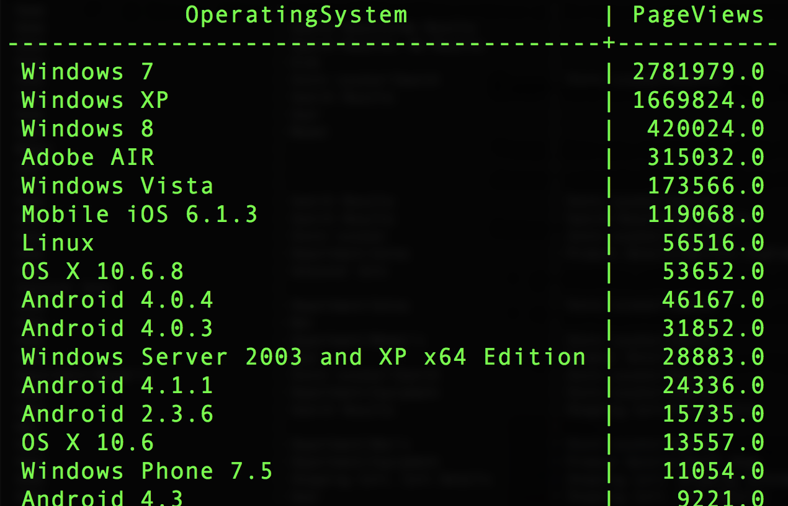

# Association de jeux de données

L’association de jeux de données vous permet d’inclure dans votre requête des données provenant d’autres jeux de données. Cet exemple utilise un jeu de données personnalisé provenant du système d’exploitation pour mapper la valeur `operatingsystemID` à la valeur `operatingsystem`.

Jeux de données :
- your_analytics_table
- custom_operating_system_lookup

Créez une instruction `SELECT` pour les 50 premiers systèmes d’exploitation classés par nombre de visites des pages.

```sql
SELECT 
  b.operatingsystem AS OperatingSystem,
  SUM(a.web.webPageDetails.pageviews.value) AS PageViews
FROM your_analytics_table a 
     JOIN custom_operating_system_lookup b 
      ON a._experience.analytics.environment.operatingsystemID = b.operatingsystemid 
WHERE _ACP_YEAR=2018 
GROUP BY OperatingSystem 
ORDER BY PageViews DESC
LIMIT 50;
```

