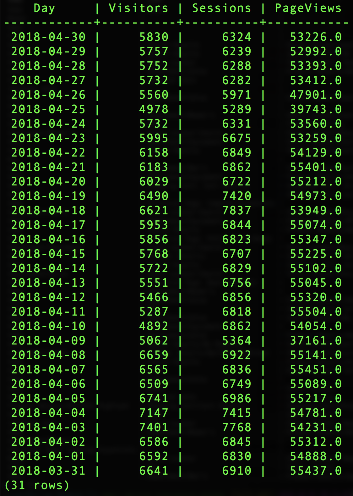

# Utilisation de fonctions définies par Adobe

L’un des principaux facteurs de différenciation d’Adobe est qu’ils comprennent les données d’expérience et ce que les clients doivent pouvoir faire avec ces données. Vous pouvez utiliser cette compréhension pour créer des fonctions d’aide qui facilitent votre travail.

Ce couvre les fonctions définies par Adobe (ADF) pour prendre en charge trois  Analytics clés :
- [Sessionisation](#sessionization)
- [Attribution](#attribution)
- [Cheminement](#pathing)

## Sessionisation

Le `SESS_TIMEOUT()` groupe reproduit les regroupements de visites trouvés avec Adobe Analytics. Il effectue un regroupement temporel similaire, mais avec des paramètres personnalisables.

**Syntaxe :**

`SESS_TIMEOUT(timestamp, timeout_in_seconds) OVER ([partition] [order] [frame])`

**Retours :**

Structure avec champs `(timestamp_diff, num, is_new, depth)`

### Explorer le niveau de ligne `SESS_TIMEOUT()` et la sortie

```sql
SELECT analyticsVisitor,
      session.is_new,
      session.timestamp_diff,
      session.num,
      session.depth
FROM  (
        SELECT endUserIDs._experience.aaid.id as analyticsVisitor,
        SESS_TIMEOUT(timestamp, 60 * 30)
        OVER (PARTITION BY endUserIDs._experience.aaid.id
        ORDER BY timestamp
        ROWS BETWEEN UNBOUNDED PRECEDING AND CURRENT ROW)
        AS session
        FROM your_analytics_table
        WHERE _ACP_YEAR = 2018
      )
LIMIT 100;
```


### Créer un rapport de tendances avec des, des sessions et des  de page

```sql
SELECT
      date_format( from_utc_timestamp(timestamp, 'EDT') , 'yyyy-MM-dd') as Day,
      COUNT(DISTINCT analyticsVisitor ) as Visitors,
      COUNT(DISTINCT analyticsVisitor || session.num ) as Sessions,
      SUM( PageViews ) as PageViews
FROM
    (
      SELECT
          timestamp,
          endUserIDs._experience.aaid.id as analyticsVisitor,
          SESS_TIMEOUT(timestamp, 60 * 30)
      OVER (PARTITION BY endUserIDs._experience.aaid.id
      ORDER BY timestamp
      ROWS BETWEEN UNBOUNDED PRECEDING AND CURRENT ROW)
      AS session,
          web.webPageDetails.pageviews.value as PageViews
      FROM your_analytics_table
      WHERE _ACP_YEAR = 2018
    )
GROUP BY Day 
ORDER BY Day DESC 
LIMIT 31;
```



## Attribution

L’attribution est la manière dont vous affectez des mesures ou des conversions, telles que les recettes, les commandes ou les abonnements, à vos efforts marketing.

Dans Adobe Analytics, les paramètres d’attribution sont configurés à l’aide de variables comme les eVars et sont générés au fur et à mesure que les données sont ingérées.

Les adaptateurs ADF d’attribution trouvés dans le service  permettent de définir et de générer ces affectations au moment  de l’.

Cet exemple se concentre sur l’attribution Dernière touche, mais Adobe  également l’attribution Première touche .

>[!NOTE] D’autres options avec les délais d’expiration et l’expiration basée sur les  seront disponibles dans les futures versions du service .

**Syntaxe :**

`ATTRIBUTION_LAST_TOUCH(timestamp, [channel_name], column) OVER ([partition] [order] [frame])`

**Retours :**

Structure avec champ `(value)`

### Explorez l’attribution au niveau de la ligne.

```sql
SELECT
  endUserIds._experience.aaid.id,
  _experience.analytics.customDimensions.evars.evar10 as MemberLevel,
  ATTRIBUTION_LAST_TOUCH(timestamp, 'eVar10', _experience.analytics.customDimensions.evars.evar10)
      OVER(PARTITION BY endUserIds._experience.aaid.id
           ORDER BY timestamp
           ROWS BETWEEN UNBOUNDED PRECEDING AND CURRENT ROW).value
      AS LastMemberLevel,
  commerce.purchases.value as Orders
FROM your_analytics_table 
WHERE _ACP_YEAR=2018 AND _ACP_MONTH=4
LIMIT 50;
```


### Créer une ventilation des commandes par niveau de dernier membre (eVar10)

```sql
SELECT
  LastMemberLevel,
  SUM(Orders) as MemberLevelOrders
FROM 
(SELECT
  ATTRIBUTION_LAST_TOUCH(timestamp, 'eVar10', _experience.analytics.customDimensions.evars.evar10)
      OVER(PARTITION BY endUserIds._experience.aaid.id
           ORDER BY timestamp
           ROWS BETWEEN UNBOUNDED PRECEDING AND CURRENT ROW).value
      AS LastMemberLevel,
  commerce.purchases.value as Orders
FROM your_analytics_table 
WHERE _ACP_YEAR=2018 AND _ACP_MONTH=4
)
GROUP BY LastMemberLevel 
ORDER BY MemberLevelOrders DESC
LIMIT 25;
```


## Cheminement

Le cheminement permet de comprendre comment les clients naviguent sur votre site. Les `NEXT()` et `PREVIOUS()` les ADF rendent cela possible.

**Syntaxe :**

```
NEXT(key, [shift, [ignoreNulls]]) OVER ([partition] [order] [frame])
PREVIOUS(key, [shift, [ignoreNulls]]) OVER ([partition] [order] [frame])
```

**Retours :**

Structure avec champ `(value)`

### Sélectionner la page active et la page suivante

```sql
SELECT 
      endUserIds._experience.aaid.id,
      timestamp,
      web.webPageDetails.name,
      NEXT(web.webPageDetails.name, 1, true)
          OVER(PARTITION BY endUserIds._experience.aaid.id
              ORDER BY timestamp
              ROWS BETWEEN CURRENT ROW AND UNBOUNDED FOLLOWING).value
          AS next_pagename
FROM your_analytics_table
WHERE _ACP_YEAR=2018 
LIMIT 10;
```


### Créer un rapport de ventilation pour les cinq premiers noms de page à l’entrée de la session

```sql
  SELECT 
    PageName,
    PageName_2,
    PageName_3,
    PageName_4,
    PageName_5,
    SUM(PageViews) as PageViews
  FROM
    (SELECT
      PageName,
      NEXT(PageName, 1, true)
        OVER(PARTITION BY VisitorID, session.num
              ORDER BY timestamp
              ROWS BETWEEN CURRENT ROW AND UNBOUNDED FOLLOWING).value
        AS PageName_2,
      NEXT(PageName, 2, true)
        OVER(PARTITION BY VisitorID, session.num
              ORDER BY timestamp
              ROWS BETWEEN CURRENT ROW AND UNBOUNDED FOLLOWING).value
        AS PageName_3,
      NEXT(PageName, 3, true)
         OVER(PARTITION BY VisitorID, session.num
              ORDER BY timestamp
              ROWS BETWEEN CURRENT ROW AND UNBOUNDED FOLLOWING).value
        AS PageName_4,
      NEXT(PageName, 4, true)
         OVER(PARTITION BY VisitorID, session.num
              ORDER BY timestamp
              ROWS BETWEEN CURRENT ROW AND UNBOUNDED FOLLOWING).value
        AS PageName_5,
      PageViews,
      session.depth AS SessionPageDepth
    FROM
      (SELECT
        endUserIds._experience.aaid.id as VisitorID,
        timestamp,
        web.webPageDetails.pageviews.value AS PageViews,
        web.webPageDetails.name AS PageName,
        SESS_TIMEOUT(timestamp, 60 * 30) 
          OVER (PARTITION BY endUserIDs._experience.aaid.id 
                ORDER BY timestamp 
                ROWS BETWEEN UNBOUNDED PRECEDING AND CURRENT ROW) 
        AS session
      FROM your_analytics_table
      WHERE _ACP_YEAR=2018)
    )
  WHERE SessionPageDepth=1
  GROUP BY PageName, PageName_2, PageName_3, PageName_4, PageName_5
  ORDER BY PageViews DESC
  LIMIT 100;
```


