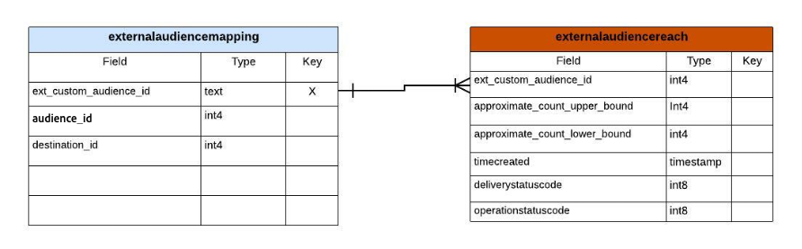
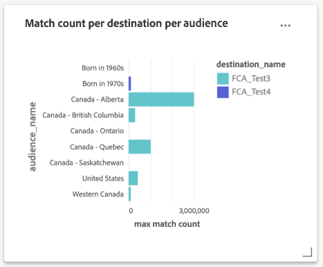

# Guide d’informations sur les rapports de magasin accélérés de requête

Le magasin d’accélération des requêtes vous permet de réduire le temps et la puissance de traitement requis pour obtenir des informations critiques à partir de vos données. En règle générale, les données sont traitées à intervalles réguliers (par exemple, toutes les heures ou tous les jours), lorsque des vues agrégées sont créées et font l’objet de rapports. L’analyse de ces rapports générés à partir de données agrégées fournit des informations destinées à améliorer les performances commerciales. Le magasin d’accélération des requêtes offre un service de cache, une simultanéité, une expérience interactive et une API sans état. Toutefois, il suppose que les données sont prétraitées et optimisées pour les requêtes agrégées et non pour les requêtes de données brutes.

Le magasin accéléré de requêtes vous permet de créer un modèle de données personnalisé et/ou d’étendre un modèle de données Adobe Real-Time Customer Data Platform existant. Vous pouvez ensuite utiliser vos informations de rapports ou les incorporer dans un framework de création de rapports/visualisation de votre choix. Consultez la documentation du modèle de données Real-time Customer Data Platform Insights pour savoir comment [personnaliser vos modèles de requête SQL pour créer des rapports Real-Time CDP pour vos cas d’utilisation de marketing et d’indicateurs clés de performance (ICP)](../../../dashboards/data-models/cdp-insights-data-model-b2c.md).

Le modèle de données Real-Time CDP de Adobe Experience Platform fournit des informations sur les profils, les audiences et les destinations et active les tableaux de bord des informations Real-Time CDP. Ce document vous guide tout au long du processus de création de votre modèle de données des rapports d’informations et vous explique également comment étendre les modèles de données Real-time CDP selon les besoins.

## Conditions préalables

Ce tutoriel utilise des tableaux de bord définis par l’utilisateur pour visualiser les données de votre modèle de données personnalisé dans l’interface utilisateur de Platform. Veuillez consulter la [documentation des tableaux de bord définis par l’utilisateur](../../../dashboards/user-defined-dashboards.md) pour en savoir plus sur cette fonctionnalité.

## Prise en main

Le SKU Data Distiller est nécessaire pour créer un modèle de données personnalisé pour vos rapports d’informations et pour étendre les modèles de données Real-time CDP qui contiennent des données Platform enrichies. Veuillez consulter la documentation [packaging](../../packaging.md), [guardrails](../../guardrails.md#query-accelerated-store) et [licensing](../../data-distiller/license-usage.md) relative au SKU de Data Distiller. Si vous ne disposez pas du SKU de Data Distiller, contactez votre représentant du service client Adobe pour plus d’informations.

## Créer un modèle de données de rapport d’informations

Ce tutoriel utilise un exemple de création d’un modèle de données d’informations sur l’audience. Si vous utilisez une ou plusieurs plateformes d’annonceurs pour atteindre votre audience, vous pouvez utiliser l’API de l’annonceur pour obtenir un nombre de correspondance approximatif de votre audience.

Dès le départ, vous disposez d’un modèle de données initial issu de vos sources (potentiellement de l’API de la plateforme de votre annonceur). Pour créer une vue globale de vos données brutes, créez un modèle de rapport d’informations comme décrit dans l’image ci-dessous. Cela permet à un jeu de données d’obtenir les limites supérieure et inférieure de la correspondance d’audience.



Dans cet exemple, le `externalaudiencereach` tableau/jeu de données est basé sur un identifiant et suit les limites inférieure et supérieure pour le nombre de correspondances. La table/le jeu de données de dimension `externalaudiencemapping` mappe l’ID externe à une destination et à une audience sur Platform.

## Créer un modèle de rapport d’informations avec Data Distiller

Créez ensuite un modèle de rapport d’informations (`audienceinsight` dans cet exemple) et utilisez la commande SQL `ACCOUNT=acp_query_batch and TYPE=QSACCEL` pour vous assurer qu’il est créé sur la boutique accélérée. Utilisez ensuite Query Service pour créer un schéma de `audienceinsight.audiencemodel` pour la base de données `audienceinsight`.

>[!NOTE]
>
>Le SKU de Data Distiller est requis pour la commande `ACCOUNT=acp_query_batch`. Sans celui-ci, un modèle de données normal est créé sur le lac de données.

```sql
CREATE database audienceinsight WITH (TYPE=QSACCEL, ACCOUNT=acp_query_batch);
 
CREATE schema audienceinsight.audiencemodel;
```

## Créer des tableaux, des relations et renseigner des données

Maintenant que vous avez créé votre modèle de rapport d’informations `audienceinsight`, créez les tableaux `externalaudiencereach` et `externalaudiencemapping` et établissez des relations entre eux. Ensuite, utilisez la commande `ALTER TABLE` pour ajouter une contrainte de clé étrangère entre les tableaux et définir une relation. L’exemple SQL suivant montre comment procéder.

```sql
CREATE TABLE IF NOT exists audienceinsight.audiencemodel.externalaudiencereach
WITH ( DISTRIBUTION = REPLICATE ) AS
  SELECT cast(null as int) approximate_count_upper_bound,
         cast(null as string) deliverystatusdescription,
         cast(null as timestamp)  timeupdated ,
         cast(null as int) operationstatuscode ,
         cast(null as string) operationstatusdescription,
         cast(null as int) approximate_count_lower_bound,
         cast(null as timestamp)timecreated ,
         cast(null as timestamp)timecontentupdated ,
         cast(null as int) deliverystatuscode ,
         cast(null as int)  ext_custom_audience_id
   WHERE false;
 
CREATE TABLE IF NOT exists audienceinsight.audiencemodel.externalaudiencemapping
WITH ( DISTRIBUTION = REPLICATE ) AS
SELECT cast(null as int) audience_id,
       cast(null as int) destination_id,
       cast(null as int) ext_custom_audience_id
 WHERE false;
 
ALTER TABLE externalaudiencereach ADD  CONSTRAINT FOREIGN KEY (ext_custom_audience_id) REFERENCES externalaudiencemapping (ext_custom_audience_id) NOT enforced;
```

Après l’exécution réussie des deux commandes `ALTER TABLE`, la relation entre les tableaux de faits et de dimensions est formée.

Une fois les instructions exécutées, utilisez la commande `SHOW datagroups;` pour renvoyer une liste des jeux de données disponibles sur la boutique accélérée à partir du `audienceinsight.audiencemodel`. Vos résultats tabulés doivent être similaires à l’exemple fourni ci-dessous.

>[!IMPORTANT]
>
>Seules les données de la boutique accélérée sont accessibles à partir du point d’entrée `POST /data/foundation/query/accelerated-queries` de l’API sans état de Query Service.

```console
    Database     |    Schema     | GroupType |      ChildType       |        ChildName        | PhysicalParent |               ChildId               
-----------------+---------------+-----------+----------------------+-------------------------+----------------+--------------------------------------
 audienceinsight | audiencemodel | QSACCEL   | Data Warehouse Table | externalaudiencemapping | true           | 9155d3b4-889d-41da-9014-5b174f6fa572
 audienceinsight | audiencemodel | QSACCEL   | Data Warehouse Table | externalaudiencereach   | true           | 1b941a6d-6214-4810-815c-81c497a0b636
```

## Interroger le modèle de données de rapport d’informations

Utilisez Query Service pour interroger le tableau des dimensions `audiencemodel.externalaudiencereach`. Vous trouverez ci-dessous un exemple de requête.

```sql
SELECT a.ext_custom_audience_id,
       a.approximate_count_upper_bound
FROM   audiencemodel.externalaudiencereach AS a
       LEFT OUTER JOIN audiencemodel.externalaudiencemapping AS b
                    ON ( ( a.ext_custom_audience_id ) =
                         ( b.ext_custom_audience_id ) )
GROUP  BY a.ext_custom_audience_id,
          a.approximate_count_upper_bound
LIMIT  5000 ;
```

Les résultats tabulés incluent un nombre et un identifiant.

```console
ext_custom_audience_id | approximate_count_upper_bound
------------------------+-------------------------------
 23850912218170554      |                          1000
 23850808585120554      |                       1012000
 23850808585220554      |                        100000
 23850814978560554      |                          1000
 23850808585180554      |                        421000
 23850814978510554      |                       3001000
 23850814978530554      |                        300000
 23850912218160554      |                        105000
 23850808584990554      |                          1000
 23850809520110554      |                          1000
(10 rows)
```

## Étendez votre modèle de données avec le modèle de données d’informations Real-time CDP.

Vous pouvez étendre votre modèle d’audience avec des détails supplémentaires pour créer un tableau des dimensions plus riche. Vous pouvez, par exemple, associer le nom de l’audience et le nom de la destination à l’identifiant de l’audience externe. Pour ce faire, utilisez Query Service pour créer ou actualiser un nouveau jeu de données et l’ajouter au modèle d’audience qui combine des audiences et des destinations avec une identité externe. Le diagramme ci-dessous illustre le concept de cette extension de modèle de données.


## Créer des tableaux des dimensions pour étendre votre modèle de rapport d’informations

Utilisez Query Service pour ajouter des attributs descriptifs clés des jeux de données de dimension Real-Time CDP enrichis au modèle de données `audienceinsight` et établir une relation entre votre table des faits et la nouvelle table des dimensions. Le code SQL ci-dessous explique comment intégrer des tables de dimensions existantes à votre modèle de données d’informations sur les rapports.

```sql
CREATE TABLE audienceinsight.audiencemodel.external_seg_dest_map AS
  SELECT ext_custom_audience_id,
         destination_name,
         audience_name,
         destination_status,
         a.destination_id,
         a.audience_id
  FROM   externalaudiencemapping AS a
         LEFT OUTER JOIN adwh_dim_audiences AS b
                      ON ( ( a.audience_id ) = ( b.audience_id ) )
         LEFT OUTER JOIN adwh_dim_destination AS c
                      ON ( ( a.destination_id ) = ( c.destination_id ) );
 
ALTER TABLE externalaudiencereach  ADD  CONSTRAINT FOREIGN KEY (ext_custom_audience_id) REFERENCES external_seg_dest_map (ext_custom_audience_id) NOT enforced;
```

Utilisez la commande `SHOW datagroups;` pour confirmer la création de la table des dimensions `external_seg_dest_map`.

```console
    Database     |     Schema     | GroupType |      ChildType       |                ChildName  | PhysicalParent |               ChildId               
-----------------+----------------+-----------+----------------------+----------------------------------------------------+----------------+--------------------------------------
 audienceinsight | audiencemodel | QSACCEL   | Data Warehouse Table | external_seg_dest_map      | true           | 4b4b86b7-2db7-48ee-a67e-4b28cb900810
 audienceinsight | audiencemodel | QSACCEL   | Data Warehouse Table | externalaudiencemapping    | true           | b0302c05-28c3-488b-a048-1c635d88dca9
 audienceinsight | audiencemodel | QSACCEL   | Data Warehouse Table | externalaudiencereach      | true           | 4485c610-7424-4ed6-8317-eed0991b9727
```

## Interroger votre modèle de données d’informations de rapports de magasin accéléré et étendu

Maintenant que le modèle de données `audienceinsight` a été augmenté, celui-ci est prêt à être interrogé. Le code SQL suivant affiche la liste des destinations et des audiences mappées.

```sql
SELECT a.ext_custom_audience_id,
       b.destination_name,
       b.audience_name,
       b.destination_status,
       b.destination_id,
       b.audience_id
FROM   audiencemodel.externalaudiencereach1 AS a
       LEFT OUTER JOIN audiencemodel.external_seg_dest_map AS b
                    ON ( ( a.ext_custom_audience_id ) = (
                         b.ext_custom_audience_id ) )
LIMIT  25; 
```

La requête renvoie tous les jeux de données du magasin accéléré de requêtes :

```console
ext_custom_audience_id | destination_name |       audience_name        | destination_status | destination_id | audience_id 
------------------------+------------------+---------------------------+--------------------+----------------+-------------
 23850808595110554      | FCA_Test2        | United States             | enabled            |     -605911558 | -1357046572
 23850799115800554      | FCA_Test2        | Born in 1980s             | enabled            |     -605911558 | -1224554872
 23850799115790554      | FCA_Test2        | Born in 1970s             | enabled            |     -605911558 |  1899603869
 23850798177620554      | FCA_Test1        | Billionaires              | enabled            |      321720439 |  1401872665
 23850814978560554      | FCA_Test3        | Canada - Saskatchewan     | enabled            |     1182494936 | -1917996562
 23850808585180554      | FCA_Test3        | United States             | enabled            |     1182494936 | -1357046572
 23850814978530554      | FCA_Test3        | Canada - British Columbia | enabled            |     1182494936 |  -652840507
 23850808585120554      | FCA_Test3        | Canada - Quebec           | enabled            |     1182494936 |  -519557860
 23850809520110554      | FCA_Test3        | Born in 1960s             | enabled            |     1182494936 |   237824266
 23850808585220554      | FCA_Test3        | Western Canada            | enabled            |     1182494936 |  1075937528
 23850808584990554      | FCA_Test3        | Canada - Ontario          | enabled            |     1182494936 |  1593438041
 23850814978510554      | FCA_Test3        | Canada - Alberta          | enabled            |     1182494936 |  1862946783
 23850912218170554      | FCA_Test4        | Canada - Alberta          | enabled            |     1549248886 |  1862946783
 23850912218160554      | FCA_Test4        | Born in 1970s             | enabled            |     1549248886 |  1899603869
```

## Visualiser vos données à l’aide de tableaux de bord définis par l’utilisateur

Maintenant que vous avez créé votre modèle de données personnalisé, vous êtes prêt à visualiser vos données à l’aide de requêtes personnalisées et de tableaux de bord définis par l’utilisateur.

Le code SQL suivant fournit une ventilation du nombre de correspondances par audiences dans une destination et une ventilation de chaque destination d’audiences par audience.

```sql
SELECT b.destination_name,
       a.approximate_count_upper_bound,
       b.audience_name
FROM   audiencemodel.externalaudiencereach AS a
       LEFT OUTER JOIN audiencemodel.external_seg_dest_map AS b
                    ON ( ( a.ext_custom_audience_id ) = (
                         b.ext_custom_audience_id ) )
GROUP  BY b.destination_name,
          a.approximate_count_upper_bound,
          b.audience_name
ORDER BY b.destination_name
LIMIT  5000
```

L’image ci-dessous fournit un exemple des visualisations personnalisées possibles à l’aide de votre modèle de données d’informations sur les rapports.



Votre modèle de données personnalisé se trouve dans la liste des modèles de données disponibles dans l’espace de travail du tableau de bord défini par l’utilisateur. Voir le [guide de tableau de bord défini par l’utilisateur](../../../dashboards/user-defined-dashboards.md) pour obtenir des conseils sur l’utilisation de votre modèle de données personnalisé.
