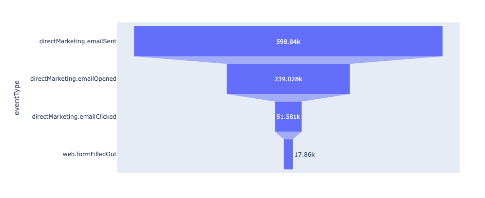

# Analyse exploratoire des données

Ce document fournit quelques exemples de base et des bonnes pratiques pour utiliser Data Distiller afin d’explorer et d’analyser les données d’un notebook [!DNL Python].

## Prise en main

Avant de poursuivre avec ce guide, assurez-vous d’avoir créé une connexion à Data Distiller dans votre notebook [!DNL Python]. Consultez la documentation pour obtenir des instructions sur la façon de [connecter un  [!DNL Python] notebook à Data Distiller](./establish-connection.md).

## Acquisition des statistiques de base {#basic-statistics}

Utilisez le code ci-dessous pour récupérer le nombre de lignes et de profils distincts dans un jeu de données.

```python
table_name = 'ecommerce_events'

basic_statistics_query = f"""
SELECT
    COUNT(_id) as "totalRows",
    COUNT(DISTINCT _id) as "distinctUsers"
FROM {table_name}"""

df = qs_cursor.query(basic_statistics_query, output="dataframe")
df
```

**Exemple de sortie**

|     | totalRows | distinctUsers |
| --- | ----------- | -------------- |
| 0 | 1276563 | 1276563 |

## Création d’une version échantillonnée de jeux de données volumineux {#create-dataset-sample}

Si le jeu de données que vous souhaitez interroger est très volumineux ou si les résultats exacts des requêtes exploratoires ne sont pas nécessaires, utilisez la [fonctionnalité d’échantillonnage](../../key-concepts/dataset-samples.md) disponible pour les requêtes Data Distiller. Il s’agit d’un processus en deux étapes :

- Tout d’abord, **analysez** le jeu de données pour créer une version échantillonnée avec un taux d’échantillonnage spécifié.
- Ensuite, interrogez la version échantillonnée du jeu de données. Selon les fonctions que vous appliquez au jeu de données échantillonné, vous pouvez mettre à l’échelle la sortie avec les nombres dans le jeu de données complet.

### Création d’un échantillon de 5 % {#create-sample}

L’exemple ci-dessous analyse le jeu de données et crée un exemple de 5 % :

```python
# A sampling rate of 10 is 100% in Query Service, so for 5% use a sampling rate 0.5
sampling_rate = 0.5

analyze_table_query=f"""
SET aqp=true;
ANALYZE TABLE {table_name} TABLESAMPLE SAMPLERATE {sampling_rate}"""

qs_cursor.query(analyze_table_query, output="raw")
```

### Afficher vos exemples {#view-sample}

Vous pouvez utiliser la fonction `sample_meta` pour afficher les exemples qui ont été créés à partir d’un jeu de données donné. Le fragment de code ci-dessous montre comment utiliser la fonction `sample_meta`.

```python
sampled_version_of_table_query = f'''SELECT sample_meta('{table_name}')'''

df_samples = qs_cursor.query(sampled_version_of_table_query, output="dataframe")
df_samples
```

**Exemple de sortie** :

|   | sample_table_name | sample_dataset_id | parent_dataset_id | sample_type | sampling_rate | filter_condition_on_source_dataset | sample_num_rows | created |
|---|---|---|---|---|---|---|---|---|
| 0 | cmle_synthétique_data_experience_event_dataset_c... | 650f7a09ed6c3e28d34d7fc2 | 64fb4d7a7d748828d304a2f4 | uniforme | 0,5 | 6427 | 23/09/2023 | 11:51:37 |

{style="table-layout:auto"}

### Interrogation de votre exemple {#query-sample-data}

Vous pouvez directement interroger votre exemple en référençant le nom de l’exemple de tableau à partir des métadonnées renvoyées. Vous pouvez ensuite multiplier les résultats par le ratio d’échantillonnage pour obtenir une estimation.

```python
sample_table_name = df_samples[df_samples["sampling_rate"] == sampling_rate]["sample_table_name"].iloc[0]

count_query=f'''SELECT count(*) as cnt from {sample_table_name}'''

df = qs_cursor.query(count_query, output="dataframe")
# Divide by the sampling rate to extrapolate to the full dataset
approx_count = df["cnt"].iloc[0] / (sampling_rate / 100)

print(f"Approximate count: {approx_count} using {sampling_rate *10}% sample")
```

**Exemple de sortie**

```console
Approximate count: 1284600.0 using 5.0% sample
```

## Analyse de l’entonnoir des emails {#email-funnel-analysis}

Une analyse d’entonnoir est une méthode permettant de comprendre les étapes nécessaires pour atteindre un résultat cible et le nombre d’utilisateurs qui passent par chacune de ces étapes. L’exemple ci-dessous illustre une analyse simple de l’entonnoir des étapes menant à un utilisateur s’abonnant à une newsletter. Le résultat de l’abonnement est représenté par un type d’événement `web.formFilledOut`.

Commencez par exécuter une requête pour obtenir le nombre d’utilisateurs à chaque étape.

```python
simple_funnel_analysis_query = f'''SELECT eventType, COUNT(DISTINCT _id) as "distinctUsers",COUNT(_id) as "distinctEvents" FROM {table_name} GROUP BY eventType ORDER BY distinctUsers DESC'''

funnel_df = qs_cursor.query(simple_funnel_analysis_query, output="dataframe")
funnel_df
```

**Exemple de sortie**

|   | eventType | distinctUsers | distinctEvents |
|---|---|---|---|
| 0 | directMarketing.emailSent | 598840 | 598840 |
| 1 | directMarketing.emailOpened | 239028 | 239028 |
| 2 | web.webpagedetails.pageViews | 120118 | 120118 |
| 3 | advertising.impressions | 119669 | 119669 |
| 4 | directMarketing.emailClicked | 51581 | 51581 |
| 5 | commerce.productViews | 37915 | 37915 |
| 6 | decisioning.propositionDisplay | 37650 | 37650 |
| 7 | web.webinteraction.linkClicks | 37581 | 37581 |
| 8 | web.formFilledOut | 17860 | 17860 |
| 9 | advertising.clicks | 7610 | 7610 |
| 10 | decisioning.propositionInteract | 2964 | 2964 |
| 11 | decisioning.propositionDismiss | 2889 | 2889 |
| 12 | commerce.purchases | 2858 | 2858 |

{style="table-layout:auto"}

### Traiter les résultats des requêtes {#plot-results}

Ensuite, tracez les résultats de la requête à l’aide de la bibliothèque [!DNL Python] `plotly` :

```python
import plotly.express as px

email_funnel_events = ["directMarketing.emailSent", "directMarketing.emailOpened", "directMarketing.emailClicked", "web.formFilledOut"]
email_funnel_df = funnel_df[funnel_df["eventType"].isin(email_funnel_events)]

fig = px.funnel(email_funnel_df, y='eventType', x='distinctUsers')
fig.show()
```

**Exemple de sortie**



## Corrélations des événements {#event-correlations}

Une autre analyse courante consiste à calculer les corrélations entre les types d’événement et un type d’événement de conversion cible. Dans cet exemple, l’événement d’abonnement est représenté par `web.formFilledOut`. Cet exemple utilise les fonctions [!DNL Spark] disponibles dans les requêtes Data Distiller pour réaliser les étapes suivantes :

1. Comptez le nombre d’événements pour chaque type d’événement par profil.
2. Agrégez le nombre de chaque type d’événement sur les profils et calculez les corrélations de chaque type d’événement avec `web,formFilledOut`.
3. Transformez le cadre de données des nombres et des corrélations en un tableau des coefficients de corrélation Pearson de chaque fonctionnalité (nombre de types d’événement) avec l’événement cible.
4. Visualisez les résultats dans un graphique.

Les fonctions [!DNL Spark] regroupent les données pour renvoyer un petit tableau de résultats, de sorte que vous pouvez exécuter ce type de requête sur le jeu de données complet.

```python
large_correlation_query=f'''
SELECT SUM(webFormsFilled) as webFormsFilled_totalUsers,
       SUM(advertisingClicks) as advertisingClicks_totalUsers,
       SUM(productViews) as productViews_totalUsers,
       SUM(productPurchases) as productPurchases_totalUsers,
       SUM(propositionDismisses) as propositionDismisses_totaUsers,
       SUM(propositionDisplays) as propositionDisplays_totaUsers,
       SUM(propositionInteracts) as propositionInteracts_totalUsers,
       SUM(emailClicks) as emailClicks_totalUsers,
       SUM(emailOpens) as emailOpens_totalUsers,
       SUM(webLinkClicks) as webLinksClicks_totalUsers,
       SUM(webPageViews) as webPageViews_totalusers,
       corr(webFormsFilled, emailOpens) as webForms_EmailOpens,
       corr(webFormsFilled, advertisingClicks) as webForms_advertisingClicks,
       corr(webFormsFilled, productViews) as webForms_productViews,
       corr(webFormsFilled, productPurchases) as webForms_productPurchases,
       corr(webFormsFilled, propositionDismisses) as webForms_propositionDismisses,
       corr(webFormsFilled, propositionInteracts) as webForms_propositionInteracts,
       corr(webFormsFilled, emailClicks) as webForms_emailClicks,
       corr(webFormsFilled, emailOpens) as webForms_emailOpens,
       corr(webFormsFilled, emailSends) as webForms_emailSends,
       corr(webFormsFilled, webLinkClicks) as webForms_webLinkClicks,
       corr(webFormsFilled, webPageViews) as webForms_webPageViews
FROM(
    SELECT _{tenant_id}.cmle_id as userID,
            SUM(CASE WHEN eventType='web.formFilledOut' THEN 1 ELSE 0 END) as webFormsFilled,
            SUM(CASE WHEN eventType='advertising.clicks' THEN 1 ELSE 0 END) as advertisingClicks,
            SUM(CASE WHEN eventType='commerce.productViews' THEN 1 ELSE 0 END) as productViews,
            SUM(CASE WHEN eventType='commerce.productPurchases' THEN 1 ELSE 0 END) as productPurchases,
            SUM(CASE WHEN eventType='decisioning.propositionDismiss' THEN 1 ELSE 0 END) as propositionDismisses,
            SUM(CASE WHEN eventType='decisioning.propositionDisplay' THEN 1 ELSE 0 END) as propositionDisplays,
            SUM(CASE WHEN eventType='decisioning.propositionInteract' THEN 1 ELSE 0 END) as propositionInteracts,
            SUM(CASE WHEN eventType='directMarketing.emailClicked' THEN 1 ELSE 0 END) as emailClicks,
            SUM(CASE WHEN eventType='directMarketing.emailOpened' THEN 1 ELSE 0 END) as emailOpens,
            SUM(CASE WHEN eventType='directMarketing.emailSent' THEN 1 ELSE 0 END) as emailSends,
            SUM(CASE WHEN eventType='web.webinteraction.linkClicks' THEN 1 ELSE 0 END) as webLinkClicks,
            SUM(CASE WHEN eventType='web.webinteraction.pageViews' THEN 1 ELSE 0 END) as webPageViews
    FROM {table_name}
    GROUP BY userId
)
'''
large_correlation_df = qs_cursor.query(large_correlation_query, output="dataframe")
large_correlation_df
```

**Exemple de sortie** :

|   | webFormsFill_totalUsers | advertisingClicks_totalUsers | productViews_totalUsers | productPurchases_totalUsers | propositionDismisses_totaUsers | propositionAffichages_totalUsers | propositionInteracts_totalUsers | emailClicks_totalUsers | emailOpens_totalUsers | webLinksClicks_totalUsers | .. | webForms_advertisingClicks | webForms_productViews | webForms_productPurchases | webForms_propositionDismisses | webForms_propositionInteracts | webForms_emailClicks | webForms_emailOpens | webForms_emailSends | webForms_webLinkClicks | webForms_webPageViews |
|---|---|---|---|---|---|---|---|---|---|---|---|---|---|---|---|---|---|---|---|---|---|
| 0 | 17860 | 7610 | 37915 | 0 | 2889 | 37650 | 2964 | 51581 | 239028 | 37581 | .. | 0,026805 | 0,2779 | Aucun | 0,06014 | 0,143656 | 0,305657 | 0,218874 | 0,192836 | 0,259353 | Aucun |

{style="table-layout:auto"}

### Transforme une ligne en corrélation de type d’événement {#event-type-correlation}

Ensuite, transformez la seule ligne de données dans la sortie de requête ci-dessus, en un tableau présentant les corrélations de chaque type d’événement avec l’événement d’abonnement cible :

```python
cols = large_correlation_df.columns
corrdf = large_correlation_df[[col for col in cols if ("webForms_"  in col)]].melt()
corrdf["feature"] = corrdf["variable"].apply(lambda x: x.replace("webForms_", ""))
corrdf["pearsonCorrelation"] = corrdf["value"]

corrdf.fillna(0)
```

**Exemple de sortie** :

|    | variable | valeur | fonctionnalité | pearsonCorrelation |
| --- | ---  |  ---  |  ---  | --- |
| 0 | `webForms_EmailOpens` | 0,218874 | EmailOpens | 0,218874 |
| 1 | `webForms_advertisingClicks` | 0,026805 | advertisingClicks | 0,026805 |
| 2 | `webForms_productViews` | 0,277900 | productViews | 0,277900 |
| 3 | `webForms_productPurchases` | 0,000000 | productPurchases | 0,000000 |
| 4 | `webForms_propositionDismisses` | 0,060140 | propositionDismisses | 0,060140 |
| 5 | `webForms_propositionInteracts` | 0,143656 | propositionInteracts | 0,143656 |
| 6 | `webForms_emailClicks` | 0,305657 | emailClicks | 0,305657 |
| 7 | `webForms_emailOpens` | 0,218874 | emailOpens | 0,218874 |
| 8 | `webForms_emailSends` | 0,192836 | emailSends | 0,192836 |
| 9 | `webForms_webLinkClicks` | 0,259353 | webLinkClicks | 0,259353 |
| 10 | `webForms_webPageViews` | 0,000000 | webPageViews | 0,000000 |


Enfin, vous pouvez visualiser les corrélations avec la bibliothèque `matplotlib` [!DNL Python] :

```python
import matplotlib.pyplot as plt
fig, ax = plt.subplots(figsize=(5,10))
sns.barplot(data=corrdf.fillna(0), y="feature", x="pearsonCorrelation")
ax.set_title("Pearson Correlation of Events with the outcome event")
```


## Étapes suivantes

En lisant ce document, vous avez appris à utiliser Data Distiller pour explorer et analyser les données d’un notebook [!DNL Python]. L’étape suivante de la création de pipelines de fonctionnalités à partir d’Experience Platform pour alimenter les modèles personnalisés dans votre environnement d’apprentissage automatique est de [créer des fonctionnalités pour l’apprentissage automatique](./feature-engineering.md).
