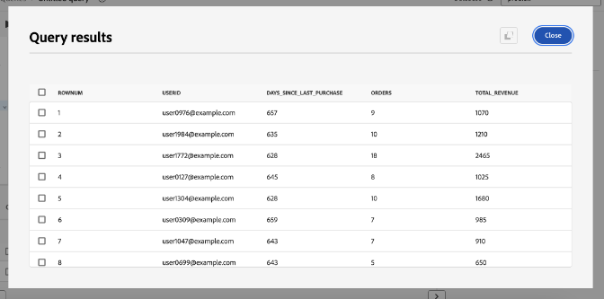
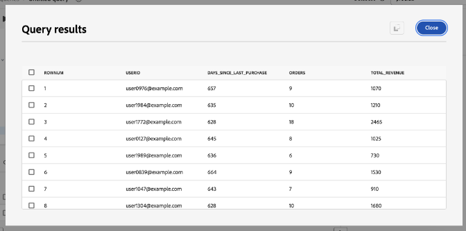
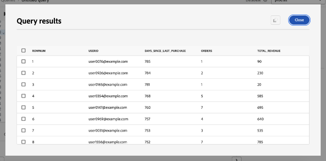
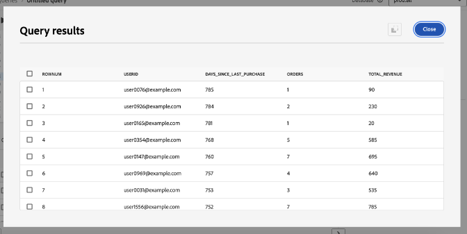
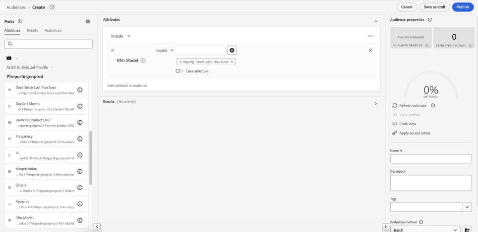

# Conseils pour optimiser la valeur avec Adobe Experience Platform Data Distiller - OS656

Cette page contient l’exemple de jeu de données vous permettant d’appliquer ce que vous avez appris dans la session Adobe Summit « OS656 - Conseils pratiques pour optimiser la valeur avec Adobe Experience Platform Data Distiller ». Vous apprendrez à accélérer les mises en œuvre d’Adobe Real-Time Customer Data Platform et de Journey Optimizer en enrichissant les données du profil client en temps réel. Cet enrichissement tire parti d’informations détaillées sur les modèles de comportement des clients pour créer des audiences pour la diffusion et l’optimisation de l’expérience.

Grâce à l’étude de cas Luma, vous allez analyser les données comportementales des utilisateurs et créer un modèle *Récence, fréquence, monétaire (RFM)*, une technique d’analyse marketing pour la segmentation de la clientèle en fonction des modèles d’achat.

## Prérequis

Pour exécuter ce cas d’utilisation, votre instance Adobe Experience Platform doit disposer d’une licence pour [Data Distiller](./overview.md). Pour plus d’informations, contactez votre représentant Adobe.

## Présentation du modèle RFM {#rfm-overview}

RFM, abréviation de Récence (R), Fréquence (F) et Monétaire (M), est une approche axée sur les données de la segmentation et de l’analyse des clients. Cette méthodologie évalue trois aspects clés du comportement du client : la date à laquelle un client a effectué un achat, la fréquence à laquelle il s’engage et le montant qu’il dépense. En quantifiant ces facteurs, les entreprises peuvent obtenir des informations exploitables sur les segments de clientèle et développer des stratégies marketing ciblées qui répondent mieux aux besoins individuels des clients.

## Comprendre le comportement des clients avec le modèle RFM {#understand-customer-behavior}

Le modèle RFM segmente les clients en fonction du comportement transactionnel à l’aide de trois paramètres clés.

- La **Récence** mesure le temps écoulé depuis le dernier achat d’un client, indiquant les niveaux d’engagement et le potentiel d’achat futur.
- Le tableau **Fréquence** indique la fréquence à laquelle un client interagit, ce qui constitue un indicateur clair de fidélité et d’engagement durable.
- **Valeur monétaire** évalue les dépenses totales des clients, en soulignant leur valeur globale pour l&#39;entreprise.

En combinant ces facteurs, les entreprises attribuent des scores numériques (généralement sur une échelle allant de `1` à `4`) à chaque client. Des scores plus bas indiquent des résultats plus favorables. Par exemple, un `1` de notation client dans toutes les catégories est considéré comme l’un des meilleurs, ce qui démontre une activité récente, un engagement élevé et des dépenses importantes.

## Avantages et limites du modèle RFM {#benefits-and-limitations}

Chaque technique de modélisation marketing implique des compromis, offrant à la fois des avantages et des limites. La modélisation RFM est un outil précieux pour comprendre le comportement des clients et affiner les stratégies marketing. Ses avantages incluent la segmentation des clients pour personnaliser les messages, optimiser les recettes et améliorer les taux de réponse, la rétention, la satisfaction et la valeur de durée de vie du client (CLTV).

Cependant, la modélisation RFM présente des limites. Il suppose une uniformité au sein des segments en fonction de la récence, de la fréquence et de la valeur monétaire, ce qui peut simplifier à l’excès le comportement des clients. Le modèle attribue également un poids égal à ces facteurs, ce qui peut donner une valeur client erronée. En outre, il ne prend pas en compte le contexte, comme les caractéristiques spécifiques au produit ou les préférences du client, ce qui peut entraîner de fausses interprétations du comportement d’achat.

## Créer une audience SQL dynamique basée sur les scores RFM {#build-a-dynamic-rfm-audience}

Avant de commencer l’étude de cas Luma, vous devez ingérer un exemple de jeu de données. Tout d’abord, [sélectionnez le lien pour télécharger le jeu de données `luma_web_data.zip` localement](../resources/luma_web_data.zip). L’exemple de jeu de données est un fichier csv au format .zip compressé pour s’aligner sur le cas d’utilisation. Décompressez ce fichier ZIP à l’aide d’Adobe Acrobat ou d’un outil d’extraction de fichiers approuvé, tel que l’utilitaire intégré de votre système d’exploitation. En pratique, vous pouvez généralement obtenir des données à partir d’Adobe Analytics, d’Adobe Commerce ou d’Adobe Web/Mobile SDK.

Tout au long de ce tutoriel, vous allez utiliser la Distiller de données pour extraire les événements et champs pertinents au format CSV normalisé. L’objectif est d’inclure uniquement les champs essentiels tout en conservant une structure de données plate pour plus d’efficacité et de facilité d’utilisation.

### Étape 1 : charger les données CSV dans Experience Platform {#upload-csv-data}

Pour charger un fichier CSV dans Adobe Experience Platform, procédez comme suit.

#### Créer un jeu de données à partir d’un fichier CSV {#create-a-dataset}

Dans l’interface utilisateur d’Experience Platform, sélectionnez **[!UICONTROL Jeux de données]** dans le rail de navigation de gauche, suivi de **[!UICONTROL Créer un jeu de données]**. Sélectionnez ensuite **[!UICONTROL Créer un jeu de données à partir d’un fichier CSV]** dans les options disponibles.

Le panneau [!UICONTROL Configurer le jeu de données] s’affiche. Dans le champ **[!UICONTROL Nom]**, saisissez le nom du jeu de données sous la forme « luma_web_data » et sélectionnez **[!UICONTROL Suivant]**.

Le panneau [!UICONTROL Ajouter des données] s’affiche. Faites glisser et déposez le fichier CSV dans la zone **[!UICONTROL Ajouter des données]** ou sélectionnez **[!UICONTROL Choisir un fichier]** pour parcourir le fichier et le charger.

Pour en savoir plus sur ce processus, consultez le [tutoriel sur l’ingestion par lots](../../ingestion/tutorials/ingest-batch-data.md) et le [workflow de création de jeu de données](../../catalog/datasets/user-guide.md#create) dans le guide de l’interface utilisateur des jeux de données.

#### Vérifier et terminer le chargement {#review-and-complete-upload}

Une fois le fichier chargé, un aperçu des données s’affiche au bas de l’interface utilisateur. Sélectionnez **[!UICONTROL Terminer]** pour terminer le chargement.


La vue des activités du jeu de données « luma_web_data » s’affiche. Le chargement manuel du fichier CSV
est ingéré sous la forme d’un lot et identifié par un [!UICONTROL Identifiant de lot]. Un panneau sur le côté droit affiche le nom du tableau comme `luma_web_data`.

>[!TIP]
>
>Lors de l’écriture de requêtes dans Data Distiller, utilisez le nom de la table au lieu du nom du jeu de données. Le nom du jeu de données est uniquement utilisé pour naviguer dans l’interface utilisateur.


<!--  
My table name is; luma_web_data_20250312_235611_817 Should we explain the suffix? 
-->

Une fois le traitement des données terminé, sélectionnez [!UICONTROL Prévisualiser le jeu de données] dans le coin supérieur droit pour prévisualiser le jeu de données. Voici comment l’aperçu du jeu de données s’affiche :


#### Considérations relatives aux schémas {#schema-considerations}

Un schéma XDM structuré (par exemple, schémas d’enregistrement, d’événement ou B2B) n’est pas nécessaire, car les données sont importées sous la forme d’un fichier CSV brut. Au lieu de cela, le jeu de données utilise un schéma ad hoc.

>[!TIP]
>
>Les schémas ad hoc sont des schémas XDM avec des champs dont l’espace de noms n’est utilisable que par un seul jeu de données. Les schémas ad hoc sont utilisés dans divers workflows d’ingestion de données pour Experience Platform et pour la création de certains types de connexions source.

Bien que Data Distiller prenne en charge tous les types de schéma, le jeu de données final à ingérer dans le profil client en temps réel utilisera un schéma XDM d’enregistrement.

### Étape 2 : Se connecter au lac de données et explorer les jeux de données disponibles {#connect-to-the-data-lake-and-explore-datasets}

L’étape suivante consiste à explorer les données du lac de données Adobe Experience Platform pour en assurer la précision et l’intégrité. Les données doivent être exactes et complètes pour générer des informations significatives, mais des erreurs, des incohérences ou des valeurs manquantes peuvent se produire lors des transferts de données. La vérification et l’exploration des données sont donc essentielles.

>[!TIP]
>
>Le lac de données stocke des données brutes non traitées, telles que des journaux d’événements, des données de parcours de navigation et des enregistrements ingérés en bloc, à des fins d’analyse et de traitement. Le magasin de profils contient des données d’identification des clients, y compris des événements d’identité regroupés et des informations d’attributs, pour prendre en charge la personnalisation et l’activation en temps réel.

Utilisez Data Distiller pour vérifier la qualité et l’exhaustivité des jeux de données au moyen de diverses opérations. Pour confirmer que les données ont été traduites avec précision lors de l’ingestion, exécutez `SELECT` requêtes pour les inspecter, les valider et les analyser. Ce processus permet d’identifier et de résoudre les incohérences ou les informations manquantes.

#### Exécuter une requête d’exploration de base {#basic-exploration-queries}

Dans l’interface utilisateur de Adobe Experience Platform, sélectionnez **[!UICONTROL Requêtes]** dans le rail de navigation de gauche, puis sélectionnez **[!UICONTROL Créer une requête]**. Le Query Editor s’affiche.

Collez la requête suivante dans l’éditeur et exécutez-la :

```sql
SELECT * FROM luma_web_data; 
```

Les résultats de la requête sont affichés sous le Query Editor dans l’onglet **[!UICONTROL Résultats]**. Pour développer les résultats dans une nouvelle boîte de dialogue, sélectionnez **[!UICONTROL Afficher les résultats]**. Les résultats ressemblent à l’image ci-dessous.


Pour plus d’informations, consultez le document [conseils généraux pour l’exécution des requêtes](../best-practices/writing-queries.md) .

#### Se concentrer sur les commandes et exclure les transactions annulées {#focus-orders-exclude-cancelled}

Le modèle RFM évalue la récence, la fréquence et la valeur monétaire en fonction des achats effectués. Les événements non transactionnels, tels que les pages vues et les interactions de passage en caisse, sont exclus de l’analyse. En outre, les commandes annulées doivent être supprimées, car elles ne contribuent pas à des calculs RFM valides et nécessitent une approche de traitement différente.

Pour garantir la précision :

- Identifiez les identifiants d’achat associés aux annulations et regroupez-les à l’aide de `GROUP BY`.
- Exclure ces identifiants d’achat du jeu de données.
- Filtrez les données pour ne conserver que les commandes terminées.

Les requêtes suivantes montrent comment identifier et exclure les commandes annulées du jeu de données.

Cette première requête sélectionne tous les identifiants d’achat non nuls associés à une annulation et les agrège à l’aide de `GROUP BY`. Les identifiants d’achat obtenus doivent être exclus du jeu de données.

```sql
CREATE VIEW orders_cancelled
AS
  SELECT purchase_id
  FROM   luma_web_data
  WHERE  event_type IN ( 'order', 'cancellation' )
         AND purchase_id IS NOT NULL
  GROUP  BY purchase_id
  HAVING Count(DISTINCT event_type) = 2; 
```

La deuxième requête récupère uniquement les identifiants d’achat qui ne se trouvent pas dans cet ensemble exclu.

```sql
SELECT *
FROM   luma_web_data
WHERE  purchase_id NOT IN (SELECT purchase_id
                           FROM   orders_cancelled)
        OR purchase_id IS NULL; 
```

La troisième requête supprime tous les événements non liés à une commande du jeu de données.

```sql
SELECT *
FROM   luma_web_data
WHERE  event_type = 'order'
       AND purchase_id NOT IN (SELECT purchase_id
                               FROM   orders_cancelled); 
```

### Étape 3 : enrichir les données à l’aide des fonctions de Distiller de données {#enrich-the-data}

Ensuite, utilisez Data Distiller pour extraire et transformer les données client, générer des scores RFM, agréger les transactions et segmenter les clients en fonction du comportement d’achat. Suivez ces étapes pour calculer les valeurs Récence, Fréquence et Monétaire (RFM), créer un modèle d’audience et préparer les informations pour l’activation.

#### Calculer le score RFM pour chaque ID utilisateur unique

Pour calculer les scores RFM, extrayez les champs clés des données brutes à l’aide du filtrage de champ.

La requête suivante s’appuie sur la logique de la section précédente en sélectionnant e-mail comme `userid`, car chaque commande nécessite une connexion par e-mail. Data Distiller applique la fonction `TO_DATE` pour convertir la date et l’heure au format de date. Le champ `total_revenue` représente le prix de chaque transaction et est ensuite agrégé en le additionnant pour chaque `userid`.

```sql
SELECT email AS userid, 
       purchase_id AS purchaseid, 
       price_total AS total_revenue, -- reflects the price for each individual transaction
       TO_DATE(timestamp) AS purchase_date -- converts timestamp to date format
FROM luma_web_data 
WHERE event_type = 'order' 
      AND purchase_id NOT IN (SELECT purchase_id FROM orders_cancelled) 
      AND email IS NOT NULL;
```

Les résultats ressemblent à l’image ci-dessous.


Créez ensuite un `TABLE` pour stocker les résultats de la requête précédente dans un jeu de données dérivé. Copiez et collez la commande suivante dans le Query Editor pour créer une `TABLE`.

```sql
CREATE TABLE IF NOT EXISTS order_data AS
  SELECT email              AS userid,
         purchase_id        AS purchaseid,
         price_total        AS total_revenue,
         To_date(timestamp) AS purchase_date
  FROM   luma_web_data
  WHERE  event_type = 'order'
         AND purchase_id NOT IN (SELECT purchase_id FROM orders_cancelled)
         AND email IS NOT NULL; 
```

Le résultat ressemble à l’image suivante, mais avec un identifiant de jeu de données différent.


Il est recommandé d’exécuter une requête d’exploration simple pour inspecter les données du jeu de données. Utilisez l’instruction suivante pour afficher vos données.

```sql
SELECT * FROM order_data;
```


#### Agréger les transactions pour générer les valeurs RFM {#aggregate-transactions}

Pour calculer les valeurs RFM, cette requête agrège les transactions pour chaque utilisateur.

La fonction `DATEDIFF(CURRENT_DATE, MAX(purchase_date)) AS days_since_last_purchase` calcule le nombre de jours écoulés depuis le dernier achat pour chaque utilisateur.

Utilisez la requête SQL suivante :

```sql
SELECT 
    userid, 
    DATEDIFF(CURRENT_DATE, MAX(purchase_date)) AS days_since_last_purchase, 
    COUNT(purchaseid) AS orders, 
    SUM(total_revenue) AS total_revenue 
FROM order_data 
GROUP BY userid;
```

Les résultats ressemblent à l’image ci-dessous.



Pour améliorer l’efficacité et la réutilisation des requêtes, créez un `VIEW` pour stocker les valeurs RFM agrégées.

```sql
CREATE VIEW rfm_values
AS
  SELECT userid,
         DATEDIFF(current_date, MAX(purchase_date)) AS days_since_last_purchase,
         COUNT(purchaseid)                          AS orders,
         SUM(total_revenue)                         AS total_revenue
  FROM   order_data
  GROUP BY userid; 
```

Le résultat ressemble à l’image suivante, mais avec un identifiant différent.


Là encore, il est recommandé d’exécuter une requête d’exploration simple pour examiner les données de la vue. Utilisez l’instruction suivante.

```sql
SELECT * FROM rfm_values;
```

La capture d’écran suivante présente un exemple de résultat de la requête, affichant les valeurs RFM calculées pour chaque utilisateur. Le résultat correspond à l&#39;identifiant de vue de la requête `CREATE VIEW`.



#### Générer le cube multidimensionnel RFM {#generate-multi-dimensional-cube}

Pour segmenter les clients en fonction de leurs scores RFM, utilisez un cube multidimensionnel RFM. La fonction de fenêtre `NTILE` trie les valeurs en intervalles classés et divise chaque dimension en quatre groupes égaux (quartiles), ce qui permet une segmentation structurée.

- Récence : les clients sont classés par date de dernier achat (`days_since_last_purchase`). Ceux qui ont acheté le produit le plus récemment font partie du groupe 1, tandis que ceux qui n&#39;ont pas acheté depuis le plus longtemps font partie du groupe 4.
- Fréquence : les clients sont classés par fréquence d’achat (`ORDER BY orders DESC`). Les acheteurs les plus fréquents sont dans le groupe 1, tandis que les moins fréquents sont dans le groupe 4.
- Monétaire : Les clients sont classés par dépenses totales (`total_revenue`). Les plus dépensiers se trouvent dans le groupe 1, tandis que les plus dépensiers se trouvent dans le groupe 4.

Exécutez la requête SQL suivante pour générer le cube multidimensionnel RFM :

```sql
SELECT userid,
       days_since_last_purchase,
       orders,
       total_revenue,
       5 - NTILE(4)
             OVER (
               ORDER BY days_since_last_purchase DESC) AS recency,
       NTILE(4)
         OVER (
           ORDER BY orders DESC)                       AS frequency,
       NTILE(4)
         OVER (
           ORDER BY total_revenue DESC)                AS monetization
FROM rfm_values; 
```

Les résultats ressemblent aux images ci-dessous.




Ensuite, utilisez l’instruction suivante pour créer un `VIEW` pour ces données.

La création d’un `VIEW` pour le cube multidimensionnel RFM améliore l’efficacité en stockant les données pré-segmentées, éliminant la nécessité de recalculer les scores RFM dans les requêtes futures. Il simplifie les instructions SQL, assure la cohérence des données et améliore la réutilisation pour une analyse plus approfondie.

```sql
CREATE OR replace VIEW rfm_scores
AS
  SELECT userid,
         days_since_last_purchase,
         orders,
         total_revenue,
         5 - NTILE(4)
               over (
                 ORDER BY days_since_last_purchase DESC) AS recency,
         NTILE(4)
           over (
             ORDER BY orders DESC)                       AS frequency,
         NTILE(4)
           over (
             ORDER BY total_revenue DESC)                AS monetization
  FROM   rfm_values;
```

Le résultat ressemble à l’image suivante, mais avec un ID d’affichage différent.


#### Modéliser les segments RFM {#model-rfm-segments}

Une fois les scores RFM calculés, les clients peuvent être classés dans les six segments prioritaires suivants :

1. `Core` : meilleurs clients avec une récence, une fréquence et une valeur monétaire élevées (récence = 1, fréquence = 1, monétaire = 1).
1. `Loyal` : clients fréquents qui sont cohérents, mais qui ne sont pas les plus dépensiers (fréquence = 1).
1. `Whales` : les plus dépensiers, indépendamment de la Récence et de la Fréquence (Monétaire = 1).
1. `Promising` : Dépensiers fréquents mais inférieurs (fréquence = 1, 2, 3 ; monétaire = 2, 3, 4).
1. `Rookies` : nouveaux clients avec une fréquence faible (Récence = 1, Fréquence = 4).
1. `Slipping` : clients anciennement fidèles avec une activité réduite (Récence = 2, 3, 4 ; Fréquence = 4).

Pour rationaliser l’accès et la réutilisation, créez un `VIEW` qui stocke les segments, scores et valeurs RFM.

Les instructions `CASE` dans le code SQL suivant classent les clients en segments en fonction de leurs scores RFM et attribuent les résultats à la variable `RFM_Model` .

+++Sélectionner pour afficher le SQL

```sql
CREATE OR replace VIEW rfm_model_segment
AS
  SELECT userid,
         days_since_last_purchase,
         orders,
         total_revenue,
         recency,
         frequency,
         monetization,
         CASE
           WHEN recency = 1
                AND frequency = 1
                AND monetization = 1 THEN '1. Core - Your Best Customers'
           WHEN recency IN( 1, 2, 3, 4 )
                AND frequency = 1
                AND monetization IN ( 1, 2, 3, 4 ) THEN
           '2. Loyal - Your Most Loyal Customers'
           WHEN recency IN( 1, 2, 3, 4 )
                AND frequency IN ( 1, 2, 3, 4 )
                AND monetization = 1 THEN
           '3. Whales - Your Highest Paying Customers'
           WHEN recency IN( 1, 2, 3, 4 )
                AND frequency IN ( 1, 2, 3 )
                AND monetization IN( 2, 3, 4 ) THEN
           '4. Promising - Faithful customers'
           WHEN recency = 1
                AND frequency = 4
                AND monetization IN ( 1, 2, 3, 4 ) THEN
           '5. Rookies - Your Newest Customers'
           WHEN recency IN ( 2, 3, 4 )
                AND frequency = 4
                AND monetization IN ( 1, 2, 3, 4 ) THEN
           '6. Slipping - Once Loyal, Now Gone'
         END RFM_Model
  FROM   rfm_scores; 
```

+++

Le `VIEW` généré suit la même structure que les créations précédentes, mais avec un identifiant différent.

Il est recommandé d’exécuter une requête d’exploration simple pour examiner les données de la vue. Utilisez l’instruction suivante.

<!-- Double check this SQL. I wrote it.- it was absent fom the KT doc. -->

```sql
SELECT * FROM rfm_model_segment;
```

<!-- Perhaps these VIEW results could be chopped? -->

Les captures d’écran suivantes affichent un exemple de résultat de la requête `SELECT * FROM rfm_model_segment;`, présentant les données du modèle RFM segmenté. La sortie reflète la structure du `VIEW` généré, y compris les segments de clients attribués en fonction des scores RFM.




### Étape 4 : utiliser SQL pour ingérer par lots des données RFM dans le profil client en temps réel {#sql-batch-ingest-rfm-data}

Ensuite, ingérez par lots des données client enrichies avec RFM dans le profil client en temps réel. Commencez par créer un jeu de données activé pour Profile et insérez les données transformées à l’aide de SQL.

#### Créer un jeu de données dérivé pour stocker les attributs RFM {#create-a-derived-dataset}

Comme ce jeu de données sera ingéré dans le magasin de profils, il nécessite une clé de partition.

>[!TIP]
>
>Le champ Identité principale sert de clé de partition, ce qui garantit des performances efficaces en matière de distribution, de récupération et de requête des données. L’affectation d’une identité principale à un espace de noms d’identité permet de regrouper les enregistrements de profil associés, optimisant ainsi les recherches et les mises à jour dans la banque de profils.

Créez un jeu de données vide pour stocker les attributs RFM et attribuer une identité principale.

Dans cette instruction SQL :

- `userId TEXT PRIMARY IDENTITY NAMESPACE 'Email'` : définit la colonne userId comme identité principale à l&#39;aide de l&#39;espace de noms « E-mail »&#x200B;
- `days_since_last_purchase INTEGER` : stocke le nombre de jours écoulés depuis le dernier achat de l’utilisateur&#x200B;
- `orders INTEGER` : représente le nombre total de commandes passées par l’utilisateur&#x200B;
- `total_revenue DECIMAL(18, 2)` : capture le chiffre d’affaires total généré par l’utilisateur, avec une précision allant jusqu’à 18 chiffres et deux décimales&#x200B;
- `recency INTEGER, frequency INTEGER, monetization INTEGER` : stockez les scores RFM respectifs pour l’utilisateur&#x200B;
- `rfm_model TEXT` : contient la classification de segment RFM affectée à l’utilisateur&#x200B;
- `WITH (LABEL = 'PROFILE')` : marque le tableau comme étant activé pour Profil dans Experience Platform, en s’assurant que les données ingérées contribuent à la création de profils clients en temps réel&#x200B;

>[!NOTE]
>
>L’espace de noms « E-mail » est un [espace de noms d’identité standard](../../identity-service/features/namespaces.md#standard) dans Adobe Experience Platform. Lors de la définition de champs d’identité, assurez-vous que l’espace de noms approprié est spécifié pour faciliter une résolution d’identité précise. &#x200B;
>
>Pour plus d’informations sur la définition des champs d’identité et l’utilisation des espaces de noms d’identité, reportez-vous à la [documentation du service d’identités](../../identity-service/home.md) ou au guide sur la [définition d’un champ d’identité dans l’interface utilisateur de Adobe Experience Platform](../../xdm/ui/fields/identity.md).

Query Editor prenant en charge l’exécution séquentielle, vous pouvez inclure les requêtes de création de table et d’insertion de données dans une seule session. Le code SQL suivant crée d&#39;abord une table activée pour Profile pour stocker les attributs RFM. Ensuite, il insère les données client enrichies RFM de `rfm_model_segment` dans la table `adls_rfm_profile`, en structurant chaque enregistrement sous votre espace de noms spécifique au client, qui est requis pour l’ingestion du profil client en temps réel.

Query Editor prenant en charge l’exécution séquentielle, vous pouvez exécuter les requêtes de création de table et d’insertion de données dans une seule session. Le code SQL suivant crée d&#39;abord une table activée pour Profile pour stocker les attributs RFM. Ensuite, il insère les données client enrichies RFM de `rfm_model_segment` dans la table `adls_rfm_profile`, en s’assurant que chaque enregistrement est correctement structuré sous votre espace de noms spécifique au client (`_{TENANT_ID}`). Cet espace de noms est essentiel pour l’ingestion du profil client en temps réel et la résolution précise des identités.

>[!IMPORTANT]
>
>Remplacez `_{TENANT_ID}` par l’espace de noms du client de votre organisation. Cet espace de noms est propre à votre organisation et garantit que toutes les données ingérées sont correctement affectées dans Adobe Experience Platform.

```sql
CREATE TABLE IF NOT EXISTS adls_rfm_profile (
    userId TEXT PRIMARY IDENTITY NAMESPACE 'Email', -- Primary identity field using the 'Email' namespace
    days_since_last_purchase INTEGER, -- Days since the last purchase
    orders INTEGER, -- Total number of orders
    total_revenue DECIMAL(18, 2), -- Total revenue with two decimal precision
    recency INTEGER, -- Recency score
    frequency INTEGER, -- Frequency score
    monetization INTEGER, -- Monetary score
    rfm_model TEXT -- RFM segment classification
) WITH (LABEL = 'PROFILE'); -- Enable the table for Real-Time Customer Profile

INSERT INTO adls_rfm_profile
SELECT STRUCT(userId, days_since_last_purchase, orders, total_revenue, recency,
              frequency, monetization, rfm_model) _{TENANT_ID}
FROM rfm_model_segment;
```

Le résultat de cette requête ressemble aux créations de jeux de données précédentes de ce playbook, mais avec un identifiant différent.

Après avoir créé le jeu de données, accédez à **[!UICONTROL Jeux de données]** > **[!UICONTROL Parcourir]** > `adls_rfm_profile` pour vérifier que le jeu de données est vide.


Vous pouvez également accéder à **[!UICONTROL Schémas]** > **[!UICONTROL Parcourir]** > `adls_rfm_profile` pour afficher le diagramme Schéma de profil individuel XDM de votre jeu de données nouvellement créé et de ses groupes de champs personnalisés.


#### Insérez des données dans le jeu de données dérivé nouvellement créé {#insert-data-into-derived-dataset}

Ensuite, insérez les données du `rfm_model_segment VIEW` dans `adls_rfm_profile`, qui est activé pour le profil client en temps réel.

Assurez-vous que l’ordre des champs dans la requête `SELECT` de l’instruction `INSERT` correspond exactement à la structure du `rfm_model_segment`. Cet alignement garantit que les valeurs de `rfm_model_segment` sont insérées correctement dans les champs correspondants de la table cible. Un mauvais alignement entre les champs source et cible peut entraîner des incohérences des données.

>[!NOTE]
>
>Cette requête s’exécute en mode batch, ce qui nécessite la création d’un cluster pour exécuter le processus. L’opération lit les données du lac de données, les traite dans le cluster et réécrit les résultats dans le lac de données.

```sql
INSERT INTO adls_rfm_profile
SELECT Struct(userid, days_since_last_purchase, orders, total_revenue, recency,
              frequency, monetization, rfm_model) _{TENANT_ID}
FROM   rfm_model_segment; 
```

Une fois l’opération terminée, la sortie de la requête affiche « Requête terminée » dans la console.

### Étape 5 : Planifier la requête pour le traitement par lots {#schedule-the-query}

Maintenant que votre code SQL génère un jeu de données dérivé et l’active pour le profil client en temps réel, l’étape suivante consiste à automatiser les mises à jour en planifiant l’exécution de la requête à des intervalles spécifiques. Grâce aux mises à jour automatiques des jeux de données, vous éliminez la nécessité d’une exécution manuelle.

#### Planifier l’exécution de la requête

Après avoir enregistré votre requête SQL, accédez à l’onglet **[!UICONTROL Modèles]** pour afficher la requête enregistrée et lancer le processus de planification. Il existe deux façons de planifier une requête :

Sélectionnez **[!UICONTROL Ajouter un planning]** dans la barre latérale droite.


Vous pouvez également sélectionner l’onglet **[!UICONTROL Plannings]** sous le nom du modèle, puis sélectionner **[!UICONTROL Ajouter un planning]**.


Pour plus d’informations sur la planification de requêtes, consultez la documentation [Plannings de requête](../ui/query-schedules.md).

La vue [!UICONTROL Détails de la planification] s’affiche. À partir de là, saisissez les détails suivants pour configurer le planning :

- **[!UICONTROL Fréquence D’Exécution]** : **Hebdomadaire**
- **[!UICONTROL Jour d&#39;exécution]** : **lundi et mardi**
- **[!UICONTROL Heure d’exécution de la planification]** : **10 h 10 UTC**
- **[!UICONTROL Période de planification]** : **17 mars au 30 avril 2025**

Sélectionnez **[!UICONTROL Enregistrer]** pour confirmer le planning.


Après avoir enregistré le planning, vous pouvez accéder à tout moment à l’onglet **[!UICONTROL Requêtes planifiées]** pour surveiller les tâches planifiées de la Distiller de données. Pour plus d’informations sur l’[affichage du statut d’exécution des requêtes, des messages d’erreur et des alertes](../ui/monitor-queries.md), consultez le document Surveillance des requêtes planifiées .

Une fois configurée, la requête SQL s’exécute automatiquement aux intervalles définis, garantissant ainsi que les données restent à jour sans nécessiter d’intervention manuelle.

### Étape 6 : créer et activer une audience basée sur RFM

<!-- double check this intro paragraph ... -->

Ce tutoriel propose deux méthodes pour créer et activer une audience basée sur RFM.

- Solution 1 : créez et activez une audience directement à l’aide de Data Distiller et de requêtes SQL.
- Solution 2 : définissez et gérez une audience dans l’interface utilisateur d’Experience Platform à l’aide d’attributs RFM précalculés, sans SQL.

Choisissez l’approche qui convient le mieux à votre workflow.

#### Solution 1 : Audience SQL via Data Distiller {#data-distiller-sql-audience}

Utilisez la commande `CREATE AUDIENCE AS SELECT` pour définir une nouvelle audience. L’audience créée est enregistrée dans un jeu de données et enregistrée dans l’espace de travail **[!UICONTROL Audiences]** sous **[!UICONTROL Distiller de données]**.

Les audiences créées à l’aide de l’extension SQL sont automatiquement enregistrées sous l’origine [!UICONTROL Distiller de données] dans l’espace de travail [!UICONTROL Audiences]. Dans [Audience Portal](../../segmentation/ui/audience-portal.md), vous pouvez afficher, gérer et activer vos audiences selon vos besoins.


Pour plus d’informations sur les audiences SQL, consultez la [documentation sur les audiences Data Distiller](../data-distiller-audiences/overview.md). Pour savoir comment gérer les audiences dans l’interface utilisateur, consultez la [présentation du portail Audiences](../../segmentation/ui/audience-portal.md#audience-list).

#### Créer une audience {#create-an-audience}

Pour créer une audience, utilisez les commandes SQL suivantes :

```sql
-- Define an audience for best customers based on RFM scores
CREATE AUDIENCE rfm_best_customer 
WITH (
    primary_identity = _{TENANT_ID}.userId, 
    identity_namespace = queryService
) AS ( 
    SELECT * FROM adls_rfm_profile 
    WHERE _{TENANT_ID}.recency = 1 
        AND _{TENANT_ID}.frequency = 1 
        AND _{TENANT_ID}.monetization = 1 
);

-- Define an audience that includes all customers
CREATE AUDIENCE rfm_all_customer 
WITH (
    primary_identity = _{TENANT_ID}.userId, 
    identity_namespace = queryService
) AS ( 
    SELECT * FROM adls_rfm_profile 
);

-- Define an audience for core customers based on email identity
CREATE AUDIENCE rfm_core_customer 
WITH (
    primary_identity = _{TENANT_ID}.userId, 
    identity_namespace = Email
) AS ( 
    SELECT * FROM adls_rfm_profile 
    WHERE _{TENANT_ID}.recency = 1 
        AND _{TENANT_ID}.frequency = 1 
        AND _{TENANT_ID}.monetization = 1 
);
```

#### Insérer une audience {#insert-an-audience}

Pour ajouter des profils à une audience existante, utilisez la commande `INSERT INTO` . Vous pouvez ainsi ajouter des profils individuels ou des audiences entières à un jeu de données d’audience existant.

```sql
-- Insert profiles into the audience dataset
INSERT INTO AUDIENCE adls_rfm_audience 
SELECT 
    _{TENANT_ID}.userId, 
    _{TENANT_ID}.days_since_last_purchase, 
    _{TENANT_ID}.orders, 
    _{TENANT_ID}.total_revenue, 
    _{TENANT_ID}.recency, 
    _{TENANT_ID}.frequency, 
    _{TENANT_ID}.monetization 
FROM adls_rfm_profile 
WHERE _{TENANT_ID}.rfm_model = '6. Slipping - Once Loyal, Now Gone';
```

#### Ajout de profils à une audience {#add-profiles-to-audience}

Utilisez les commandes SQL suivantes pour créer et renseigner une audience :

```sql
-- Create an empty audience dataset
CREATE AUDIENCE adls_rfm_audience 
WITH (
    primary_identity = userId, 
    identity_namespace = Email
) AS 
SELECT 
    CAST(NULL AS STRING) userId, 
    CAST(NULL AS INTEGER) days_since_last_purchase, 
    CAST(NULL AS INTEGER) orders, 
    CAST(NULL AS DECIMAL(18,2)) total_revenue, 
    CAST(NULL AS INTEGER) recency, 
    CAST(NULL AS INTEGER) frequency, 
    CAST(NULL AS INTEGER) monetization, 
    CAST(NULL AS STRING) rfm_model 
WHERE FALSE;
```

#### Suppression d’une audience {#delete-an-audience}

Pour supprimer une audience existante, utilisez la commande `DROP AUDIENCE` . Si l’audience n’existe pas, une exception se produit, sauf si `IF EXISTS` est spécifié.

Utilisez la commande SQL suivante pour supprimer une audience :

```sql
DROP AUDIENCE IF EXISTS adls_rfm_audience;
```

#### Solution 2 : créer une audience avec des attributs RFM {#create-audience-with-rfm-attributes}

Utilisez des attributs RFM pour segmenter les utilisateurs en fonction de leur comportement et de leurs caractéristiques. Cette section vous guide tout au long de l’interface utilisateur de Adobe Experience Platform pour définir une audience à l’aide des scores RFM.

Pour vérifier que les données ont été chargées dans le profil client en temps réel, accédez à **[!UICONTROL Clients] > [!UICONTROL Profils] > [!UICONTROL Parcourir]**. Sélectionnez **[!UICONTROL Espace de noms d’identité]** comme `Email` et saisissez `user0076@example.com`. Vérifiez les détails du profil pour vous assurer qu’il contient les attributs RFM attendus.


Pour parcourir les audiences existantes, sélectionnez **[!UICONTROL Audiences]** dans le panneau de navigation de gauche et assurez-vous que l’onglet **[!UICONTROL Parcourir]** est sélectionné. La liste des audiences disponibles dans le sandbox s’affiche. La sélection d’une audience affiche sa description, les règles de qualification et le nombre de profils inclus.

Pour créer une audience, sélectionnez **[!UICONTROL Créer une audience]** dans le coin supérieur droit. Une boîte de dialogue s’affiche avec deux options. Sélectionnez **[!UICONTROL Créer une règle]** puis **[!UICONTROL Créer]**.


L’interface utilisateur Composition d’audience permet d’accéder aux attributs de profil. Accédez à **[!UICONTROL Attributs] > [!UICONTROL Profil individuel XDM]** pour afficher les attributs disponibles.

Pour plus d’informations sur l’utilisation de la composition de l’audience, consultez le guide [Guide de l’interface utilisateur de la composition de l’audience](../../segmentation/ui/audience-composition.md). Pour plus d’informations sur l’utilisation du créateur de segments, consultez le [guide de l’interface utilisateur du créateur de segments](../../segmentation/ui/segment-builder.md).


Les attributs personnalisés créés dans Data Distiller sont stockés dans le dossier correspondant au nom de l’espace de noms du client, qui s’affiche à côté du nom du sandbox. Ces attributs peuvent être utilisés pour définir des critères de segmentation d’audience.


Pour créer une audience à l’aide d’attributs RFM, faites glisser l’attribut `Rfm_Model` dans le compositeur d’audience, puis déposez-le. Ces attributs peuvent être utilisés pour les audiences Edge, en flux continu et par lots.



Pour finaliser l’audience, sélectionnez **[!UICONTROL Enregistrer et publier]** dans le coin supérieur droit. Après l’enregistrement, l’audience nouvellement créée apparaît dans l’espace de travail [!UICONTROL Audiences], où vous pouvez consulter son résumé et ses critères de qualification.

Utilisez le créateur de segments pour accéder aux attributs RFM dérivés et concevoir des audiences supplémentaires. Activez l’audience SQL nouvellement créée en fonction des scores RFM et envoyez-la à n’importe quelle destination préférée, y compris Adobe Journey Optimizer.
