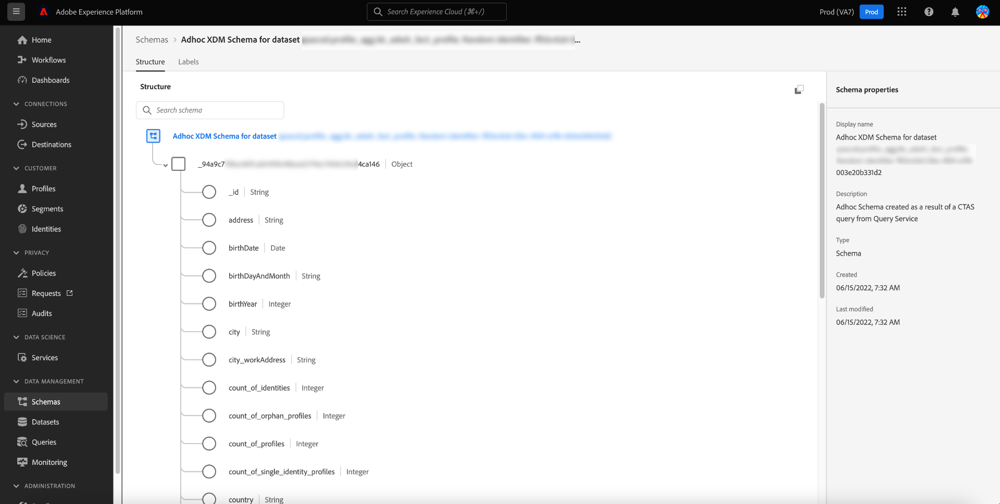

# Prise en charge du contrôle d’accès basé sur les attributs pour les schémas ad hoc

Toutes les données introduites dans Adobe Experience Platform sont encapsulées par des schémas de modèle de données d’expérience (XDM) et peuvent être soumises à des restrictions d’utilisation définies par votre organisation ou par des réglementations légales.

L’exécution d’une requête CTAS par le biais de Query Service lorsqu’aucun schéma n’est spécifié génère automatiquement un schéma ad hoc. Il est souvent nécessaire de restreindre l’utilisation de certains champs ou jeux de données de schémas ad hoc pour contrôler l’accès à des données personnelles sensibles et à des informations d’identification personnelle. Adobe Experience Platform facilite ce contrôle d’accès en vous permettant d’étiqueter les champs de schéma via l’interface utilisateur d’Experience Platform à l’aide de la fonctionnalité de contrôle d’accès basé sur les attributs.

Vous pouvez appliquer les libellés à tout moment, ce qui vous offre une certaine flexibilité quant à la manière dont vous choisissez de gérer les données. Bien qu’il soit recommandé de libeller les données dès qu’elles sont ingérées dans Experience Platform, ou dès que les données sont disponibles pour une utilisation dans Experience Platform.

Les libellés basés sur des schémas constituent un composant important du contrôle d’accès basé sur les attributs. Ils permettent de mieux gérer l’accès accordé aux utilisateurs ou groupes d’utilisateurs. Adobe Experience Platform vous permet de restreindre l’accès à n’importe quel champ d’un schéma ad hoc en créant et en appliquant des libellés.

Ce document fournit un tutoriel permettant de gérer l’accès aux données sensibles en appliquant des libellés aux champs de données des schémas ad hoc générés via Query Service.

## Prise en main

Ce guide nécessite une compréhension professionnelle des composants suivants d’Adobe Experience Platform :

* [Système de modèle de données d’expérience (XDM)](../../xdm/home.md) : cadre normalisé selon lequel Experience Platform organise les données d’expérience client.
   * [[!DNL Schema Editor]](../../xdm/ui/overview.md) : découvrez comment créer et gérer des schémas et d’autres ressources dans l’interface utilisateur d’Experience Platform.
* [[!DNL Data Governance]](../../data-governance/home.md) : découvrez comment [!DNL Data Governance] vous permet de gérer les données client et de garantir la conformité aux réglementations, aux restrictions et aux politiques applicables à l’utilisation des données.
* [Contrôle d’accès basé sur les attributs](../../access-control/abac/overview.md) : le contrôle d’accès basé sur les attributs est une fonctionnalité de Adobe Experience Platform qui permet aux administrateurs de contrôler l’accès à des objets et/ou fonctionnalités spécifiques en fonction d’attributs. Les attributs peuvent être des métadonnées ajoutées à un objet, comme un libellé ajouté à un champ de schéma ad hoc ou normal. Un administrateur définit des politiques d’accès qui comprennent des attributs afin de gérer les autorisations d’accès des utilisateurs.

## Créer un schéma ad hoc

Une fois votre requête exécutée et les résultats générés, un schéma ad hoc est automatiquement généré et ajouté à l’inventaire des schémas.

Pour ajouter un libellé de données, accédez à l’onglet de navigation du tableau de bord [!UICONTROL Schémas] en sélectionnant [!UICONTROL Schémas] dans le rail gauche de l’interface utilisateur d’Experience Platform. L’inventaire des schémas s’affiche.

>[!NOTE]
>
>Les schémas ad hoc ne s’affichent pas par défaut dans l’inventaire des schémas.

## Découvrir les schémas ad hoc dans l’inventaire des schémas de l’interface utilisateur d’Experience Platform {#discover-ad-hoc-schemas}

Pour activer l’affichage des schémas ad hoc dans l’interface utilisateur d’Experience Platform, sélectionnez l’icône de filtre () à gauche du champ de recherche, puis sélectionnez **[!UICONTROL Afficher les schémas ad hoc] dans le rail de gauche qui s’affiche.

Sélectionnez le nom du schéma ad hoc récemment créé dans la liste disponible. Une visualisation de la structure du schéma ad hoc s’affiche.

## Modifier les libellés de gouvernance

Pour modifier les libellés de données de votre schéma ad hoc, sélectionnez l’onglet [!UICONTROL Libellés]. L’espace de travail des libellés vous permet d’appliquer, de créer et de modifier des libellés à vos champs de schéma ad hoc et de contrôler les autorisations d’accès via l’interface utilisateur. Tous les champs du schéma ad hoc sont représentés ici.

## Modifier les libellés du schéma ou du champ

Pour modifier les libellés de l’ensemble du schéma, sélectionnez l’icône en forme de crayon () sur le côté du nom du schéma sous l’onglet [!UICONTROL Libellés].

Pour appliquer un libellé à un champ existant, sélectionnez un ou plusieurs champs dans la liste, puis [!UICONTROL Modifier les libellés de gouvernance] dans la barre latérale droite.

## Fenêtre contextuelle Modifier les libellés

La fenêtre contextuelle [!UICONTROL &#x200B; Modifier les libellés &#x200B;] s’affiche. De ce point de vue, vous pouvez créer ou modifier des libellés de gouvernance existants par le biais de l’interface utilisateur.

Consultez la documentation pour obtenir des conseils sur la [création ou modification des libellés pour le schéma ou le champ sélectionné](../../xdm/tutorials/labels.md#edit-the-labels-for-the-schema-or-field).

>[!NOTE]
>
>La création ou la modification d’un libellé existant nécessite des autorisations d’administrateur pour votre organisation. Si vous ne disposez pas des privilèges d’administrateur, contactez votre administrateur système pour organiser l’accès.

Vous pouvez également créer des libellés à l’aide de l’espace de travail Autorisations . Pour obtenir des instructions, consultez le guide [&#x200B; sur la création de libellés dans l’espace de travail Autorisations &#x200B;](../../access-control/abac/ui/labels.md) .

Une fois le niveau approprié de contrôle d’accès basé sur les attributs appliqué, le comportement système suivant s’applique à toute requête exécutée via Query Service lorsqu’un utilisateur ou une utilisatrice tente d’accéder à des données non accessibles :

1. Si l’accès à l’un des champs d’un schéma lui est refusé, il ne pourra pas lire ni écrire dans le champ restreint. Cela s’applique aux scénarios courants suivants :

   * Lorsqu’un utilisateur ou une utilisatrice tente d’exécuter une requête avec une colonne restreinte uniquement, le système renvoie une erreur indiquant que la colonne n’existe pas.
   * Lorsque l’utilisateur tente d’exécuter une requête avec plusieurs colonnes comprenant une colonne restreinte, le système renvoie une sortie pour toutes les colonnes non restreintes uniquement.

1. Si un utilisateur ou une utilisatrice demande l’accès à un champ calculé, il ou elle doit avoir accès à tous les champs utilisés dans la composition, sinon le système lui refusera l’accès au champ calculé.

Si une identité ou une identité principale est définie sur un schéma ad hoc, le système honore automatiquement toutes les demandes d’hygiène des données associées et nettoie les données de ces jeux de données liées à la colonne d’identité.

## Étapes suivantes

Vous êtes arrivé au bout de ce document. À présent, vous comprenez mieux comment ajouter des libellés d’utilisation des données aux schémas ad hoc créés par le biais de requêtes CTAS Query Service. Si vous ne l’avez pas déjà fait, les documents suivants sont utiles pour améliorer votre compréhension de la gouvernance des données dans Query Service :

* [Identités de schéma ad hoc](./ad-hoc-schema-identities.md)
* [Gouvernance des données](../../data-governance/home.md)
