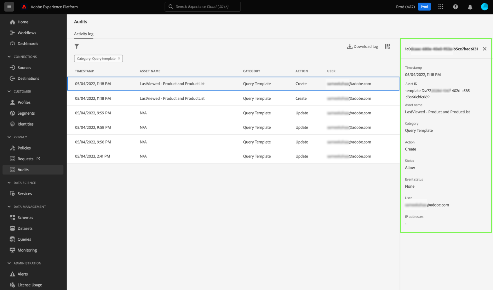

# [!DNL Query Service] intégration du journal d’audit

Adobe Experience Platform [!DNL Query Service] l’intégration du journal d’audit fournit des enregistrements des actions utilisateur liées aux requêtes. Les journaux d’audit sont un outil essentiel pour résoudre les problèmes et respecter les politiques de gestion des données d’entreprise et les exigences réglementaires. La fonctionnalité vous permet de renvoyer un journal des actions pour de nombreux types d’événements, de filtrer et d’exporter les enregistrements. Les journaux sont accessibles via l’interface utilisateur de Platform ou le [API de requête d’audit](https://www.adobe.io/experience-platform-apis/references/audit-query/) et téléchargés au format CSV ou JSON.

Pour en savoir plus sur l’interface utilisateur des journaux d’audit, reportez-vous à la section [document d’aperçu des journaux d’audit](../../landing/governance-privacy-security/audit-logs/overview.md). Pour en savoir plus sur les appels aux API Platform, reportez-vous à la section [guide de l’API des journaux d’audit](../../landing/api-guide.md).

## Conditions préalables

Vous devez avoir la variable [!DNL Data Governance] [!UICONTROL Afficher le journal d’activité utilisateur] autorisation activée pour afficher le tableau de bord du journal d’audit dans l’interface utilisateur de Platform. L’autorisation est activée via l’[Admin Console](https://adminconsole.adobe.com/) d’Adobe. Contactez l’administrateur ou administratrice de votre organisation si vous ne disposez pas des privilèges d’administrateur pour activer cette autorisation. Consultez la documentation sur le contrôle d’accès pour des [instructions complètes sur l’ajout d’autorisations via Admin Console](../../access-control/home.md).

## [!DNL Query Service] catégories du journal d’audit {#audit-log-categories}

Catégories de journal d’audit fournies par [!DNL Query Service] sont les suivantes.

| Catégorie | Description |
|---|---|
| [!UICONTROL Requête] | Cette catégorie permet de contrôler les exécutions de requête. |
| [!UICONTROL Modèle de requête] | Cette catégorie permet de contrôler les différentes actions (création, mise à jour et suppression) effectuées sur un modèle de requête. |
| [!UICONTROL Requête planifiée] | Cette catégorie vous permet de contrôler les plannings qui ont été créés, mis à jour ou supprimés dans [!DNL Query Service]. |

## Effectuez une [!DNL Query Service] journal d’audit {#perform-an-audit-log}

Pour effectuer un audit pour [!DNL Query Service] activités, sélectionnez **[!UICONTROL Audits]** dans le volet de navigation de gauche, suivi de l’icône d’entonnoir () pour afficher une liste de contrôles de filtre afin de limiter les résultats.

Dans la [!UICONTROL Audits] tableau de bord [!UICONTROL Journal d’activité] vous pouvez filtrer toutes les actions de Platform enregistrées selon l’une des options [!DNL Query Service] catégories. Les résultats du journal peuvent être filtrés davantage en fonction de la période pendant laquelle ils ont été exécutés, de l’action/de la fonction entreprise ou de l’utilisateur ayant déclenché la requête. Consultez la documentation du journal d’audit pour [instructions complètes sur la manière de filtrer les journaux en fonction de la catégorie, de l’action, de l’utilisateur et de l’état](../../landing/governance-privacy-security/audit-logs/overview.md#managing-audit-logs-in-the-ui).

Les données du journal d’audit renvoyées contiennent les informations suivantes sur toutes les requêtes qui répondent aux critères de filtrage de votre choix.

| Nom de la colonne | Description |
|---|---|
| [!UICONTROL Date et heure] | La date et l’heure exactes de l’action effectuée dans une `month/day/year hour:minute AM/PM` format. |
| [!UICONTROL Nom de la ressource] | La valeur de la variable [!UICONTROL Nom de la ressource] dépend de la catégorie choisie comme filtre. Lors de l’utilisation de la variable [!UICONTROL Requête planifiée] catégorie il s’agit de la **nom du planning**. Lors de l’utilisation de la variable [!UICONTROL Modèle de requête] catégorie, il s’agit de la **nom du modèle**. Lors de l’utilisation de la variable [!UICONTROL Requête] catégorie, il s’agit de la **session ID** |
| [!UICONTROL Catégorie] | Ce champ correspond à la catégorie que vous avez sélectionnée dans la liste déroulante des filtres. |
| [!UICONTROL Action] | Il peut s’agir de créer, supprimer, mettre à jour ou exécuter . Les actions disponibles dépendent de la catégorie choisie comme filtre. |
| [!UICONTROL Utilisateur] | Ce champ indique l’ID utilisateur qui a exécuté la requête. |

>[!NOTE]
>
>Pour plus d’informations sur les requêtes, téléchargez les résultats du journal dans des formats de fichiers CSV ou JSON, par défaut, affichés dans le tableau de bord du journal d’audit.

## Panneau Détails

Sélectionnez une ligne de résultats du journal d’audit pour ouvrir un panneau de détails à droite de l’écran.

Le panneau Détails peut être utilisé pour rechercher la variable [!UICONTROL ID de ressource] et le [!UICONTROL Statut de l’événement].

La valeur de la variable [!UICONTROL ID de ressource] change en fonction de la catégorie utilisée dans l’audit.

* Lors de l’utilisation de la variable [!UICONTROL Requête] la catégorie, [!UICONTROL ID de ressource] est la valeur  **session ID**.
* Lors de l’utilisation de la variable [!UICONTROL Modèle de requête] la catégorie, [!UICONTROL ID de ressource] est la valeur **ID de modèle** et précédé du préfixe `[!UICONTROL templateID:]`.
* Lors de l’utilisation de la variable [!UICONTROL Requête planifiée] la catégorie, [!UICONTROL ID de ressource] est la valeur  **ID de planification** et précédé du préfixe `[!UICONTROL scheduleID:]`.

La valeur de la variable [!UICONTROL Statut de l’événement] change en fonction de la catégorie utilisée dans l’audit.

* Lors de l’utilisation de la variable [!UICONTROL Requête] la catégorie, [!UICONTROL Statut de l’événement] fournit une liste de tous les **ID de requête** exécuté par l’utilisateur au cours de cette session.
* Lors de l’utilisation de la variable [!UICONTROL Modèle de requête] la catégorie, [!UICONTROL Statut de l’événement] fournit la variable **nom du modèle** comme préfixe de l’état de l’événement.
* Lors de l’utilisation de la variable [!UICONTROL Planning de requête] la catégorie, [!UICONTROL Statut de l’événement] fournit la variable **nom du planning** comme préfixe de l’état de l’événement.

## Filtres disponibles pour [!DNL Query Service] catégories du journal d’audit {#available-filters}

Les filtres disponibles varient en fonction de la catégorie sélectionnée dans la liste déroulante. Le tableau suivant détaille les filtres disponibles pour [[!DNL Query Service] catégories du journal d’audit](#audit-log-categories).

| Filtre | Description |
|---|---|
| Catégorie | Voir [[!DNL Query Service] catégories du journal d’audit](#audit-log-categories) pour obtenir une liste complète des catégories disponibles. |
| Action | En ce qui concerne [!DNL Query Service] catégories d’audit, la mise à jour est une **modification du formulaire existant**, la suppression correspond à la propriété **suppression du planning ou du modèle**, créer est **création d’un nouveau planning ou d’un nouveau modèle**, et l’exécution est **exécution d’une requête**. |
| Utilisateur | Saisissez l’ID utilisateur complet (par exemple, johndoe@acme.com) à filtrer par utilisateur. |
| Statut | Le [!UICONTROL Autoriser], [!UICONTROL Succès], et [!UICONTROL Échec] Les options filtrent les journaux en fonction de l’état ou de l’état de l’événement, tandis que la variable [!UICONTROL Refuser] l’option sera filtrée. **all** journaux. |
| Date | Sélectionnez une date de début et/ou une date de fin pour définir une période en fonction de laquelle filtrer les résultats. |

## Étapes suivantes

En lisant ce document, vous comprenez mieux les [!DNL Query Service] la fonctionnalité de journal d’audit et son utilisation pour filtrer votre [!DNL Query Service] actions de l’utilisateur.

Si vous utilisez la variable [!DNL Query Service] la fonctionnalité de journal d’audit à des fins de dépannage, il est recommandé de lire la [guide de dépannage](../troubleshooting-guide.md).
