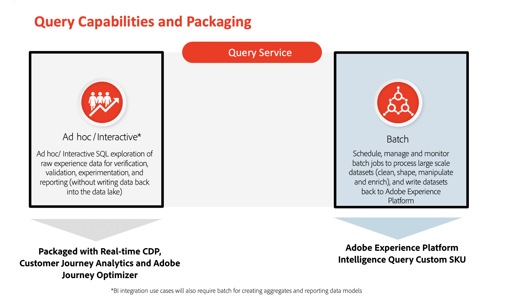

# Barrières de sécurité pour Query Service

Les barrières de sécurité sont des seuils qui fournissent des conseils pour l’utilisation des données et du système, l’optimisation des performances et la prévention des erreurs ou des résultats inattendus dans Adobe Experience Platform.

Ce document fournit des limites d’utilisation par défaut pour les données de Query Service afin de vous aider à optimiser les performances du système lors de l’interrogation de données par rapport à vos droits de licence.

## Conditions préalables

Avant de poursuivre ce document, vous devez bien comprendre les deux fonctionnalités clés de Query Service décrites ci-dessous :

* **Requêtes ad hoc**: Pour exécuter `SELECT` requêtes pour explorer, tester et valider les données où les résultats des requêtes **ne sont pas stockés** sur le lac de données.

* **Requêtes par lots**: Pour exécuter `INSERT TABLE AS SELECT` et `CREATE TABLE AS SELECT` requêtes pour nettoyer, former, manipuler et enrichir les données. Les résultats de ces requêtes **sont stockées** sur le lac de données. La mesure permettant de mesurer la consommation de cette fonctionnalité est les heures de calcul.

L’illustration ci-dessous résume la manière dont les fonctionnalités de Query Service sont actuellement mises en package et sous licence :

## Types de limite

Ce document comprend deux types de limites par défaut :

* **Soft limit**: Vous pouvez dépasser cette limite ; toutefois, les limites souples fournissent une indication recommandée pour les performances du système.

* **Limite maximale**: Une limite stricte fournit un maximum absolu.

>[!NOTE]
>
>Les limites par défaut décrites dans ce document sont constamment améliorées. Consultez régulièrement les mises à jour.

## Barrières de sécurité des performances des Principales entités

Les tableaux ci-dessous contiennent les descriptions et limites recommandées pour l’exécution des requêtes lors de l’utilisation d’un modèle de requête particulier.

**Requêtes ad hoc**

| **Barrière de sécurité** | **Limite** | **Type de limite** | **Description** |
|---|---|---|---|
| Durée maximale d’exécution | 10 minutes | Hard | Cela définit le temps de sortie maximal pour une requête SQL ad hoc. Le dépassement de la limite de temps pour renvoyer un résultat renvoie le code d’erreur 53400. |
| Concurrence des requêtes | <ul><li>Comme spécifié dans la description du produit de l’application.</li><li>+1 (avec l’achat de chaque module complémentaire SKU d’utilisateur de requête ad hoc supplémentaire)</li></ul> | Hard | Cela définit le nombre de requêtes pouvant être exécutées simultanément pour une organisation particulière. Si la limite de simultanéité est dépassée, les requêtes sont mises en file d&#39;attente. |
| Connecteur client et limite de sortie de résultat | Connecteur client<ul><li>Interface utilisateur de requête (100 lignes)</li><li>Client tiers (50 000)</li><li>[!DNL PostgresSQL] client (50 000)</li></ul> | Hard | Le résultat d&#39;une requête peut être reçu par les moyens suivants :<ul><li>UI Query Service</li><li>Client tiers</li><li>[!DNL PostgresSQL] client</li></ul>Remarque : L’ajout d’une limitation au nombre de sorties peut renvoyer des résultats plus rapidement. Par exemple, `LIMIT 5`, `LIMIT 10`, etc. |
| Résultats renvoyés via | Interface utilisateur du client | S/O | Cela définit la manière dont les résultats sont mis à la disposition des utilisateurs. |

{style=&quot;table-layout:auto&quot;}

**Requêtes par lots**

| **Barrière de sécurité** | **Limite** | **Type de limite** | **Description** |
|---|---|---|---|
| Durée maximale d’exécution | 24 heures | Hard | Cette option définit le temps d’exécution maximal d’une requête SQL par lot. Le temps de traitement d’une requête dépend du volume de données à traiter et de la complexité des requêtes. |
| Concurrence des utilisateurs | Aucune limitation d’utilisateur | S/O | Les requêtes par lots planifiées sont des tâches asynchrones, il n’y a donc aucune limitation de l’utilisateur. |
| Heures de calcul pour le traitement des données par lots | Comme spécifié dans la commande de ventes SKU personnalisé de la requête de renseignement Adobe Experience Platform du client | Soft | Cela définit la durée de calcul définie par chaque année pendant laquelle un client est autorisé à exécuter des requêtes par lots pour analyser, traiter et écrire des données dans le lac de données. |
| Concurrence des requêtes | Pris en charge | S/O | Les requêtes par lots planifiées sont des tâches asynchrones. Par conséquent, les requêtes simultanées sont prises en charge. |
| Connecteur client et limite de sortie des résultats | Connecteur client<ul><li>Interface utilisateur de requête (pas de limite supérieure pour les lignes)</li><li>Client tiers (pas de limite supérieure aux lignes)</li><li>[!DNL PostgresSQL] client (aucune limite supérieure aux lignes)</li><li>API REST (pas de limite supérieure pour les lignes)</li></ul> | Hard | Le résultat d&#39;une requête peut être rendu disponible à l&#39;aide des méthodes suivantes :<ul><li>Peut être stocké en tant que jeux de données dérivés</li><li>Peuvent être insérés dans les jeux de données dérivés existants</li></ul>Remarque : Il n’existe aucune limite supérieure au nombre d’enregistrements à partir du résultat de la requête. |
| Résultats renvoyés via | Jeu de données | S/O | Cela définit la manière dont les résultats sont mis à la disposition des utilisateurs. |

{style=&quot;table-layout:auto&quot;}

## Informations sur les tableaux de bord générés avec des requêtes {#dashboard-insights}

Pour s’assurer que chaque requête d’un tableau de bord des insights Real-time Customer Data Platform dispose de suffisamment de ressources pour s’exécuter efficacement, l’API effectue le suivi de l’utilisation des ressources en attribuant des emplacements simultanés à chaque requête. Le système peut traiter jusqu’à quatre requêtes simultanées. Par conséquent, quatre emplacements de requête simultanés sont disponibles à tout moment. Les requêtes sont placées dans une file d’attente en fonction des emplacements de simultanéité, puis patientez dans la file d’attente jusqu’à ce que suffisamment d’emplacements de simultanéité soient disponibles.

## Étapes suivantes

Après avoir lu ce document, vous devez mieux comprendre les limites par défaut pour l’exécution des requêtes avec les modèles de requête disponibles.

Pour plus d’informations sur Query Service, consultez la documentation suivante :

* [API Query Service](./api/getting-started.md)
* [UI Query Service](./ui/overview.md)
