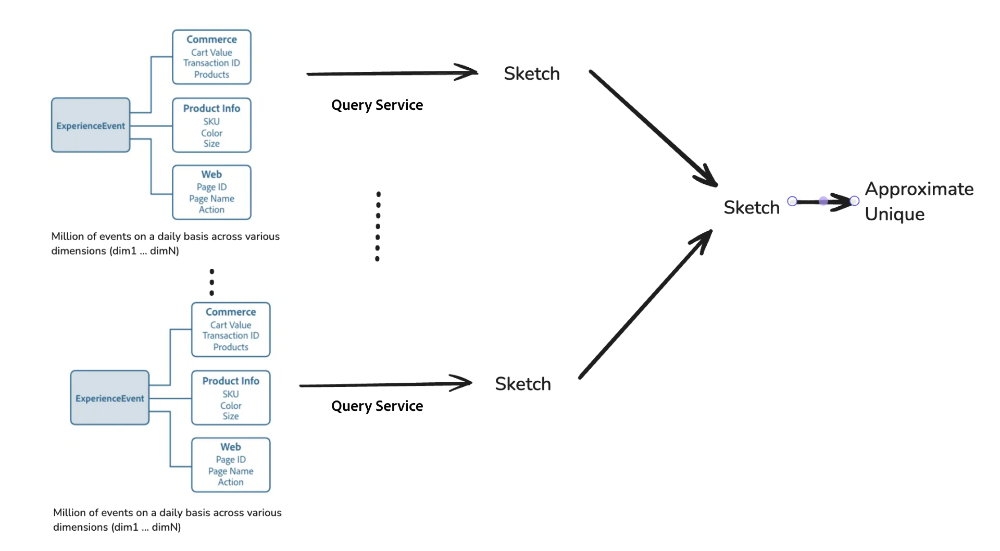

# Analyse Big Data efficace avec des hypercubes

>[!AVAILABILITY]
>
>Cette fonctionnalité n’est disponible que pour les utilisateurs qui ont acheté le [SKU de Data Distiller](../data-distiller/overview.md). Contactez votre représentant ou représentante Adobe pour plus d’informations.

Découvrez comment utiliser les hypercubes dans Adobe Experience Platform Experience Query Service pour effectuer des analyses de données avancées avec une efficacité accrue. Ce document explique comment utiliser des fonctions avancées de la [[!DNL Apache Datasketches] bibliothèque](https://datasketches.apache.org/) pour gérer des nombres distincts et des calculs complexes de manière incrémentielle, sans avoir à retraiter les données historiques à chaque fois.

Dans l’analyse Big Data, la génération de mesures telles que les décomptes distincts, les quantiles, les éléments les plus fréquents, les jointures et l’analyse graphique implique souvent un comptage non additif (où les résultats ne peuvent pas être simplement résumés à partir de sous-groupes). Les méthodes traditionnelles nécessitent de retraiter toutes les données historiques, ce qui peut nécessiter beaucoup de ressources et de temps. Utilisez des esquisses, qui sont des résumés compacts qui utilisent des probabilités pour représenter des jeux de données volumineux, et des fonctions avancées de Query Service pour rationaliser ce processus en réduisant la nécessité de recalculer.

## Fonctions clés des hypercubes {#key-functions}

Les hypercubes offrent plusieurs fonctions puissantes pour améliorer l&#39;efficacité et la flexibilité de l&#39;analyse des données.

1. **Compter les utilisateurs uniques ou les requêtes distinctes** : utilisez les fonctionnalités SQL pour générer un nombre unique d’utilisateurs interagissant avec différentes dimensions de données, telles que les consultations de produits, les visites de site ou l’activité commerciale, sans réanalyser à plusieurs reprises les données brutes.
2. **Traitement incrémentiel** : effectuez des mises à jour incrémentielles pour plier et fusionner des points de données dans les dimensions et le temps sans tout recalculer de A à Z.
3. **Analyse multidimensionnelle** : les hypercubes permettent le filtrage multidimensionnel et la réorganisation des données afin de créer des lignes de résumé qui représentent des combinaisons de dimensions. Ces résumés peuvent ensuite être utilisés pour générer des informations avec un temps de calcul minimal.

## Cas pratiques des hypercubes {#use-cases}

Utilisez des hypercubes pour générer efficacement des nombres distincts pour diverses interactions utilisateur, sans recalculer complètement les données à chaque fois. Voici quelques scénarios pratiques de leur utilisation :

- Analysez les visiteurs et visiteuses uniques qui consultent des produits spécifiques au cours d’une période définie.
- Identifier les utilisateurs qui interagissent avec plusieurs produits au cours d’une période donnée afin d’améliorer l’analyse des ventes croisées.
- Distinguer les utilisateurs qui interagissent avec un produit, mais pas avec un autre au fil du temps pour identifier les schémas de préférences.
- Combinez les données d’interaction en ligne et hors ligne pour obtenir une vue d’ensemble complète du comportement des utilisateurs sur une période donnée.
- Suivez les mouvements des utilisateurs dans différentes activités au sein d’un événement pour optimiser la disposition et les services.

## Avantages de l&#39;utilisation des hypercubes

Dans ces situations, vous pouvez précalculer des informations de base pour des catégories spécifiques. Cependant, lorsque vous analysez des données sur plusieurs dimensions et périodes, vous devez soit tout recalculer à partir des données brutes, soit utiliser un hypercube Query Service. Les hypercubes rationalisent le processus en organisant efficacement les données, ce qui permet un filtrage flexible et une analyse multidimensionnelle sans retraitement. Ils utilisent des fonctions avancées pour estimer les résultats rapidement et avec précision afin d’offrir des avantages clés tels que l’amélioration de l’efficacité du traitement, l’évolutivité et l’adaptabilité pour les tâches analytiques complexes.

### Efficacité de la taille des données pour le traitement des requêtes

Query Service peut compresser des millions ou des milliards de points de données (par exemple, des identifiants d’utilisateur) dans une forme compacte appelée esquisse. Cette esquisse a une taille de données considérablement réduite pour le traitement des requêtes, ce qui maintient l’évolutivité et permet de travailler beaucoup plus facilement et plus rapidement. Quelle que soit la taille des données d’origine, la taille de l’esquisse reste faible, ce qui rend l’analyse des données volumineuses beaucoup plus facile à gérer et efficace.

Le diagramme ci-dessous illustre la manière dont Commerce, les informations sur les produits et la dimension web ExperienceEvent sont traités sous forme d’esquisses, qui sont ensuite utilisées pour approximer des décomptes uniques.


### Fusionner des esquisses pour accélérer et faciliter l’analyse des données

Pour éviter de recalculer et améliorer la vitesse de traitement, vous pouvez fusionner des esquisses de différentes catégories ou groupes. Query Service simplifie également la conception en organisant vos données dans un hypercube, où chaque ligne devient un résumé de sa partition (un ensemble de dimensions) à côté de la colonne d’esquisse. Chaque ligne de l’hyper-cube contient la combinaison de dimensions mais ne contient aucune donnée brute. Lors de l’exécution d’une requête, spécifiez les colonnes dimensionnelles à utiliser pour créer des mesures additionnelles et fusionnez les esquisses de ces lignes.



### Rapport coût-efficacité {#cost-effectiveness}

Les données client sont souvent à grande échelle, mais vous pouvez éliminer la nécessité de retraiter les données historiques à l’aide d’un traitement incrémentiel. Les schémas sont beaucoup plus petits et permettent d’obtenir des résultats plus rapides en temps réel tout en économisant sur les ressources et les coûts de calcul. Cette transformation des données rend les requêtes interactives plus réalisables et plus efficaces.

## Présentation des fonctions

Cette section décrit comment chaque fonction optimise le traitement des données et améliore les capacités analytiques grâce à l’utilisation efficace des schémas et des hypercubes. Il présente leur objectif, un exemple de syntaxe, les paramètres et la sortie attendue.

### Créer des estimations de nombre uniques avec des schémas HLL

`hll_build_agg` est une fonction d’agrégat qui crée une esquisse HLL (HyperLogLog). Cette fonction est une méthode probabiliste compacte permettant d’estimer le nombre de valeurs uniques dans une colonne ou une expression d’un jeu de données groupé.

#### Définition de fonction

```sql
hll_build_agg(column [, lgConfigK])
```

**Usage:**

L’exemple suivant montre comment la fonction peut être structurée dans une requête.

```sql
SELECT
   [dim1, dim2 ... ,] hll_build_agg(coalesce(col1, col2, col3)) AS sketch_col
FROM fact_sketch_table
  [GROUP BY dimension1, dimension2 ...]
```

#### Paramètres

| Paramètre | Description |
|---------------------------|---------------------------------------|
| `column` | Nom de la colonne ou de la colonne sur laquelle créer une esquisse. |
| `lgConfigK` | *Int* (Facultatif) Log-base-2 de K, où K est le nombre de compartiments ou d&#39;emplacements pour l&#39;esquisse HLL. Valeur minimale : 4. Valeur max : 12. Valeur par défaut : 12. |

#### Sortie

| Colonne de sortie | Description |
|---------------------------|---------------------------------------|
| `sketch_res` | Colonne de type string contenant l’esquisse HLL singifiée. |

#### Exemple SQL

L’exemple suivant crée une esquisse agrégée sur la colonne `customer_id` :

```sql
SELECT
  country,
  hll_build_agg(customer_id, 10) AS sketch
FROM
  EXPLODE(
    ARRAY<STRUCT<country STRING, customer_id STRING, invoice_id STRING>>[
      ('UA', 'customer_id_1', 'invoice_id_11'),
      ('CZ', 'customer_id_2', 'invoice_id_22'),
      ('CZ', 'customer_id_2', 'invoice_id_23'),
      ('BR', 'customer_id_3', 'invoice_id_31'),
      ('UA', 'customer_id_2', 'invoice_id_24')
    ])
GROUP BY country;
```

**Exemple de sortie SQL :**

| Pays | Esquisse |
|---------|------------------------------------------------------------|
| UA | AgEHBAMAAgCR9mUEulKKCQAAAAAAAAAAAAAAAAAAAAAAAAAAAAAAAAAAA== |
| CZ | AgEHBAMAAQC6UooJAAAAAAAAAAAAAAAAAAAAAAAAAAAAAAAAAAAAAAAAA== |
| BR | AgEHBAMAAQCcmH0HAAAAAAAAAAAAAAAAAAAAAAAAAAAAAAAAAAAAAAAA== |

### Estimer les décomptes distincts avec des schémas HLL

`hll_estimate` est une fonction scalaire qui fournit une estimation du nombre distinct dans chaque ligne d’un jeu de données. Contrairement aux fonctions d’agrégat, `hll_estimate` fonctionne au niveau des lignes et est utilisé pour estimer le nombre distinct à partir d’une esquisse dans des lignes individuelles.

>[!NOTE]
>
>Cette fonction ne peut pas être utilisée comme fonction agrégée. Pour les décomptes agrégés, utilisez `sketch_count`.

#### Définition de fonction

```sql
hll_estimate(sketch_col)
```

**Usage:**

L’exemple suivant montre comment la fonction peut être structurée dans une requête.

```sql
SELECT
   [col1, col2 ... ,] hll_estimate(sketch_column) AS estimate
FROM fact_sketch_table
```

#### Paramètres

| Paramètre | Description |
|---------------------------|---------------------------------------|
| `sketch_column` | Colonne contenant une esquisse HLL stringifiée. Il estime le nombre distinct pour l’esquisse dans chaque ligne. |

#### Sortie

| Colonne de sortie | Description |
|---------------------------|---------------------------------------|
| `estimate` | Colonne de type double qui fournit l’estimation de l’esquisse, arrondie à deux décimales. |

#### Exemple SQL

L’exemple suivant estime le nombre distinct de clients par pays à l’aide de la fonction `hll_estimate` sur une esquisse HLL :

```sql
SELECT
  country,
  hll_estimate(hll_build_agg(customer_id, 10)) AS distinct_customers_by_country
FROM
  (
    SELECT
      country,
      hll_build_agg(customer_id, 10) AS sketch
    FROM 
      EXPLODE(
        ARRAY<STRUCT<country STRING, customer_id STRING, invoice_id STRING>>[
          ('UA', 'customer_id_1', 'invoice_id_11'),
          ('CZ', 'customer_id_2', 'invoice_id_22'),
          ('CZ', 'customer_id_2', 'invoice_id_23'),
          ('BR', 'customer_id_3', 'invoice_id_31'),
          ('UA', 'customer_id_2', 'invoice_id_24')
        ])
    GROUP BY country
  );
```

**Exemple de sortie SQL :**

| Pays | distinct_customers_by_country |
|---------|-------------------------------|
| UA | 2,00 |
| CZ | 1,00 |
| BR | 1,00 |

### Fusionner plusieurs schémas HLL avec `hll_merge_agg`

`hll_merge_agg` est une fonction d&#39;agrégation qui fusionne plusieurs esquisses HLL au sein d&#39;un groupe, produisant une nouvelle esquisse comme sortie. Il permet la combinaison d’esquisses sur plusieurs partitions ou dimensions, ce qui améliore la flexibilité de l’analyse des données.

#### Définition de fonction

```sql
hll_merge_agg(sketch_col [, allowDifferentLgConfigK])
```

**Usage:**

L’exemple suivant montre comment la fonction peut être structurée dans une requête.

```sql
SELECT
   [dim1, dim2 ... ,] hll_merge_agg(sketch_column.sketch) AS estimate
FROM fact_sketch_table
  [GROUP BY dimension1, dimension2 ...]
```

#### Paramètres

| Paramètre | Description |
|---------------------------|---------------------------------------|
| `sketch_column` | Colonne contenant l&#39;esquisse HLL étranglée. |
| `allowDifferentLgConfigK` | *Booléen* (facultatif) Si cet attribut est défini sur true, permet la fusion d’esquisses avec différentes valeurs de `lgConfigK`. La valeur par défaut est false. Une exception est générée si la valeur est false et que les esquisses ont des valeurs de `lgConfigK` différentes. |

>[!NOTE]
>
>Si `allowDifferentLgConfigK` est défini sur false, la fusion d’esquisses avec des valeurs de `lgConfigK` différentes génère une `UnsupportedOperationException`.

#### Sortie

| Colonne de sortie | Description |
|----------------|-------------------------------------------------|
| `sketch_res` | Colonne de type Esquisse HLL contenant l&#39;Esquisse HLL fusionnée et stratifiée. |

#### Exemple SQL

L’exemple suivant fusionne plusieurs schémas HLL sur la colonne `customer_id` :

```sql
SELECT
   hll_merge_agg(hll_sketch) AS uniq_customers_with_invoice
FROM
  (
    SELECT
      country,
      hll_build_agg(customer_id) AS hll_sketch
    FROM
      EXPLODE(
        ARRAY<STRUCT<country STRING, customer_id STRING, invoice_id STRING>>[
          ('UA', 'customer_id_1', 'invoice_id_11'),
          ('BR', 'customer_id_3', 'invoice_id_31'),
          ('CZ', 'customer_id_2', 'invoice_id_22'),
          ('CZ', 'customer_id_2', 'invoice_id_23'),
          ('BR', 'customer_id_3', 'invoice_id_31'),
          ('UA', 'customer_id_2', 'invoice_id_24')
        ])
    GROUP BY country
    UNION
    SELECT
      country,
      hll_build_agg(customer_id) AS hll_sketch
    FROM
      EXPLODE(
        ARRAY<STRUCT<country STRING, customer_id STRING, invoice_id STRING>>[
          ('UA', 'customer_id_1', 'invoice_id_21'),
          ('MX', 'customer_id_3', 'invoice_id_31'),
          ('MX', 'customer_id_2', 'invoice_id_21')
        ])
    GROUP BY country
  )
GROUP BY customer_id;
```

**Exemple de sortie SQL :**

| Pays | hll_merge_agg(sketch, true) |
|---------|--------------------------------------------|
| UA | AgEHDAMAAwiR9mUEulKKCQAAAAAAAAAAAAAAA== |
| CZ | AgEHDAMAAQi6UooJAAAAAAAAAAAAAAAAAAAAAAAA== |
| BR | AgEHDAMAAQicmH0HAAAAAAAAAAAAAAAAAAAAAAAAA== |
| MX | AgEHFQMAAgiGL/kNdAAAAAAAAAAAAAAAAAAAAAAAA== |

### Estimer la cardinalité avec `hll_merge_count_agg`

`hll_merge_count_agg` est une fonction d&#39;agrégat qui estime la cardinalité (nombre d&#39;éléments uniques) à partir d&#39;une ou de plusieurs esquisses dans une colonne. Elle renvoie une seule estimation pour toutes les esquisses rencontrées dans le regroupement. Cette fonction est utilisée pour agréger des esquisses et ne peut pas être utilisée comme transformation au niveau des lignes. Pour les estimations par ligne, utilisez `sketch_estimate`.

#### Définition de fonction

```sql
hll_merge_count_agg(sketch_col [, allowDifferentLgConfigK])
```

**Usage:**

L’exemple suivant montre comment la fonction peut être structurée dans une requête.

```sql
SELECT
   [dim1, dim2 ... ,] hll_merge_count_agg(sketch_column) AS estimate
FROM fact_sketch_table
  [GROUP BY dimension1, dimension2 ...]
```

#### Paramètres

| Paramètre | Description |
|-------------------------|----------------------------------------------|
| `sketch_column` | Colonne contenant l’esquisse HLL renforcée. |
| `allowDifferentLgConfigK` | *Booléen* (facultatif) La valeur par défaut est false. Si la valeur est définie sur true, cela permet de fusionner des esquisses avec des valeurs de `lgConfigK` différentes. Dans le cas contraire, une `UnsupportedOperationException` est générée. |

#### Sortie

| Colonne de sortie | Description |
|---------------|----------------------------------------------------------|
| `estimate` | Colonne de type Double fournissant l’estimation de l’esquisse. |

#### Exemple SQL

L’exemple suivant estime le nombre de clients uniques avec des factures à l’aide de la fonction `hll_merge_count_agg` :

```sql
SELECT
   hll_merge_count_agg(hll_sketch) AS uniq_customers_with_invoice
FROM
  (
    SELECT
      country,
      hll_build_agg(customer_id) AS hll_sketch
    FROM
      EXPLODE(
        ARRAY<STRUCT<country STRING, customer_id STRING, invoice_id STRING>>[
          ('UA', 'customer_id_1', 'invoice_id_11'),
          ('BR', 'customer_id_3', 'invoice_id_31'),
          ('CZ', 'customer_id_2', 'invoice_id_22'),
          ('CZ', 'customer_id_2', 'invoice_id_23'),
          ('BR', 'customer_id_3', 'invoice_id_31'),
          ('UA', 'customer_id_2', 'invoice_id_24')
        ])
    GROUP BY country
    UNION
    SELECT
      country,
      hll_build_agg(customer_id) AS hll_sketch
    FROM
      EXPLODE(
        ARRAY<STRUCT<country STRING, customer_id STRING, invoice_id STRING>>[
          ('UA', 'customer_id_1', 'invoice_id_21'),
          ('MX', 'customer_id_3', 'invoice_id_31'),
          ('MX', 'customer_id_2', 'invoice_id_21')
        ])
    GROUP BY country
  )
GROUP BY customer_id;
```

**Exemple de sortie SQL :**

| Pays | hll_merge_count_agg(sketch, true) |
|---------|----------------------------------|
| UA | 2.0 |
| CZ | 1.0 |
| BR | 1.0 |
| MX | 2.0 |

## Limites

Actuellement, les esquisses ne peuvent pas être mises à jour une fois créées. Les futures mises à jour introduiront la possibilité de mettre à jour les schémas. Grâce à cette fonctionnalité, vous pouvez gérer plus efficacement les exécutions manquées et les données arrivées en retard.

## Étapes suivantes

En lisant ce document, vous savez maintenant comment utiliser les hypercubes et les fonctions d&#39;esquisse associées pour effectuer un traitement efficace des données pour des analyses complexes et multidimensionnelles sans avoir à retraiter les données historiques. Cette approche permet de gagner du temps, de réduire les coûts et d’offrir la flexibilité requise pour les requêtes interactives en temps réel, ce qui en fait un outil précieux pour l’analyse de big data dans Adobe Experience Platform.

Ensuite, explorez d’autres concepts clés tels que [chargement incrémentiel](../key-concepts/incremental-load.md) et [déduplication des données](../key-concepts/deduplication.md) pour mieux comprendre comment utiliser ces fonctions efficacement pour vos besoins de données spécifiques.
