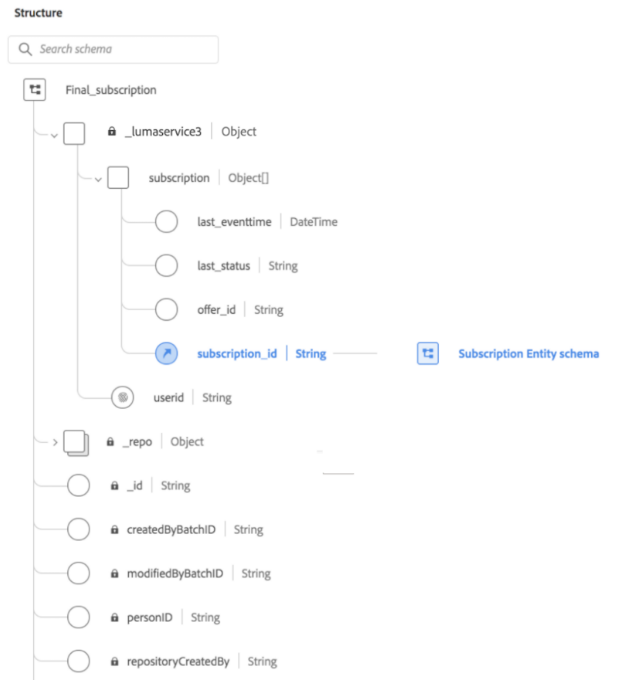

# Utiliser des structures de données imbriquées dans Query Service

Adobe Experience Platform Query Service prend en charge l’utilisation de champs de données imbriqués. La complexité des structures de données d’entreprise peut compliquer la transformation ou le traitement de ces données. Ce document fournit des exemples de création, de traitement ou de transformation de jeux de données avec des types de données complexes, y compris des structures de données imbriquées.

Query Service fournit une interface [!DNL PostgreSQL] pour exécuter des requêtes SQL sur tous les jeux de données gérés par Experience Platform. Experience Platform prend en charge l’utilisation de types de données primitifs ou complexes dans les colonnes de tableau telles que les structures (struct), les tableaux, les mappages, ainsi que les structures (struct), tableaux, et mappages profondément imbriqués. Les jeux de données peuvent également contenir des structures imbriquées dans lesquelles le type de données de colonne peut être aussi complexe qu’un tableau de structures imbriquées, ou une carte de mappages dans laquelle la valeur d’une paire clé-valeur peut être une structure avec plusieurs niveaux d’imbrication.

## Prise en main

Ce tutoriel nécessite l’utilisation d’un client PSQL tiers ou de l’outil Query Editor pour écrire, valider et exécuter des requêtes dans l’interface utilisateur de Platform Experience. Des informations complètes sur l’exécution des requêtes via l’interface utilisateur sont disponibles dans la section [Guide de l’interface utilisateur de Query Editor](../ui/user-guide.md). Pour obtenir une liste détaillée des clients de bureau tiers qui peuvent se connecter à Query Service, reportez-vous à la section [présentation des connexions client](../clients/overview.md).

Vous devriez également avoir une bonne compréhension de la syntaxe des instructions `INSERT INTO` et `CTAS`. Vous trouverez des informations spécifiques sur leur utilisation dans les sections [`INSERT INTO`](../sql/syntax.md#insert-into) et [`CTAS`](../sql/syntax.md#create-table-as-select) de la [documentation de référence sur la syntaxe SQL](../sql/syntax.md).

## Créer un jeu de données

Query Service fournit la fonctionnalité Create Table As Select (`CTAS`) pour créer un tableau en fonction du résultat d’une instruction `SELECT`, ou comme dans ce cas, en utilisant une référence à un schéma XDM existant dans Adobe Experience Platform. Le schéma XDM affiché ci-dessous est pour l’`Final_subscription` créé pour cet exemple.



L’exemple suivant illustre le langage SQL utilisé pour créer le jeu de données `final_subscription_test2`. `final_subscription_test2` est créé en utilisant le schéma `Final_subscription`. Les données sont extraites de la source à l’aide d’une clause `SELECT` pour renseigner certaines lignes.

```sql
CREATE TABLE final_subscription_test2 with(schema='Final_subscription') AS (
        SELECT struct(userid, collect_set(subscription) AS subscription) AS _lumaservices3 FROM(
            SELECT user AS userid,
                   struct( last(eventtime) AS last_eventtime,
                           last(status) AS last_status,
                           offer_id, 
                           subsid AS subscription_id)
                   AS subscription
             FROM (
                   SELECT _lumaservices3.msftidentities.userid user
                        , _lumaservices3.subscription.subscription_id subsid
                        , _lumaservices3.subscription.subscription_status status
                        , _lumaservices3.subscription.offer_id offer_id
                        , TIMESTAMP eventtime
 
                   FROM
                        xbox_subscription_event
                   UNION   
                   SELECT _lumaservices3.msftidentities.userid user
                        , _lumaservices3.subscription.subscription_id subsid
                        , _lumaservices3.subscription.subscription_status status
                        , _lumaservices3.subscription.offer_id offer_id
                        , TIMESTAMP eventtime
                   FROM
                        office365_subscription_event
             ) 
             GROUP BY user,subsid,offer_id
             ORDER BY user ASC
       ) GROUP BY userid)
```

Dans le jeu de données initial `final_subscription_test2`, le type de données struct est utilisé pour contenir à la fois le champ `subscription` et l’`userid` qui est propre à chaque personne. Le champ `subscription` décrit les abonnements aux produits pour une personne. Il peut y avoir plusieurs abonnements, mais un tableau ne peut contenir que les informations d’un abonnement par ligne.

## Utiliser INSERT INTO pour mettre à jour les champs de données imbriqués

Une fois le jeu de données `final_subscription_test2` créé, l’instruction `INSERT INTO` sert à ajouter des données supplémentaires dans le tableau. Lors de la copie de données, les types de données dans la source et la cible doivent correspondre. Sinon, le type de données source doit être `CAST` au type de données cible. Les données incrémentielles sont ensuite ajoutées au jeu de données cible avec le code SQL suivant.

```sql
INSERT INTO final_subscription_test
      SELECT struct(userid, collect_set(subscription) AS subscription) AS _lumaservices3 FROM(
            SELECT user AS userid,
                   struct( last(eventtime) AS last_eventtime,
                           last(status) AS last_status,
                           offer_id, 
                           subsid AS subscription_id)
                   AS subscription
             FROM  SELECT _lumaservices3.msftidentities.userid user
                        , _lumaservices3.subscription.subscription_id subsid
                        , _lumaservices3.subscription.subscription_status status
                        , _lumaservices3.subscription.offer_id offer_id
                        , TIMESTAMP eventtime
 
                   FROM
                        xbox_subscription_event
                   UNION   
                   SELECT _lumaservices3.msftidentities.userid user
                        , _lumaservices3.subscription.subscription_id subsid
                        , _lumaservices3.subscription.subscription_status status
                        , _lumaservices3.subscription.offer_id offer_id
                        , timestamp eventtime
                   FROM
                        office365_subscription_event
             ) 
             GROUP BY user,subsid,offer_id
             ORDER BY user ASC
       ) GROUP BY userid)
```

## Traiter les données d’un jeu de données imbriqué

Pour trouver la liste des abonnements en cours d’une personne à partir d’un jeu de données, vous devez écrire une requête qui sépare les éléments d’un tableau en plusieurs lignes et colonnes. Pour ce faire, vous devez d’abord comprendre la structure du modèle de données, car les informations d’abonnement sont stockées dans un tableau imbriqué dans le jeu de données.

La commande PSQL `\d` est utilisée pour naviguer niveau par niveau vers les données d’abonnement requises. Les tableaux illustrent la structure du jeu de données `final_subscription_test2`. Les types de données complexes peuvent être reconnus en un coup d’œil, car il ne s’agit pas de valeurs de type standard telles que le texte, le booléen, la date et l’heure, etc.

| Colonne | Type |
|--------|-------|
| `_lumaservices3` | final_subscription_test2__lumaservices3 |

Les champs de la colonne suivante sont affichés à l’aide de commande `\d final_subscription_test2__lumaservices3`.

| Colonne | Type |
|---------|-------|
| `userid` | texte |
| `subscription` | _lumaservices3_subscription_e[] |

`subscription` est un tableau d’éléments de structure (struct). Ses champs s’affichent à l’aide de la commande `\d _lumaservices3_subscription_e[]`.

| Colonne | Type |
|---------|-------|
| `last_eventtime` | date et heure |
| `last_status` | texte |
| `offer_id` | texte |
| `subscription_id` | texte |

Pour interroger les champs imbriqués de l’abonnement, vous devez d’abord séparer les éléments du tableau `subscription` en plusieurs lignes et renvoyer les résultats à l’aide de la fonction explode. L’exemple SQL suivant renvoie l’abonnement actif d’une personne en fonction de `userid`.

```sql
SELECT userid, subs AS active_subscription FROM (
    SELECT _lumaservices3.userid AS userid, explode(_lumaservices3.subscription) AS subs 
    FROM final_subscription_test2
)
WHERE subs.last_status='Active';
```

Cet exemple simplifié de solution ne permet qu’un abonnement actif par personne. En réalité, il peut y avoir de nombreux abonnements actifs pour une seule personne. L’exemple suivant modifie la requête précédente pour permettre plusieurs abonnements actifs simultanés.

```sql
SELECT userid, collect_list(subs) AS active_subscriptions FROM (
     SELECT
          _lumaservices3.userid AS userid,
          explode(_lumaservices3.subscription) AS subs
     FROM final_subscription_test2
     )
WHERE subs.last_status='Active' 
GROUP BY userid ;
```

Malgré la complexité croissante de cet exemple SQL, la `collect_list` pour les abonnements actifs ne garantit pas que le résultat sera dans le même ordre que la source. Pour créer une liste d’abonnements actifs pour une personne, vous devez utiliser l’instruction GROUP BY ou shuffling pour agréger les résultats de la liste.

## Étapes suivantes

En lisant ce document, vous comprenez désormais comment traiter ou transformer des jeux de données qui utilisent des types de données complexes dans Adobe Experience Platform Query Service. Consultez le [guide d’exécution des requêtes](../best-practices/writing-queries.md) pour plus d’informations sur l’exécution de requêtes SQL sur des jeux de données dans le lac de données.
