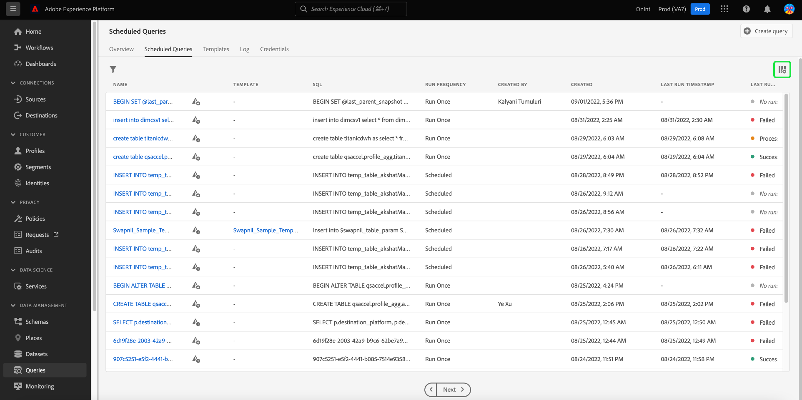
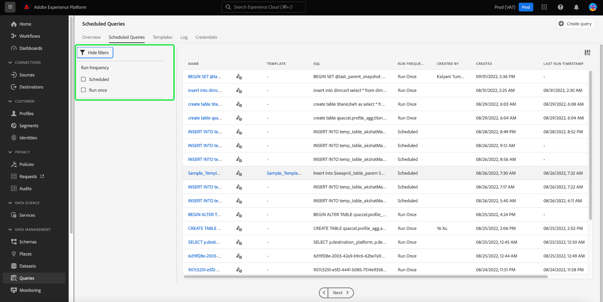
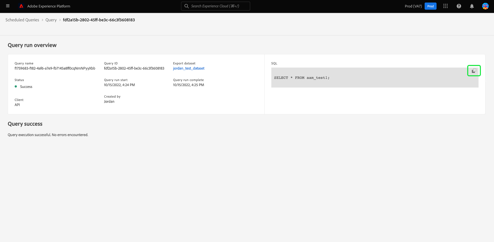

# Surveiller les requêtes

Adobe Experience Platform offre une meilleure visibilité du statut de toutes les tâches de requête via l’interface utilisateur. Depuis l’onglet [!UICONTROL Requêtes planifiées], vous pouvez désormais trouver des informations importantes sur vos exécutions de requêtes qui incluent le statut, les détails de la planification et les messages/codes d’erreur en cas d’échec. Vous pouvez également vous abonner à des alertes pour les requêtes en fonction de leur statut par le biais de l’interface utilisateur pour l’une de ces requêtes via l’onglet [!UICONTROL Requêtes planifiées].

## [!UICONTROL Requêtes planifiées]

L’onglet [!UICONTROL Requêtes planifiées] fournit un aperçu des requêtes exécutées et planifiées. L’espace de travail contient toutes vos requêtes CTAS et ITAS qui sont planifiées pour s’exécuter ou qui ont été exécutées au moins une fois. Vous trouverez des détails sur l’exécution pour toutes les requêtes planifiées, ainsi que des codes d’erreur et des messages pour les requêtes en échec.

Pour accéder à l’onglet [!UICONTROL Requêtes planifiées], sélectionnez **[!UICONTROL Requêtes]** dans la barre de navigation de gauche, suivi de **[!UICONTROL Requêtes planifiées]**

Le tableau ci-dessous décrit chaque colonne disponible.

>[!NOTE]
>
>L’icône d’abonnement aux alertes apparaît dans chaque ligne dans une colonne sans titre. Consultez la section [Abonnements aux alertes](#alert-subscription) pour plus d’informations.

| Colonne | Description |
|---|---|
| Nom | Le champ nom correspond soit au nom du modèle, soit aux premiers caractères de votre requête SQL. Toute requête créée à l’aide de l’interface utilisateur avec le Query Editor est nommée dès le départ. Si la requête a été créée via l’API, le nom de la requête est un extrait du SQL initial utilisé pour créer la requête. |
| Modèle | Nom du modèle de la requête. Sélectionnez un nom de modèle pour accéder à l’éditeur de requêtes. Le modèle de requête est affiché dans l’éditeur de requêtes pour plus de commodité. S’il n’existe aucun nom de modèle, la ligne est marquée d’un trait d’union et il n’est pas possible d’effectuer une redirection vers l’éditeur de requêtes pour afficher la requête. |
| SQL | Fragment de la requête SQL. |
| Fréquence d’exécution | Il s’agit de la cadence d’exécution de votre requête. Les valeurs disponibles sont `Run once` et `Scheduled`. Les requêtes peuvent être filtrées en fonction de leur fréquence d’exécution. |
| Créé par | Nom de la personne qui a créé la requête. |
| Créé | La date et l’heure de création de la requête, au format UTC. |
| La date et l’heure de la dernière exécution | La date et l’heure les plus récentes auxquelles la requête a été exécutée. Cette colonne met en évidence si une requête a été exécutée conformément à son planning actuel. |
| Statut de la dernière exécution | Statut de la dernière exécution de la requête. Les trois valeurs de statut sont les suivantes : `successful` `failed` ou `in progress`. |

>[!TIP]
>
>Si vous accédez à l’éditeur de requêtes, vous pouvez sélectionner **[!UICONTROL Requêtes]** pour revenir à l’onglet [!UICONTROL Modèles].

### Personnaliser les paramètres des tableaux pour les requêtes planifiées

Vous pouvez ajuster les colonnes de l’onglet [!UICONTROL Requêtes planifiées] à vos besoins. Sélectionnez l’icône des paramètres () pour ouvrir la boîte de dialogue paramètres [!UICONTROL Personnalisation du tableau] et modifier les colonnes disponibles.

Activez/désactivez les cases à cocher appropriées pour supprimer ou ajouter une colonne de tableau. Ensuite, sélectionnez **[!UICONTROL Appliquer]** pour confirmer vos choix.

>[!NOTE]
>
>Toute requête créée via l’interface utilisateur devient un modèle nommé dans le cadre du processus de création. Le nom du modèle est indiqué dans la colonne de modèle. Si la requête a été créée via l’API, la colonne de modèle est vide.

### S’abonner aux alertes {#alert-subscription}

Vous pouvez vous abonner à des alertes à partir de l’onglet [!UICONTROL Requêtes planifiées]. Sélectionnez l’icône de notification d’alerte () à côté d’un nom de requête pour ouvrir la boîte de dialogue [!UICONTROL Alertes]. La boîte de dialogue [!UICONTROL Alertes] permet de s’abonner aux notifications de l’interface utilisateur et aux alertes envoyées par e-mail. Les alertes reposent sur le statut de la requête. Trois options sont disponibles : `start`, `success` et `failure`. Cochez la ou les cases correspondantes et sélectionnez **[!UICONTROL Enregistrer]** pour vous abonner.

<!-- This dialog will be updated before release. THe image below will need to be updated inline with these changes. -->

<!-- Link to alert subscriptions doc when available -->

### Filtrer des requêtes

Vous pouvez filtrer les requêtes selon la fréquence d’exécution. Dans l’onglet [!UICONTROL Requêtes planifiées], sélectionnez l’icône de filtre () pour ouvrir la barre latérale du filtre.

Sélectionnez l’une des cases de filtrage des fréquences d’exécution suivantes : **[!UICONTROL Planifié]** ou **[!UICONTROL Exécuter une seule fois]** pour filtrer la liste des requêtes.

>[!NOTE]
>
>Toute requête qui a été exécutée mais n’a pas été planifiée est qualifiée selon l’option [!UICONTROL Exécuter une fois].

Une fois que vos critères de filtre sont activés, sélectionnez **[!UICONTROL Masquer les filtres]** pour fermer le panneau de filtrage.

## Détails du planning des exécutions de requête

Sélectionnez un nom de requête pour accéder à la page des détails du planning. Cette vue fournit une liste de toutes les exécutions exécutées dans le cadre de cette requête planifiée. Les informations fournies incluent l’heure de début et de fin, le statut et le jeu de données utilisé.

Ces informations apparaissent dans un tableau à cinq colonnes. Chaque ligne indique l’exécution d’une requête.

| Nom de la colonne | Description |
|---|---|
| ID d’exécution de requête | ID pour l’exécution de requête quotidienne. |
| Démarrage de l’exécution de requête | Date et heure de l’exécution de la requête. Affichée au format UTC. |
| Fin de l’exécution de requête | Date et heure de la fin de la requête. Affichée au format UTC. |
| Statut | Statut de la dernière exécution de la requête. Les trois valeurs de statut sont les suivantes : `successful`, `failed` ou `in progress`. |
| Jeu de données | Jeu de données présent dans l’exécution. |

Les détails de la requête en cours de planification sont visibles dans le panneau [!UICONTROL Propriétés]. Ce panneau comprend l’ID de requête initial, le type de client, le nom du modèle, la requête SQL et la cadence du planning.

### Détails de l’exécution

Sélectionnez un ID d’exécution de requête pour accéder à la page des détails de l’exécution et afficher les informations de la requête.

Cette vue fournit des informations sur les exécutions individuelles pour cette requête planifiée et une ventilation plus détaillée du statut d’exécution. Cette page inclut également les informations sur le client et les détails des erreurs ayant provoqué l’échec de la requête.

La section du statut de la requête indique le code d’erreur et le message correspondant en cas d’échec de la requête.

Vous pouvez copier la requête SQL dans le presse-papiers à partir de cette vue. Sélectionnez l’icône de copie en haut à droite du fragment de code SQL pour copier la requête. Un message contextuel confirme que le code a été copié.

Sélectionnez **[!UICONTROL Requête]** pour revenir à l’écran des détails du planning, ou **[!UICONTROL Requêtes planifiées]** pour revenir à l’onglet [!UICONTROL Requêtes planifiées].

